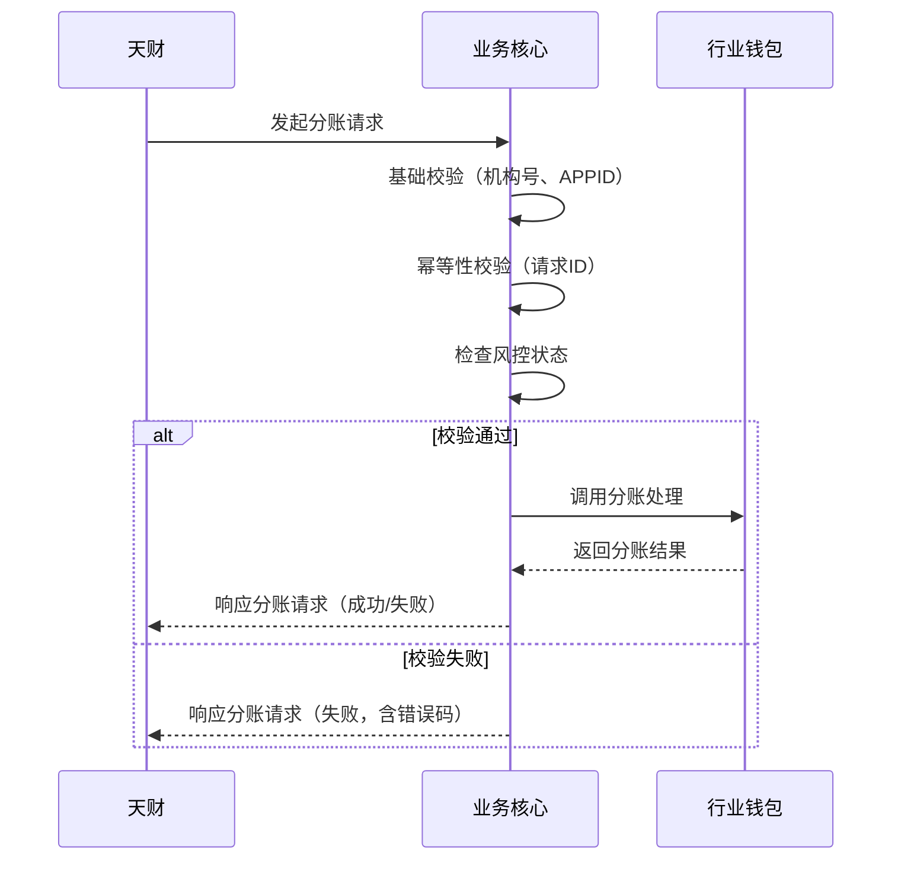

# 模块设计: 交易系统

生成时间: 2026-01-23 15:23:52
批判迭代: 2

---

# 业务核心模块设计文档

## 1. 概述
- **目的与范围**: 本模块负责接收和处理天财分账交易数据，是业务处理的核心入口。其核心职责是接收来自天财的分账请求，进行初步校验，并协调后续的分账、结算等业务流程。其边界止于将处理请求分发至行业钱包、清结算等下游系统，不涉及具体的账户操作、记账或风控逻辑。

## 2. 接口设计
- **API端点 (REST/GraphQL)**: TBD
- **请求/响应结构**: TBD
- **发布/消费的事件**: TBD

## 3. 数据模型
- **表/集合**: TBD
- **关键字段**: TBD
- **与其他模块的关系**: 接收天财的分账交易数据，处理后调用行业钱包、清结算等模块。

## 4. 业务逻辑
- **核心工作流/算法**:
    1.  接收天财的分账请求。
    2.  基础数据校验（机构号、APPID、报文格式）。
    3.  幂等性校验（检查请求ID是否已处理）。
    4.  检查风控状态（根据风控指令判断交易是否被冻结）。
    5.  调用行业钱包处理分账请求。
    6.  根据处理结果响应天财。
- **业务规则与验证**:
    1.  验证请求来源（机构号、APPID）的合法性。
    2.  校验请求报文格式。
    3.  确保交易数据符合天财分账业务的基本规则。
    4.  检查请求ID，防止重复处理。
    5.  检查商户或交易是否被风控冻结。
- **关键边界情况处理**:
    1.  **处理重复请求**: 通过校验请求ID实现幂等性，若请求ID已存在且处理成功，则直接返回成功结果；若处理中，则返回处理中状态；若处理失败，则根据规则决定是否重试。
    2.  **处理下游系统调用异常**: 对行业钱包、清结算等下游系统的调用设置超时和重试机制。根据下游返回的错误码决定是重试还是立即失败。
    3.  **处理风控冻结指令**: 在调用下游系统前，查询风控状态。若商户或交易被冻结，则直接拒绝交易，并返回相应的错误码和描述。

## 5. 时序图

## 6. 错误处理
- **预期错误情况**:
    1.  请求参数校验失败（机构号、APPID、格式错误）。
    2.  重复请求（请求ID已处理）。
    3.  交易被风控冻结。
    4.  下游系统（行业钱包、清结算）服务不可用或返回业务失败。
    5.  网络超时。
    6.  系统内部异常。
- **处理策略**:
    1.  参数错误、重复请求、风控冻结等业务校验失败，立即返回明确的错误码和描述。
    2.  下游系统失败，根据其返回的错误码决定是重试还是返回失败。
    3.  网络超时或系统内部异常，记录详细错误日志，返回系统繁忙或处理失败。
    4.  所有错误情况均需记录日志，用于问题排查和监控。

## 7. 依赖关系
- **上游模块**: 天财（业务请求方）
    -   **交互方式**: 通过API接口接收分账请求。
    -   **依赖内容**: 请求报文格式、机构号、APPID、业务规则。
- **下游模块**:
    -   **行业钱包**:
        -   **交互方式**: 同步调用其分账处理接口。
        -   **依赖内容**: 分账处理能力、计费校验、账户关系验证。
    -   **清结算系统**:
        -   **交互方式**: 间接依赖（通过行业钱包调用）。业务核心不直接调用清结算。
        -   **依赖内容**: 清分、结算能力。
    -   **风控**:
        -   **交互方式**: 同步查询接口或订阅风控事件。
        -   **依赖内容**: 商户冻结状态、交易冻结指令。