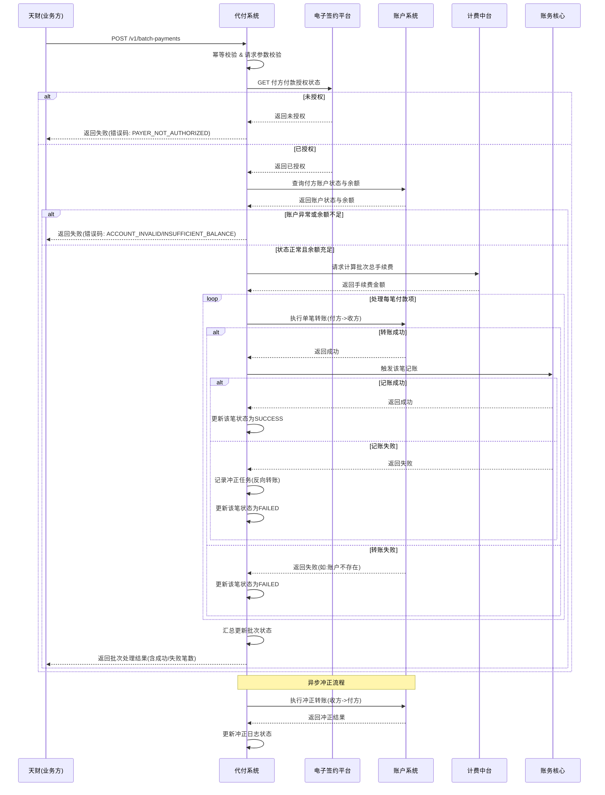

# 模块设计: 代付系统

生成时间: 2026-01-23 15:24:06
批判迭代: 2

---

# 代付系统模块设计文档

## 1. 概述
- **目的与范围**: 本模块负责处理从天财收款账户向外部收款方（如供应商）进行资金划转的业务，核心场景为批量付款。其边界包括接收付款指令、执行资金转账、处理手续费、更新状态，并与相关系统交互完成身份验证、计费、账务记录等。不涉及分账、归集、会员结算等内部资金分配流程。
- **关键实体澄清**: “天财”在本模块上下文中，指通过API发起批量付款请求的**业务方系统**，而非最终用户。

## 2. 接口设计
- **API端点 (REST)**:
    - `POST /v1/batch-payments`: 创建并提交批量付款批次。
    - `GET /v1/batch-payments/{batchId}`: 查询批量付款批次状态及详情。
    - `GET /v1/batch-payments/{batchId}/items`: 查询批次内所有付款明细项状态。
- **关键请求/响应字段**:
    - 创建批次请求 (`POST /v1/batch-payments`):
        - `requestId` (String): 请求唯一标识，用于幂等。
        - `payerMerchantId` (String): 付方收单商户ID（总部或门店）。
        - `payerAccountNo` (String): 付方天财收款账户号。
        - `feeMode` (String): 计费模式，枚举值：`NET`（净额）, `GROSS`（全额-付方承担）, `GROSS_RECEIVER`（全额-收方承担）。
        - `items` (Array): 付款明细列表，每个明细包含 `payeeAccountNo`（收款方账户号）、`amount`（金额，单位：分）、`remark`（备注）等。
    - 创建批次响应:
        - `batchId` (String): 系统生成的批次唯一标识。
        - `status` (String): 批次状态，如 `PROCESSING`, `PARTIAL_SUCCESS`, `SUCCESS`, `FAILED`。
- **发布/消费的事件**:
    - 消费事件: `AccountFrozenEvent` (账户冻结事件)，由风控系统发布，包含 `accountNo`（账户号）和 `freezeType`（冻结类型，如 `MERCHANT_FREEZE`）。
    - 发布事件: `PaymentCompletedEvent` (付款完成事件)，包含 `batchId`, `status`, `totalAmount`, `successCount`, `failCount`。

## 3. 数据模型
- **核心表/集合**:
    - `payment_batch` (付款批次表):
        - `batch_id` (PK): 批次ID。
        - `request_id` (UK): 外部请求ID，用于幂等。
        - `payer_merchant_id`: 付方商户ID。
        - `payer_account_no`: 付方天财收款账户号。
        - `fee_mode`: 计费模式。
        - `total_amount`: 批次总金额。
        - `total_fee`: 批次总手续费。
        - `status`: 批次状态。
        - `create_time`, `update_time`: 创建与更新时间。
    - `payment_item` (付款明细表):
        - `item_id` (PK): 明细项ID。
        - `batch_id` (FK): 关联的批次ID。
        - `payee_account_no`: 收款方账户号。
        - `amount`: 付款金额。
        - `fee`: 该笔手续费。
        - `status`: 明细状态（如 `PENDING`, `SUCCESS`, `FAILED`）。
        - `fail_reason`: 失败原因。
        - `accounting_voucher_no`: 关联的记账凭证号。
        - `create_time`, `update_time`: 创建与更新时间。
    - `compensation_log` (冲正/补偿日志表):
        - `log_id` (PK): 日志ID。
        - `batch_id`: 关联的批次ID。
        - `item_id`: 关联的明细项ID（如为单笔冲正）。
        - `compensation_type`: 冲正类型（如 `REVERSE_TRANSFER`, `REVERSE_ACCOUNTING`）。
        - `target_system`: 目标系统（如 `ACCOUNT`, `ACCOUNTING`）。
        - `request_body`: 冲正请求内容。
        - `response_body`: 冲正响应结果。
        - `status`: 冲正执行状态（`INIT`, `SENT`, `SUCCESS`, `FAILED`）。
        - `create_time`, `update_time`: 创建与更新时间。
- **与其他模块的关系**: 依赖**账户系统**执行账户扣款与入账（通过账户号关联），依赖**账务核心**完成记账（通过凭证号关联），依赖**计费中台**计算手续费。

## 4. 业务逻辑
- **核心工作流/算法**: 处理批量付款请求。流程包括：验证付方（总部/门店）是否已完成“开通付款”流程（含关系绑定、协议签署等）、校验付方天财收款账户状态与余额、调用计费中台计算手续费（支持净额或全额模式）、调用账户系统执行转账、触发账务核心记账、更新付款状态。
- **业务规则与验证**:
    1.  付方必须为已完成“开通付款”流程的收单商户（总部或门店）。通过调用**电子签约平台**的 `GET /api/merchant/{merchantId}/payment-authorization` 接口进行校验，该接口返回授权状态及协议ID。
    2.  付款资金必须来自付方的天财收款账户。
    3.  需校验付方账户状态是否正常（非冻结）。通过监听 `AccountFrozenEvent` 事件实时更新本地缓存/状态，并在交易执行前进行校验。
    4.  需校验账户余额是否充足（含手续费）。通过调用**账户系统**的查询余额接口进行校验。
    5.  收款方账户（天财接收方账户）状态需正常。通过调用**账户系统**的查询账户状态接口进行校验。
- **关键边界情况处理**:
    1.  **风控冻结处理**: 系统订阅 `AccountFrozenEvent` 事件。当收到付方账户的 `MERCHANT_FREEZE` 事件时，立即更新本地账户状态为冻结。对于处理中的交易，在调用账户系统前进行状态检查，若冻结则中止该笔及批次后续交易。对于已发起扣款但未完成的交易，进入冲正流程。
    2.  **下游系统调用失败**: 调用账户系统、账务核心等超时或失败，采用有限次数的指数退避重试。对于账户不存在等业务性错误，直接标记失败，不重试。
    3.  **部分成功与冲正**: 采用Saga模式管理分布式事务。若调用账户系统扣款成功，但后续记账失败，则触发冲正流程，向账户系统发起反向转账以回滚资金，并记录冲正日志。
    4.  **并发控制**: 在批次和单笔处理层面使用乐观锁（通过版本号）或数据库行锁，防止对同一账户余额的并发操作导致超额扣款。

## 5. 时序图

## 6. 错误处理
- **预期错误情况**:
    1.  付方未开通付款权限 (`PAYER_NOT_AUTHORIZED`)。
    2.  付方或收方账户状态异常 (`ACCOUNT_FROZEN`, `ACCOUNT_CLOSED`)。
    3.  付方账户余额不足 (`INSUFFICIENT_BALANCE`)。
    4.  计费中台服务不可用或返回错误 (`FEE_CALCULATION_ERROR`, `FEE_SERVICE_UNAVAILABLE`)。
    5.  账户系统转账失败 (`ACCOUNT_TRANSFER_FAILED`, `PAYEE_ACCOUNT_NOT_EXIST`)。
    6.  账务核心记账失败 (`ACCOUNTING_FAILED`)。
    7.  网络超时 (`NETWORK_TIMEOUT`)。
    8.  请求重复 (`DUPLICATE_REQUEST_ID`)。
- **处理策略**:
    1.  **业务校验错误**: 直接返回对应错误码，不进行重试。
    2.  **下游系统暂时性故障**: 对网络超时、服务暂时不可用等情况，采用指数退避策略进行重试（最多3次）。
    3.  **冲正机制**: 对于已扣款成功的交易，若后续步骤（如记账）失败，系统自动触发冲正流程。冲正请求记录在 `compensation_log` 中，由后台作业异步重试直至成功。冲正失败会告警，需人工介入。
    4.  **状态一致性**: 通过 `payment_batch` 和 `payment_item` 的状态机确保流程可追踪。任何步骤失败都会更新对应状态，并提供 `fail_reason`。
    5.  **监控与告警**: 对失败率、冲正失败、下游系统异常等设置监控指标和告警阈值。

## 7. 依赖关系
- **上游模块**:
    - **天财（业务方系统）**: 批量付款请求的发起方。
    - **电子签约平台**: 提供 `GET /api/merchant/{merchantId}/payment-authorization` 接口，用于校验付方“开通付款”授权状态。
    - **风控**: 发布 `AccountFrozenEvent` 事件，通知账户冻结状态变更。
- **下游模块**:
    - **计费中台**: 提供手续费计算接口。
    - **账户系统**: 提供账户状态查询、余额查询、资金转账接口。
    - **账务核心**: 提供记账凭证生成接口。
- **交互模式**:
    - 与**电子签约平台**、**计费中台**、**账户系统**、**账务核心**为同步API调用。
    - 与**风控**为异步事件订阅（消息队列）。