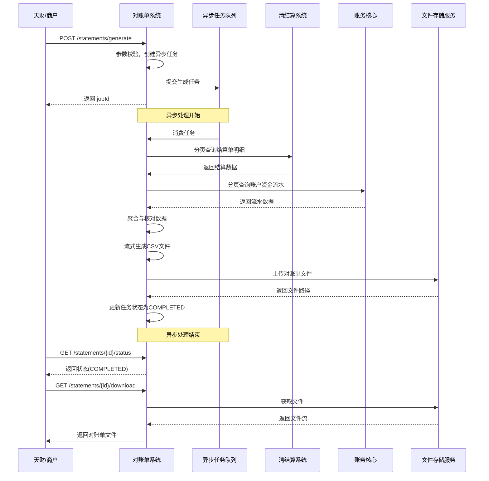

# 模块设计: 对账单系统

生成时间: 2026-01-23 15:23:53
批判迭代: 2

---

# 对账单系统设计文档

## 1. 概述
- **目的与范围**：本模块负责生成和提供各类账户和交易维度的对账单。其核心职责是聚合来自清结算、账务核心等模块的数据，按需生成标准格式的对账单文件或数据流，供天财、商户或内部运营查询下载。边界在于数据聚合与呈现，不涉及原始交易数据的处理或资金结算。

## 2. 接口设计
- **API端点 (REST/GraphQL)**：
    - `POST /api/v1/statements/generate`：异步生成对账单。
    - `GET /api/v1/statements`：查询对账单列表。
    - `GET /api/v1/statements/{statementId}/download`：下载对账单文件。
    - `GET /api/v1/statements/{statementId}/status`：查询对账单生成状态。
- **请求/响应结构**：
    - 生成对账单请求：`{ “merchantId”: “string”, “accountNo”: “string”, “startDate”: “YYYY-MM-DD”, “endDate”: “YYYY-MM-DD”, “type”: “SETTLEMENT|ACCOUNT” }`
    - 生成对账单响应：`{ “jobId”: “string”, “status”: “PENDING” }`
    - 对账单列表项：`{ “statementId”: “string”, “merchantId”: “string”, “generatedAt”: “timestamp”, “period”: “string”, “downloadUrl”: “string”, “status”: “COMPLETED|FAILED|PROCESSING” }`
- **发布/消费的事件**：
    - 消费事件：TBD（例如，消费来自业务核心的原始交易数据事件，或清结算的结算完成事件）。
    - 发布事件：TBD（例如，发布对账单生成成功或失败事件）。

## 3. 数据模型
- **表/集合**：
    - `statement_jobs`：对账单生成任务表。字段：`job_id`（主键），`request_params`（JSON），`status`，`error_message`，`created_at`，`updated_at`。
    - `statement_metadata`：对账单元数据表。字段：`statement_id`（主键），`job_id`，`merchant_id`，`account_no`，`period_start`，`period_end`，`statement_type`，`file_storage_path`，`file_size`，`generated_at`。
    - `statement_items`：对账单明细条目表（可选，用于支持明细查询）。字段：`id`（主键），`statement_id`，`transaction_time`，`transaction_type`，`amount`，`balance`，`counterparty`，`remark`。
- **关键字段**：`statement_id`（对账单唯一标识），`merchant_id`（商户标识），`account_no`（账户号），`period_start/end`（对账周期），`statement_type`（对账单类型：结算单或资金流水单）。
- **与其他模块的关系**：依赖清结算系统获取结算单数据；依赖账务核心获取账户余额变动流水（会计分录数据）。

## 4. 业务逻辑
- **核心工作流/算法**：
    1.  **触发**：接收来自API的生成请求或定时任务触发。
    2.  **数据获取**：
        - 结算数据：根据商户、账户、时间范围，调用清结算系统接口获取结算单明细。
        - 资金流水数据：根据账户、时间范围，调用账务核心接口获取会计分录流水。
    3.  **数据聚合与核对**：
        - 将获取的结算明细与资金流水按交易号或关联ID进行关联。
        - 执行账实核对算法：计算结算单中的交易总额，并与账务核心中对应账户同期的资金流入流出净额进行比对。若差额超过阈值，则标记异常并记录日志。
    4.  **文件生成**：将核对后的数据按标准格式（CSV）组装，生成对账单文件，并上传至文件存储服务。
    5.  **状态更新与通知**：更新任务状态，存储文件元数据，并通过事件或回调通知调用方。
- **业务规则与验证**：
    - 对账单数据需与清结算系统的结算单总额、账务核心的账户余额变动总额进行核对，确保账实相符。核对不通过时，对账单状态标记为“核对异常”，但文件仍可生成并附带异常说明。
    - 输入参数校验：日期格式、商户ID、账户号的有效性校验。
- **关键边界情况处理**：
    - **上游数据延迟或缺失**：采用指数退避策略进行重试（如最多3次）。若最终无法获取完整数据，则任务失败，记录缺失的数据范围，并触发告警。
    - **大商户数据量处理**：
        - 采用分页方式从上游系统拉取数据。
        - 对账单生成采用流式写入文件的方式，避免内存溢出。
        - 对于超大规模数据，支持按日或按小时分批生成多个文件。
    - **异步任务管理**：长时间生成任务采用异步队列处理，提供任务ID供查询状态和结果。

## 5. 时序图

## 6. 错误处理
- **预期错误情况**：
    1.  上游服务（清结算、账务核心）不可用或超时。
    2.  查询参数不合法（如日期格式错误、账户不存在）。
    3.  对账单生成过程中文件存储服务异常。
    4.  数据核对不一致，账实不符。
    5.  异步任务处理超时。
- **处理策略**：
    - 对上游依赖调用设置连接超时和读取超时，并配置重试机制（带指数退避）。
    - 对输入参数进行严格校验，无效请求立即返回4xx错误。
    - 文件存储异常时，记录错误日志并告警，任务状态标记为“失败”。
    - 数据核对异常时，在对账单文件中添加显式警告标记，并记录详细差异日志供运营核查，任务状态标记为“完成（有警告）”。
    - 异步任务设置全局超时时间，超时后任务状态标记为“超时失败”。

## 7. 依赖关系
- **上游模块**：
    - 清结算系统：提供结算单和交易明细数据。
    - 账务核心：提供账户会计分录（资金流水）数据。
    - （可选）业务核心：TBD，作为可能的原始交易数据源。
- **下游模块**：
    - 天财：通过API查询和下载对账单。
    - 内部运营平台：消费对账单数据或文件。
    - 文件存储服务：存储生成的对账单文件。