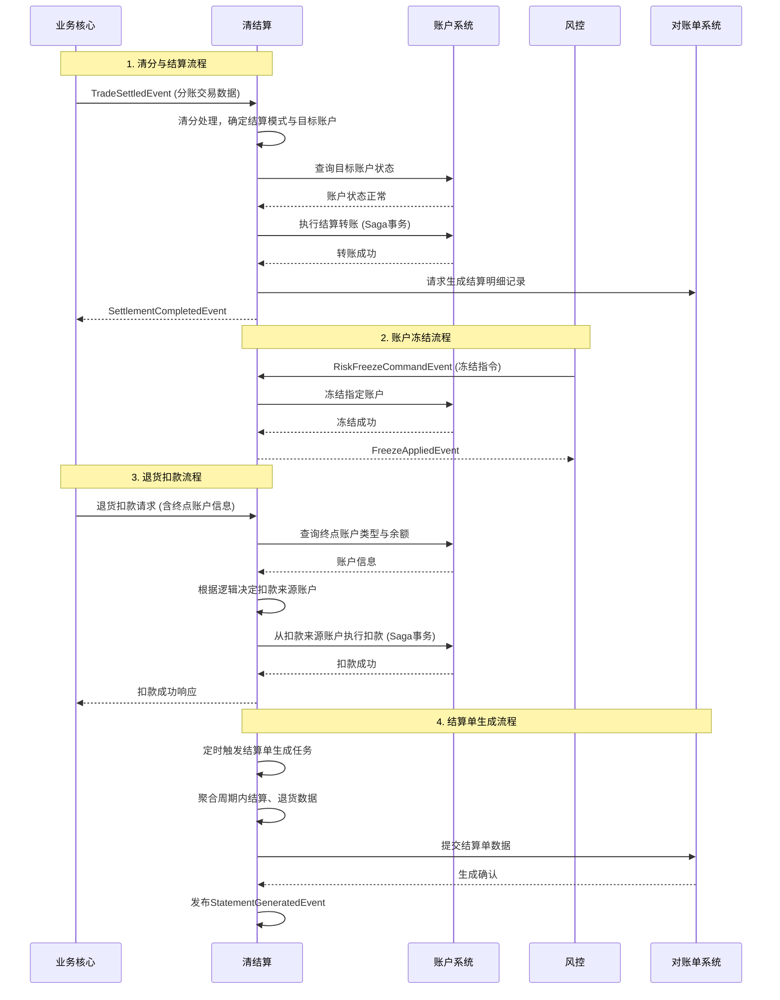

# 模块设计: 清结算

生成时间: 2026-01-23 15:23:52
批判迭代: 2

---

# 清结算模块设计文档

## 1. 概述
- **目的与范围**: 本模块负责处理交易资金的清分、结算、账户冻结、退货扣款和结算单生成。它是资金流转的核心处理环节，连接业务核心、账户系统和风控等模块。

## 2. 接口设计
- **API端点 (REST/GraphQL)**:
    - `POST /api/v1/settlement/process`: 处理分账交易结算。
    - `POST /api/v1/settlement/refund/deduct`: 执行退货扣款。
    - `POST /api/v1/settlement/freeze`: 执行账户冻结。
    - `GET /api/v1/settlement/statement/generate`: 触发结算单生成。
- **请求/响应结构**: TBD
- **发布/消费的事件**:
    - 消费事件: `TradeSettledEvent` (来自业务核心)， `RiskFreezeCommandEvent` (来自风控)。
    - 发布事件: `SettlementCompletedEvent`， `RefundDeductedEvent`， `FreezeAppliedEvent`， `StatementGeneratedEvent`。

## 3. 数据模型
- **表/集合**:
    - `settlement_order` (结算订单表): 记录每笔结算请求。
    - `settlement_detail` (结算明细表): 记录结算涉及的账户与金额明细。
    - `freeze_record` (冻结记录表): 记录风控发起的冻结操作。
    - `refund_deduction` (退货扣款记录表): 记录退货扣款操作。
- **关键字段**:
    - `settlement_order`: `id`, `trade_id`, `settlement_mode` (主动结算/被动结算), `target_account_id`, `amount`, `status`, `created_at`。
    - `settlement_detail`: `id`, `settlement_order_id`, `from_account_id`, `to_account_id`, `amount`, `fee`。
    - `freeze_record`: `id`, `account_id`, `freeze_type` (商户冻结/交易冻结), `risk_order_id`, `status`, `created_at`。
    - `refund_deduction`: `id`, `refund_id`, `deduct_from_account_id`, `amount`, `status`, `created_at`。
- **与其他模块的关系**: 与账户系统交互进行账户余额扣减和转账执行；与业务核心交互处理分账交易数据；与风控交互处理冻结指令；与对账单系统交互生成结算单。

## 4. 业务逻辑
- **核心工作流/算法**:
    1.  **清分与结算**: 接收业务核心的分账交易数据，进行清分处理。根据结算模式将资金结算至目标账户。
        - **结算模式决策规则**: 若交易关联的商户已配置并启用了“主动结算”且指定了有效的“天财收款账户”，则执行主动结算至该账户；否则，执行被动结算至默认的“待结算账户”。
    2.  **账户冻结**: 处理风控发起的商户冻结和交易冻结指令，调用账户系统冻结指定账户或资金。
    3.  **退货扣款**: 执行退货流程。
        - **扣款来源决策逻辑**: 首先查询“终点账户”类型和余额。
            - 若终点账户为“天财收款账户”且余额充足，则直接从此账户扣款。
            - 若终点账户为“待结算账户”或余额不足，则尝试从关联的“退货账户”扣款。
            - 若均失败，则流程失败。
    4.  **结算单生成**: 定时或手动触发，汇总指定周期内的结算与退货记录，生成账户维度和交易维度的结算单，并调用对账单系统进行持久化与分发。
- **业务规则与验证**:
    1.  校验结算目标账户的状态是否正常（非冻结、非注销）。
    2.  验证分账请求的金额、账户关系及业务合法性。
    3.  所有核心操作（结算、扣款、冻结）需支持幂等性，通过业务唯一ID（如`trade_id`, `freeze_order_id`）保证。
- **关键边界情况处理**:
    1.  结算时目标账户被冻结：中断流程，返回账户冻结错误。
    2.  退货时终点账户及退货账户余额均不足：中断流程，返回余额不足错误。
    3.  清分过程中交易数据异常：记录异常，通知业务核心，流程失败。
- **技术考量**:
    1.  **幂等性**: 所有写操作接口需基于上游传递的唯一业务流水号实现幂等。
    2.  **分布式事务**: 涉及多系统调用（如账户系统扣款+账务核心记账）时，采用Saga模式，通过补偿操作保证最终一致性。
    3.  **弹性设计**: 对账户系统、账务核心等下游调用配置重试机制（如指数退避）和熔断器，防止级联故障。

## 5. 时序图

## 6. 错误处理
- **预期错误情况**:
    1.  账户状态异常（冻结、注销）。
    2.  账户余额不足。
    3.  系统间调用超时或失败（如账户系统、账务核心）。
    4.  交易数据格式错误或业务规则校验失败。
    5.  幂等键冲突。
- **处理策略**:
    1.  对于业务错误（账户异常、余额不足、规则校验失败），返回明确的业务错误码并中断当前流程，不进行重试。
    2.  对于下游系统调用失败（网络超时、服务不可用），根据配置的重试策略进行有限次重试。重试失败后，记录异常日志，流程失败，必要时触发Saga补偿。
    3.  对于数据格式错误，记录异常并通知上游系统（业务核心）。
    4.  对于幂等键冲突，视为重复请求，直接返回之前的处理结果。

## 7. 依赖关系
- **上游模块**: 业务核心（提供交易数据）、风控（提供冻结指令）。
- **下游模块**: 账户系统（执行账户操作）、账务核心（账务处理）、对账单系统（结算单持久化与生成）。