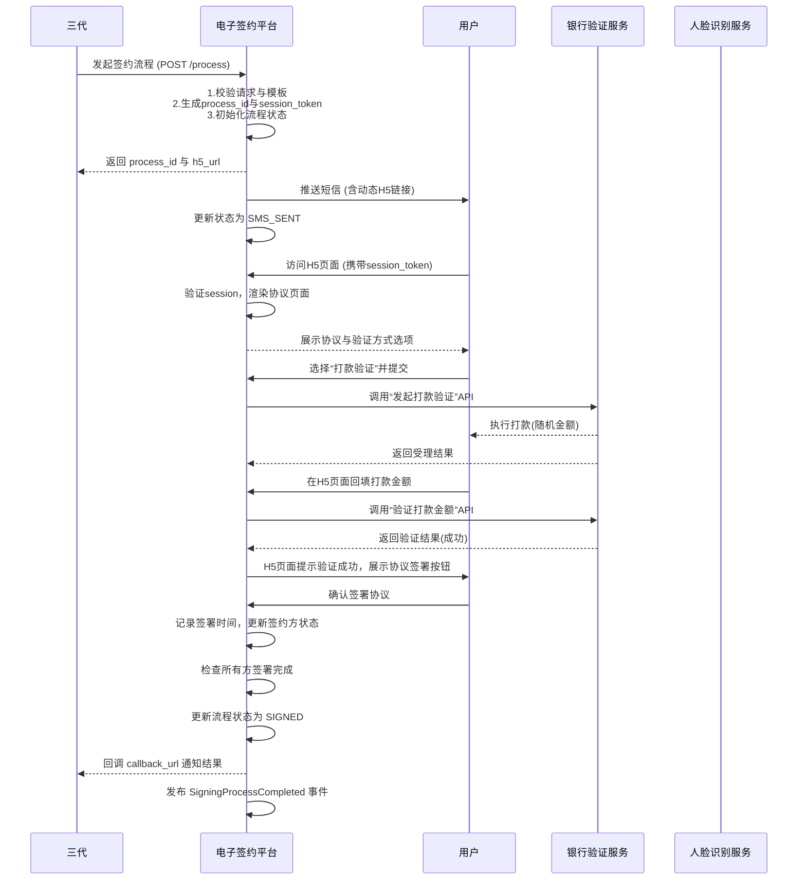

# 模块设计: 电子签约平台

生成时间: 2026-01-23 15:24:02
批判迭代: 2

---

# 电子签约平台模块设计文档

## 1. 概述
- **目的与范围**：本模块负责协议模板管理、签约流程的发起与执行，包括短信推送、H5页面封装、打款验证和人脸验证的调用。它为“三代”发起的“关系绑定”和“开通付款”流程提供身份认证与协议签署的流程管理服务，不直接处理资金交易。
- **核心职责**：
    1.  协议模板的存储、版本管理与动态渲染。
    2.  接收“三代”的签约请求，创建并管理签约流程实例。
    3.  封装并下发包含签约流程状态的H5页面链接。
    4.  根据认证类型，协调调用外部验证服务（打款验证/人脸验证）。
    5.  记录签约结果，并将最终状态同步回“三代”。

## 2. 接口设计
- **API端点 (REST)**：
    1.  `POST /api/v1/signing/process`：创建签约流程。
        - **请求方**：三代。
        - **请求体**：`{“biz_scene”: “RELATION_BIND” | “OPEN_PAYMENT”, “template_id”: “string”, “parties”: [{“role”: “PAYER” | “PAYEE”, “user_id”: “string”, “name”: “string”, “id_no”: “string?”, “bank_card_no”: “string?”}, …], “callback_url”: “string”}`
        - **响应体**：`{“process_id”: “string”, “h5_url”: “string”}`
    2.  `GET /api/v1/signing/process/{process_id}`：查询签约流程状态。
        - **请求方**：三代 / 内部管理。
        - **响应体**：`{“process_id”: “string”, “status”: “INIT” | “SMS_SENT” | “VERIFYING” | “SIGNED” | “FAILED” | “EXPIRED”, “parties_status”: {“user_id”: “string”, “status”: “PENDING” | “VERIFIED” | “SIGNED” | “FAILED”}, …}`
    3.  `POST /api/v1/signing/template`：上传协议模板。
        - **请求方**：内部管理后台。
        - **请求体**：`{“template_id”: “string”, “version”: “string”, “biz_scene”: “string”, “content”: “string (HTML)”, “variables”: [“var1”, “var2”]}`
- **发布/消费的事件**：
    - **消费事件**：TBD（从“三代”接收签约指令的事件，如“RelationBindRequested”）。
    - **发布事件**：`SigningProcessCompleted`（签约流程完成时发布，包含process_id, status, parties等信息）。

## 3. 数据模型
- **表/集合**：
    1.  **协议模板表 (agreement_template)**：
        - `id` (PK)， `template_id`， `version`， `biz_scene`， `content_html`， `variables_config` (JSON)， `is_active` (boolean)， `created_at`， `created_by`。
    2.  **签约流程表 (signing_process)**：
        - `process_id` (PK)， `biz_scene`， `template_id`， `template_version`， `status`， `h5_session_token`， `callback_url`， `expires_at`， `created_at`， `updated_at`。
    3.  **签约方表 (signing_party)**：
        - `id` (PK)， `process_id` (FK)， `user_id`， `role`， `name`， `id_no`， `bank_card_no`， `verification_type`， `verification_status`， `signed_at`， `meta_info` (JSON)。
    4.  **流程日志表 (process_audit_log)**：
        - `id` (PK)， `process_id`， `event_type` (如“SMS_SENT”, “VERIFICATION_INITIATED”, “VERIFICATION_RESULT”)， `event_data` (JSON)， `created_at`。
- **与其他模块的关系**：本模块的数据模型通过`process_id`、`user_id`与“三代”和“行业钱包”的业务上下文关联。“三代”通过`process_id`查询状态，“行业钱包”在关系绑定生效后可能关联此处的签约记录。

## 4. 业务逻辑
- **核心工作流**：
    1.  **流程创建**：“三代”调用接口发起签约。系统校验模板与场景，生成唯一`process_id`和`h5_session_token`，初始化流程状态为`INIT`。
    2.  **H5页面封装**：根据`process_id`和`h5_session_token`生成动态H5 URL。该页面逻辑负责：a) 根据session加载用户身份与协议内容；b) 引导用户选择/确认验证方式；c) 管理前端状态，并与后端保持心跳/状态同步。
    3.  **短信推送**：向签约方发送包含动态H5链接的短信。流程状态更新为`SMS_SENT`。
    4.  **用户验证**：
        - **打款验证**：用户选择后，系统调用“银行/验证服务”的API，请求向指定银行卡发送随机金额。**本模块不发起实际打款，仅调用验证服务的接口**。用户回填金额后，系统再次调用验证服务进行校验。
        - **人脸验证**：用户选择后，系统调用“人脸识别服务”的API，引导用户完成人脸采集与比对。
    5.  **协议签署**：验证通过后，用户在H5页面确认协议并签署。系统记录签署时间，更新签约方状态为`SIGNED`。
    6.  **流程完成**：所有必要方签署完成后，流程状态更新为`SIGNED`。通过回调`callback_url`通知“三代”，并发布`SigningProcessCompleted`事件。
- **业务规则**：
    1.  协议模板选择基于`biz_scene`（如`RELATION_BIND`）和签约方角色。
    2.  验证方式选择规则：企业通常使用打款验证，个人/个体户负责人可使用人脸验证。
    3.  H5会话有效期（如30分钟），超时后流程状态置为`EXPIRED`。
    4.  同一对签约方在特定业务场景下，仅允许存在一个`INIT`或`SMS_SENT`状态的流程。
- **关键边界情况处理**：
    1.  **用户中途放弃**：H5会话超时管理。支持通过原链接在一定时间内恢复流程。
    2.  **验证失败**：提供有限次数的重试（如3次）。超过次数，流程状态置为`FAILED`。
    3.  **外部服务不可用**：对“银行/验证服务”和“人脸识别服务”的调用配置熔断器与降级策略。服务不可用时，流程阻塞并记录，前端提示“服务繁忙，请稍后重试”。

## 5. 时序图

## 6. 错误处理
- **预期错误情况**：
    1.  **请求错误**：模板不存在、签约方信息不全、重复发起。
    2.  **流程错误**：H5会话过期、验证失败超次、用户取消。
    3.  **外部依赖错误**：短信服务失败、银行验证服务超时或不可用、人脸识别服务调用失败。
    4.  **系统错误**：数据库异常、网络中断。
- **处理策略**：
    1.  **输入校验**：接口层进行严格参数校验，返回明确的错误码（如`INVALID_TEMPLATE`, `MISSING_PARTY_INFO`）。
    2.  **流程状态机**：定义清晰的流程状态（`INIT` -> `SMS_SENT` -> `VERIFYING` -> `SIGNED`/`FAILED`/`EXPIRED`），确保状态转换的原子性与一致性。
    3.  **外部调用容错**：
        - **重试**：对可重试的第三方服务错误（如网络超时），采用指数退避策略进行重试（最多3次）。
        - **熔断**：配置熔断器（如基于失败率），当外部服务持续不可用时快速失败，避免资源耗尽。
        - **降级**：服务不可用时，流程无法继续，记录日志并通知运维。前端展示友好错误提示。
    4.  **监控与告警**：记录所有关键操作和错误日志。对流程失败率、第三方服务可用性设置监控指标与告警。

## 7. 依赖关系
- **上游模块**：**三代**。本模块作为服务被“三代”调用，用于执行其控制的“关系绑定”与“开通付款”流程中的签约环节。
- **下游模块/服务**：
    1.  **银行/验证服务**：提供打款验证能力的第三方或内部服务。本模块调用其API发起验证请求与校验结果。
    2.  **人脸识别服务**：提供人脸采集与比对能力的第三方或内部服务。
    3.  **短信推送服务**：用于向用户发送签约链接。
- **数据依赖**：协议模板数据（内部管理）。