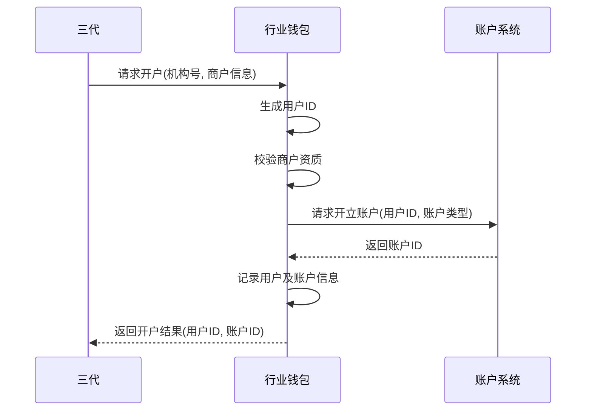
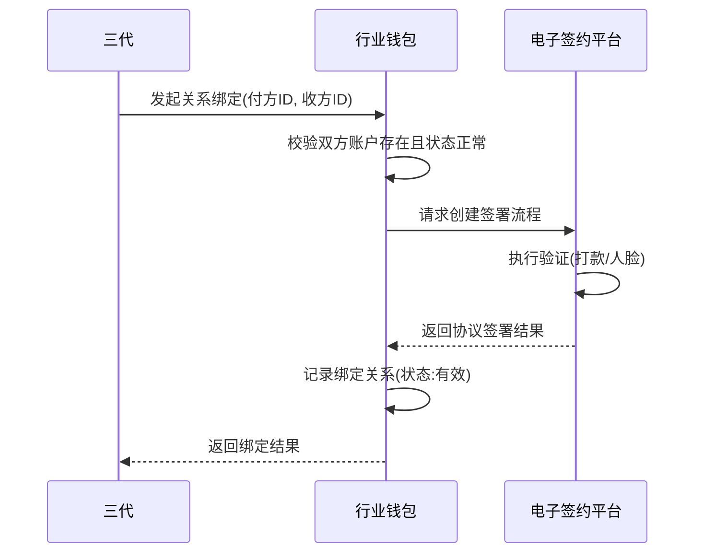
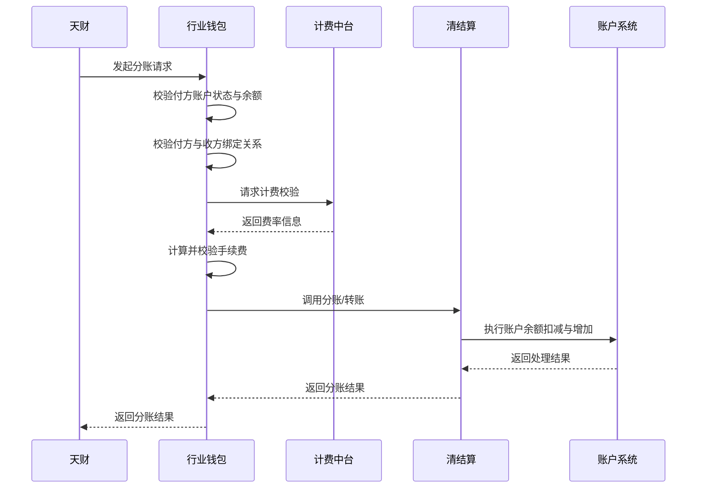
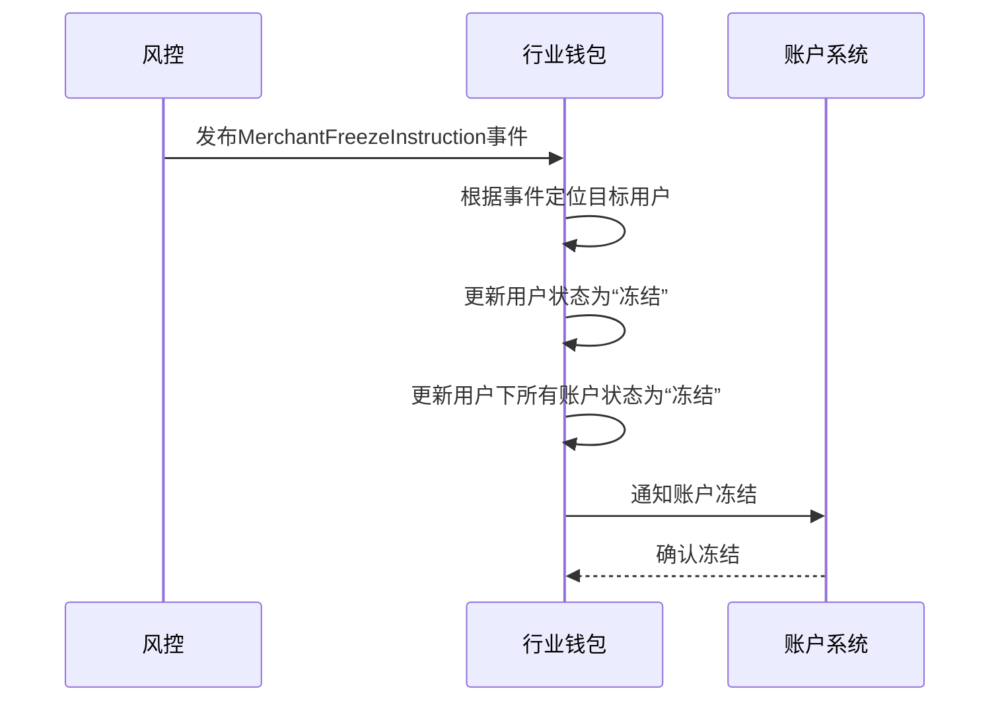

# 模块设计: 行业钱包

生成时间: 2026-01-23 15:24:15
批判迭代: 2

---

# 行业钱包模块设计文档

## 1. 概述
- **目的与范围**: 本模块是负责用户ID生成、账户开户、关系绑定、分账请求处理和计费校验的核心系统。它作为天财业务与底层账户、清结算系统之间的桥梁，处理与账户生命周期、资金划转授权及交易处理相关的业务逻辑。
- **范围澄清**: 本文档描述的“行业钱包”是一个具体的业务模块，其功能与术语表中定义的“行业钱包（钱包系统）”系统/模块概念一致。本模块不包含底层账户的物理记账功能，该功能由“账户系统”和“账务核心”负责。

## 2. 接口设计
- **API端点 (REST/GraphQL)**: TBD
- **请求/响应结构**: TBD
- **发布/消费的事件**:
    - **消费事件**:
        - `MerchantFreezeInstruction`: 来自风控模块的商户冻结指令。
        - `TransactionFreezeInstruction`: 来自风控模块的交易冻结指令。
    - **发布事件**:
        - `AccountOpened`: 账户开户成功事件。
        - `BindingRelationshipEstablished`: 关系绑定成功事件。
        - `SplitRequestProcessed`: 分账请求处理完成事件（包含成功或失败结果）。

## 3. 数据模型
- **表/集合**:
    - `users`: 用户信息表。
    - `accounts`: 账户信息表。
    - `binding_relationships`: 关系绑定表。
    - `split_requests`: 分账请求记录表。
- **关键字段**:
    - `users`:
        - `user_id` (PK): 用户ID，由本模块生成。
        - `institution_id`: 机构号。
        - `merchant_type`: 商户类型（企业、个体、个人）。
        - `role`: 角色（总部、门店、非收单商户、个人）。
        - `status`: 状态（正常、冻结）。
    - `accounts`:
        - `account_id` (PK): 账户ID。
        - `user_id` (FK): 关联的用户ID。
        - `account_type`: 账户类型（天财收款账户、天财接收方账户）。
        - `balance`: 账户余额。
        - `status`: 账户状态（正常、冻结、注销）。
    - `binding_relationships`:
        - `binding_id` (PK): 绑定关系ID。
        - `payer_user_id` (FK): 付方用户ID。
        - `receiver_user_id` (FK): 收方用户ID。
        - `agreement_status`: 协议状态（已签署、未签署、已失效）。
        - `is_valid`: 绑定是否有效。
    - `split_requests`:
        - `request_id` (PK): 请求ID。
        - `payer_account_id` (FK): 付方账户ID。
        - `receiver_account_id` (FK): 收方账户ID。
        - `amount`: 分账金额。
        - `fee`: 手续费。
        - `status`: 处理状态（处理中、成功、失败）。
        - `settlement_ref`: 清结算系统返回的参考号。
- **与其他模块的关系**:
    - 与`账户系统`：通过账户ID关联，同步账户状态与余额。
    - 与`清结算系统`：通过分账请求记录关联，传递分账指令并接收结果。
    - 与`电子签约平台`：通过绑定关系ID关联，验证协议签署状态。
    - 与`计费中台`：通过分账请求关联，获取费率信息。
    - 与`业务核心`：接收分账请求。

## 4. 业务逻辑
- **核心工作流/算法**:
    1.  **用户ID生成**:
        - **算法**: 结合机构号(`institution_id`)、商户类型(`merchant_type`)和序列号生成唯一用户ID。格式示例：`INST_{institution_id}_TYPE_{type}_SEQ_{sequence}`。
        - **规则**: 同一机构号下，用户ID需保证唯一性。
    2.  **账户开户**:
        - **天财收款账户**: 为收单商户（企业或个体）开立。开户前需校验商户资质（通过三代审核）。调用账户系统接口开立行业钱包类型账户。
        - **天财接收方账户**: 为非收单商户或个人开立。开户流程相对简化，主要依赖身份信息验证。
        - **状态管理**: 开户成功后，账户状态初始化为“正常”。
    3.  **关系绑定**:
        - **前提**: 付方（如总部）与收方（如门店、供应商）均已完成开户。
        - **流程**: 调用电子签约平台完成协议签署（可能涉及打款验证或人脸验证）。签署成功后，在本模块记录绑定关系，状态为“有效”。
        - **校验**: 分账前必须校验付方与收方之间存在有效的绑定关系。
    4.  **分账请求处理**:
        - **校验序列**:
            a. 校验付方账户状态（正常、未冻结）与余额（大于等于分账金额+手续费）。
            b. 校验付方与收方的绑定关系有效。
            c. 调用计费中台获取费率，计算并校验手续费。
        - **执行**: 通过清结算系统执行分账/转账。
    5.  **冻结指令处理**:
        - **商户冻结**: 收到风控`MerchantFreezeInstruction`事件后，更新相应用户及其名下所有账户的状态为“冻结”，并通知账户系统。
        - **交易冻结**: 收到风控`TransactionFreezeInstruction`事件后，对指定交易关联的账户资金进行冻结操作（需与清结算系统协同）。
- **业务规则与验证**:
    1.  开户需校验商户资质（企业、个体或个人）。
    2.  关系绑定是分账的前提。
    3.  分账需校验付方账户（天财收款账户）状态、余额及与收方的关系。
    4.  校验计费中台返回的费率信息。
- **关键边界情况处理**:
    1.  处理风控发起的商户冻结或交易冻结指令，更新账户状态。
    2.  处理清结算系统返回的结算失败、账户状态异常等情况。

## 5. 时序图

### 5.1 账户开户时序图

### 5.2 关系绑定时序图

### 5.3 分账请求处理时序图

### 5.4 处理冻结指令时序图

## 6. 错误处理
- **预期错误情况**:
    1.  **开户流程**: 商户资质不合法、机构号无效、账户系统开立失败。
    2.  **绑定流程**: 付方或收方账户不存在/已冻结、电子签约平台验证失败。
    3.  **分账流程**: 付方账户不存在、已冻结或余额不足；付方与收方未建立有效绑定关系；计费校验失败或费率信息异常；清结算系统处理失败（如账户状态异常、系统错误）；网络或下游服务超时。
    4.  **冻结流程**: 接收到的冻结指令目标不存在、与账户系统同步状态失败。
- **处理策略**:
    1.  对业务规则校验失败（如余额不足、无绑定关系），立即返回明确的错误码和提示，流程终止。
    2.  对下游系统（电子签约平台、计费中台、清结算、账户系统）调用失败，根据错误类型决定：
        - 对于网络超时或可重试的系统错误，进行有限次重试。
        - 对于明确的业务失败（如验证不通过、账户不存在），记录日志并返回失败。
    3.  对于关键资金操作（如分账扣款），确保与清结算系统的状态同步。在调用清结算后，需根据其明确结果更新本模块的分账请求状态，避免状态不一致。
    4.  处理风控冻结指令时，需确保本模块的用户/账户状态与账户系统的状态最终一致。若通知账户系统失败，需记录异常并告警，启动人工干预流程。
    5.  所有错误均需记录详细的日志，包含请求ID、用户ID、账户ID、错误码和错误信息，用于问题追踪和审计。

## 7. 依赖关系
- **上游模块**: 业务核心（发起分账）、三代（发起开户、绑定）、风控（发起冻结）、电子签约平台（绑定验证）、计费中台（费率计算）。
- **下游模块**: 清结算系统（执行分账）、账户系统（管理账户实体与余额）、对账单系统（提供对账数据）。