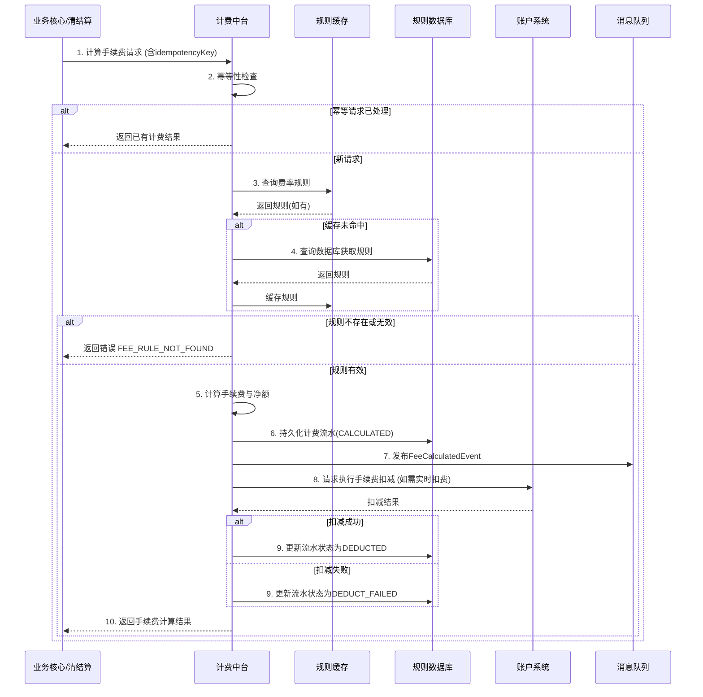

# 模块设计: 计费中台

生成时间: 2026-01-23 15:23:52
批判迭代: 2

---

# 计费中台模块设计文档

## 1. 概述
- **目的与范围**: 负责计费流水生成、手续费计算和费率信息同步的系统。其核心职责是处理与分账、转账等资金流转业务相关的费用计算，并生成相应的计费流水记录。
- **上游调用方角色澄清**:
    - **业务核心**: 作为交易发起方，在处理天财分账交易时，请求计算手续费。
    - **清结算系统**: 作为结算发起方，在清分结算流程中，请求计算相关手续费。
- **费率同步目标**: 将计算出的手续费信息，通过异步消息等方式同步给**账务核心**，用于记账。

## 2. 接口设计
- **API端点 (REST)**:
    - `POST /api/v1/fee/calculate`: 手续费计算接口。
    - `GET /api/v1/fee/rules/{ruleId}`: 查询费率规则详情接口。
- **请求/响应结构**:
    - **计算手续费请求体**:
        - `originalTxId` (string): 原交易ID。
        - `scenario` (string): 计费场景，如 `SPLIT`（分账）、`COLLECTION`（归集）、`BATCH_PAY`（批量付款）。
        - `payerAccountNo` (string): 付款方账户号。
        - `receiverAccountNo` (string): 收款方账户号。
        - `amount` (BigDecimal): 交易金额。
        - `feeBearer` (string): 手续费承担方，如 `PAYER`、`RECEIVER`。
        - `idempotencyKey` (string): 幂等键。
    - **计算手续费响应体**:
        - `feeTxId` (string): 计费流水ID。
        - `originalTxId` (string): 原交易ID。
        - `calculatedFee` (BigDecimal): 计算出的手续费金额。
        - `netAmount` (BigDecimal): 净额（适用于净额转账场景）。
        - `status` (string): 计费状态，如 `CALCULATED`、`DEDUCTED`。
        - `ruleId` (string): 使用的费率规则ID。
- **发布/消费的事件**:
    - **消费事件**: TBD（例如，监听费率规则更新事件）。
    - **发布事件**: `FeeCalculatedEvent`，包含手续费计算结果及流水信息，供账务核心等下游模块消费。

## 3. 数据模型
- **表/集合**:
    - **费率规则表 (fee_rule)**:
        - `rule_id` (PK, string): 规则唯一标识。
        - `scenario` (string): 适用业务场景。
        - `rate_type` (string): 费率类型（如比例费率、固定费率）。
        - `rate_value` (decimal): 费率值。
        - `fee_bearer` (string): 默认手续费承担方。
        - `effective_date` (datetime): 生效时间。
        - `expiry_date` (datetime): 失效时间。
        - `min_fee` (decimal): 最低手续费。
        - `max_fee` (decimal): 最高手续费。
    - **计费流水表 (fee_transaction)**:
        - `fee_id` (PK, string): 计费流水唯一标识。
        - `original_tx_id` (string): 关联的原交易ID。
        - `scenario` (string): 业务场景。
        - `amount` (decimal): 交易原金额。
        - `calculated_fee` (decimal): 计算出的手续费。
        - `net_amount` (decimal): 净额。
        - `status` (string): 状态（CALCULATED， DEDUCT_FAILED， DEDUCTED）。
        - `payer_account_no` (string): 付款方账户。
        - `receiver_account_no` (string): 收款方账户。
        - `fee_bearer` (string): 手续费承担方。
        - `rule_id` (string): 使用的费率规则ID。
        - `idempotency_key` (string, unique): 幂等键。
        - `created_at` (datetime): 创建时间。
- **与其他模块的关系**:
    - 通过 `original_tx_id` 与**业务核心**或**清结算系统**的交易记录关联。
    - 计费结果通过事件同步至**账务核心**。
    - 手续费扣减需调用**账户系统**。

## 4. 业务逻辑
- **核心工作流/算法**:
    1. **接收请求**: 接收来自业务核心或清结算系统的计费请求。
    2. **幂等校验**: 检查请求中的 `idempotencyKey`，若已存在相同流水则直接返回历史结果。
    3. **查询费率规则**: 根据请求的 `scenario`、`payerAccountNo`、`receiverAccountNo` 以及当前时间，查询生效的费率规则。支持从缓存读取，缓存未命中则查数据库。
    4. **手续费计算**:
        - **比例费率**: `fee = amount * rate_value`。
        - **固定费率**: `fee = rate_value`。
        - 计算结果需与规则中的 `min_fee` 和 `max_fee` 比较并钳制。
        - **精度与舍入**: 金额计算使用 `BigDecimal`，最终手续费金额舍入规则为 `HALF_UP`（四舍五入），精度为分（0.01元）。
    5. **净额计算**: 若为`净额转账`模式，则 `netAmount = amount - fee`；若为`全额转账`模式，则 `netAmount = amount`。
    6. **生成流水**: 将计算结果持久化至 `fee_transaction` 表，状态初始为 `CALCULATED`。
    7. **同步信息**: 发布 `FeeCalculatedEvent` 事件。
    8. **返回结果**: 将计算结果返回给调用方。
- **业务规则与验证**:
    - 校验请求参数合法性（如金额为正数）。
    - 验证计费场景（`scenario`）是否在支持范围内。
    - 验证费率规则是否存在且有效，若缺失则视为关键错误。
- **关键边界情况处理**:
    - **费率规则并发更新**: 采用乐观锁或分布式锁（如基于 `rule_id`）确保计算时规则状态一致。
    - **手续费计算溢出**: 使用 `BigDecimal` 防止精度丢失和溢出，计算前后进行合理性校验（如手续费不大于本金）。
    - **下游扣费失败**: 若需实时扣费（由账户系统执行），扣费失败后更新计费流水状态为 `DEDUCT_FAILED`，并通知上游业务方。

## 5. 时序图

## 6. 错误处理
- **预期错误情况与错误码**:
    - `FEE_RULE_NOT_FOUND` (400): 未找到适用的有效费率规则。
    - `INVALID_FEE_SCENARIO` (400): 不支持的计费场景。
    - `CALCULATION_OVERFLOW` (500): 手续费计算溢出或结果不合理。
    - `ACCOUNT_DEDUCT_FAILED` (500): 账户系统手续费扣减失败（如余额不足）。
    - `DOWNSTREAM_SERVICE_UNAVAILABLE` (503): 下游服务（如账户系统、数据库）暂时不可用。
    - `IDEMPOTENCY_KEY_CONFLICT` (409): 幂等键冲突（罕见，内部处理机制触发）。
- **处理策略**:
    - 对于 `FEE_RULE_NOT_FOUND` 等业务规则错误，返回明确错误，阻断业务流程。
    - 对于 `ACCOUNT_DEDUCT_FAILED`，记录详细日志并通知上游，由业务决定重试或终止。
    - 对于 `DOWNSTREAM_SERVICE_UNAVAILABLE` 等暂时性故障，实现指数退避重试机制（如调用账户系统扣费）。
    - 所有错误均记录结构化日志，包含请求ID、错误码和上下文信息。

## 7. 依赖关系
- **上游模块**:
    - **业务核心**: 提供分账等交易请求，触发手续费计算。
    - **清结算系统**: 在结算流程中触发手续费计算。
- **下游模块**:
    - **账户系统**: 执行实际的手续费余额扣减操作。
    - **账务核心**: 消费 `FeeCalculatedEvent`，完成手续费相关的账务处理。
- **内部/基础设施依赖**:
    - 规则数据库、缓存服务、消息中间件。