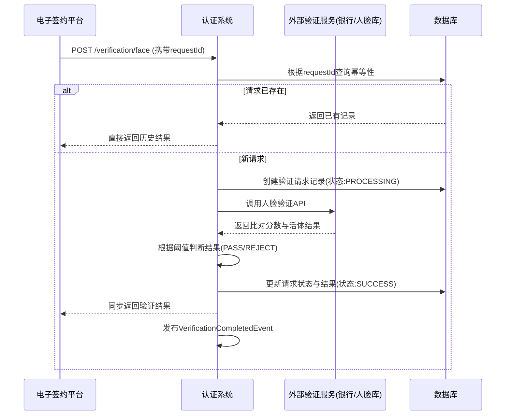

# 模块设计: 认证系统

生成时间: 2026-01-23 15:23:46
批判迭代: 2

---

# 认证系统 模块设计文档

## 1. 概述
- **目的与范围**：本模块负责处理用户身份认证与账户授权验证。其核心职责包括执行打款验证以确认银行卡有效性，以及执行人脸验证以核实个人或个体户负责人的身份。本模块是关系绑定、开通付款等业务流程中身份认证环节的执行者，不负责协议管理或流程编排。本模块由电子签约平台调用，提供标准化的验证服务。
- **关键非功能性要求**：
    - **安全性**：需对传输和存储的个人身份信息（PII）及生物特征数据进行加密处理，并遵循相关数据保护法规。
    - **合规性**：人脸验证需符合国家关于生物特征信息采集与使用的规定，数据保留期限需根据法规和业务要求设定。
    - **性能**：单次验证请求的端到端响应时间P95应低于5秒。
    - **幂等性**：支持基于唯一请求ID的幂等调用，防止重复验证。

## 2. 接口设计
- **API端点 (REST)**：
    - `POST /api/v1/verification/payment`：发起打款验证。
    - `POST /api/v1/verification/face`：发起人脸验证。
    - `GET /api/v1/verification/result/{requestId}`：查询验证结果。
- **请求/响应结构**：
    - **打款验证请求**：
        ```json
        {
          "requestId": "唯一请求标识，用于幂等",
          "userId": "用户ID",
          "userName": "姓名",
          "bankCardNo": "银行卡号",
          "idCardNo": "身份证号",
          "mobile": "银行预留手机号（可选）",
          "callbackUrl": "异步回调地址（可选）"
        }
        ```
    - **人脸验证请求**：
        ```json
        {
          "requestId": "唯一请求标识，用于幂等",
          "userId": "用户ID",
          "userName": "姓名",
          "idCardNo": "身份证号",
          "faceImage": "Base64编码的人脸图片或活体检测数据",
          "scene": "验证场景，如：RELATION_BINDING"
        }
        ```
    - **通用响应**：
        ```json
        {
          "code": "业务状态码",
          "message": "描述信息",
          "data": {
            "requestId": "请求ID",
            "status": "状态（PROCESSING/SUCCESS/FAILED）",
            "result": "验证结果（PASS/REJECT）",
            "failReason": "失败原因（可选）",
            "verifyTime": "验证完成时间"
          }
        }
        ```
- **发布/消费的事件**：
    - **消费事件**：TBD（例如，接收来自电子签约平台的验证指令事件）。
    - **发布事件**：`VerificationCompletedEvent`，当验证完成时发布，包含请求ID、用户ID、验证类型和结果。

## 3. 数据模型
- **表/集合**：
    - **verification_request（验证请求表）**：存储所有验证请求的主记录。
    - **payment_verification_detail（打款验证详情表）**：存储打款验证的特定信息。
    - **face_verification_detail（人脸验证详情表）**：存储人脸验证的特定信息。
    - **verification_audit_log（验证审计日志表）**：存储所有操作的审计日志。
- **关键字段**：
    - **verification_request**：
        - `id` / `request_id`：主键，与请求ID一致。
        - `user_id`：用户ID。
        - `type`：验证类型（PAYMENT/FACE）。
        - `status`：状态（INIT， PROCESSING， SUCCESS， FAILED）。
        - `result`：最终结果（PASS， REJECT）。
        - `scene`：业务场景。
        - `created_at`， `updated_at`：时间戳。
    - **payment_verification_detail**：
        - `request_id`：外键，关联验证请求。
        - `bank_card_no`：银行卡号（加密存储）。
        - `amount`：打款金额（分）。
        - `external_trade_no`：外部通道交易流水号。
        - `callback_confirmed`：回调是否已确认。
    - **face_verification_detail**：
        - `request_id`：外键，关联验证请求。
        - `id_card_no`：身份证号（加密存储）。
        - `face_image_hash`：人脸特征信息哈希（不存储原始图片）。
        - `score`：人脸比对分数。
        - `liveness_result`：活体检测结果。
- **与其他模块的关系**：本模块由**电子签约平台**调用，验证结果可供**行业钱包**在关系绑定时查询。本模块依赖外部验证服务。

## 4. 业务逻辑
- **核心工作流/算法**：
    1.  **接收与校验**：接收验证请求，校验参数完整性、业务规则（如身份证格式）及幂等性（根据`requestId`判断是否已处理）。
    2.  **调用外部服务**：
        - **打款验证**：
            a. 生成随机小额金额（如0.01-0.99元）。
            b. 调用银行/支付通道的打款接口，向目标银行卡转账。
            c. 记录外部交易流水号，等待用户回填金额或通道异步回调。
            d. 比对用户回填金额或回调通知中的金额，判断是否匹配。
        - **人脸验证**：
            a. 调用公安人脸库或第三方人脸识别服务，传入姓名、身份证号和人脸特征。
            b. 服务返回比对分数和活体检测结果。
            c. 根据预设阈值（如比对分数>0.8且活体检测通过）判断验证结果。
    3.  **状态更新与通知**：更新验证状态和结果，若请求指定了`callbackUrl`，则异步回调通知调用方。发布`VerificationCompletedEvent`事件。
- **业务规则与验证**：
    - **打款验证匹配规则**：用户回填金额需与系统打款金额完全一致（单位：分）。
    - **人脸验证匹配规则**：需同时满足：1) 比对分数 > 预设阈值（可配置）；2) 活体检测结果为通过。
    - **验证时效性**：打款验证回填有效期通常为24小时；人脸验证响应实时处理。
- **关键边界情况处理**：
    - **外部服务不可用**：触发熔断机制，并返回“服务暂时不可用”错误。
    - **网络超时**：设置合理的接口超时时间，并具备重试机制。
    - **验证信息不匹配**：记录详细的不匹配原因（如金额错误、人脸比对分数低），并返回明确的失败结果。
    - **重复请求**：基于`requestId`实现幂等，直接返回已存在的验证结果。

## 5. 时序图



## 6. 错误处理
- **预期错误情况与错误码**：
    - `4000`：请求参数无效（如身份证格式错误）。
    - `4001`：重复的请求（幂等性冲突）。
    - `5001`：外部验证服务调用失败。
    - `5002`：外部验证服务响应超时。
    - `5003`：外部验证服务返回业务错误（如账户不存在）。
    - `5004`：系统内部错误（如数据库异常）。
- **处理策略**：
    - **重试机制**：对于网络超时（`5002`）等可重试错误，采用指数退避策略进行最多3次重试。
    - **熔断器**：针对外部验证服务，当失败率超过阈值时，开启熔断，直接快速失败，定期尝试恢复。
    - **降级与回退**：TBD（在极端情况下，是否提供降级验证方案，如仅依赖基础信息校验）。
    - **错误传递**：向上游返回结构化的错误信息，包含错误码、可读消息及请求ID，便于排查。
    - **审计与监控**：所有错误均记录至审计日志，并接入监控告警系统。

## 7. 依赖关系
- **上游模块**：**电子签约平台**。本模块作为其下游服务，被调用来执行具体的身份与银行卡验证。
- **下游模块/服务**：
    - **外部验证服务**：银行打款通道、公安人脸识别系统或合规的第三方人脸验证服务商。
    - **内部依赖**：数据库、消息中间件（用于发布事件）、配置中心（用于管理阈值、开关等）。
- **澄清**：本模块是独立的服务，由电子签约平台在需要执行打款或人脸验证时同步或异步调用。不存在循环依赖。验证结果状态由本模块持久化存储。