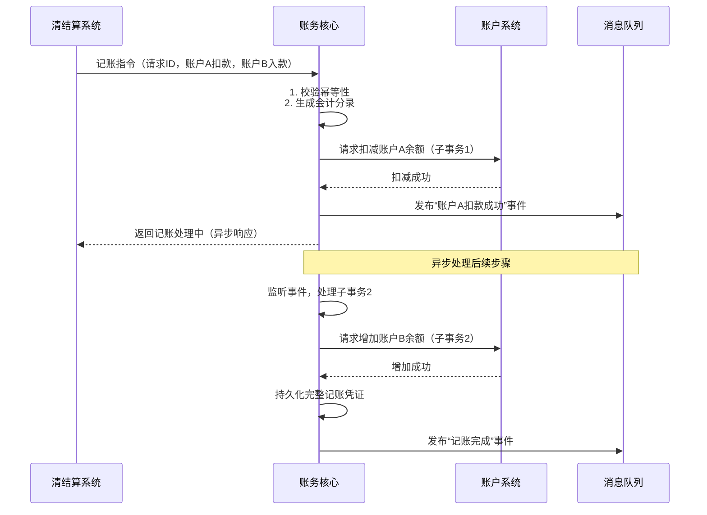

# 模块设计: 账务核心

生成时间: 2026-01-23 15:23:42
批判迭代: 2

---

# 账务核心模块设计文档

## 1. 概述
- **目的与范围**: 本模块是负责记账分录生成和账务处理的底层核心系统。其核心职责是接收来自上游系统的记账指令，根据会计规则生成准确、完整的会计分录，并完成账户余额的更新。其边界在于处理纯粹的账务逻辑，不涉及业务规则校验、风险控制或账户管理。本模块负责验证记账指令的要素完整性，但账户状态等业务规则校验委托给上游系统或依赖的账户系统完成。

## 2. 接口设计
- **API端点 (REST/GraphQL)**: TBD
- **请求/响应结构**: TBD
- **发布/消费的事件**: TBD

## 3. 数据模型
- **表/集合**: TBD
- **关键字段**: TBD
- **与其他模块的关系**: 本模块处理的数据与**账户系统**管理的账户余额直接相关，为**对账单系统**提供原始的账务流水数据。

## 4. 业务逻辑
- **核心工作流/算法**: 接收记账请求 -> 验证记账要素（账户、金额、借贷方向）-> 应用会计规则生成分录 -> 调用底层服务更新账户余额 -> 持久化记账凭证。
- **业务规则与验证**: 确保所有会计分录遵循“有借必有贷，借贷必相等”的会计恒等式。验证记账指令中账户、金额等要素的完整性。账户状态是否可用等业务规则由上游调用方（如清结算系统、行业钱包）或下游账户系统负责校验。
- **关键边界情况处理**: 处理分布式事务场景下的账务一致性。采用补偿事务（Saga）模式确保涉及多账户余额变动的操作（如分账、转账）的最终一致性。为所有请求提供幂等性支持。
- **幂等与重试机制**: 通过业务唯一键（如请求ID+业务类型）实现接口幂等。对于可重试的系统级错误，采用指数退避策略进行重试。

## 5. 时序图

## 6. 错误处理
- **预期错误情况**: 账户不存在、账户状态异常（如冻结）、账户余额不足、记账要素不完整、网络或数据库异常、幂等冲突。
- **处理策略**: 对于业务性错误（如余额不足、账户不存在），立即失败并返回明确错误码，由上游系统处理。对于系统级异常，记录详细日志，并根据Saga模式触发已成功子事务的补偿操作，确保最终一致性。所有操作支持幂等重试。

## 7. 依赖关系
- **上游模块**: **清结算系统**（触发结算、退货等记账请求）、**行业钱包**（触发分账记账请求）。上游模块需保证传入的记账指令业务正确，并处理业务校验失败场景。
- **下游模块**: **账户系统**（依赖其进行账户余额的原子性更新）。通过异步事件和补偿机制保证分布式事务的最终一致性。