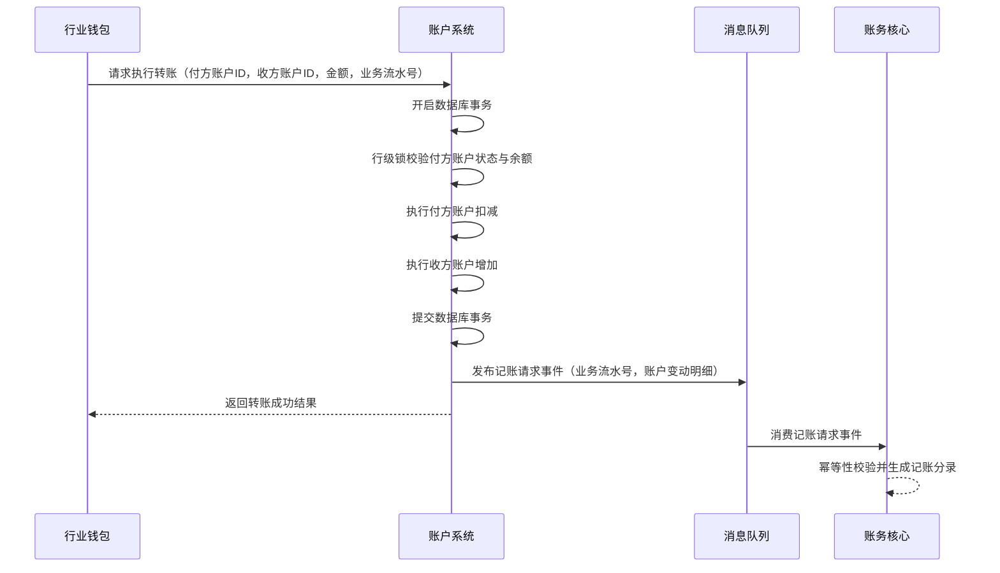
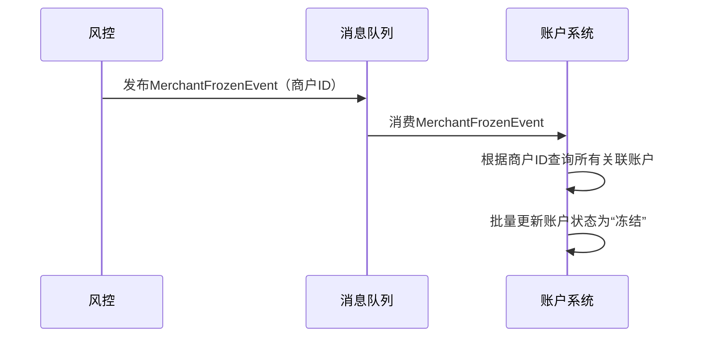

# 模块设计: 账户系统

生成时间: 2026-01-23 15:23:53
批判迭代: 2

---

# 账户系统模块设计文档

## 1. 概述
- **目的与范围**: 账户系统是底层核心系统，负责账户的开立、升级、余额扣减、转账执行和账户状态管理等原子操作。它为上层业务（如行业钱包、清结算）提供基础的账户操作能力，但不处理业务逻辑（如分账规则、计费）。其边界止于账户层面的原子操作，例如执行一笔从A账户到B账户的转账，但不关心转账的业务原因。

## 2. 接口设计
- **API端点 (REST/GraphQL)**: TBD
- **请求/响应结构**: TBD
- **发布/消费的事件**:
    - **消费事件**:
        - `MerchantFrozenEvent` (来自风控): 包含商户ID。触发冻结该商户关联的所有账户。
    - **发布事件**:
        - `AccountOpenedEvent`: 账户开立成功后发布，包含账户ID、类型、所属商户ID。
        - `BalanceChangedEvent`: 账户余额发生变动后发布，包含账户ID、变动金额、变动后余额、业务流水号。
        - `AccountStatusChangedEvent`: 账户状态（启用/禁用/冻结）变更后发布，包含账户ID、变更前状态、变更后状态。

## 3. 数据模型
- **表/集合**: TBD
- **关键字段**: TBD
- **与其他模块的关系**: 账户系统为行业钱包、清结算系统提供账户数据支撑和操作接口。账户系统在完成资金变动后，需要通知账务核心进行记账。

## 4. 业务逻辑
- **核心工作流/算法**:
    1.  **账户开立**: 根据请求（来自行业钱包）创建指定类型的账户（如天财收款账户、天财接收方账户、待结算账户、退货账户）。
    2.  **账户升级**: 根据业务需要，变更账户的等级或属性。
    3.  **余额操作**: 执行账户余额的扣减、增加、冻结、解冻。扣减前需校验余额是否充足。
    4.  **转账执行**: 执行从付方账户到收方账户的资金划转，确保原子性（要么全成功，要么全失败）。
    5.  **状态管理**: 管理账户的启用、禁用、冻结（由风控事件触发）等状态。
- **业务规则与验证**:
    1.  开立账户时，需校验账户类型的合法性。
    2.  执行余额扣减或转账前，必须校验付方账户状态是否正常、余额是否充足。
    3.  转账操作需保证事务一致性。
- **关键边界情况处理**:
    1.  **并发扣款**: 对同一账户的并发扣款操作通过数据库行级锁（悲观锁）防止超扣。每次扣减操作在一个数据库事务内完成，锁定目标账户行。
    2.  **系统故障与冲正**: 在转账等关键操作中，采用本地事务确保付方扣减和收方增加的原子性。若后续调用账务核心失败，系统记录失败日志并发出告警，由对账系统在日终进行核对与修复，确保最终一致性。
    3.  **风控冻结**: 订阅`MerchantFrozenEvent`事件。收到事件后，根据商户ID查询其关联的所有账户，并批量将其状态更新为“冻结”。
    4.  **与账务核心的集成**: 资金操作（转账、余额变动）与记账操作解耦。账户系统在成功完成资金变动后，异步发出记账请求（如通过消息队列）给账务核心。记账请求需包含唯一业务流水号以保证幂等性。账户系统不等待记账结果即向上游返回资金操作成功，记账的最终一致性由对账机制保障。

## 5. 时序图

### 5.1 转账执行时序图

### 5.2 处理风控冻结指令时序图

## 6. 错误处理
- **预期错误情况**:
    1.  付方账户不存在或状态异常（禁用、冻结）。
    2.  付方账户余额不足。
    3.  收方账户不存在或状态异常。
    4.  系统内部错误（如数据库连接失败）。
    5.  调用下游系统（如消息队列）失败。
- **处理策略**:
    1.  对于账户状态或余额问题，返回明确的业务错误码和提示，事务回滚。
    2.  对于数据库等系统内部错误，记录详细日志，向上游返回系统错误，触发告警，事务回滚。
    3.  发布事件到消息队列失败时，记录本地失败日志并重试，同时触发告警。由补偿作业定期扫描并重发未成功事件。

## 7. 依赖关系
- **上游模块**:
    1.  **行业钱包**: 调用账户系统进行开户、转账等操作。
    2.  **清结算系统**: 调用账户系统进行结算、退货扣款等资金操作。
    3.  **风控**: 通过消息事件向账户系统发送商户冻结/解冻指令。
- **下游模块**:
    1.  **账务核心**: 账户系统在完成资金变动后，通过异步事件通知账务核心进行记账。
    2.  **消息队列**: 用于解耦与风控、账务核心的通信。