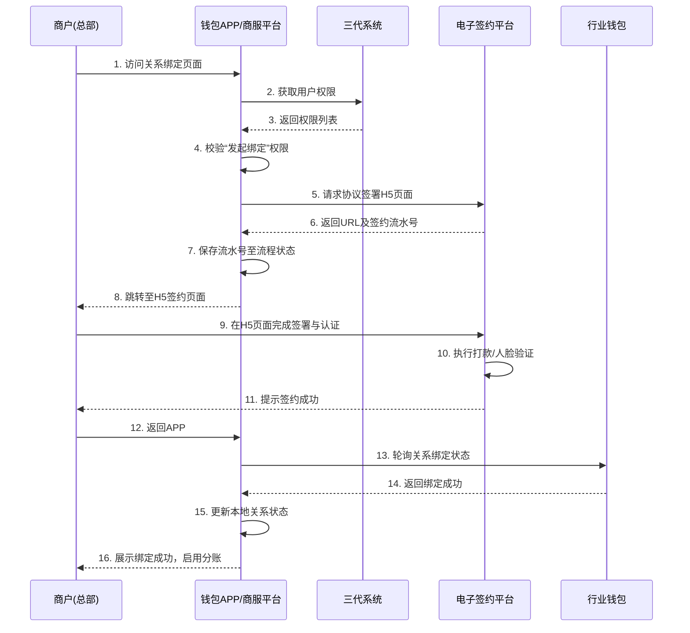
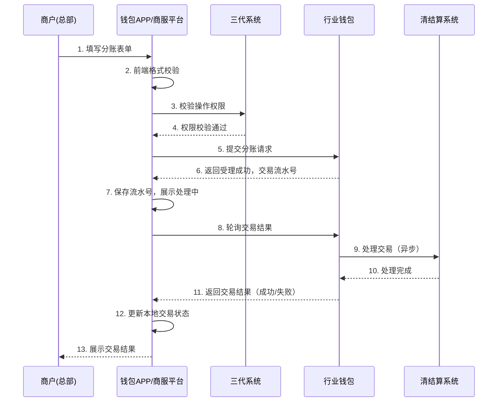

# 模块设计: 钱包APP/商服平台

生成时间: 2026-01-23 15:24:05
批判迭代: 2

---

# 钱包APP/商服平台 模块设计文档

## 1. 概述
- **目的与范围**：本模块是面向商户（总部、门店）和接收方（非收单商户、个人）的前端应用平台。其核心职责是为用户提供账户管理、交易查询、分账/转账操作、协议签署、认证流程（如打款验证、人脸验证）以及相关业务申请（如开通付款）的交互界面。它作为用户与后端系统交互的入口，主要负责界面展示、流程引导、数据收集以及前端状态管理，不处理核心业务规则（如计费、记账、风控判定）的计算与执行。
- **模块定位**：本模块是业务流程的发起者和用户交互的协调者，通过调用后端服务接口驱动业务流转，并根据后端返回的状态控制前端界面。

## 2. 接口设计
- **API端点 (REST/GraphQL)**：本模块作为前端应用，主要消费后端服务提供的RESTful API。关键接口类别包括：
    - **认证与权限**：从“三代”系统获取机构/商户令牌、用户角色及权限列表。
    - **账户服务**：从“行业钱包”查询天财收款账户、天财接收方账户的余额、状态及列表。
    - **交易服务**：向“行业钱包”提交分账/转账请求；从“清结算系统”或“业务核心”查询历史交易、结算记录。
    - **协议与认证**：从“电子签约平台”获取协议签署H5页面URL及签约流水号；查询签约状态。
    - **业务开通**：向“行业钱包”提交开通付款能力申请，并获取后续引导流程。
    - **文件服务**：从“对账单系统”获取对账单下载链接。
- **请求/响应结构**：TBD（需根据具体后端API文档定义）。
- **发布/消费的事件**：本模块主要消费后端服务通过Webhook或轮询方式推送的状态变更事件，如：协议签署完成事件、账户状态变更事件、交易处理结果事件。模块本身不发布业务事件。

## 3. 数据模型
- **前端状态模型**：本模块在前端（如Vuex/Pinia Store或React Context）维护以下状态，用于界面渲染和流程控制：
    - **用户会话**：包含`机构号`、`APPID`、`商户ID`、`用户角色`（总部、门店等）、`权限列表`、`令牌`。
    - **账户视图**：缓存当前用户可见的`账户列表`（含账户ID、类型、余额、状态）、`选中账户`信息。
    - **交易表单**：暂存用户正在填写的分账/转账请求数据（付方账户、收方账户、金额、备注等）。
    - **流程状态**：记录多步骤流程（如关系绑定、开通付款）的当前步骤、上下文数据（如签约流水号）及临时状态。
    - **界面状态**：控制加载中、错误提示、模态框显示等UI状态。
- **数据映射**：前端状态模型中的数据是对后端模块（如行业钱包、账户系统）数据视图的映射和适配，不独立持久化。数据转换在API调用响应处理层完成。

## 4. 业务逻辑
- **核心工作流/流程控制**：
    1.  **用户登录与鉴权流程**：引导用户输入凭证，调用“三代”系统接口进行身份验证，获取并存储用户角色与权限。
    2.  **权限校验与界面控制**：根据用户角色（总部/门店）和权限列表，动态渲染或禁用界面元素（如“发起归集”按钮仅总部可见且需具备相应权限）。
    3.  **关系绑定流程引导**：协调“电子签约平台”完成协议签署。保存签约流水号，监听签约结果回调或主动轮询状态，根据结果更新本地关系状态并引导下一步。
    4.  **分账/转账操作流程**：收集用户输入，进行前端格式校验，调用“行业钱包”提交请求。轮询或监听处理结果，更新交易状态。
    5.  **开通付款流程引导**：引导用户完成多步骤的签约与认证申请。管理流程步骤状态，在步骤间传递必要参数，调用不同后端服务（行业钱包、电子签约平台）。
    6.  **数据查询与展示流程**：调用相应后端接口获取账户、交易数据，进行前端格式化（如金额、日期）后展示。
- **业务规则与验证**：
    - **前端校验**：对用户输入进行即时格式校验（金额为正数、账户号格式、必填项）。
    - **操作权限控制**：基于从“三代”获取的权限列表，在界面层控制操作入口的可见性与可用性。例如：校验“门店发起归集”权限是否存在。
    - **状态依赖控制**：根据从后端查询的账户状态（冻结、正常）、关系绑定状态，控制相关操作按钮的禁用/启用及提示信息。
- **前端状态管理策略**：
    - 对于多步骤流程，使用前端路由参数或状态管理库持久化流程步骤和上下文，支持浏览器刷新后流程恢复。
    - 对高频查询数据（如账户余额）实施短期缓存与定时刷新策略。
    - 表单数据在页面组件卸载前进行本地暂存，提升用户体验。

## 5. 时序图

### 5.1 关系绑定流程时序图

### 5.2 分账/转账操作时序图

## 6. 错误处理
- **预期错误情况**：
    - 网络异常、后端服务超时或不可用。
    - 用户输入数据格式错误。
    - 后端返回的业务逻辑错误（余额不足、关系未绑定、账户冻结、权限不足）。
    - 认证流程失败（打款验证金额错误、人脸比对失败）。
- **处理策略**：
    - **网络与服务器错误**：采用指数退避策略进行API调用重试（如最多3次）。超过重试次数后，展示统一网络错误页面，提供“重试”按钮。
    - **用户输入错误**：在表单提交时进行即时校验并提示，阻止无效请求发出。
    - **业务逻辑错误**：拦截后端返回的错误码，映射为友好的用户提示信息。对于状态类错误（如未绑定），引导用户进入对应流程（如关系绑定）。
    - **流程中断与恢复**：对于多步骤流程，将关键进度和参数持久化。当流程因错误中断后，用户重新进入时可恢复至最近步骤。
    - **全局错误边界**：使用前端框架错误边界组件捕获渲染错误，降级展示备用UI。

## 7. 依赖关系
- **上游模块（依赖方）**：
    - **三代系统**：**关键依赖**。提供用户身份认证、机构校验、以及基于角色的操作权限控制。
    - **行业钱包**：**核心依赖**。提供账户查询、关系绑定状态查询、分账/转账请求提交、开通付款申请受理等接口。
    - **电子签约平台**：**核心依赖**。提供协议签署H5页面、签约状态查询及认证流程集成。
    - **清结算系统**：提供交易记录、结算单的查询接口。
    - **业务核心**：提供天财分账交易数据的查询接口。
    - **对账单系统**：提供对账单下载链接或文件流。
    - **账户系统**：通过行业钱包间接依赖，获取底层账户状态。
- **下游模块**：本模块为前端展示与流程引导层，无其他业务模块依赖其输出。用户通过本模块的操作直接触发上游模块的业务流程。