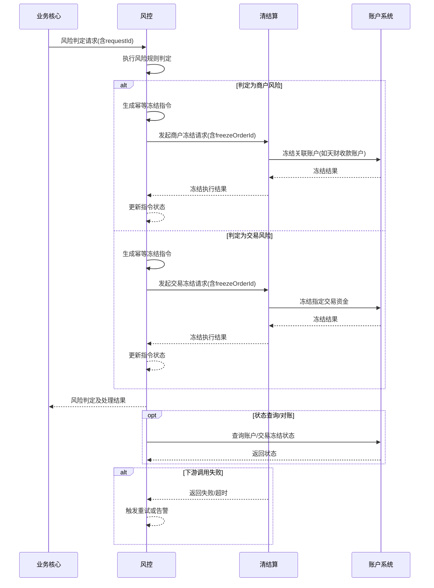

# 模块设计: 风控

生成时间: 2026-01-23 15:23:54
批判迭代: 2

---

# 风控模块设计文档

## 1. 概述
- **目的与范围**: 本模块负责对商户及交易进行风险判定，并据此发起资金冻结操作。核心职责包括接收风险判定请求、执行风险规则、发起商户冻结和交易冻结流程。其边界在于风险规则的制定与判定，以及冻结指令（请求/命令）的发起，不涉及具体的账户资金操作执行。冻结操作的实际执行由下游清结算系统和账户系统完成。

## 2. 接口设计
- **API端点 (REST/GraphQL)**:
    - `POST /api/v1/risk/assessment`: 接收风险判定请求。
    - `GET /api/v1/risk/freeze-orders/{freezeOrderId}`: 查询冻结指令状态。
    - `POST /api/v1/risk/rules`: 创建风险规则（管理接口）。
    - `PUT /api/v1/risk/rules/{ruleId}`: 更新风险规则（管理接口）。
- **请求/响应结构**:
    - 风险判定请求 (`POST /api/v1/risk/assessment`):
        - 请求体: `{ “requestId”: “string”, “type”: “MERCHANT”|”TRANSACTION”, “entityId”: “string”, “data”: {} }`
        - 响应体: `{ “requestId”: “string”, “riskLevel”: “HIGH”|”MEDIUM”|”LOW”, “decision”: “FREEZE”|”PASS”, “freezeOrderId”: “string|null” }`
    - 冻结指令状态查询响应: `{ “freezeOrderId”: “string”, “status”: “PENDING”|”SUCCESS”|”FAILED”, “detail”: “string” }`
- **发布/消费的事件**:
    - 消费事件: TBD（例如来自业务核心的交易创建事件、来自监控系统的告警事件）。
    - 发布事件: `MerchantFreezeRequestedEvent`, `TransactionFreezeRequestedEvent`。

## 3. 数据模型
- **表/集合**:
    - `risk_events`: 风险事件记录表。
    - `risk_rules`: 风险规则配置表。
    - `freeze_orders`: 冻结指令记录表。
- **关键字段**:
    - `risk_events`: `id`, `request_id`, `entity_type`, `entity_id`, `trigger_data`, `risk_score`, `decision`, `created_at`。
    - `risk_rules`: `id`, `name`, `rule_type`, `condition`, `action`, `threshold`, `is_active`, `updated_at`。
    - `freeze_orders`: `id`, `order_no`, `entity_type`, `entity_id`, `freeze_type`, `status`, `request_data`, `response_data`, `retry_count`, `created_at`, `updated_at`。
- **与其他模块的关系**: 风控模块的风险判定结果会触发对清结算系统、账户系统等模块的调用，以执行冻结操作。`freeze_orders` 表通过 `entity_id` 关联商户或交易实体。

## 4. 业务逻辑
- **核心工作流/算法**:
    1.  接收来自业务核心、清结算系统或其他监控渠道（如内部审计日志告警）的风险事件或判定请求。
    2.  根据预设的风险规则模型（如交易频次、金额、商户行为模式等）进行风险评分或判定。规则引擎加载活跃规则，对输入数据进行匹配和计算。
    3.  若判定风险成立，则根据风险类型（商户级或交易级）生成幂等的冻结指令，并调用下游清结算系统接口发起相应的冻结流程。
    4.  异步监听或主动查询冻结指令的执行状态，并更新本地记录。
- **业务规则与验证**: 规则包括但不限于：商户交易行为异常检测（如短时间内高频交易）、单笔/累计交易金额阈值、关联账户风险传导等。验证逻辑需确保冻结指令的准确性和必要性，避免误判。
- **关键边界情况处理**:
    1.  对已冻结的商户或交易重复发起冻结请求的处理：通过幂等键（`requestId` 或 `freezeOrderId`）保证请求幂等性，返回已有处理结果。
    2.  风险判定所需数据不完整或延迟时的处理策略：配置规则降级策略或等待超时，记录数据缺失事件。
    3.  冻结指令发出后，下游系统执行失败或超时的补偿与通知机制：实现带指数退避的自动重试机制（记录于 `retry_count`），达到最大重试次数后标记为失败并触发告警，支持人工介入。定期与下游系统对账，以发现并修复状态不一致。
- **性能、安全与审计**:
    - 规则引擎需支持高效匹配，考虑对高频规则进行索引优化或缓存。
    - 所有风险判定请求、规则命中、冻结指令的发起与结果均需记录详细审计日志，满足数据留存要求。
    - 处理敏感风险数据时，需遵守数据隐私和安全规范，对日志中的敏感信息进行脱敏。

## 5. 时序图

## 6. 错误处理
- **预期错误情况**:
    1.  风险判定服务不可用。
    2.  规则引擎执行错误（如规则语法错误）。
    3.  向下游系统（清结算）发起冻结请求失败或超时。
    4.  接收到的风险数据格式错误或无效。
    5.  与下游系统状态不一致。
- **处理策略**:
    1.  对关键服务依赖（如规则引擎、数据库）进行健康检查与熔断。
    2.  冻结指令发送失败时，根据 `freezeOrderId` 进行幂等重试，采用指数退避策略，记录日志并触发告警。
    3.  对无效请求返回明确的错误码和描述。
    4.  建立定期对账任务，比对风控模块的 `freeze_orders` 状态与下游系统的实际状态，发现不一致时触发修复流程或告警。

## 7. 依赖关系
- **上游模块**: 业务核心（触发交易风险判定）、清结算系统（可能提供交易数据或触发风险检查）。
- **下游模块**: 清结算系统（执行商户冻结、交易冻结的资金操作命令）。账户系统（风控模块可通过清结算间接查询状态，或直接查询以进行对账）。