# DocuFlow-AI Project - 软件设计文档
生成时间: 2026-01-23 14:16:53

## 目录
1. [概述说明](#1-概述说明)
   - 1.1 [术语与缩略词](#11-术语与缩略词)
2. [系统设计](#2-系统设计)
3. [模块设计](#3-模块设计)
   - 3.1 [天财](#module-1)
   - 3.2 [三代](#module-2)
   - 3.3 [行业钱包](#module-3)
   - 3.4 [清结算](#module-4)
   - 3.5 [账户系统](#module-5)
   - 3.6 [账务核心](#module-6)
   - 3.7 [风控](#module-7)
   - 3.8 [代付系统](#module-8)
   - 3.9 [认证系统](#module-9)
   - 3.10 [电子签章系统](#module-10)
   - 3.11 [计费中台](#module-11)
   - 3.12 [对账单系统](#module-12)
   - 3.13 [业务核心](#module-13)
   - 3.14 [钱包APP](#module-14)
   - 3.15 [商服平台](#module-15)
   - 3.16 [交易系统](#module-16)
   - 3.17 [用户中心](#module-17)
   - 3.18 [代付通道](#module-18)
4. [接口设计](#4-接口设计)
5. [数据库设计](#5-数据库设计)

---
# 1 概述说明

## 1.1 术语与缩略词


## 系统角色/参与者

- **天财**: 提出分账、会员结算、批量付款等资金管理需求的业务方或系统。
- **三代**: 运营机构，负责商户入网审核、业务开通、接口调用等运营管理职能的系统或角色。
- **行业钱包** (别名: 钱包系统): 负责处理天财专用账户开户、关系绑定、分账请求校验、数据同步等核心业务逻辑的系统。
- **清结算** (别名: 清结算/计费中台): 负责交易清分、结算、计费处理、资金冻结/解冻编排等资金清算与结算处理的系统。
- **账户系统** (别名: 账户): 负责各类账户（如收款账户、接收方账户）的开立、升级、资金扣减/增加、余额管理等底层账户操作的系统。
- **账务核心**: 负责记录所有资金变动流水，进行会计分录记账的系统。
- **风控**: 负责识别交易或商户风险，并触发冻结等管控措施的系统或角色。
- **代付系统**: 负责处理向外部银行账户进行代付出款的系统。
- **认证系统**: 负责执行打款验证、人脸验证等身份核验功能的系统。
- **电子签章系统** (别名: 电子签约平台): 负责生成电子协议、发送签约短信、封装H5页面、管理签约证据链的系统。
- **计费中台**: 负责根据配置的费率规则，计算并生成转账、分账等业务手续费的计费系统。
- **对账单系统**: 负责按机构或账户维度生成并提供各类交易、结算、动账明细对账单的系统。
- **业务核心**: 负责接收并处理天财分账等交易数据的系统。
- **钱包APP**: 面向商户的移动端应用，需对天财新机构号关闭提现等入口。
- **商服平台**: 面向商户的服务平台，需对天财新机构号关闭提现等入口。

## 业务实体

- **天财收款账户** (别名: 天财专用账户, 天财专用收款账户): 为收单商户开立的专用账户，具备转账付款给其他天财收款账户、分账至天财接收方账户、提现等能力。
- **天财接收方账户** (别名: 接收方账户): 为非收单商户或个人开立的专用账户，主要用于接收分账资金并提现。
- **普通收款账户**: 非天财专用的普通收款账户，可通过接口升级为天财收款账户。
- **待结算账户** (别名: 01待结算账户): 用于暂存未结算交易资金的账户，类型标识为01。
- **退货账户** (别名: 04退货账户): 用于处理退货资金的账户，类型标识为04。
- **收单商户** (别名: 拉卡拉收单商户): 具备企业或个体资质，从事收款业务的商户，可开通天财收款账户。
- **非收单商户**: 不从事收款业务的商户或个人，通常作为接收方开立天财接收方账户。
- **对账单**: 按日提供的交易、结算、账户动账等明细数据文件，用于对账。

## 角色

- **总部** (别名: 品牌, 总店): 在品牌与门店架构中处于管理方的角色，通常为企业资质，开立天财收款账户。
- **门店**: 在品牌与门店架构中属于被管理方的角色，可以是企业或个体，开立天财收款账户。
- **接收方** (别名: 入账方): 在分账场景中接收资金的非收单商户或个人角色，开立天财接收方账户。

## 领域特定术语

- **机构号** (别名: 二级机构号): 由三代运营分配给天财下各总部或品牌的唯一机构标识。
- **APPID**: 由ISV或开放平台分配的应用标识，用于接口调用的身份识别。
- **主动结算**: 一种结算模式，结算资金主动结算至指定的收款账户（如天财收款账户）。
- **被动结算**: 一种结算模式，结算资金不主动划付，停留在待结算账户。
- **手续费承担方**: 指定由付款方或收款方统一承担转账分账手续费的参数。
- **净额转账**: 一种转账模式，实际到账金额为分账金额减去手续费。
- **全额转账**: 一种转账模式，分账金额全额到账，手续费额外扣除。
- **计费产品**: 计费中台用于计算手续费的产品配置。
- **扣费方式**: 计费时扣除手续费的方式，如按比例或固定金额。

## 关键流程/工作流名称

- **分账** (别名: 天财分账, 转账): 从天财收款账户向其他天财收款账户或天财接收方账户进行资金划转的业务操作。
- **归集** (别名: 资金归集): 将门店资金归集到总部的资金管理场景，是关系绑定的一种类型。
- **会员结算**: 总部根据会员消费向门店进行分账结算的资金管理场景。
- **批量付款** (别名: 批付): 总部向多个供应商、门店等收款方发起批量分账付款的资金管理场景。
- **关系绑定** (别名: 绑定关系): 在分账、归集、会员结算等场景下，建立收付款双方授权关系的流程，包含签约与认证。
- **开通付款**: 在批量付款和会员结算场景下，付方（总部/门店）需要额外完成的授权签约流程。
- **打款验证**: 通过向目标银行卡打入随机小额资金，并验证回填金额来完成身份或授权核验的认证方式。
- **人脸验证**: 通过比对姓名、身份证和人脸信息来完成身份核验的认证方式。
- **电子协议签署**: 通过电子签章系统在线完成协议签署并留存证据链的流程。
- **开户** (别名: 开户流程): 开立天财收款账户或天财接收方账户的流程。
- **提现** (别名: 提款): 从天财收款账户或天财接收方账户将资金提款至绑定银行卡的流程。
- **商户冻结**: 风控因商户风险发起的，冻结该商户对应天财收款账户资金的流程。
- **交易冻结**: 风控因交易风险发起的，冻结已结算至天财收款账户的特定交易资金的流程。
- **退货前置**: 退货交易处理前的查询与资金预扣流程，用于确定扣款账户和余额。

---
# 2 系统设计
## 2.1 系统结构
本系统采用分层、模块化的微服务架构，旨在为“天财”业务提供专业的资金管理能力。整体架构遵循职责分离原则，由业务接入层、核心业务层、基础服务层和外部依赖层构成，各层通过定义清晰的API进行交互。

- **业务接入层**：包含“天财”和“三代”，作为外部业务方和运营方的统一入口，负责接收、校验业务请求，并进行异步结果管理。
- **核心业务层**：包含“业务核心”、“行业钱包”和“交易系统”，作为业务逻辑的编排与执行中心，负责处理开户、关系绑定、分账、结算等核心业务流程。
- **基础服务层**：包含“账户系统”、“清结算”、“账务核心”、“计费中台”、“风控”、“认证系统”、“电子签章系统”、“代付系统”、“代付通道”和“用户中心”，提供账户、资金、风控、认证等原子化、可复用的基础能力。
- **数据与报表层**：包含“对账单系统”，负责聚合各系统数据，生成并提供对账文件。
- **商户端应用层**：包含“钱包APP”和“商服平台”，为商户提供资金管理和信息查询的界面。

系统通过异步消息、事件驱动和API调用相结合的方式，确保高内聚、低耦合，支持高并发与弹性伸缩。

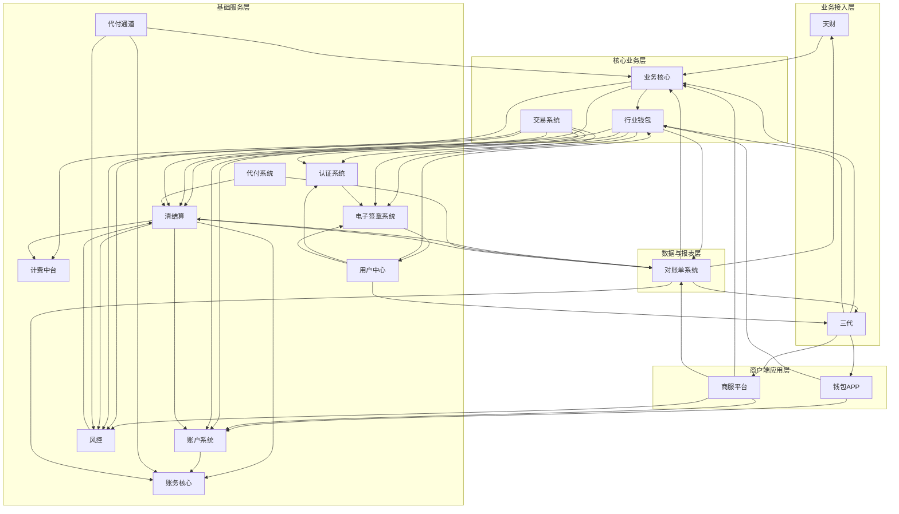
```mermaid
graph TB
    subgraph "业务接入层"
        TC[天财]
        SD[三代]
    end

    subgraph "商户端应用层"
        APP[钱包APP]
        MSP[商服平台]
    end

    subgraph "核心业务层"
        BC[业务核心]
        HW[行业钱包]
        TS[交易系统]
    end

    subgraph "基础服务层"
        AS[账户系统]
        CL[清结算]
        JC[账务核心]
        FC[计费中台]
        RISK[风控]
        AUTH[认证系统]
        ES[电子签章系统]
        DS[代付系统]
        DC[代付通道]
        UC[用户中心]
    end

    subgraph "数据与报表层"
        ST[对账单系统]
    end

    TC --> BC
    SD --> BC
    SD --> HW
    SD --> APP
    SD --> MSP

    APP --> HW
    APP --> AS
    MSP --> BC
    MSP --> AS
    MSP --> ST
    MSP --> RISK

    BC --> HW
    BC --> CL
    BC --> RISK
    HW --> AS
    HW --> CL
    HW --> AUTH
    HW --> ES
    HW --> ST
    TS --> AS
    TS --> RISK
    TS --> AUTH
    TS --> ES
    TS --> CL
    TS --> FC

    CL --> AS
    CL --> JC
    CL --> FC
    CL --> ST
    CL --> RISK
    AS --> JC
    RISK --> CL
    DS --> CL
    DS --> ST
    DC --> BC
    DC --> RISK
    DC --> JC
    AUTH --> ES
    ES --> UC
    UC --> SD
    UC --> HW
    UC --> AUTH
    UC --> ES

    ST --> BC
    ST --> CL
    ST --> JC
    ST --> TC
    ST --> SD
```

## 2.2 功能结构
系统功能围绕“天财资金管理”核心业务展开，主要划分为商户与账户管理、资金业务处理、风控与合规、结算与对账四大功能域。

1.  **商户与账户管理**
    *   **商户入网与机构管理**：由“三代”负责，完成商户资质审核、分配机构号、同步机构信息。
    *   **账户全生命周期管理**：由“行业钱包”和“账户系统”协同，实现天财专用账户（收款/接收方）的开立、升级、状态管理及余额查询。
    *   **用户与关系管理**：由“用户中心”统一管理用户身份，并与机构、商户、账户进行绑定。“行业钱包”负责处理收付款方之间的业务授权关系绑定。

2.  **资金业务处理**
    *   **业务请求接收**：由“天财”接收分账、会员结算、批量付款等原始请求。
    *   **核心业务编排**：“业务核心”和“交易系统”负责接收请求，协调“行业钱包”进行业务校验，并调用“清结算”执行资金处理。
    *   **资金操作执行**：“清结算”负责清分、结算、计费编排；“账户系统”执行具体的资金扣减、增加、冻结、解冻操作；“账务核心”记录所有资金变动的会计分录。
    *   **代付出款**：“代付系统”与“代付通道”协同，处理向外部银行账户的资金划转。

3.  **风控与合规**
    *   **风险识别与处置**：“风控”系统识别交易或商户风险，向“清结算”发起资金冻结指令。
    *   **身份核验与签约**：“认证系统”提供打款验证、人脸验证；“电子签章系统”提供电子协议签署与证据链留存，确保业务合规。

4.  **结算与对账**
    *   **手续费计算**：“计费中台”根据规则计算业务手续费。
    *   **对账单服务**：“对账单系统”聚合各模块数据，生成交易、结算、动账等明细对账单。

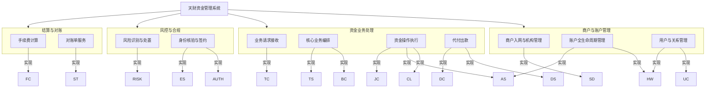
```mermaid
graph TD
    Root[天财资金管理系统]

    subgraph FM[商户与账户管理]
        direction LR
        FM1[商户入网与机构管理]
        FM2[账户全生命周期管理]
        FM3[用户与关系管理]
    end

    subgraph FP[资金业务处理]
        direction LR
        FP1[业务请求接收]
        FP2[核心业务编排]
        FP3[资金操作执行]
        FP4[代付出款]
    end

    subgraph FR[风控与合规]
        direction LR
        FR1[风险识别与处置]
        FR2[身份核验与签约]
    end

    subgraph FS[结算与对账]
        direction LR
        FS1[手续费计算]
        FS2[对账单服务]
    end

    Root --> FM
    Root --> FP
    Root --> FR
    Root --> FS

    FM1 -->|实现| SD
    FM2 -->|实现| HW
    FM2 -->|实现| AS
    FM3 -->|实现| UC
    FM3 -->|实现| HW

    FP1 -->|实现| TC
    FP2 -->|实现| BC
    FP2 -->|实现| TS
    FP3 -->|实现| CL
    FP3 -->|实现| AS
    FP3 -->|实现| JC
    FP4 -->|实现| DS
    FP4 -->|实现| DC

    FR1 -->|实现| RISK
    FR2 -->|实现| AUTH
    FR2 -->|实现| ES

    FS1 -->|实现| FC
    FS2 -->|实现| ST
```

## 2.3 网络拓扑图
TBD

## 2.4 数据流转
以“天财分账”核心业务流程为例，描述关键数据在各系统间的流转过程。流程始于业务请求，经过多层校验与处理，最终完成资金划转和账务记录。

1.  **请求发起与接收**：“天财”发起分账请求至“业务核心”。
2.  **业务校验**：“业务核心”调用“行业钱包”校验付款方账户状态、收款方账户状态以及双方是否存在有效的授权关系。
3.  **风控检查**：“业务核心”同步或异步咨询“风控”系统进行交易风险识别。
4.  **资金处理编排**：校验通过后，“业务核心”或“交易系统”将请求转发至“清结算”。
5.  **手续费计算**：“清结算”调用“计费中台”计算本次分账产生的手续费。
6.  **账户资金操作**：“清结算”编排资金处理逻辑，向“账户系统”发起扣款（从付款方账户）和加款（至收款方账户）指令。
7.  **账务记录**：“账户系统”完成资金操作后，同步调用“账务核心”记录会计分录。
8.  **结果同步**：处理结果由“清结算”返回给上游，并最终由“业务核心”回调通知“天财”。同时，各环节的流水数据将作为源数据提供给“对账单系统”。

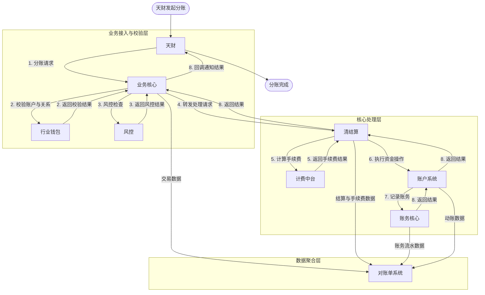
```mermaid
flowchart TD
    Start([天财发起分账]) --> TC
    subgraph A [业务接入与校验层]
        TC[天财] -- 1. 分账请求 --> BC[业务核心]
        BC -- 2. 校验账户与关系 --> HW[行业钱包]
        BC -- 3. 风控检查 --> RISK[风控]
    end

    subgraph B [核心处理层]
        BC -- 4. 转发处理请求 --> CL[清结算]
        CL -- 5. 计算手续费 --> FC[计费中台]
        CL -- 6. 执行资金操作 --> AS[账户系统]
        AS -- 7. 记录账务 --> JC[账务核心]
    end

    subgraph C [数据聚合层]
        BC -- 交易数据 --> ST[对账单系统]
        CL -- 结算与手续费数据 --> ST
        JC -- 账务流水数据 --> ST
        AS -- 动账数据 --> ST
    end

    JC -- 8. 返回结果 --> AS
    AS -- 8. 返回结果 --> CL
    CL -- 8. 返回结果 --> BC
    BC -- 8. 回调通知结果 --> TC
    HW -- 2. 返回校验结果 --> BC
    RISK -- 3. 返回风控结果 --> BC
    FC -- 5. 返回手续费结果 --> CL

    End([分账完成])
    TC --> End
```

## 2.5 系统模块交互关系
模块间主要通过同步API调用进行交互，部分场景辅以异步消息或事件通知。下表概述了关键模块之间的主要调用方向与目的。

| 调用方 | 被调用方 | 交互目的 |
| :--- | :--- | :--- |
| **天财** | 业务核心 | 发起分账、会员结算、批量付款请求；查询请求状态。 |
| **三代** | 业务核心/行业钱包/钱包APP/商服平台 | 同步机构号信息；开通业务。 |
| **业务核心** | 行业钱包 | 校验账户状态、关系绑定。 |
| **业务核心** | 清结算 | 发起资金清分、结算、冻结/解冻编排。 |
| **业务核心** | 风控 | 提交交易进行风险识别。 |
| **行业钱包** | 账户系统 | 查询账户信息、执行账户升级。 |
| **行业钱包** | 清结算 | 转发分账请求。 |
| **行业钱包** | 认证系统 | 发起身份核验（打款/人脸）。 |
| **行业钱包** | 电子签章系统 | 发起电子协议签署流程。 |
| **清结算** | 账户系统 | 执行资金扣减、增加、冻结、解冻操作。 |
| **清结算** | 账务核心 | 记录资金变动的会计分录。 |
| **清结算** | 计费中台 | 计算业务手续费。 |
| **账户系统** | 账务核心 | 在资金变动后同步记账。 |
| **风控** | 清结算 | 发起针对账户或交易的资金冻结指令。 |
| **交易系统** | 清结算/账户系统/风控/认证系统/电子签章系统/计费中台 | 协调完成分账、归集、会员结算、批量付款的资金处理全流程。 |
| **钱包APP/商服平台** | 行业钱包/账户系统 | 查询账户信息、提交提现申请。 |
| **对账单系统** | 业务核心/清结算/账务核心/天财/三代 | 拉取交易、结算、账务数据；提供对账单下载。 |

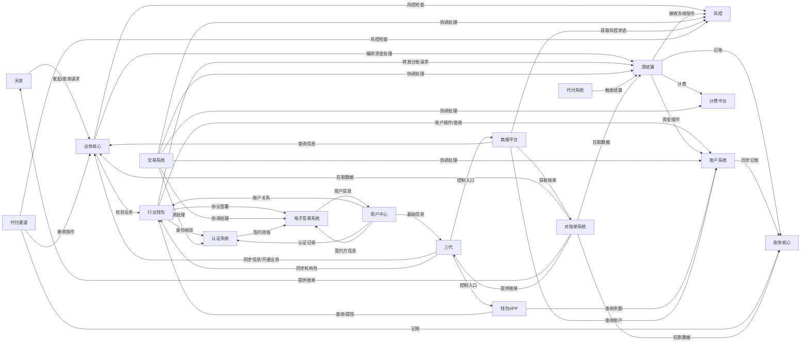
```mermaid
flowchart LR
    TC[天财] -- 发起/查询请求 --> BC[业务核心]
    SD[三代] -- 同步信息/开通业务 --> BC
    SD -- 同步机构号 --> HW[行业钱包]
    SD -- 控制入口 --> APP[钱包APP]
    SD -- 控制入口 --> MSP[商服平台]

    BC -- 校验业务 --> HW
    BC -- 编排资金处理 --> CL[清结算]
    BC -- 风控检查 --> RISK[风控]

    HW -- 账户操作/查询 --> AS[账户系统]
    HW -- 转发分账请求 --> CL
    HW -- 身份核验 --> AUTH[认证系统]
    HW -- 协议签署 --> ES[电子签章系统]

    CL -- 资金操作 --> AS
    CL -- 记账 --> JC[账务核心]
    CL -- 计费 --> FC[计费中台]
    CL -- 接收冻结指令 --> RISK

    AS -- 同步记账 --> JC

    TS[交易系统] -- 协调处理 --> CL
    TS -- 协调处理 --> AS
    TS -- 协调处理 --> RISK
    TS -- 协调处理 --> AUTH
    TS -- 协调处理 --> ES
    TS -- 协调处理 --> FC

    APP -- 查询/提现 --> HW
    APP -- 查询余额 --> AS
    MSP -- 查询信息 --> BC
    MSP -- 查询账户 --> AS
    MSP -- 获取账单 --> ST[对账单系统]
    MSP -- 获取风控状态 --> RISK

    DS[代付系统] -- 触发结算 --> CL
    DC[代付通道] -- 接收指令 --> BC
    DC -- 风控检查 --> RISK
    DC -- 记账 --> JC

    AUTH -- 签约流程 --> ES
    ES -- 用户信息 --> UC[用户中心]
    UC -- 基础信息 --> SD
    UC -- 账户关系 --> HW
    UC -- 认证记录 --> AUTH
    UC -- 签约方信息 --> ES

    ST -- 拉取数据 --> BC
    ST -- 拉取数据 --> CL
    ST -- 拉取数据 --> JC
    ST -- 提供账单 --> TC
    ST -- 提供账单 --> SD
```
---
# 3 模块设计

<a id="module-1"></a>

## 3.1 天财


### 1. 概述
- **目的与范围**：本模块作为业务方或系统，负责提出分账、会员结算、批量付款等资金管理需求。它是业务流程的发起方，定义了业务场景和规则，并将请求传递给下游系统处理。其边界止于业务请求的发起与状态查询，不涉及具体的账户操作、清结算处理或风控执行。

### 2. 接口设计
- **API端点 (REST/GraphQL)**：
    - `POST /api/v1/fund/allocate`：发起分账请求。
    - `POST /api/v1/fund/member-settlement`：发起会员结算请求。
    - `POST /api/v1/fund/batch-payment`：发起批量付款请求。
    - `GET /api/v1/fund/requests/{request_id}`：查询业务请求状态。
    - `POST /api/v1/fund/requests/{request_id}/retry`：重试指定请求。
- **请求/响应结构**：
    - 通用请求头需包含：`X-Request-Id`（幂等键）、`X-Institution-Id`（机构号）、`X-App-Id`（APPID）。
    - 分账请求体示例：
        ```json
        {
          "payer_account_no": "TC_PAYER_001",
          "payee_account_no": "TC_PAYEE_001",
          "amount": 10000,
          "fee_payer": "PAYER",
          "transfer_mode": "NET",
          "biz_scene": "ALLOCATE",
          "remark": "分账给供应商"
        }
        ```
    - 通用响应体结构：
        ```json
        {
          "code": "SUCCESS",
          "message": "请求已受理",
          "data": {
            "request_id": "REQ_20231027001",
            "status": "PENDING",
            "submit_time": "2023-10-27T10:00:00Z"
          }
        }
        ```
- **发布/消费的事件**：
    - 发布事件：`FundRequestSubmitted`（资金请求已提交）、`FundRequestStatusUpdated`（资金请求状态已更新）。
    - 消费事件：TBD（从下游模块接收处理结果通知）。

### 3. 数据模型
- **表/集合**：
    - `fund_request`（资金请求表）：用于持久化追踪所有发起的业务请求。
    - `request_retry_log`（请求重试日志表）：记录请求重试的历史。
- **关键字段**：
    - `fund_request`表：
        - `id` (主键)
        - `request_id` (业务请求唯一标识，与幂等键关联)
        - `institution_id` (机构号)
        - `biz_type` (业务类型：ALLOCATE/MEMBER_SETTLEMENT/BATCH_PAYMENT)
        - `request_payload` (原始请求参数，JSON格式)
        - `status` (状态：PENDING/PROCESSING/SUCCESS/FAILED)
        - `idempotency_key` (幂等键)
        - `callback_url` (异步回调地址，可选)
        - `created_at` (创建时间)
        - `updated_at` (最后更新时间)
        - `final_result` (最终结果快照，JSON格式)
    - `request_retry_log`表：
        - `id` (主键)
        - `request_id` (关联的业务请求ID)
        - `retry_count` (当前重试次数)
        - `triggered_at` (重试触发时间)
        - `reason` (重试原因)
- **与其他模块的关系**：天财模块通过`institution_id`（机构号）与三代运营机构关联。通过`request_id`和业务类型，与业务核心、行业钱包等模块产生交互。

### 4. 业务逻辑
- **核心工作流/算法**：
    1.  **请求接收与校验**：接收业务请求，校验机构号有效性、请求参数合法性（如金额、账户、业务场景）。
    2.  **幂等性检查**：根据请求头中的`X-Request-Id`（幂等键）查询`fund_request`表。若存在相同幂等键且状态为终态（SUCCESS/FAILED）的记录，则直接返回历史结果；若状态为处理中（PENDING/PROCESSING），则返回当前状态。
    3.  **请求持久化与路由**：将校验通过的请求持久化至`fund_request`表，初始状态为`PENDING`。根据配置的路由规则（可能通过三代机构或直接调用），将请求转发至下游业务核心系统。
    4.  **状态管理与轮询**：对于返回“处理中”状态的请求，启动异步轮询机制，定期调用下游状态查询接口，并更新`fund_request`表状态。
    5.  **结果处理与回调**：当请求达到终态（SUCCESS/FAILED）时，更新数据库，并可选地向预设的`callback_url`发送异步通知。
- **业务规则与验证**：
    - 确保发起的请求符合业务场景定义，例如在分账中指定手续费承担方（付款方或收款方）、转账模式（净额转账或全额转账）。
    - 必须使用由三代分配的有效`机构号`进行身份标识和路由。
    - 批量付款请求需确保收款方列表不为空，且单笔金额符合风控限额。
- **状态机**：
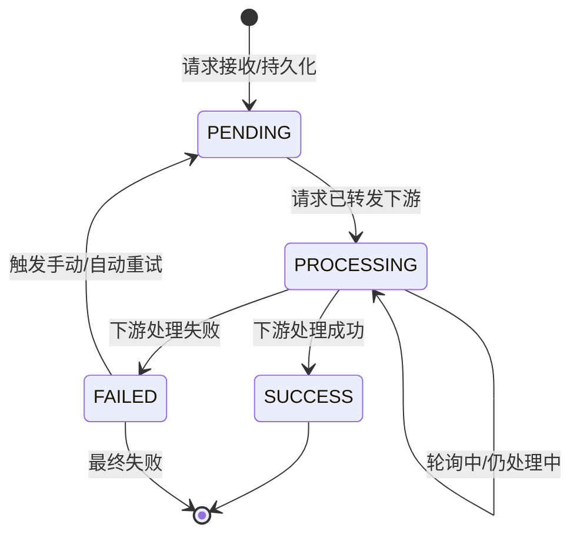
```mermaid
stateDiagram-v2
    [*] --> PENDING: 请求接收/持久化
    PENDING --> PROCESSING: 请求已转发下游
    PROCESSING --> SUCCESS: 下游处理成功
    PROCESSING --> FAILED: 下游处理失败
    PROCESSING --> PROCESSING: 轮询中/仍处理中
    FAILED --> PENDING: 触发手动/自动重试
    SUCCESS --> [*]
    FAILED --> [*]: 最终失败
```
- **关键边界情况处理**：
    - **处理中状态**：通过`fund_request`表记录状态，并提供查询接口。对于异步处理场景，实现后台任务定期轮询下游系统获取最新状态。
    - **幂等性与重试**：通过`idempotency_key`保证同一业务请求的重复提交仅产生一次效果。对于可重试的失败（如网络超时），支持配置化的重试策略（如指数退避）。

### 5. 时序图
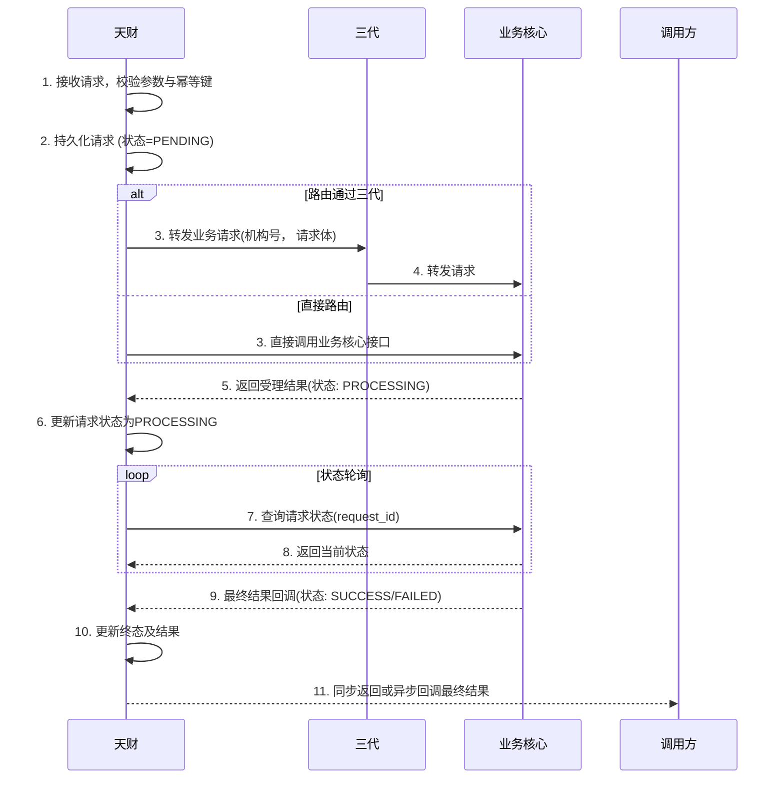
```mermaid
sequenceDiagram
    participant 天财
    participant 三代
    participant 业务核心

    天财->>天财: 1. 接收请求，校验参数与幂等键
    天财->>天财: 2. 持久化请求 (状态=PENDING)
    alt 路由通过三代
        天财->>三代: 3. 转发业务请求(机构号， 请求体)
        三代->>业务核心: 4. 转发请求
    else 直接路由
        天财->>业务核心: 3. 直接调用业务核心接口
    end
    业务核心-->>天财: 5. 返回受理结果(状态: PROCESSING)
    天财->>天财: 6. 更新请求状态为PROCESSING
    loop 状态轮询
        天财->>业务核心: 7. 查询请求状态(request_id)
        业务核心-->>天财: 8. 返回当前状态
    end
    业务核心-->>天财: 9. 最终结果回调(状态: SUCCESS/FAILED)
    天财->>天财: 10. 更新终态及结果
    天财-->>调用方: 11. 同步返回或异步回调最终结果
```

### 6. 错误处理
- **预期错误情况**：
    - **客户端错误 (4xx)**：机构号无效、请求参数不合法（如金额格式错误）、幂等键冲突但状态为终态。
    - **服务器错误 (5xx)**：下游系统（三代、业务核心）服务不可用、网络超时、数据库连接失败。
    - **业务错误**：业务规则校验失败（如余额不足）、风控拦截、账户状态异常。
- **错误分类与代码**：
    - `INVALID_INSTITUTION`: 机构号无效或未授权。
    - `INVALID_PARAMETER`: 请求参数校验失败。
    - `IDEMPOTENCY_CONFLICT`: 幂等键冲突，请求已处理。
    - `DOWNSTREAM_UNAVAILABLE`: 下游服务暂时不可用。
    - `BUSINESS_RULE_FAILED`: 业务规则校验失败（如余额不足）。
    - `RISK_CONTROL_REJECTED`: 风控拦截。
- **处理策略**：
    - **参数/业务错误**：立即失败，返回明确的错误码和描述，不重试。
    - **系统级/网络错误**：记录错误日志，并根据错误类型决定重试策略。对于`DOWNSTREAM_UNAVAILABLE`或超时错误，采用指数退避算法进行自动重试（最大次数可配置），重试记录写入`request_retry_log`表。
    - **降级与监控**：当持续失败达到阈值时，触发告警。在极端情况下，可提供“降级模式”，如将请求标记为`MANUAL_REVIEW`（人工处理）状态。
- **重试机制**：
    - 可重试错误码：`DOWNSTREAM_UNAVAILABLE`, `NETWORK_TIMEOUT`。
    - 策略：指数退避，初始间隔1秒，最大间隔60秒，最大重试次数3次。
    - 实现：通过后台任务扫描状态为`FAILED`且错误码可重试的请求进行重试。

### 7. 依赖关系
- **上游模块**：**三代（运营机构）**。根据业务配置，天财发起的请求**必须**通过三代进行路由和转发。三代负责机构的准入、审核和接口权限管理，天财依赖三代提供的机构号进行身份标识。
- **下游模块**：**业务核心**、**行业钱包**。天财将业务请求（分账、结算、批付）通过三代或直接接口发送至业务核心，由业务核心协调行业钱包、清结算等模块完成具体处理。

<a id="module-2"></a>

## 3.2 三代


### 1. 概述
- **目的与范围**: 本模块是运营机构系统，负责商户入网审核、业务开通、接口调用等运营管理职能。其核心职责包括：为天财（业务方）分配和管理二级机构号，审核并开通商户的天财业务权限，以及作为调用方发起对行业钱包等下游系统的接口调用。

### 2. 接口设计
- **API端点 (REST/GraphQL)**:
    - `POST /api/v1/merchant/onboarding`: 接收商户入网及天财业务开通申请。
    - `POST /api/v1/merchant/audit`: 提交商户资质审核结果。
    - `GET /api/v1/agency/number/{merchantId}`: 查询商户分配的机构号。
    - `POST /api/v1/sync/agency-info`: 手动触发机构号信息同步。
- **请求/响应结构**:
    - `POST /api/v1/merchant/onboarding` 请求体包含：商户基本信息（商户ID、商户名称、商户类型、资质文件链接等）、申请业务类型。
    - 响应体包含：申请单号、处理状态。
    - 其他接口请求/响应结构：TBD。
- **发布/消费的事件**:
    - 发布事件：`MerchantAuditPassedEvent`（商户审核通过）、`AgencyNumberAssignedEvent`（机构号已分配）、`SyncCompletedEvent`（下游同步完成）。
    - 消费事件：TBD。

### 3. 数据模型
- **表/集合**:
    - `merchant_application`: 商户入网申请单表。
    - `agency_allocation`: 机构号分配记录表。
    - `sync_log`: 下游系统同步日志表。
- **关键字段**:
    - `merchant_application`: `application_id` (主键), `merchant_id`, `merchant_name`, `status` (待审核/审核通过/审核驳回), `audit_comment`, `apply_time`, `audit_time`。
    - `agency_allocation`: `id` (主键), `merchant_id`, `agency_number`, `is_active`, `allocate_time`。
    - `sync_log`: `log_id`, `target_system` (行业钱包/钱包APP/商服平台), `sync_data`, `status` (成功/失败), `retry_count`, `error_message`, `create_time`。
- **与其他模块的关系**: 三代模块为天财（业务方）分配机构号，并管理商户与机构号的绑定关系。这些信息需要同步给行业钱包（用于业务逻辑）、钱包APP（用于关闭提现入口）、商服平台（用于关闭提现入口）。

### 4. 业务逻辑
- **核心工作流/算法**:
    1.  **商户入网申请**: 接收商户提交的入网及天财业务开通申请，创建申请记录，状态为“待审核”。
    2.  **资质审核**: 运营人员对商户资质（如营业执照、法人信息）进行人工或系统自动审核。审核通过则进入下一步；审核驳回则更新申请状态并通知商户。
    3.  **机构号分配**: 审核通过后，系统为该商户分配一个全局唯一的二级机构号。分配逻辑需检查冲突，确保唯一性。
    4.  **下游同步**: 机构号分配成功后，异步向行业钱包、钱包APP、商服平台同步机构号与商户的绑定关系。需保证同步的最终一致性。
    5.  **结果通知**: 所有必要同步完成后（或达到最终一致性），通知申请方（天财业务方）业务开通结果及分配的机构号。
- **业务规则与验证**:
    - 同一商户ID只能分配一个有效的机构号。
    - 机构号格式需符合预定义规则（如特定前缀+序列号）。
    - 仅当商户申请状态为“审核通过”时，才允许分配机构号。
- **关键边界情况处理**:
    - **重复申请**: 同一商户在已有“待审核”或“审核通过”申请单时，新申请将被拒绝。
    - **审核信息不全**: 资质文件缺失或关键信息不完整，审核流程挂起并通知补全。
    - **下游系统不可用**: 通过重试机制和补偿任务处理，确保最终同步成功。

### 5. 时序图
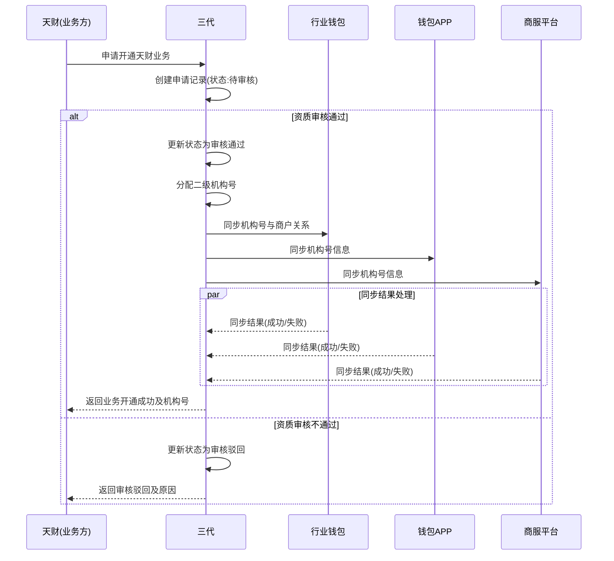
```mermaid
sequenceDiagram
    participant 天财 as 天财(业务方)
    participant 三代
    participant 行业钱包
    participant 钱包APP
    participant 商服平台

    天财->>三代: 申请开通天财业务
    三代->>三代: 创建申请记录(状态:待审核)
    alt 资质审核通过
        三代->>三代: 更新状态为审核通过
        三代->>三代: 分配二级机构号
        三代->>行业钱包: 同步机构号与商户关系
        三代->>钱包APP: 同步机构号信息
        三代->>商服平台: 同步机构号信息
        par 同步结果处理
            行业钱包-->>三代: 同步结果(成功/失败)
            钱包APP-->>三代: 同步结果(成功/失败)
            商服平台-->>三代: 同步结果(成功/失败)
        end
        三代-->>天财: 返回业务开通成功及机构号
    else 资质审核不通过
        三代->>三代: 更新状态为审核驳回
        三代-->>天财: 返回审核驳回及原因
    end
```

### 6. 错误处理
- **预期错误情况**:
    1.  商户资质审核不通过。
    2.  机构号分配冲突（极小概率事件）。
    3.  下游系统（行业钱包、钱包APP、商服平台）同步失败或超时。
- **处理策略**:
    - **审核不通过**: 流程终止，申请状态更新为“驳回”，并记录驳回原因。
    - **分配冲突**: 触发重试分配逻辑，使用新的序列号再次尝试分配，并记录冲突事件。
    - **下游同步失败**:
        - 记录详细失败日志至`sync_log`表。
        - 实现基于指数退避的重试机制（如最多重试5次）。
        - 超过重试阈值后，触发告警通知运营人员人工介入处理。
        - 设计补偿查询接口，允许手动触发特定数据的重新同步，确保操作的幂等性。

### 7. 依赖关系
- **上游依赖**: 天财（作为业务方，提出业务开通申请）。
- **下游依赖**:
    - 行业钱包：接收机构号与商户绑定关系，用于核心业务逻辑。
    - 钱包APP：接收机构号信息，用于对天财新机构号关闭提现入口。
    - 商服平台：接收机构号信息，用于对天财新机构号关闭提现入口。

<a id="module-3"></a>

## 3.3 行业钱包


### 1. 概述
- **目的与范围**: 本模块是处理天财资金管理业务的核心系统，负责天财专用账户（收款账户、接收方账户）的开户、关系绑定、分账请求的校验与数据同步。其边界包括接收业务核心的交易数据，与清结算系统协同处理资金冻结/解冻，与账户系统交互完成账户操作，并与认证系统、电子签章系统等协作完成授权签约流程。

### 2. 接口设计
- **API端点 (REST/GraphQL)**:
    - `POST /api/v1/account/open`: 开户接口。接收来自业务核心的开户请求，为天财或三代指定的商户开立天财专用账户。
    - `POST /api/v1/binding/initiate`: 关系绑定发起接口。接收分账、归集等场景的绑定请求，触发协议生成与认证流程。
    - `POST /api/v1/transfer/request`: 分账请求接口。接收天财的分账请求，进行业务校验并转发至清结算系统。
    - `GET /api/v1/account/{accountId}/status`: 账户状态查询接口。
    - `GET /api/v1/binding/{bindingId}/status`: 关系绑定状态查询接口。
- **请求/响应结构**:
    - 通用请求头包含：`X-Request-Id`（幂等键）、`X-App-Id`（应用标识）、`X-Org-Id`（机构号）。
    - 通用响应体包含：`code`（状态码）、`message`（消息）、`data`（业务数据）、`requestId`（请求ID）。
    - 具体接口的请求/响应字段：TBD。
- **发布/消费的事件**:
    - 消费事件：
        - `Account.Opened` (来自账户系统)：账户开立成功。
        - `Account.Status.Changed` (来自账户系统)：账户状态（如冻结）变更。
        - `Settlement.Instruction.Result` (来自清结算系统)：分账指令处理结果。
        - `Binding.Verified` (来自认证系统)：关系绑定验证完成。
    - 发布事件：
        - `Transfer.Request.Validated`：分账请求校验通过，指令已发送至清结算。
        - `Binding.Required`：分账请求因关系绑定未完成被拦截，需引导完成绑定。
        - `Account.Open.Requested`：已向账户系统发起开户申请。

### 3. 数据模型
- **表/集合**:
    - `wallet_accounts` (行业钱包账户表)：存储与天财专用账户相关的业务属性，与账户系统的核心账户数据通过`account_id`关联。
    - `authorization_bindings` (授权关系绑定表)：存储收付款双方的关系绑定记录。
    - `transfer_requests` (分账请求表)：存储分账请求记录，用于幂等控制与状态跟踪。
- **关键字段**:
    - `wallet_accounts`:
        - `id` (主键)
        - `account_id` (外键，关联账户系统核心账户ID)
        - `org_id` (机构号)
        - `account_type` (账户类型：`RECEIVING`-收款账户，`RECEIVER`-接收方账户)
        - `merchant_id` (商户ID)
        - `business_tags` (业务标签，如是否开通付款)
        - `created_at`, `updated_at`
    - `authorization_bindings`:
        - `id` (主键)
        - `payer_account_id` (付款方账户ID，关联`wallet_accounts.id`)
        - `payee_account_id` (收款方账户ID，关联`wallet_accounts.id`)
        - `binding_type` (绑定类型：`TRANSFER`-分账，`COLLECTION`-归集，`SETTLEMENT`-会员结算)
        - `status` (状态：`PENDING`-待签约，`VERIFYING`-待验证，`ACTIVE`-生效，`EXPIRED`-过期，`REVOKED`-解除)
        - `contract_id` (电子协议ID)
        - `auth_method` (认证方式：`PAYMENT_VERIFY`， `FACE_VERIFY`)
        - `expiry_date` (有效期至)
        - `created_at`, `updated_at`
    - `transfer_requests`:
        - `id` (主键)
        - `request_id` (幂等键，唯一索引)
        - `payer_account_id` (付款方账户ID)
        - `payee_account_id` (收款方账户ID)
        - `amount` (金额)
        - `status` (状态：`VALIDATING`-校验中，`BINDING_REQUIRED`-需绑定，`SETTLEMENT_PENDING`-待清结算，`SUCCESS`， `FAILED`)
        - `settlement_instruction_id` (清结算指令ID)
        - `failure_reason` (失败原因)
        - `created_at`, `updated_at`
- **与其他模块的关系**:
    - **账户系统**：行业钱包模块通过`account_id`关联账户系统的核心账户实体。行业钱包管理账户的业务属性（如`account_type`, `business_tags`），账户系统管理资金、余额及基础状态。数据通过事件（如`Account.Status.Changed`）进行状态同步。
    - **业务核心**：共享交易请求数据，行业钱包负责其中的资金流转业务校验。
    - **清结算系统**：共享结算指令与状态。行业钱包发起指令，清结算负责资金流转的编排与执行（包括调用账户系统进行资金操作），并回调结果。

### 4. 业务逻辑
- **核心工作流/算法**:
    1.  **开户流程**: 接收来自**业务核心**（其请求可能源自天财或三代运营操作）的开户请求，校验资质，调用账户系统开立天财专用账户（收款账户或接收方账户），并在`wallet_accounts`表中创建业务记录。
    2.  **关系绑定流程**:
        a. **发起绑定**：处理分账、归集、会员结算等场景下的授权关系建立请求。
        b. **协议与认证**：调用电子签章系统生成协议，调用认证系统完成打款验证或人脸验证。
        c. **状态同步**：认证通过后，更新`authorization_bindings`表状态为`ACTIVE`。
    3.  **分账请求处理**:
        a. **接收与幂等校验**：接收天财的分账请求，通过`request_id`确保幂等。
        b. **顺序业务校验**：
            i.   校验付款方账户是否存在且状态正常（非冻结）。
            ii.  校验付款方账户余额是否充足。
            iii. 校验付款方与收款方的授权关系（`authorization_bindings`）是否`ACTIVE`且未过期。
            iv.  对于批量付款、会员结算场景，额外校验付款方账户的`business_tags`是否包含“开通付款”授权。
        c. **路由处理**：
            - 若上述校验全部通过，向清结算系统发起分账指令，更新`transfer_requests`状态为`SETTLEMENT_PENDING`。
            - 若关系绑定校验失败（未绑定或失效），则暂停分账流程，发布`Binding.Required`事件，并返回指引信息，引导用户完成绑定。绑定完成后，需由天财重新发起原分账请求（携带原`request_id`）。
        d. **结果处理**：接收清结算回调，更新分账请求状态为成功或失败。
    4.  **数据同步**: 将账户状态、关系绑定状态、分账结果等数据通过事件或API同步给相关业务方（如业务核心）。
- **业务规则与验证**:
    1.  分账付款方必须是天财收款账户。
    2.  分账前必须按顺序校验：①账户状态 → ②账户余额 → ③关系绑定状态 → ④（场景化）开通付款授权。
    3.  对于批量付款场景，应对列表中的每一笔独立执行上述校验序列。单笔失败不应影响其他成功项的继续处理，但整体批次状态需标记为部分成功。
- **关键边界情况处理**:
    1.  **账户冻结**: 若分账时付款方账户被风控冻结，则拒绝分账。
    2.  **关系绑定失效**: 若分账时授权关系已过期或解除，则拒绝分账，并引导重新绑定。
    3.  **清结算处理失败**: 接收清结算系统的失败回调，更新分账状态为失败，记录原因。根据失败类型（如系统异常、账户异常）决定是否自动触发冲正流程（由清结算系统执行）。

### 5. 时序图
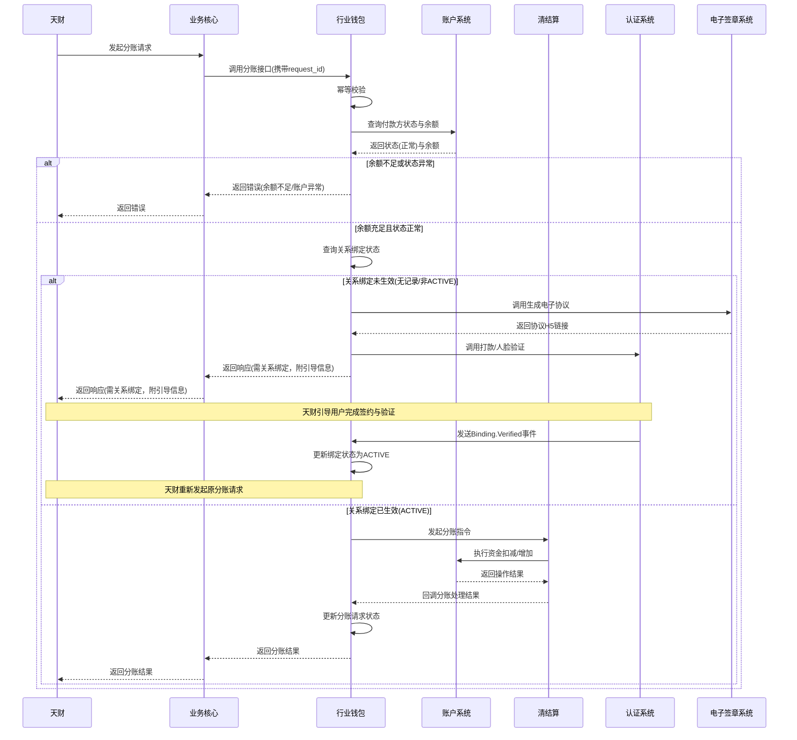
```mermaid
sequenceDiagram
    participant 天财
    participant 业务核心
    participant 行业钱包
    participant 账户系统
    participant 清结算
    participant 认证系统
    participant 电子签章系统

    天财->>业务核心: 发起分账请求
    业务核心->>行业钱包: 调用分账接口(携带request_id)
    行业钱包->>行业钱包: 幂等校验
    行业钱包->>账户系统: 查询付款方状态与余额
    账户系统-->>行业钱包: 返回状态(正常)与余额
    alt 余额不足或状态异常
        行业钱包-->>业务核心: 返回错误(余额不足/账户异常)
        业务核心-->>天财: 返回错误
    else 余额充足且状态正常
        行业钱包->>行业钱包: 查询关系绑定状态
        alt 关系绑定未生效(无记录/非ACTIVE)
            行业钱包->>电子签章系统: 调用生成电子协议
            电子签章系统-->>行业钱包: 返回协议H5链接
            行业钱包->>认证系统: 调用打款/人脸验证
            行业钱包-->>业务核心: 返回响应(需关系绑定，附引导信息)
            业务核心-->>天财: 返回响应(需关系绑定，附引导信息)
            Note over 天财, 认证系统: 天财引导用户完成签约与验证
            认证系统->>行业钱包: 发送Binding.Verified事件
            行业钱包->>行业钱包: 更新绑定状态为ACTIVE
            Note over 天财, 行业钱包: 天财重新发起原分账请求
        else 关系绑定已生效(ACTIVE)
            行业钱包->>清结算: 发起分账指令
            清结算->>账户系统: 执行资金扣减/增加
            账户系统-->>清结算: 返回操作结果
            清结算-->>行业钱包: 回调分账处理结果
            行业钱包->>行业钱包: 更新分账请求状态
            行业钱包-->>业务核心: 返回分账结果
            业务核心-->>天财: 返回分账结果
        end
    end
```

### 6. 错误处理
- **预期错误情况**:
    1.  账户不存在或状态异常（冻结）。
    2.  账户余额不足。
    3.  关系绑定未完成、已失效或未开通付款授权。
    4.  清结算系统处理超时或失败。
    5.  与下游系统（账户、认证、电子签章）通信失败或超时。
- **处理策略**:
    1.  **业务校验失败**：立即向调用方返回明确的错误码和提示，不进行重试。
    2.  **下游系统调用失败**：
        - **账户系统、认证系统、电子签章系统调用**：采用指数退避策略进行有限次重试（如最多3次）。若最终失败，则业务流程失败，记录日志并告警。
        - **清结算系统调用**：此为关键资金操作。调用时需确保幂等。若调用超时或失败，启动异步补偿查询流程，定期向清结算查询指令状态，直至获得明确终态（成功/失败）。同时记录日志并触发高级别告警。
    3.  **幂等性实现**：
        - 所有写操作接口必须接收`X-Request-Id`。
        - 在`transfer_requests`等表使用`request_id`作为唯一索引。
        - 请求到达时，先查询`request_id`是否存在。若存在且为终态，则直接返回原结果；若存在且为中间态，返回处理中；若不存在，则开始处理。
    4.  **冲正流程**：当清结算返回明确的业务失败（如对方账户异常）时，行业钱包记录失败原因，通常不主动发起冲正。若因系统异常导致资金状态不确定，由清结算系统根据其事务一致性要求决定并执行冲正，行业钱包接收最终状态回调。

### 7. 依赖关系
- **上游模块**:
    - **业务核心**：提供开户、分账等业务请求。
    - **天财**：业务需求的最终发起方。
    - **三代**：运营角色，通过业务核心发起商户开户等运营操作。
    - **风控**：通过账户系统间接影响账户状态。
- **下游模块**:
    - **账户系统**：执行账户开立、资金扣减/增加、余额查询。
    - **清结算系统**：执行分账资金流转的编排与结算。
    - **认证系统**：执行身份核验（打款验证、人脸验证）。
    - **电子签章系统**：生成与管理电子协议。
    - **对账单系统**：提供交易明细数据。

<a id="module-4"></a>

## 3.4 清结算


### 1. 概述
- **目的与范围**: 本模块（清结算）负责交易清分、结算、计费处理、资金冻结/解冻编排等资金清算与结算处理。其边界包括接收业务核心的交易数据，进行资金清算计算，调用计费中台计算手续费，调用账户系统完成资金操作，编排风控发起的冻结/解冻流程，以及将结算结果通知对账单系统。

### 2. 接口设计
- **API端点 (REST/GraphQL)**: TBD
- **请求/响应结构**: TBD
- **发布/消费的事件**:
    - **消费事件**:
        - `transaction.created` (来自业务核心)：包含交易基础数据。
        - `risk.freeze.order` (来自风控)：包含冻结指令。
    - **发布事件**:
        - `settlement.completed`：通知业务核心结算完成。
        - `settlement.detail.ready`：通知对账单系统结算明细已生成。

### 3. 数据模型
- **表/集合**:
    - `settlement_record` (结算记录表)
    - `fee_calculation` (手续费计算记录表)
    - `freeze_order` (冻结指令记录表)
- **关键字段**:
    - `settlement_record`: 结算流水号、交易流水号、结算模式（主动结算/被动结算）、结算状态（待清分/已清分/结算中/已完成/失败）、结算金额、手续费金额、源账户（待结算账户）、目标账户（天财收款账户）、创建时间、完成时间。
    - `fee_calculation`: 计费流水号、关联结算流水号、计费产品、计费结果（金额）、扣费方式、承担方、请求时间、响应时间。
    - `freeze_order`: 冻结指令ID、关联账户、冻结类型（商户冻结/交易冻结）、冻结金额、指令状态（待处理/处理中/已完成/失败）、风控请求时间、处理完成时间。
- **与其他模块的关系**: 处理来自业务核心的交易数据；调用账户系统进行资金操作；接收风控的冻结指令；为对账单系统提供结算明细数据。

### 4. 业务逻辑
- **核心工作流/算法**:
    1.  **交易清分与结算计算**:
        - 输入：交易数据（含交易金额、商户信息、产品类型）。
        - 处理：根据配置的结算规则（如T+1）确定结算批次与时间。计算应结算的净额（交易金额 - 预估手续费）。
        - 输出：待结算记录，状态为“待清分”。
    2.  **计费处理**:
        - 根据结算记录中的交易信息（如产品类型、金额）构造计费请求。
        - 调用计费中台，传入计费产品、金额、扣费方式、手续费承担方等参数。
        - 接收计费结果，更新结算记录中的实际手续费金额和净结算金额。
        - 状态流转：`待清分` -> `已清分`。
    3.  **资金结算执行**:
        - **主动结算模式**:
            1.  校验目标账户（天财收款账户）状态是否正常。
            2.  调用账户系统，从待结算账户扣减结算净额。
            3.  调用账务核心，记录资金从待结算账户流向天财收款账户的会计分录。
            4.  调用账户系统，向天财收款账户增加结算净额。
        - **被动结算模式**:
            - 资金保留在待结算账户，仅更新结算记录状态为“已完成”，不进行实际资金划转。
        - 状态流转：`已清分` -> `结算中` -> `已完成`。
    4.  **冻结/解冻编排**:
        - 接收风控冻结指令。
        - 根据指令类型（商户冻结/交易冻结）定位关联的账户或特定结算资金。
        - 调用账户系统执行资金冻结操作。
        - 更新冻结指令状态。
- **业务规则与验证**:
    - 结算模式规则：根据商户或产品配置决定采用主动或被动结算。
    - 手续费计算规则：遵循计费中台返回的结果。支持净额转账和全额转账模式。
    - 账户状态校验：执行资金操作前，必须校验源账户（待结算账户）余额充足，目标账户状态正常（非冻结、非注销）。
- **关键边界情况处理**:
    - 结算时目标账户被冻结：终止结算流程，记录失败原因，并可能触发告警。
    - 清分计算时数据不一致：与业务核心进行数据核对，若无法解决则挂起该笔结算，人工介入。

### 5. 时序图
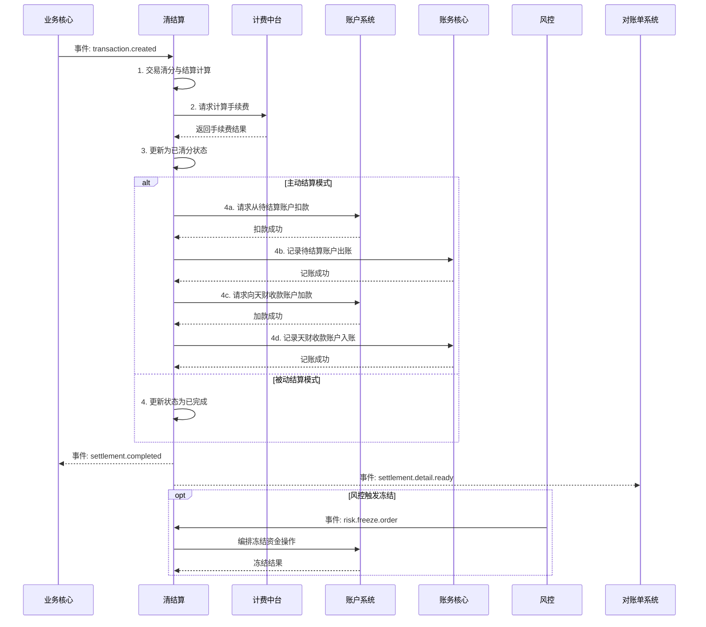
```mermaid
sequenceDiagram
    participant 业务核心
    participant 清结算
    participant 计费中台
    participant 账户系统
    participant 账务核心
    participant 风控
    participant 对账单系统

    业务核心->>清结算: 事件: transaction.created
    清结算->>清结算: 1. 交易清分与结算计算
    清结算->>计费中台: 2. 请求计算手续费
    计费中台-->>清结算: 返回手续费结果
    清结算->>清结算: 3. 更新为已清分状态
    alt 主动结算模式
        清结算->>账户系统: 4a. 请求从待结算账户扣款
        账户系统-->>清结算: 扣款成功
        清结算->>账务核心: 4b. 记录待结算账户出账
        账务核心-->>清结算: 记账成功
        清结算->>账户系统: 4c. 请求向天财收款账户加款
        账户系统-->>清结算: 加款成功
        清结算->>账务核心: 4d. 记录天财收款账户入账
        账务核心-->>清结算: 记账成功
    else 被动结算模式
        清结算->>清结算: 4. 更新状态为已完成
    end
    清结算-->>业务核心: 事件: settlement.completed
    清结算-->>对账单系统: 事件: settlement.detail.ready

    opt 风控触发冻结
        风控->>清结算: 事件: risk.freeze.order
        清结算->>账户系统: 编排冻结资金操作
        账户系统-->>清结算: 冻结结果
    end
```

### 6. 错误处理
- **预期错误情况**:
    - 依赖系统调用失败：计费中台、账户系统、账务核心服务超时或返回错误。
    - 业务逻辑错误：结算资金不足、目标账户状态异常、计费产品未配置。
    - 数据错误：风控指令格式错误、交易数据不完整。
- **处理策略**:
    - **重试机制**：对可重试的依赖系统调用失败（如网络超时），采用指数退避策略进行重试（如最多3次）。
    - **降级与补偿**：
        - 计费中台不可用：可使用本地配置的保底费率进行计算，并记录日志告警，事后核对。
        - 资金操作部分失败（如扣款成功但加款失败）：触发补偿交易，尝试回滚已完成的扣款操作，并将结算记录状态置为“失败”，等待人工处理。
    - **流程终止与告警**：遇到资金不足、账户冻结等业务错误，立即终止流程，更新状态为“失败”，并发送告警通知运营人员。
    - **无效指令处理**：对格式错误或无法识别的风控指令，记录错误日志并告警，不执行后续操作。

### 7. 依赖关系
- **上游模块**: 业务核心（提供交易数据）、风控（提供冻结指令）
- **下游模块**: 账户系统（执行资金操作）、账务核心（记录资金流水）、计费中台（计算手续费）、对账单系统（提供结算明细数据）

<a id="module-5"></a>

## 3.5 账户系统


### 1. 概述
- **目的与范围**：本模块负责各类账户（如收款账户、接收方账户）的开立、升级、资金扣减/增加、余额管理等底层账户操作。其边界止于账户层面的资金变动指令执行与余额管理，不涉及业务逻辑（如分账校验）和资金清分结算逻辑。账户系统负责记录所有账户资金变动流水，并同步至账务核心进行会计分录记账，两者职责明确，无重叠。

### 2. 接口设计
- **API端点 (REST)**：
    - `POST /api/v1/accounts`：开立账户。
    - `PUT /api/v1/accounts/{accountNo}/upgrade`：升级账户。
    - `POST /api/v1/accounts/{accountNo}/actions/debit`：执行扣款。
    - `POST /api/v1/accounts/{accountNo}/actions/credit`：执行加款。
    - `POST /api/v1/accounts/{accountNo}/actions/freeze`：执行资金冻结。
    - `POST /api/v1/accounts/{accountNo}/actions/unfreeze`：执行资金解冻。
    - `GET /api/v1/accounts/{accountNo}/balance`：查询账户余额。
- **请求/响应结构**：
    - 通用请求头：`X-Request-ID`（请求流水号，用于幂等）。
    - 通用响应体：`{“code”: “string”, “msg”: “string”, “data”: object, “requestId”: “string”}`。
    - 示例（开立账户请求）：
        ```json
        {
          “accountType”: “NORMAL_RECEIVE”,
          “institutionNo”: “string”,
          “relatedUserId”: “string”,
          “currency”: “CNY”
        }
        ```
    - 示例（资金操作请求）：
        ```json
        {
          “amount”: 10000,
          “businessOrderNo”: “string”,
          “remark”: “string”
        }
        ```
- **发布/消费的事件**：
    - 消费事件：TBD（上游模块如清结算、行业钱包发起的指令事件）。
    - 发布事件：`AccountTransactionEvent`（账户动账事件），包含流水号、账户号、交易类型、金额、业务订单号等字段，供账务核心订阅。

### 3. 数据模型
- **表/集合**：
    - `account_main`（账户主表）
    - `account_balance`（账户余额表）
    - `account_transaction_flow`（账户动账流水表）
- **关键字段与关系**：
    - `account_main`：
        - `account_no` (VARCHAR(32), PRIMARY KEY): 账户号。
        - `account_type` (VARCHAR(20)): 账户类型（`TIANCAI_RECEIVE`-天财收款账户， `TIANCAI_RECEIVER`-天财接收方账户， `NORMAL_RECEIVE`-普通收款账户， `PENDING_SETTLEMENT`-待结算账户， `REFUND`-退货账户）。
        - `institution_no` (VARCHAR(20)): 所属机构号。
        - `status` (VARCHAR(10)): 状态（`NORMAL`-正常， `FROZEN`-冻结， `CLOSED`-注销）。
        - `related_user_id` (VARCHAR(64)): 关联商户/用户ID。
        - `created_at` (DATETIME): 创建时间。
        - `updated_at` (DATETIME): 更新时间。
        - `version` (INT, DEFAULT 0): 数据版本号（用于乐观锁）。
        - 索引：`idx_institution_no`(`institution_no`), `idx_related_user`(`related_user_id`), `idx_status`(`status`)。
    - `account_balance`：
        - `id` (BIGINT, PRIMARY KEY, AUTO_INCREMENT): 主键ID。
        - `account_no` (VARCHAR(32), FOREIGN KEY REFERENCES `account_main`(`account_no`), UNIQUE): 账户号。
        - `available_balance` (DECIMAL(15,2), DEFAULT 0.00): 可用余额。
        - `frozen_balance` (DECIMAL(15,2), DEFAULT 0.00): 冻结余额。
        - `currency` (VARCHAR(3)): 账户币种。
        - `updated_at` (DATETIME): 更新时间。
        - 索引：`idx_account_no`(`account_no`)。
    - `account_transaction_flow`：
        - `flow_no` (VARCHAR(64), PRIMARY KEY): 流水号。
        - `account_no` (VARCHAR(32), FOREIGN KEY REFERENCES `account_main`(`account_no`)): 账户号。
        - `transaction_type` (VARCHAR(10)): 交易类型（`CREDIT`-入账， `DEBIT`-出账， `FREEZE`-冻结， `UNFREEZE`-解冻）。
        - `amount` (DECIMAL(15,2)): 变动金额。
        - `balance_before` (DECIMAL(15,2)): 变动前余额。
        - `balance_after` (DECIMAL(15,2)): 变动后余额。
        - `business_order_no` (VARCHAR(64)): 关联业务订单号。
        - `created_at` (DATETIME): 记账时间。
        - 索引：`idx_account_no`(`account_no`), `idx_business_order`(`business_order_no`), `idx_created_at`(`created_at`)。
- **与其他模块的关系**：`account_transaction_flow` 表记录的资金变动流水，将作为事件源同步至账务核心进行会计分录记账。账户系统负责记录交易事实，账务核心负责会计处理，职责分离。

### 4. 业务逻辑
- **核心工作流/算法**：
    1.  **账户开立**：接收开户请求，校验必要参数，在 `account_main` 和 `account_balance` 表中创建记录，初始化余额为0。
    2.  **账户升级**：接收升级请求，校验原账户类型是否为 `NORMAL_RECEIVE`（普通收款账户）且状态为 `NORMAL`。校验通过后，将 `account_main.account_type` 更新为 `TIANCAI_RECEIVE`（天财收款账户）。
    3.  **资金操作（扣减/增加/冻结/解冻）**：
        - 在数据库事务内执行。
        - 使用 `account_balance` 表的 `version` 字段实现乐观锁控制并发。
        - 根据指令计算新的可用余额与冻结余额，更新 `account_balance` 表并递增版本号。
        - 在 `account_transaction_flow` 表中插入动账流水记录。
        - 发布 `AccountTransactionEvent` 事件。
- **业务规则与验证**：
    - 执行扣款前必须校验账户可用余额是否充足。
    - 冻结/解冻操作需校验账户状态是否为 `NORMAL`。
    - 账户升级需校验原账户类型为 `NORMAL_RECEIVE`。
    - 所有资金操作需通过 `business_order_no` 保证幂等性，重复请求直接返回已存在的流水记录。
- **关键边界情况处理**：
    - **并发控制**：采用乐观锁机制（基于 `version` 字段），更新失败时重试或返回冲突错误。
    - **幂等性**：通过业务流水号 (`business_order_no`) 唯一索引保证，防止重复处理。
    - **事务一致性**：资金操作涉及余额更新与流水记录插入，必须在同一数据库事务中完成。

### 5. 时序图

#### 账户开立时序图
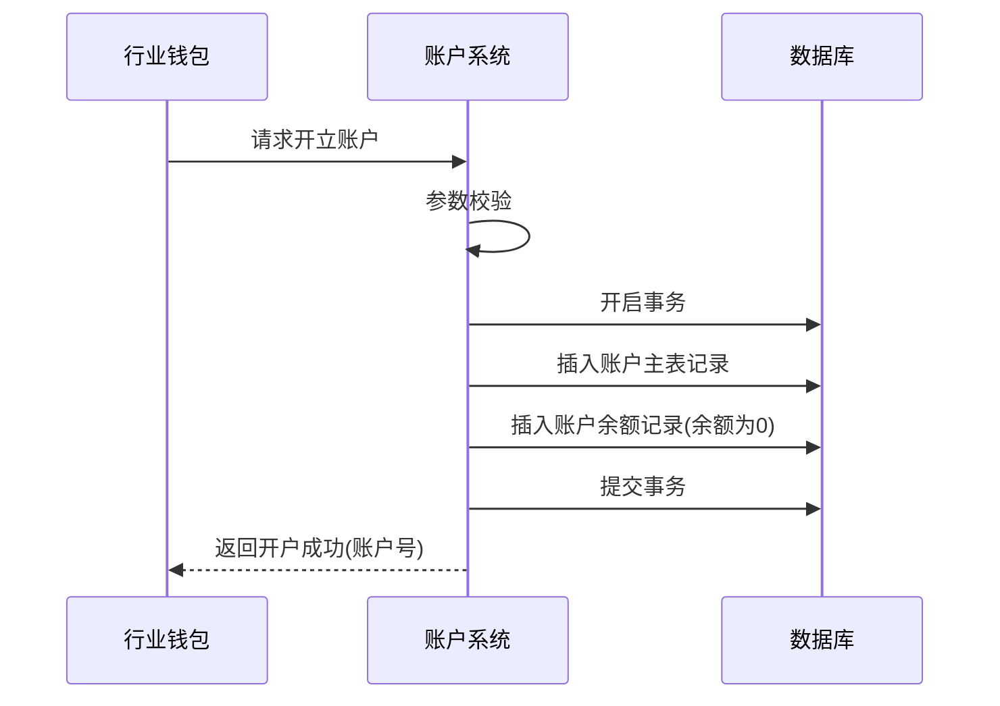
```mermaid
sequenceDiagram
    participant Client as 行业钱包
    participant Account as 账户系统
    participant DB as 数据库

    Client->>Account: 请求开立账户
    Account->>Account: 参数校验
    Account->>DB: 开启事务
    Account->>DB: 插入账户主表记录
    Account->>DB: 插入账户余额记录(余额为0)
    Account->>DB: 提交事务
    Account-->>Client: 返回开户成功(账户号)
```

#### 账户升级时序图
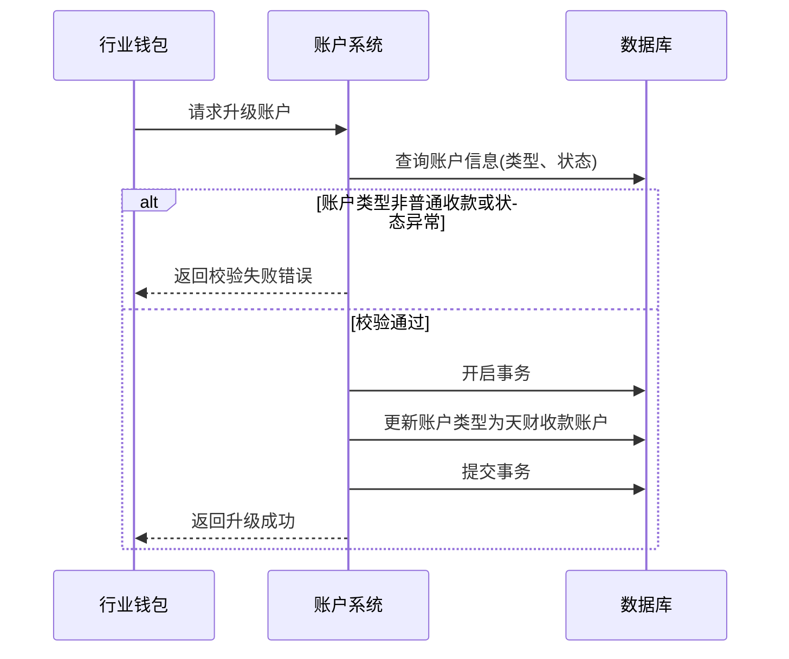
```mermaid
sequenceDiagram
    participant Client as 行业钱包
    participant Account as 账户系统
    participant DB as 数据库

    Client->>Account: 请求升级账户
    Account->>DB: 查询账户信息(类型、状态)
    alt 账户类型非普通收款或状态异常
        Account-->>Client: 返回校验失败错误
    else 校验通过
        Account->>DB: 开启事务
        Account->>DB: 更新账户类型为天财收款账户
        Account->>DB: 提交事务
        Account-->>Client: 返回升级成功
    end
```

#### 资金扣减时序图（含错误处理）
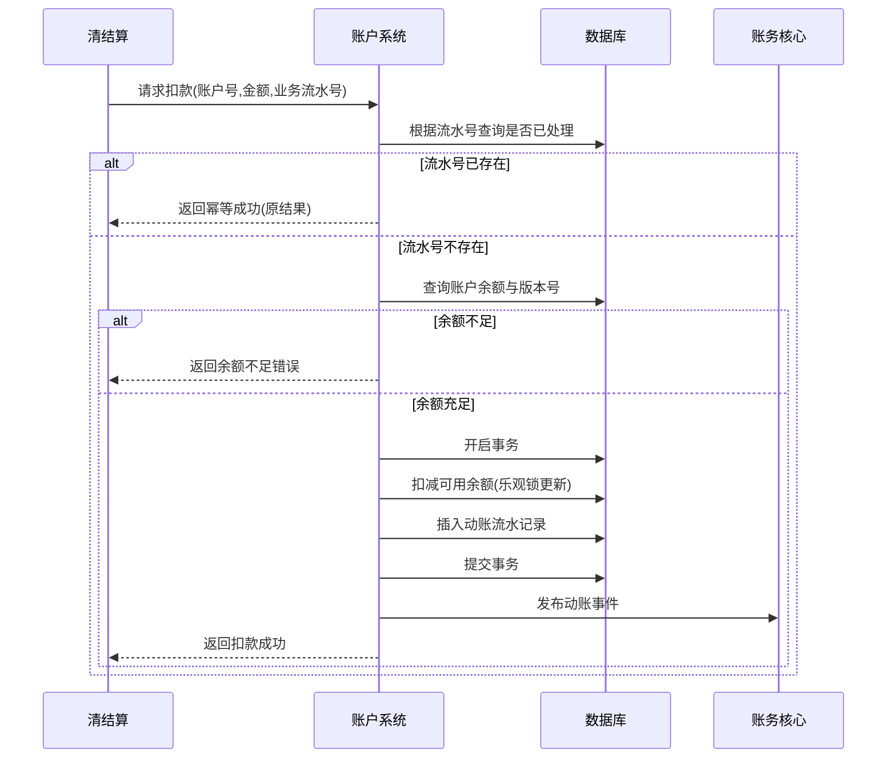
```mermaid
sequenceDiagram
    participant Client as 清结算
    participant Account as 账户系统
    participant DB as 数据库
    participant Ledger as 账务核心

    Client->>Account: 请求扣款(账户号,金额,业务流水号)
    Account->>DB: 根据流水号查询是否已处理
    alt 流水号已存在
        Account-->>Client: 返回幂等成功(原结果)
    else 流水号不存在
        Account->>DB: 查询账户余额与版本号
        alt 余额不足
            Account-->>Client: 返回余额不足错误
        else 余额充足
            Account->>DB: 开启事务
            Account->>DB: 扣减可用余额(乐观锁更新)
            Account->>DB: 插入动账流水记录
            Account->>DB: 提交事务
            Account->>Ledger: 发布动账事件
            Account-->>Client: 返回扣款成功
        end
    end
```

### 6. 错误处理
- **预期错误情况与错误码**：
    - `ACCOUNT_NOT_FOUND` (1001)：账户不存在。
    - `ACCOUNT_STATUS_INVALID` (1002)：账户状态异常（非正常状态）。
    - `INSUFFICIENT_BALANCE` (1003)：账户可用余额不足。
    - `DUPLICATE_REQUEST` (1004)：重复的业务流水号请求。
    - `ACCOUNT_TYPE_UPGRADE_INVALID` (1005)：账户类型不符合升级条件。
    - `CONCURRENT_OPERATION_CONFLICT` (1006)：并发操作冲突（乐观锁更新失败）。
    - `DOWNSTREAM_SERVICE_UNAVAILABLE` (2001)：下游服务（如数据库、消息队列）不可用。
- **处理策略**：
    - 业务错误（1xxx）：返回具体错误码和信息，拒绝操作。对于幂等请求，返回已成功的结果。
    - 系统错误（2xxx）：记录详细日志，告警。尝试重试或熔断，向上游返回系统繁忙或操作失败，建议稍后重试。
    - 依赖故障：对于账务核心事件发布失败，采用本地事务表与异步重试机制，确保最终一致性。

### 7. 依赖关系
- **上游模块**：
    - **清结算**：发起资金冻结/解冻、扣减/增加指令。
    - **行业钱包**：发起开户、升级指令。
- **下游模块**：
    - **账务核心**：订阅账户系统发布的动账事件，进行会计分录记账。
- **基础设施依赖**：数据库、消息中间件。

<a id="module-6"></a>

## 3.6 账务核心


### 1. 概述
- **目的与范围**: 本模块负责记录所有资金变动流水，进行会计分录记账。它是资金流转的最终账务记录中心，确保所有涉及账户余额变动的操作都有准确、可追溯的账务记录。核心职责包括接收记账指令、执行复式记账、生成账务流水，并为下游对账系统提供数据。

### 2. 接口设计
- **API端点 (REST/GraphQL)**:
    - `POST /api/v1/journal/entries`: 接收记账请求，创建会计分录。
    - `GET /api/v1/journal/entries/{request_id}`: 根据请求ID查询记账结果。
- **请求/响应结构**:
    - 记账请求 (`POST /api/v1/journal/entries`):
        ```json
        {
          "request_id": "unique_request_identifier",
          "business_type": "TRANSFER|FEE|SETTLEMENT|...",
          "business_ref": "关联业务订单号",
          "entries": [
            {
              "account_id": "账户ID",
              "amount": "100.00",
              "dr_cr": "DEBIT",
              "currency": "CNY"
            },
            {
              "account_id": "账户ID",
              "amount": "100.00",
              "dr_cr": "CREDIT",
              "currency": "CNY"
            }
          ]
        }
        ```
    - 记账响应:
        ```json
        {
          "code": "SUCCESS",
          "message": "成功",
          "data": {
            "journal_entry_id": "账务流水主ID",
            "status": "SUCCESS",
            "created_at": "2023-01-01T00:00:00Z"
          }
        }
        ```
- **发布/消费的事件**:
    - 消费事件: TBD (例如，来自**账户系统**的余额更新成功事件、来自**计费中台**的计费完成事件)
    - 发布事件: `JournalEntryCreated` (账务流水已创建)，供**对账单系统**等下游模块订阅。

### 3. 数据模型
- **表/集合**:
    - `journal_entries` (账务流水主表): 记录每笔记账请求。
    - `ledger_lines` (会计分录明细表): 记录每笔分录的借贷明细。
- **关键字段**:
    - `journal_entries`:
        - `id` (主键)
        - `request_id` (唯一业务请求ID，用于幂等)
        - `business_type` (业务类型)
        - `business_ref` (关联业务订单号)
        - `status` (状态: PROCESSING, SUCCESS, FAILED)
        - `created_at`, `updated_at`
    - `ledger_lines`:
        - `id` (主键)
        - `journal_entry_id` (外键)
        - `account_id` (账户ID)
        - `amount` (金额)
        - `dr_cr` (借贷方向: DEBIT/CREDIT)
        - `currency` (币种)
        - `line_no` (行号)
- **与其他模块的关系**: 接收来自**账户系统**（余额变动）、**清结算**（清分结算指令）、**计费中台**（手续费记录）的资金变动指令，记录账务流水。为**对账单系统**提供动账明细数据源。

### 4. 业务逻辑
- **核心工作流/算法**:
    1. **接收与幂等校验**: 接收记账请求，首先根据 `request_id` 查询 `journal_entries` 表。若已存在成功记录，则直接返回历史结果；若存在处理中记录，则等待或返回处理中状态；否则，创建新记录。
    2. **借贷平衡校验**: 对请求中的 `entries` 数组进行校验，确保所有分录的借方总金额等于贷方总金额。校验失败则拒绝请求。
    3. **持久化流水**: 校验通过后，将主记录 (`journal_entries`) 和明细记录 (`ledger_lines`) 在同一个数据库事务中持久化。
    4. **状态更新与事件发布**: 持久化成功后，将主记录状态更新为 `SUCCESS`，并异步发布 `JournalEntryCreated` 事件。
- **业务规则与验证**:
    - 每笔分录必须借贷平衡。
    - `request_id` 全局唯一，确保幂等性。
    - `business_ref` 用于关联上游业务订单。
- **关键边界情况处理**:
    - **重复请求 (幂等)**: 通过 `request_id` 机制保证。
    - **记账与账户余额更新的分布式事务**: 采用最终一致性策略。账务核心记录流水后，异步监听**账户系统**的余额更新结果事件。若账户更新失败，账务流水状态标记为待核对 (`RECONCILIATION_NEEDED`)，触发告警并需人工介入处理。
    - **与计费中台的协作**: 对于涉及手续费的业务（如分账），**清结算**或**业务核心**会先调用**计费中台**计算费用，然后将本金和手续费拆分，分别向账务核心发起记账请求。账务核心不直接调用计费中台。

### 5. 时序图
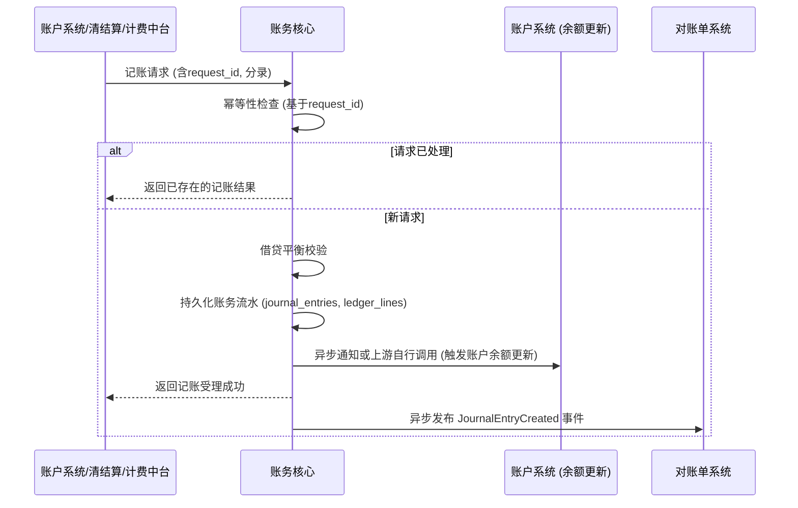
```mermaid
sequenceDiagram
    participant A as 账户系统/清结算/计费中台
    participant B as 账务核心
    participant C as 账户系统 (余额更新)
    participant D as 对账单系统

    A->>B: 记账请求 (含request_id, 分录)
    B->>B: 幂等性检查 (基于request_id)
    alt 请求已处理
        B-->>A: 返回已存在的记账结果
    else 新请求
        B->>B: 借贷平衡校验
        B->>B: 持久化账务流水 (journal_entries, ledger_lines)
        B->>C: 异步通知或上游自行调用 (触发账户余额更新)
        B-->>A: 返回记账受理成功
        B->>D: 异步发布 JournalEntryCreated 事件
    end
```

### 6. 错误处理
- **预期错误情况**:
    1. **请求数据错误**: `request_id` 格式错误、`entries` 为空、借贷不平衡、金额格式错误。
    2. **系统内部错误**: 数据库连接失败、持久化异常、消息发布失败。
    3. **分布式不一致**: 账务流水记录成功，但关联的账户余额更新失败。
- **处理策略**:
    - 对于请求数据错误，在校验阶段直接拒绝，返回明确的错误码和描述。
    - 对于系统内部错误，记录详细错误日志，触发告警，并向上游返回系统繁忙或失败响应，建议重试（依赖`request_id`幂等）。
    - 对于分布式不一致，将相关流水标记为 `RECONCILIATION_NEEDED` 状态，记录异常上下文，触发高级别告警，需运营或开发人员介入进行账务核对与人工补账。

### 7. 依赖关系
- **上游模块**:
    - **账户系统**: 提供账户余额变动的最终动因，账务核心记录其对应的会计分录。
    - **清结算**: 在清分、结算过程中产生资金划转指令，触发记账。
    - **计费中台**: 产生手续费计费结果，由上游模块将手续费作为独立的记账请求发送至账务核心。
- **下游模块**:
    - **对账单系统**: 订阅账务核心发布的账务流水事件，作为生成账户动账明细对账单的核心数据源。

<a id="module-7"></a>

## 3.7 风控


### 1. 概述
- **目的与范围**: 本模块负责识别交易或商户风险，并触发冻结等管控措施。核心职责包括对商户风险进行识别与评估，以及对特定交易的风险进行判断，并根据风险等级向**清结算**模块发起冻结请求。其边界止于风险识别与管控指令的发起，不直接与**账户系统**或**行业钱包**交互，也不管理指令的执行生命周期。

### 2. 接口设计
- **API端点 (REST/GraphQL)**: TBD
- **请求/响应结构**: TBD
- **发布/消费的事件**:
    - **发布事件**: `RiskEvent` (风险事件)，包含风险主体（商户/交易）、风险类型、风险等级、触发规则等信息。
    - **消费事件**: TBD（可能消费来自**业务核心**的交易/商户状态变更事件作为风险识别数据源）。

### 3. 数据模型
- **表/集合**: TBD
- **关键字段**: TBD
- **与其他模块的关系**: 本模块通过事件或API向**清结算**模块发起冻结请求。依赖**业务核心**等模块提供的数据进行风险识别。

### 4. 业务逻辑
- **核心工作流/算法**:
    1.  **风险识别**: 通过监听业务事件（如交易创建、结算完成）或定时任务扫描，获取商户与交易数据。通过内置规则引擎（规则TBD）评估风险，生成风险事件与等级。
    2.  **冻结发起**: 当风险等级达到预设阈值时，构造冻结请求（包含冻结类型：商户冻结/交易冻结、目标标识、风险依据等），调用**清结算**的冻结编排接口。
    3.  **请求幂等性处理**: 对同一风险主体（商户ID/交易ID）的冻结请求，通过检查本地记录的状态（如“已发起冻结”），确保仅发起一次有效请求。
    4.  **结果处理**: 监听**清结算**返回的冻结结果事件，更新本地冻结请求状态，记录成功或失败。对于失败结果，根据失败原因决定是否重试或告警。
- **业务规则与验证**: 风险识别规则（如商户行为模式、交易特征等）由风控策略决定，具体规则TBD。
- **关键边界情况处理**:
    - **重复冻结请求**: 通过幂等性检查，对已发起或已成功的冻结请求，直接返回已有状态，不重复发起。
    - **下游执行失败**: **清结算**执行冻结失败后，本模块根据失败原因（如参数错误、系统异常）决定后续动作。对于暂时性系统错误，可配置重试机制；对于业务性失败（如账户不存在），记录失败原因并告警运营人员，不自动重试。

### 5. 时序图
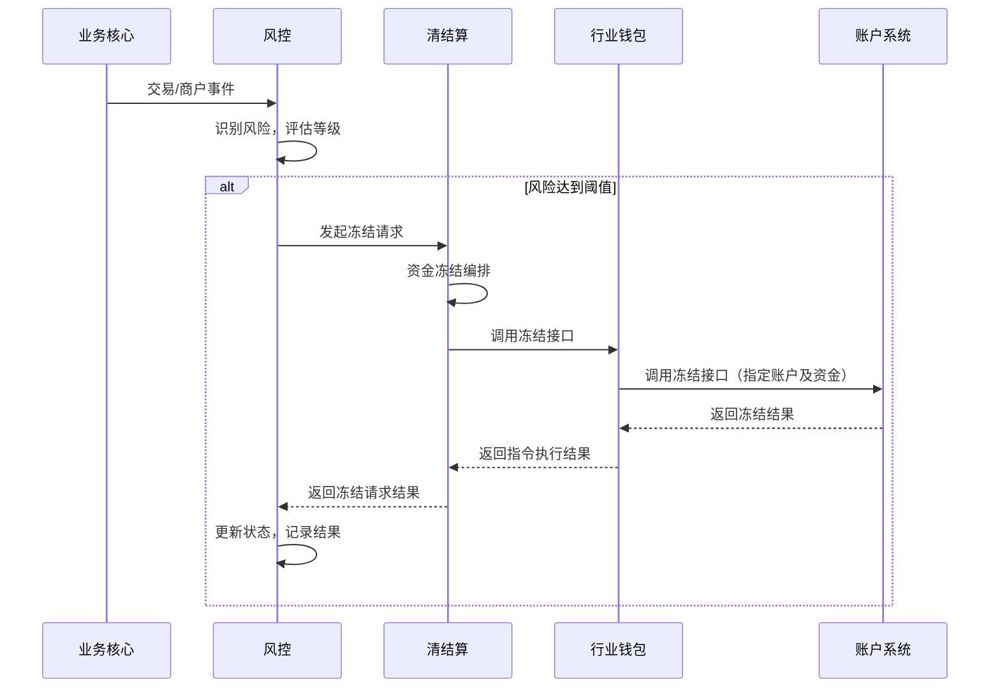
```mermaid
sequenceDiagram
    participant 业务核心
    participant 风控
    participant 清结算
    participant 行业钱包
    participant 账户系统

    业务核心->>风控: 交易/商户事件
    风控->>风控: 识别风险，评估等级
    alt 风险达到阈值
        风控->>清结算: 发起冻结请求
        清结算->>清结算: 资金冻结编排
        清结算->>行业钱包: 调用冻结接口
        行业钱包->>账户系统: 调用冻结接口（指定账户及资金）
        账户系统-->>行业钱包: 返回冻结结果
        行业钱包-->>清结算: 返回指令执行结果
        清结算-->>风控: 返回冻结请求结果
        风控->>风控: 更新状态，记录结果
    end
```

### 6. 错误处理
- **预期错误情况**:
    1) 下游系统（**清结算**）服务不可用或超时。
    2) 冻结请求参数错误（如不存在的商户或交易标识）。
    3) **清结算**返回冻结执行失败（可能因账户余额不足、账户状态异常等）。
    4) 风险识别依赖的数据源异常。
- **处理策略**:
    - 对于下游系统暂时性错误，采用带退避策略的重试机制，并记录日志告警。
    - 对于参数错误，应在发起请求前进行基础校验，校验失败则记录错误不发起请求。
    - 对于**清结算**返回的业务性失败，记录具体失败原因，通知运营人员处理，不自动重试。
    - 数据源异常时，暂停部分风险识别任务并告警。

### 7. 依赖关系
- **上游模块**: 依赖**业务核心**提供交易和商户数据以进行风险识别。具体依赖方式TBD。
- **下游模块**: **清结算**模块依赖本模块下发的冻结请求来编排执行资金管控。

<a id="module-8"></a>

## 3.8 代付系统


### 1. 概述
- **目的与范围**: 本模块负责处理向外部银行账户进行代付出款的业务。其核心职责是接收来自上游系统的付款指令，调用银行通道完成资金划转，并同步处理结果。其边界止于银行通道接口的调用与结果返回，不涉及账户资金的扣减、会计分录的记录以及手续费的计算。本模块仅处理资金已预先从相关账户中扣减完毕的代付请求。

### 2. 接口设计
- **API端点 (REST/GraphQL)**:
  - `POST /api/v1/disburse`: 接收代付指令。
  - `GET /api/v1/disburse/{orderNo}/status`: 查询代付单状态。
  - `POST /api/v1/disburse/callback`: 接收银行通道异步回调（如支持）。
- **请求/响应结构**:
  - 代付请求 (`POST /api/v1/disburse`):
    - 请求体字段: `requestId` (请求流水号，用于幂等), `merchantId` (商户号), `bankAccountNo` (收款银行账号), `bankAccountName` (收款户名), `bankCode` (开户行编码), `amount` (金额), `currency` (币种), `purpose` (用途), `clientIp` (客户端IP), `notifyUrl` (结果通知地址)。
    - 响应体字段: `code` (响应码), `message` (响应信息), `data.orderNo` (代付系统订单号), `data.status` (订单状态: PROCESSING/SUCCESS/FAILED)。
  - 状态查询 (`GET /api/v1/disburse/{orderNo}/status`):
    - 响应体字段: `code`, `message`, `data.orderNo`, `data.status`, `data.bankSerialNo` (银行流水号，成功时返回), `data.failReason` (失败原因)。
- **发布/消费的事件**:
  - 消费事件: TBD (上游系统在资金扣减完成后发送的“代付指令就绪”事件)。
  - 发布事件: `DisburseOrderCompleted` (代付订单终态事件，包含订单号、状态、银行流水号等信息)。

### 3. 数据模型
- **表/集合**: `disburse_order` (代付订单表)
- **关键字段**:
  - `order_no` (主键，代付系统订单号),
  - `request_id` (唯一索引，上游请求流水号，用于幂等),
  - `merchant_id` (商户号),
  - `bank_account_no` (收款银行账号),
  - `bank_account_name` (收款户名),
  - `bank_code` (开户行编码),
  - `amount` (金额),
  - `currency` (币种),
  - `status` (状态: INIT, PROCESSING, SUCCESS, FAILED, MANUAL),
  - `bank_serial_no` (银行流水号),
  - `channel_code` (通道编码),
  - `fail_reason` (失败原因),
  - `notify_url` (结果通知地址),
  - `retry_count` (重试次数),
  - `next_retry_time` (下次重试时间),
  - `completed_at` (完成时间),
  - `created_at`, `updated_at`。
- **与其他模块的关系**: 本模块执行出款操作，其处理结果（成功/失败的交易记录）被**对账单系统**用于生成对账单。本模块不直接依赖账户系统进行资金操作。

### 4. 业务逻辑
- **核心工作流/算法**:
  1.  **接收请求**: 接收上游系统（清结算）发起的代付请求。请求中必须包含用于保证幂等性的唯一`requestId`。
  2.  **参数校验与幂等检查**: 校验请求参数（账户信息、金额、商户状态等）。根据`requestId`查询历史记录，若已存在相同请求且处于终态（SUCCESS/FAILED），则直接返回历史结果；若处于处理中（PROCESSING），返回处理中状态。
  3.  **订单创建与预处理**: 校验通过后，创建状态为`INIT`的代付订单。根据路由规则（如金额、银行、商户等级）选择合适的银行出款通道。
  4.  **调用银行通道**: 将订单状态更新为`PROCESSING`，组装银行接口要求的报文，调用银行出款接口。
  5.  **处理同步返回**:
      - **成功**: 更新订单状态为`SUCCESS`，记录银行流水号。
      - **失败**: 更新订单状态为`FAILED`，记录失败原因。
      - **处理中**: 银行返回处理中状态。启动异步结果查询任务（轮询或等待回调）。
  6.  **异步结果处理**:
      - **轮询**: 对于处理中的订单，按照退避策略（如首次5秒后，之后每次间隔加倍，最多重试N次）向银行查询结果，直至得到终态或超时。
      - **回调**: 监听银行通道的异步回调通知，验证签名后更新订单状态。
  7.  **终态处理与通知**: 订单进入终态（SUCCESS/FAILED）后，通过回调`notifyUrl`异步通知上游系统。同时发布`DisburseOrderCompleted`事件。
  8.  **人工处理兜底**: 对于长时间处于`PROCESSING`状态且异步查询无结果的订单，定期扫描并置为`MANUAL`状态，进入人工对账流程。
- **业务规则与验证**: 验证收款银行账户信息的有效性（如四要素）、出款金额是否在单笔/单日限额内、商户状态是否正常、通道是否可用等。
- **关键边界情况处理**: 明确处理银行通道超时、返回结果不明（“银行处理中”）、网络异常等场景，通过异步查询、重试机制和人工对账进行兜底。

### 5. 时序图

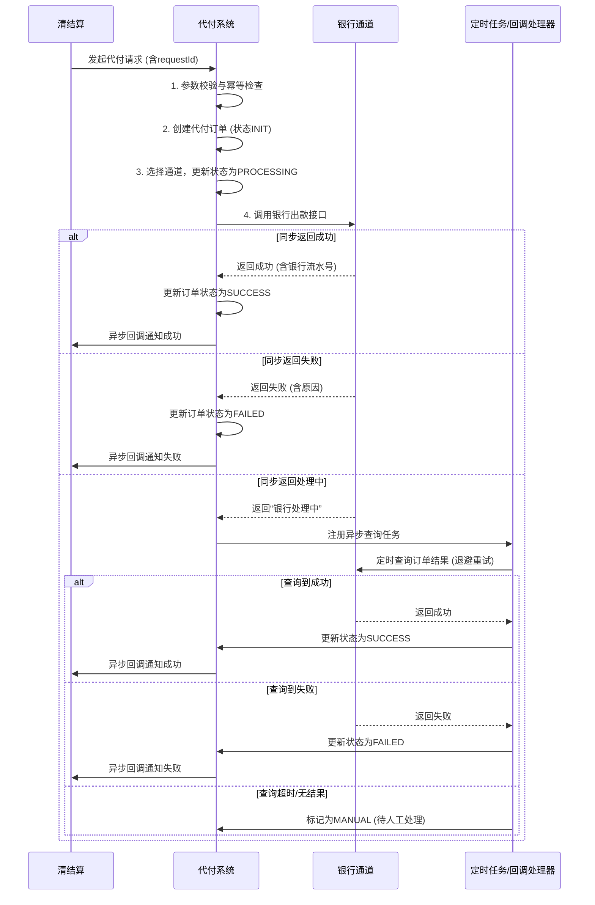
```mermaid
sequenceDiagram
    participant U as 清结算
    participant P as 代付系统
    participant B as 银行通道
    participant J as 定时任务/回调处理器

    U->>P: 发起代付请求 (含requestId)
    P->>P: 1. 参数校验与幂等检查
    P->>P: 2. 创建代付订单 (状态INIT)
    P->>P: 3. 选择通道，更新状态为PROCESSING
    P->>B: 4. 调用银行出款接口
    alt 同步返回成功
        B-->>P: 返回成功 (含银行流水号)
        P->>P: 更新订单状态为SUCCESS
        P->>U: 异步回调通知成功
    else 同步返回失败
        B-->>P: 返回失败 (含原因)
        P->>P: 更新订单状态为FAILED
        P->>U: 异步回调通知失败
    else 同步返回处理中
        B-->>P: 返回“银行处理中”
        P->>J: 注册异步查询任务
        J->>B: 定时查询订单结果 (退避重试)
        alt 查询到成功
            B-->>J: 返回成功
            J->>P: 更新状态为SUCCESS
            P->>U: 异步回调通知成功
        else 查询到失败
            B-->>J: 返回失败
            J->>P: 更新状态为FAILED
            P->>U: 异步回调通知失败
        else 查询超时/无结果
            J->>P: 标记为MANUAL (待人工处理)
        end
    end
```

### 6. 错误处理
- **预期错误情况**:
  - **业务错误**: 银行账户信息错误、交易限额超限、商户状态异常、重复请求。
  - **通道错误**: 银行通道临时维护、单通道额度不足。
  - **系统错误**: 网络超时、银行响应报文解析失败、系统内部异常。
- **处理策略**:
  - **业务错误**: 立即失败，返回明确错误码，不重试。
  - **通道级错误**: 触发通道切换（如有备用通道）或标记通道不可用，并立即失败。
  - **网络超时等临时错误**: 对于`PROCESSING`状态的订单，由异步查询任务负责重试获取最终结果。对于因超时未成功发起的请求，可根据配置进行有限次数的同步重试。
  - **幂等性**: 通过唯一`requestId`保证，避免因重试导致重复出款。
  - **人工对账**: 对于异步查询也无法获取明确结果的订单，落入`MANUAL`状态，由运营人员通过银行对账单进行人工核对与处理。

### 7. 依赖关系
- **上游模块**: **清结算**（发起已扣减资金的代付指令）。
- **下游模块**: **对账单系统**（消费`DisburseOrderCompleted`事件或直接查询，以获取代付交易明细生成对账单）。
- **外部依赖**: 各银行或第三方支付机构的出款通道接口。

<a id="module-9"></a>

## 3.9 认证系统


### 1. 概述
- **目的与范围**: 认证系统负责执行打款验证、人脸验证等身份核验功能，为关系绑定、开通付款等业务流程提供身份认证支持。其核心职责是验证用户身份的真实性和授权的有效性，确保资金操作的安全合规。

### 2. 接口设计
- **API端点 (REST/GraphQL)**:
    - `POST /api/v1/verification/payment`: 发起打款验证。
    - `POST /api/v1/verification/face`: 发起人脸验证。
    - `POST /api/v1/verification/confirm`: 提交验证信息（如回填金额）进行确认。
    - `GET /api/v1/verification/record/{id}`: 查询验证记录状态。
- **请求/响应结构**:
    - 发起打款验证请求 (`POST /api/v1/verification/payment`):
        - 请求体: `{“user_id”: “string”, “bank_account”: “string”, “bank_name”: “string”, “id_card”: “string”, “name”: “string”}`
        - 响应体: `{“code”: “string”, “message”: “string”, “data”: {“verification_id”: “string”, “expire_time”: “timestamp”}}`
    - 提交确认请求 (`POST /api/v1/verification/confirm`):
        - 请求体: `{“verification_id”: “string”, “entered_amount”: “number”}` 或 `{“verification_id”: “string”, “face_image”: “base64_string”}`
        - 响应体: `{“code”: “string”, “message”: “string”, “data”: {“result”: “SUCCESS/FAILURE”, “locked_until”: “timestamp”}}`
- **发布/消费的事件**:
    - 发布事件: `VerificationCompleted` (验证成功), `VerificationFailed` (验证失败)。
    - 消费事件: TBD。

### 3. 数据模型
- **表/集合**: `verification_records` (验证记录表)。
- **关键字段**:
    - `id` (主键，验证流水号)
    - `user_id` (用户标识)
    - `type` (验证类型: PAYMENT, FACE)
    - `status` (状态: INITIATED, PENDING, SUCCESS, FAILED, LOCKED)
    - `amount_sent` (打款金额，加密存储)
    - `amount_entered` (用户回填金额)
    - `bank_account` (银行卡号，加密存储)
    - `face_data_hash` (人脸图像哈希值，用于比对)
    - `request_time` (请求时间)
    - `expire_time` (过期时间)
    - `failure_count` (失败次数)
    - `locked_until` (锁定截止时间)
    - `external_ref` (外部关联ID，如电子协议ID)
- **与其他模块的关系**: 认证系统与电子签章系统在复合认证流程中存在交互（例如，在关系绑定流程中，认证完成后触发电子协议签署）。与行业钱包、三代系统通过API交互接收验证请求。

### 4. 业务逻辑
- **核心工作流/算法**:
    1. **打款验证**:
        - 接收验证请求，生成一个密码学安全的随机小数金额（如0.01-0.99元）。
        - 将生成的金额加密后存储于`amount_sent`字段。
        - 调用银行通道接口发起小额打款。
        - 等待用户回填金额，比对回填金额与存储的`amount_sent`（允许微小误差，如±0.001元）。
    2. **人脸验证**:
        - 接收验证请求，获取用户提供的姓名、身份证号和人脸图像。
        - 调用第三方人脸识别服务，进行活体检测与三要素（姓名、身份证号、人脸）比对。
        - 根据服务返回的置信度分数判断验证结果。
- **业务规则与验证**:
    - 打款验证金额需使用密码学安全的随机数生成器生成。
    - 所有人脸生物特征数据在传输和临时处理过程中需脱敏或加密，不持久化存储原始图像。
    - 所有验证请求均有有效期（如10分钟），超时自动失效。
- **关键边界情况处理**:
    - **验证失败次数限制与锁定机制**: 同一验证标的（如银行卡/用户）连续失败3次后，状态置为`LOCKED`，锁定24小时。解锁可通过人工审核或锁定时间过期自动解除。
    - **打款验证中银行打款失败的处理**: 首次失败自动重试1次（更换通道或稍后重试）。若再次失败，则验证状态置为`FAILED`，并记录失败原因。需通知运营人员并告警。
    - **验证超时处理**: 系统定时任务扫描状态为`PENDING`且已过`expire_time`的记录，自动将其状态更新为`FAILED`。

### 5. 时序图

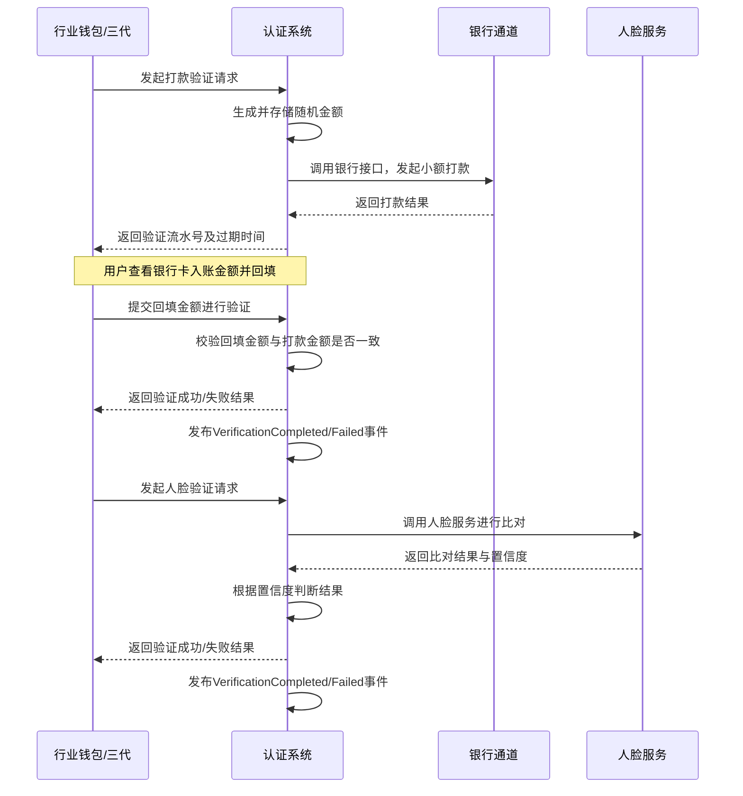
```mermaid
sequenceDiagram
    participant A as 行业钱包/三代
    participant B as 认证系统
    participant C as 银行通道
    participant D as 人脸服务

    A->>B: 发起打款验证请求
    B->>B: 生成并存储随机金额
    B->>C: 调用银行接口，发起小额打款
    C-->>B: 返回打款结果
    B-->>A: 返回验证流水号及过期时间
    Note over A, B: 用户查看银行卡入账金额并回填
    A->>B: 提交回填金额进行验证
    B->>B: 校验回填金额与打款金额是否一致
    B-->>A: 返回验证成功/失败结果
    B->>B: 发布VerificationCompleted/Failed事件

    A->>B: 发起人脸验证请求
    B->>D: 调用人脸服务进行比对
    D-->>B: 返回比对结果与置信度
    B->>B: 根据置信度判断结果
    B-->>A: 返回验证成功/失败结果
    B->>B: 发布VerificationCompleted/Failed事件
```

### 6. 错误处理
- **预期错误情况**:
    - 银行打款通道异常或失败。
    - 人脸识别服务不可用或超时。
    - 用户回填金额错误、超时或验证次数超限。
    - 网络超时或系统内部错误。
- **处理策略**:
    - 对银行通道、人脸服务等外部依赖设置指数退避重试机制（最多2次）和熔断器。
    - 所有验证操作记录详细流水日志，包含请求、响应、关键中间状态，便于审计与问题追踪。
    - 向调用方返回结构化的错误码和用户友好的提示信息。
    - 对系统级错误进行监控告警。

### 7. 依赖关系
- **上游模块**: 行业钱包、三代（发起认证请求）。
- **下游模块/服务**: 银行系统（执行打款）、第三方人脸识别服务（执行人脸比对）。
- **协作模块**: 电子签章系统。在关系绑定等复合流程中，认证系统完成验证后，可通过发布`VerificationCompleted`事件或同步API回调，通知电子签章系统进入后续签署流程。具体交互模式为事件驱动。

<a id="module-10"></a>

## 3.10 电子签章系统


### 1. 概述
- **目的与范围**: 本模块负责为“关系绑定”和“开通付款”等业务流程提供电子协议签署能力。核心职责包括：根据业务需求生成电子协议、封装并发送签约短信、提供H5签约页面、管理签约证据链的生成与存储。本模块不涉及具体的业务审批逻辑或资金操作。

### 2. 接口设计
- **API端点 (REST/GraphQL)**:
  - `POST /v1/agreement/initiate`: 接收来自上游系统（如“行业钱包”）的签约请求，发起签约流程。
  - `GET /v1/agreement/{agreementId}/status`: 查询指定协议的签署状态。
  - `POST /v1/agreement/{agreementId}/resend-sms`: 重新发送签约短信。
  - `POST /v1/h5/sign/verify`: H5页面调用的身份验证接口。
  - `POST /v1/h5/sign/confirm`: H5页面调用的最终签署确认接口。
- **请求/响应结构**:
  - 发起签约请求 (`POST /v1/agreement/initiate`)
    - 请求体: `{“bizId”: “业务流水号”, “templateCode”: “协议模板编码”, “parties”: [ {“name”: “签约方名称”, “mobile”: “手机号”, “idNo”: “证件号”} ], “bizContext”: {“feeRule”: “计费产品信息”, … } }`
    - 响应体: `{“code”: “响应码”, “message”: “消息”, “data”: {“agreementId”: “协议唯一ID”, “expireTime”: “链接过期时间”}}`
  - 签署状态查询响应: `{“code”: “响应码”, “data”: {“agreementId”: “协议ID”, “status”: “pending/sent/signed/expired”, “signTime”: “签署时间”, “evidenceId”: “证据链ID”}}`
- **发布/消费的事件**:
  - 消费事件: TBD（例如，监听账户系统或业务核心发起的签约触发事件）。
  - 发布事件: `AgreementSignedEvent` (协议签署完成事件)，包含协议ID、签署方、签署时间、证据链ID。

### 3. 数据模型
- **表/集合**:
  - `agreement` (协议主表):
    - `agreement_id` (主键), `biz_id`, `template_code`, `status` (状态: pending, sent, signed, expired), `initiate_time`, `expire_time`, `biz_context` (JSON, 存储业务上下文如计费信息), `created_at`, `updated_at`.
  - `signatory` (签约方表):
    - `id` (主键), `agreement_id` (外键), `name`, `mobile`, `id_no`, `sign_status`, `sign_time`, `sign_ip`, `sign_user_agent`.
  - `evidence_log` (证据链日志表):
    - `evidence_id` (主键), `agreement_id` (外键), `content` (JSON, 存储完整的签署证据，包括页面访问记录、验证码验证记录、签署动作时间戳、IP、用户代理、协议原文哈希等), `storage_path` (外部存储路径), `created_at`.
  - `sms_send_log` (短信发送日志表):
    - `id` (主键), `agreement_id`, `mobile`, `sms_content`, `send_status`, `send_time`, `channel`.
- **关键字段**: 如上所述。
- **与其他模块的关系**: 本模块被“行业钱包”系统调用，用于在“关系绑定”和“开通付款”流程中完成电子协议签署环节。协议的业务上下文 (`biz_context`) 可能包含来自“账户系统”或“计费中台”的费率等信息。

### 4. 业务逻辑
- **核心工作流/算法**:
  1.  **接收与初始化**: 接收来自“行业钱包”的签约请求，校验参数，生成唯一`agreement_id`，根据`template_code`从模板引擎加载协议模板，并注入业务参数（包括来自`biz_context`的计费产品等信息）生成最终协议文件（PDF/HTML）。协议状态置为`pending`。
  2.  **生成链接与发送通知**: 为协议生成唯一的H5签约页面链接（包含`agreement_id`参数），链接设置有效期（如24小时）。调用短信服务发送签约短信。协议状态更新为`sent`。
  3.  **H5页面签署流程**:
      a. 签约方访问H5链接，系统展示协议全文。
      b. 调用`认证系统`的接口，通过短信验证码验证签约方手机号（与请求中的`mobile`匹配）。
      c. 验证通过后，签约方进行签署操作（如点击确认按钮、绘制签名等）。
      d. 签署时，前端收集用户环境信息（IP、User-Agent、时间戳）并提交。
  4.  **证据链生成与存储**: 在签署确认时，系统将协议原文、签署方身份信息、验证记录、签署动作时间戳、环境信息等打包，计算哈希，生成结构化证据链JSON。将该证据链存储至外部存储服务（如对象存储），并在`evidence_log`表中记录存储路径和元数据。
  5.  **状态更新与通知**: 协议状态更新为`signed`，记录签署时间。异步发布`AgreementSignedEvent`事件，通知“行业钱包”等上游系统。
- **业务规则与验证**:
  1.  签约方必须通过`认证系统`完成短信验证码验证，且验证的手机号需与协议中指定的手机号一致。
  2.  协议内容在签署前必须在H5页面完整、不可篡改地展示给签约方。
  3.  签署操作需记录精确到毫秒的时间戳、IP地址、用户代理等关键信息，并纳入证据链。
  4.  签约链接具有有效期，过期后状态自动更新为`expired`，需重新发起流程。
- **关键边界情况处理**:
  1.  短信发送失败：记录失败日志，提供`resend-sms`接口供上游重试，支持重试次数限制（如3次）。
  2.  签约链接过期：H5页面访问时校验`expire_time`，若过期则提示用户并引导联系业务方重新发起。
  3.  签署过程中断：基于`agreement_id`，用户重新访问链接时可恢复至上次步骤（如已验证则跳过验证，直接进入签署页面）。

### 5. 时序图
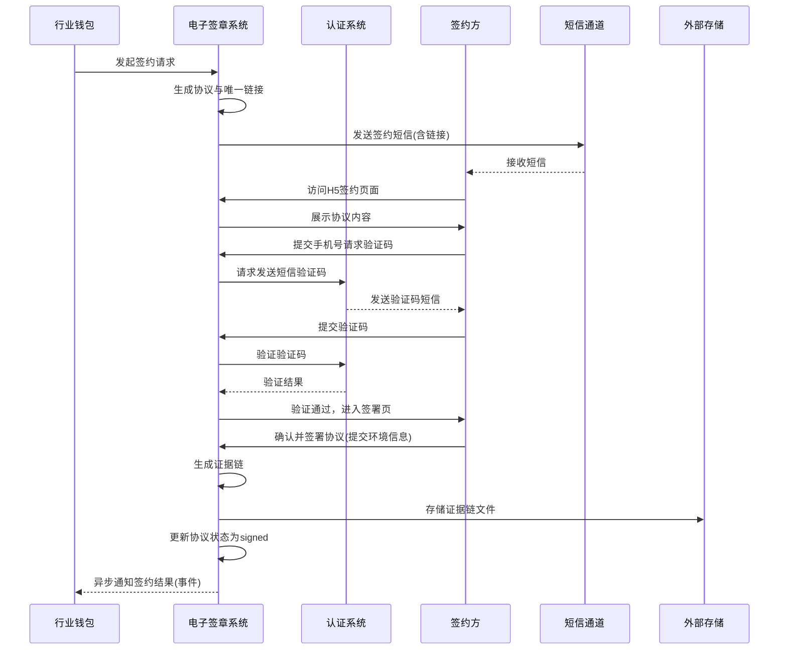
```mermaid
sequenceDiagram
    participant 行业钱包
    participant 电子签章系统
    participant 认证系统
    participant 签约方
    participant 短信通道
    participant 外部存储

    行业钱包->>电子签章系统: 发起签约请求
    电子签章系统->>电子签章系统: 生成协议与唯一链接
    电子签章系统->>短信通道: 发送签约短信(含链接)
    短信通道-->>签约方: 接收短信
    签约方->>电子签章系统: 访问H5签约页面
    电子签章系统->>签约方: 展示协议内容
    签约方->>电子签章系统: 提交手机号请求验证码
    电子签章系统->>认证系统: 请求发送短信验证码
    认证系统-->>签约方: 发送验证码短信
    签约方->>电子签章系统: 提交验证码
    电子签章系统->>认证系统: 验证验证码
    认证系统-->>电子签章系统: 验证结果
    电子签章系统->>签约方: 验证通过，进入签署页
    签约方->>电子签章系统: 确认并签署协议(提交环境信息)
    电子签章系统->>电子签章系统: 生成证据链
    电子签章系统->>外部存储: 存储证据链文件
    电子签章系统->>电子签章系统: 更新协议状态为signed
    电子签章系统-->>行业钱包: 异步通知签约结果(事件)
```

### 6. 错误处理
- **预期错误情况**:
  1.  模板生成失败（模板不存在或参数错误）。
  2.  短信发送失败（通道异常、号码格式错误）。
  3.  `认证系统`调用失败或验证不通过。
  4.  外部存储服务异常导致证据链保存失败。
  5.  并发签署请求（幂等性处理）。
- **处理策略**:
  1.  **重试机制**: 对短信发送、外部存储等外部依赖调用，配置指数退避重试策略（如最多3次）。对于`/initiate`接口，要求上游传递幂等键（如`bizId`），避免重复创建协议。
  2.  **状态机管理**: 协议状态遵循明确的状态流转（`pending` -> `sent` -> `signed`/`expired`），非法状态操作返回明确错误。
  3.  **错误响应**: 向调用方返回结构化的错误码和提示信息。例如：`SMS_SEND_FAILED`, `VERIFICATION_FAILED`, `AGREEMENT_EXPIRED`。
  4.  **补偿与兜底**: 证据链存储失败时，记录本地详细日志并告警，协议状态暂不更新为`signed`，等待人工介入或定时任务重试存储。确保关键数据不丢失。

### 7. 依赖关系
- **上游模块**:
  - 行业钱包（主调用方，发起签约请求）。
  - 账户系统/计费中台（提供协议中可能需要的业务上下文信息，如费率详情）。
- **下游模块/服务**:
  - 认证系统（必须，用于签约方短信验证码身份验证）。
  - 短信服务提供商（发送签约通知短信）。
  - 外部存储服务（用于持久化存储生成的协议文件和证据链文件）。

<a id="module-11"></a>

## 3.11 计费中台


### 1. 概述
- **目的与范围**: 本模块负责根据配置的费率规则，计算并生成转账、分账等业务手续费。其核心职责是接收业务核心或清结算系统的计费请求，根据计费产品配置、扣费方式（如按比例或固定金额）以及手续费承担方（付款方或收款方）等参数，计算出应收手续费，并将结果返回给调用方。其边界仅限于手续费的计算，不涉及账户资金的扣减与记账。

### 2. 接口设计
- **API端点 (REST)**: `/api/v1/fee/calculate`
- **请求/响应结构**:
    - **请求方法**: POST
    - **请求体**:
        ```json
        {
            "requestId": "string, 请求唯一标识",
            "caller": "string, 调用方标识（如‘业务核心’、‘清结算’）",
            "businessType": "string, 业务类型（如‘分账’、‘转账’）",
            "amount": "number, 交易金额（单位：分）",
            "feeProductCode": "string, 计费产品编码",
            "feeBearer": "string, 手续费承担方（‘PAYER’ 或 ‘PAYEE’）",
            "transferMode": "string, 转账模式（‘NET’ 净额转账 或 ‘GROSS’ 全额转账）",
            "payerAccountNo": "string, 付款方账户号",
            "payeeAccountNo": "string, 收款方账户号",
            "extInfo": "object, 扩展信息"
        }
        ```
    - **成功响应体**:
        ```json
        {
            "code": "SUCCESS",
            "message": "成功",
            "data": {
                "requestId": "string, 原请求ID",
                "calculatedFee": "number, 计算出的手续费（单位：分）",
                "originalAmount": "number, 原始交易金额（单位：分）",
                "settlementAmount": "number, 结算金额（单位：分，根据转账模式调整后的金额）",
                "feeRuleApplied": "string, 应用的费率规则摘要",
                "calculationTime": "string, 计算时间戳"
            }
        }
        ```
    - **事件发布/消费**: TBD

### 3. 数据模型
- **表/集合**:
    1.  **计费产品表 (fee_product)**: 存储计费产品定义。
    2.  **费率规则表 (fee_rule)**: 存储具体的费率规则，与计费产品关联。
    3.  **计费计算日志表 (fee_calculation_log)**: 记录每次计费请求与结果，用于对账与审计。
- **关键字段**:
    - **fee_product**: `product_code` (主键), `product_name`, `status`, `effective_time`, `expire_time`, `description`。
    - **fee_rule**: `rule_id` (主键), `product_code` (外键), `fee_type` (如 ‘RATE‘， ‘FIXED‘), `rate` (比例，如 0.006 表示 0.6%), `fixed_amount` (固定金额，单位分), `min_fee` (最低手续费，单位分), `max_fee` (最高手续费，单位分), `priority`, `condition_json` (适用条件)。
    - **fee_calculation_log**: `log_id` (主键), `request_id`, `caller`, `business_type`, `original_amount`, `fee_product_code`, `calculated_fee`, `fee_bearer`, `transfer_mode`, `calculation_result`, `request_time`, `response_time`。
- **与其他模块的关系**: 本模块依赖上游系统（业务核心、清结算）传入的计费请求数据。`fee_product` 与 `fee_rule` 表的数据由运营配置系统（如三代运营机构的后台）进行管理。

### 4. 业务逻辑
- **核心工作流/算法**:
    1.  **接收与校验**: 接收计费请求，校验必填参数、金额有效性、计费产品状态。
    2.  **规则查询与匹配**: 根据 `feeProductCode` 查询有效的 `fee_rule`，并根据请求中的业务类型、金额区间等条件匹配优先级最高的适用规则。
    3.  **手续费计算**:
        - **基础计算**: 根据匹配的规则计算基础手续费。
            - 比例费率: `基础手续费 = 原始金额 * 费率`。
            - 固定金额: `基础手续费 = 固定金额`。
        - **封顶保底处理**: 若规则配置了 `min_fee` 或 `max_fee`，则应用 `手续费 = max(min_fee, min(基础手续费, max_fee))`。
        - **舍入规则**: 手续费计算结果向上取整到分。
    4.  **承担方与转账模式处理**:
        - **手续费承担方 (`feeBearer`)**:
            - `PAYER` (付款方承担): 最终应收手续费 = 计算出的手续费。
            - `PAYEE` (收款方承担): 最终应收手续费 = 计算出的手续费。
        - **转账模式 (`transferMode`)**:
            - `NET` (净额转账): 结算金额 = 原始金额 - 最终应收手续费 (当 `feeBearer` 为 `PAYER` 时)。
            - `GROSS` (全额转账): 结算金额 = 原始金额。
        - **逻辑组合**: 手续费金额的计算独立于承担方，但 `transferMode` 影响返回给上游的 `settlementAmount`（结算金额）。手续费由承担方后续在资金流中支付。
    5.  **结果返回与记录**: 组装计算结果，记录日志，返回给调用方。
- **业务规则与验证**: 校验请求参数有效性；确保计费产品处于生效状态；验证金额为正整数。
- **关键边界情况处理**:
    - **费率规则未配置/失效**: 返回明确的“计费产品不存在或已失效”错误。
    - **手续费为0**: 属于正常情况，按0返回。
    - **手续费计算为负数**: 此为逻辑错误，因费率为正，金额为正，不应出现。若出现，视为系统异常，记录错误日志并返回计算失败。
    - **大额交易费率封顶/保底**: 通过 `fee_rule` 表中的 `max_fee` 和 `min_fee` 字段实现。

### 5. 时序图

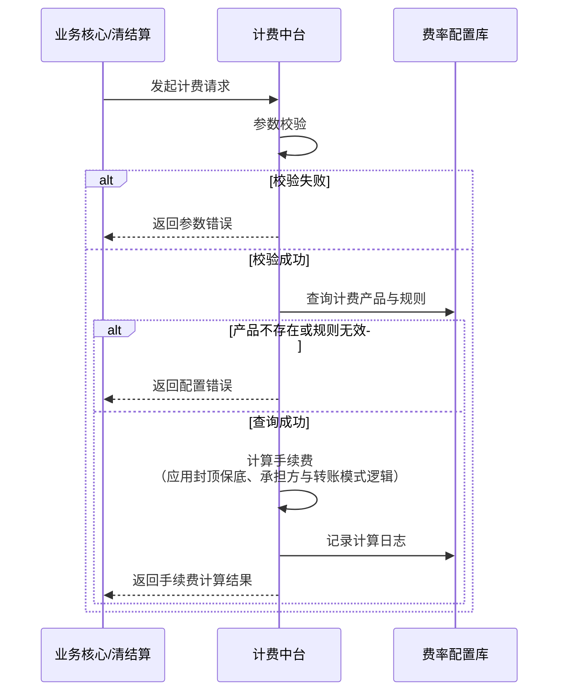
```mermaid
sequenceDiagram
    participant 调用方 as 业务核心/清结算
    participant 计费中台
    participant 费率配置库

    调用方->>计费中台: 发起计费请求
    计费中台->>计费中台: 参数校验
    alt 校验失败
        计费中台-->>调用方: 返回参数错误
    else 校验成功
        计费中台->>费率配置库: 查询计费产品与规则
        alt 产品不存在或规则无效
            计费中台-->>调用方: 返回配置错误
        else 查询成功
            计费中台->>计费中台: 计算手续费<br>（应用封顶保底、承担方与转账模式逻辑）
            计费中台->>费率配置库: 记录计算日志
            计费中台-->>调用方: 返回手续费计算结果
        end
    end
```

### 6. 错误处理
- **预期错误情况与错误码**:
    - `INVALID_PARAMETER` (400): 请求参数缺失、格式错误或金额非法。
    - `FEE_PRODUCT_NOT_FOUND` (404): 计费产品编码不存在。
    - `FEE_PRODUCT_INACTIVE` (400): 计费产品未生效或已过期。
    - `FEE_RULE_NOT_APPLICABLE` (400): 未找到适用于当前请求的费率规则。
    - `CALCULATION_ERROR` (500): 手续费计算过程出现逻辑错误（如负手续费）。
    - `SYSTEM_ERROR` (500): 系统内部异常（数据库连接失败等）。
- **处理策略**:
    - 对于客户端错误（4xx），返回具体错误码和信息，调用方不应重试。
    - 对于服务端错误（5xx），记录详细日志并触发告警。调用方可依据策略进行有限次重试。
    - 所有计费请求和结果（包括错误）均记录入 `fee_calculation_log` 表。

### 7. 依赖关系
- **上游模块**:
    - **业务核心**: 在处理分账、转账等交易时，调用本模块计算手续费。
    - **清结算**: 在清分结算过程中，调用本模块计算交易相关手续费。
- **下游模块**: TBD。本模块为纯计算服务，计算结果返回给上游调用方，由上游模块负责后续资金处理。
- **配置管理依赖**: 计费产品与费率规则依赖运营配置系统（如三代运营机构的后台）进行管理。

<a id="module-12"></a>

## 3.12 对账单系统


### 1. 概述
- **目的与范围**: 本模块负责按机构或账户维度生成并提供各类交易、结算、动账明细对账单。其核心职责是接收上游系统的交易、结算及账户变动数据，按日（或按需）生成结构化的明细数据文件，并提供给下游系统（如天财、三代）进行对账。边界在于数据的聚合、格式化和分发，不涉及原始交易数据的处理或资金结算逻辑。
- **触发条件**: 对账单生成主要分为两种模式：
    1.  **定时生成**: 每日定时（如T+1日凌晨）为所有活跃机构生成前一自然日的对账单。
    2.  **按需生成**: 由下游系统（天财、三代）通过API主动触发，可指定特定机构、账户及日期范围（如补单、重跑）。

### 2. 接口设计
- **API端点 (REST)**:
    - `POST /api/v1/statements/generate`: 触发按需生成对账单。
        - 请求体: `{“institutionCode”: “机构号”, “accountNo”: “账户号(可选)”, “startDate”: “YYYY-MM-DD”, “endDate”: “YYYY-MM-DD”, “type”: “TRADE|SETTLEMENT|ACCOUNT”}`
        - 响应: `{“taskId”: “任务ID”, “status”: “ACCEPTED”}`
    - `GET /api/v1/statements`: 查询对账单列表。
        - 查询参数: `institutionCode`, `accountNo`, `date`, `type`, `status`
        - 响应: `[{“statementId”: “对账单ID”, “institutionCode”: “机构号”, “date”: “YYYY-MM-DD”, “type”: “类型”, “fileUrl”: “文件下载链接”, “status”: “GENERATED|FAILED”, “createdAt”: “时间戳”}]`
    - `GET /api/v1/statements/{statementId}/download`: 下载对账单文件。
- **发布/消费的事件**:
    - 消费事件: TBD (例如，监听上游系统发布的“日切完成”事件，作为定时触发的信号之一)。
    - 发布事件: `StatementGeneratedEvent` (对账单文件生成成功时发布，包含文件路径、机构、日期、类型等信息，供下游订阅)。

### 3. 数据模型
- **表/集合**:
    - `statement_metadata` (对账单元数据表)
        - `statement_id` (主键，对账单唯一标识)
        - `institution_code` (机构号)
        - `account_no` (账户号，可为空)
        - `statement_date` (对账日期)
        - `statement_type` (类型: TRADE-交易, SETTLEMENT-结算, ACCOUNT-动账)
        - `file_storage_path` (文件在对象存储中的路径)
        - `file_format` (文件格式，如CSV)
        - `status` (状态: GENERATING, GENERATED, FAILED)
        - `checksum` (文件校验和，用于完整性验证)
        - `generated_at` (生成时间)
        - `created_at`, `updated_at`
    - `generation_task_log` (生成任务日志表)
        - `task_id` (任务ID)
        - `trigger_type` (触发类型: SCHEDULED, MANUAL, API)
        - `parameters` (触发参数，JSON格式)
        - `status` (任务状态: PENDING, PROCESSING, SUCCESS, PARTIAL_FAILURE, FAILED)
        - `error_message` (错误信息)
        - `start_time`, `end_time`
- **关键字段**: 如上所述。
- **与其他模块的关系**: 依赖**业务核心**获取交易订单数据，依赖**清结算**获取结算明细数据，依赖**账务核心**获取资金流水（动账）数据。生成的对账单供**天财**、**三代**等系统使用。术语澄清：根据术语表，“账务核心”负责记录所有资金变动流水，因此动账明细数据源应为“账务核心”，而非“账户系统”。“账户系统”负责账户的底层操作，但对账单所需的资金变动记录应由“账务核心”提供。

### 4. 业务逻辑
- **核心工作流/算法**:
    1.  **数据拉取**: 根据对账日期和机构/账户维度，并行调用上游系统接口获取数据。
        - 从 **业务核心** 拉取指定日期范围内的交易订单明细。
        - 从 **清结算** 拉取指定日期范围内的结算明细（包括结算状态、金额、手续费等）。
        - 从 **账务核心** 拉取指定日期范围内涉及目标账户的资金流水明细（借贷方向、余额变动）。
    2.  **数据清洗与聚合**:
        - **清洗**: 校验数据必填字段，过滤无效记录（如金额为0），统一时间格式。
        - **聚合**: 按 `机构号`、`账户号`、`业务类型`、`日期` 等维度对明细数据进行分组。核心算法为按关键字段（如订单号、流水号）进行关联和汇总，确保同一笔业务在不同系统的记录能通过关联键对应。
        - **对账逻辑**: 在生成文件前，将聚合后的交易金额、结算金额与从上游获取的日汇总数据进行总额核对。若差异超过阈值，则记录告警并暂停文件生成。
    3.  **文件生成**:
        - **格式**: 采用CSV格式，文件编码UTF-8。具体列结构根据对账单类型预定义（例如交易对账单包含：订单号、交易时间、交易类型、金额、状态等）。
        - **命名规范**: `{机构号}_{对账日期}_{对账单类型}_{序列号}.csv`，例如 `INS001_2023-10-27_TRADE_01.csv`。
        - **存储**: 生成的文件上传至公司内部对象存储服务，存储路径遵循：`/statements/{yyyy}/{mm}/{dd}/{机构号}/`。
    4.  **分发与通知**: 更新对账单元数据状态为`GENERATED`，并记录文件访问URL。通过发布事件或回调通知下游系统（天财、三代）对账单已就绪。
- **业务规则与验证**:
    - 同一机构、同一日期、同一类型的对账单，成功生成后状态标记为`GENERATED`，防止重复生成。
    - 文件生成后计算MD5校验和，存储于元数据中，供下游验证文件完整性。
    - 对账单文件在存储服务中的保留策略为至少180天。
- **关键边界情况处理**:
    - **上游数据延迟**: 设置数据就绪等待窗口（如30分钟），超时后若数据仍不全，则根据配置决定是生成部分对账单（标记`PARTIAL`）还是失败告警。
    - **数据不一致**: 当交易、结算、动账三方数据无法通过关联键匹配或总额核对不一致时，记录详细的不匹配日志，发出数据一致性告警，并可由运营人员介入处理。
    - **下游系统不可用**: 文件推送失败时，进入重试队列，最多重试3次，每次间隔指数递增。最终失败则告警。

### 5. 时序图

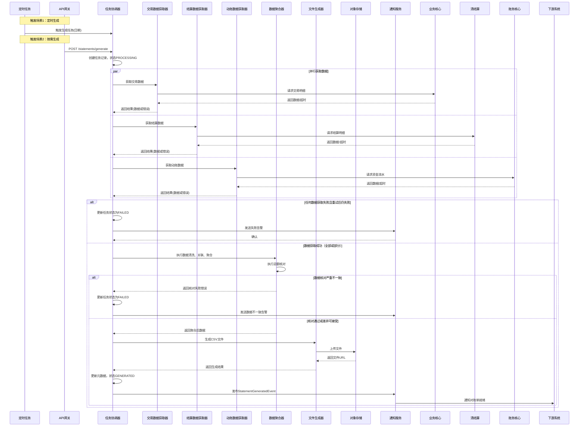
```mermaid
sequenceDiagram
    participant Scheduler as 定时任务
    participant API as API网关
    participant Coordinator as 任务协调器
    participant FetcherT as 交易数据获取器
    participant FetcherS as 结算数据获取器
    participant FetcherA as 动账数据获取器
    participant Aggregator as 数据聚合器
    participant Generator as 文件生成器
    participant Storage as 对象存储
    participant Notifier as 通知服务
    participant BizCore as 业务核心
    participant Clearing as 清结算
    participant LedgerCore as 账务核心
    participant Downstream as 下游系统

    Note over Scheduler,API: 触发场景1：定时生成
    Scheduler->>Coordinator: 触发生成任务(日期)
    Note over Scheduler,API: 触发场景2：按需生成
    API->>Coordinator: POST /statements/generate

    Coordinator->>Coordinator: 创建任务记录，状态PROCESSING

    par 并行获取数据
        Coordinator->>FetcherT: 获取交易数据
        FetcherT->>BizCore: 请求交易明细
        BizCore-->>FetcherT: 返回数据/超时
        FetcherT-->>Coordinator: 返回结果(数据或错误)
    and
        Coordinator->>FetcherS: 获取结算数据
        FetcherS->>Clearing: 请求结算明细
        Clearing-->>FetcherS: 返回数据/超时
        FetcherS-->>Coordinator: 返回结果(数据或错误)
    and
        Coordinator->>FetcherA: 获取动账数据
        FetcherA->>LedgerCore: 请求资金流水
        LedgerCore-->>FetcherA: 返回数据/超时
        FetcherA-->>Coordinator: 返回结果(数据或错误)
    end

    alt 任何数据获取失败且重试后仍失败
        Coordinator->>Coordinator: 更新任务状态为FAILED
        Coordinator->>Notifier: 发送失败告警
        Notifier-->>Coordinator: 确认
    else 数据获取成功（全部或部分）
        Coordinator->>Aggregator: 执行数据清洗、关联、聚合
        Aggregator->>Aggregator: 执行总额核对
        alt 数据核对严重不一致
            Aggregator-->>Coordinator: 返回核对失败错误
            Coordinator->>Coordinator: 更新任务状态为FAILED
            Coordinator->>Notifier: 发送数据不一致告警
        else 核对通过或差异可接受
            Aggregator-->>Coordinator: 返回聚合后数据
            Coordinator->>Generator: 生成CSV文件
            Generator->>Storage: 上传文件
            Storage-->>Generator: 返回文件URL
            Generator-->>Coordinator: 返回生成结果
            Coordinator->>Coordinator: 更新元数据，状态GENERATED
            Coordinator->>Notifier: 发布StatementGeneratedEvent
            Notifier->>Downstream: 通知对账单就绪
        end
    end
```

### 6. 错误处理
- **预期错误情况**:
    1.  上游接口调用失败或超时。
    2.  上游返回数据格式异常、关键字段缺失或数据逻辑错误（如金额为负）。
    3.  数据聚合过程中关联失败，或核对总额与上游汇总数据差异超阈值。
    4.  文件生成失败（如模板错误、编码问题）。
    5.  文件上传至对象存储失败。
    6.  通知下游系统失败。
- **处理策略**:
    - **重试机制**: 对上游数据获取、文件上传、下游通知等外部调用设置指数退避重试策略（如最多3次）。
    - **熔断与降级**: 当某一上游系统持续不可用，触发熔断，暂时跳过该数据源，生成部分对账单并标记`PARTIAL_FAILURE`状态，同时告警。
    - **数据校验**: 对接收到的数据进行严格的结构和逻辑校验。失败记录被隔离并记录详细日志，不影响其他有效数据的处理，但触发告警。
    - **状态追踪与补偿**: 通过`generation_task_log`表完整记录任务生命周期。对于失败的生成任务，提供管理界面供运营人员查看错误详情并手动触发重试或补偿生成。
    - **监控告警**: 对任务失败率、数据不一致率、端到端延迟等关键指标进行监控，超出阈值时即时告警。

### 7. 依赖关系
- **上游模块**:
    - **业务核心**: 提供原始交易订单明细数据。
    - **清结算**: 提供交易清分、结算结果明细数据。
    - **账务核心**: 提供所有资金变动流水（动账）明细数据。
- **下游模块**:
    - **天财**: 消费交易、结算、动账对账单，用于其内部对账与资金管理。
    - **三代**: 消费对账单，用于运营侧对账与商户服务。
- **基础设施依赖**:
    - 对象存储服务（用于对账单文件持久化）。
    - 消息队列（用于异步事件发布/订阅）。
    - 数据库（用于存储元数据与任务日志）。

<a id="module-13"></a>

## 3.13 业务核心


### 1. 概述
- **目的与范围**: 本模块负责接收并处理天财分账等交易数据。它是天财资金管理业务流程的入口和协调中枢，负责接收业务请求、协调下游系统（如行业钱包、清结算）完成资金处理，并返回最终结果。其边界止于业务逻辑的编排与数据转发，不包含具体的账户操作、清分结算或风控规则执行。

### 2. 接口设计
- **API端点 (REST/GraphQL)**:
    - `POST /api/v1/tiancai/split`: 处理天财分账请求。
    - `POST /api/v1/tiancai/member-settlement`: 处理会员结算请求。
    - `POST /api/v1/tiancai/batch-payment`: 处理批量付款请求。
    - `POST /api/internal/risk/freeze`: 接收风控系统发起的账户冻结指令。
- **请求/响应结构**:
    - 分账请求: 包含请求流水号、付方机构号/账户、收方机构号/账户、分账金额、业务场景标识等字段。
    - 通用响应: 包含处理状态（成功/失败）、业务流水号、错误码、错误信息等字段。
- **发布/消费的事件**:
    - 消费事件: `RiskFreezeEvent` (来自风控系统)。
    - 发布事件: `TransactionProcessedEvent` (处理完成事件，供下游订阅)。

### 3. 数据模型
- **表/集合**:
    - `tiancai_transaction`: 核心交易流水表。
    - `freeze_instruction`: 冻结指令记录表。
- **关键字段**:
    - `tiancai_transaction`: 交易流水号、业务类型（分账/结算/批付）、付方信息、收方信息、金额、状态（待处理/处理中/成功/失败/已冻结）、创建时间、更新时间。
    - `freeze_instruction`: 指令ID、目标账户、冻结类型（商户冻结/交易冻结）、关联交易流水号、指令状态（待执行/已执行）、接收时间。
- **与其他模块的关系**: 本模块接收并处理来自“天财”的交易数据，处理后需调用“行业钱包”进行业务校验与账户操作，并调用“清结算”进行资金清分与结算编排。处理结果通过事件通知给其他订阅的下游系统。

### 4. 业务逻辑
- **核心工作流/算法**: 主要业务流程为接收天财的分账、会员结算、批量付款等请求，验证基础参数，然后调用行业钱包进行账户关系、状态及余额校验，最后调用清结算系统执行具体的资金冻结、解冻、分账等清结算流程。
- **业务规则与验证**: 对请求的必填字段、格式进行基础校验。依赖行业钱包校验分账双方账户是否存在、是否已绑定关系、账户状态是否正常、余额是否充足等业务规则。
- **关键边界情况处理**:
    - **下游系统失败重试与补偿**: 对行业钱包、清结算的调用采用带退避策略的有限次重试。对于最终失败且无法自动补偿的请求，记录详细日志并落入死信队列，供人工或定时任务进行后续对账与处理，确保最终一致性。
    - **处理风控冻结指令**: 通过内部API接收风控系统发起的`RiskFreezeEvent`。收到指令后，立即在`freeze_instruction`表记录。对于“商户冻结”，阻止后续所有涉及该商户账户的新交易处理；对于“交易冻结”，将`tiancai_transaction`表中对应流水号交易的状态标记为“已冻结”，并通知清结算系统执行资金冻结操作。

### 5. 时序图

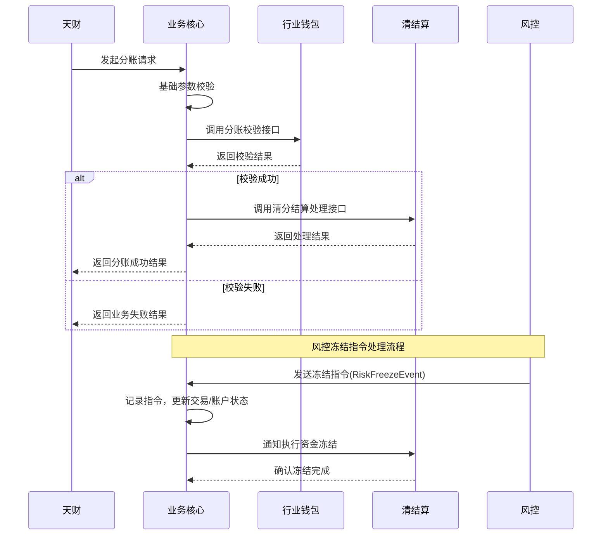
```mermaid
sequenceDiagram
    participant 天财
    participant 业务核心
    participant 行业钱包
    participant 清结算
    participant 风控

    天财->>业务核心: 发起分账请求
    业务核心->>业务核心: 基础参数校验
    业务核心->>行业钱包: 调用分账校验接口
    行业钱包-->>业务核心: 返回校验结果
    alt 校验成功
        业务核心->>清结算: 调用清分结算处理接口
        清结算-->>业务核心: 返回处理结果
        业务核心-->>天财: 返回分账成功结果
    else 校验失败
        业务核心-->>天财: 返回业务失败结果
    end

    Note over 风控,业务核心: 风控冻结指令处理流程
    风控->>业务核心: 发送冻结指令(RiskFreezeEvent)
    业务核心->>业务核心: 记录指令，更新交易/账户状态
    业务核心->>清结算: 通知执行资金冻结
    清结算-->>业务核心: 确认冻结完成
```

### 6. 错误处理
- **预期错误情况**: 请求参数错误、账户不存在、账户状态异常（如冻结）、账户余额不足、关系未绑定、下游系统服务不可用、网络超时。
- **处理策略**: 参数错误立即返回失败。业务规则错误（如余额不足）返回明确的业务错误码。下游系统依赖失败，根据错误类型决定是否可重试，并记录日志用于对账与人工干预。对于超时等暂时性故障，执行有限次重试。最终失败则记录至死信队列。

### 7. 依赖关系
- **上游模块**: 天财、风控
- **下游模块**: 行业钱包、清结算

<a id="module-14"></a>

## 3.14 钱包APP


### 1. 概述
- **目的与范围**: 钱包APP是面向商户的移动端应用。其核心职责是为商户提供账户信息展示、分账、提现等资金操作界面。本模块需根据商户的机构号属性，对天财新机构号动态隐藏或禁用提现等特定功能入口，以符合业务管控要求。
- **设计原则**: 前端界面状态由后端数据驱动，确保功能控制逻辑与后端业务规则一致。

### 2. 接口设计
- **API端点 (REST)**: 钱包APP通过调用后端服务提供的RESTful API获取数据与执行业务操作。主要依赖以下接口：
    1.  **账户信息查询接口** (`GET /api/v1/account/summary`): 用于获取当前登录商户的账户概览信息，包括账户类型、余额、状态及机构号属性。
    2.  **提现申请接口** (`POST /api/v1/withdrawal/apply`): 用于提交提现申请。
- **请求/响应结构**:
    - 账户信息查询响应示例：
        ```json
        {
          "code": 0,
          "msg": "success",
          "data": {
            "accountNo": "ACC20240001",
            "accountType": "天财收款账户",
            "balance": "1000.00",
            "status": "NORMAL",
            "institutionNo": "INS002", // 机构号
            "isNewTiancaiInstitution": true, // 是否为天财新机构号标识
            "features": {
              "canWithdraw": false,
              "canTransfer": true
            }
          }
        }
        ```
    - 提现申请请求示例：
        ```json
        {
          "amount": "500.00",
          "bankCardNo": "6217000010000001234"
        }
        ```
- **发布/消费的事件**: TBD

### 3. 数据模型
- **前端状态模型 (View Model)**: 钱包APP内部维护以下核心状态模型以驱动UI渲染。
    - `AccountState`: 账户状态
        - `accountNo` (String): 账户号
        - `accountType` (String): 账户类型（如“天财收款账户”）
        - `balance` (Decimal): 可用余额
        - `status` (String): 账户状态（NORMAL, FROZEN）
        - `institutionNo` (String): 机构号
        - `isNewTiancaiInstitution` (Boolean): 是否为天财新机构号
        - `features` (FeatureState): 功能可用性状态
    - `FeatureState`: 功能开关状态
        - `canWithdraw` (Boolean): 提现功能是否可用
        - `canTransfer` (Boolean): 转账/分账功能是否可用
- **数据持久化**: APP本地可缓存`AccountState`，用于启动时快速展示及网络异常时降级处理。缓存键为`current_account_{userId}`。
- **与其他模块的关系**: 前端数据模型映射自**行业钱包**与**账户系统**后端接口返回的DTO。

### 4. 业务逻辑
- **核心工作流**:
    1.  **启动与登录**: 用户登录后，APP调用账户信息查询接口，获取完整的账户信息与功能状态。
    2.  **状态判定与UI渲染**: 解析响应中的`isNewTiancaiInstitution`字段及`features`对象，据此控制各功能入口（如提现按钮）的显示（`display: none`）或交互状态（`disabled`）。
    3.  **操作拦截**: 在用户发起提现等受控操作前，再次校验本地`FeatureState`，若不可用则阻止请求发出并给出提示。
    4.  **状态同步**: 在APP切换到前台或用户手动下拉刷新时，重新调用账户信息查询接口，更新本地状态，确保功能控制与后端最新状态一致。
- **业务规则与验证**:
    - **天财新机构号判定规则**: 完全依赖后端接口返回的`isNewTiancaiInstitution`布尔值。该标识由**行业钱包**系统根据机构号配置的业务规则生成。
    - **UI控制逻辑**: UI组件（如按钮）的可见性与可用性绑定至`FeatureState`中的对应字段。例如：`提现按钮.visible = features.canWithdraw`。
    - **操作权限验证**: 所有涉及资金变动的操作（如提现），在调用后端API前，必须确保本地`features`中对应功能为`true`，并检查账户`status`为`NORMAL`。
- **关键边界情况处理**:
    - **初始数据加载失败**: 显示友好错误页，提供“重试”按钮。
    - **缓存数据过时**: 每次成功调用账户信息接口后，更新本地缓存。使用缓存数据时，需明确提示用户“数据可能不是最新的”。

### 5. 时序图

```mermaid
sequenceDiagram
    participant 商户
    participant 钱包APP
    participant 行业钱包
    participant 账户系统

    商户->>钱包APP: 启动/登录
    钱包APP->>行业钱包: GET /api/v1/account/summary
    行业钱包-->>钱包APP: 返回账户详情(含机构号、isNewTiancaiInstitution、features)
    钱包APP->>钱包APP: 解析响应，更新AccountState与FeatureState
    钱包APP->>钱包APP: 根据FeatureState渲染UI（如控制提现按钮）
    钱包APP-->>商户: 展示账户首页

    商户->>钱包APP: 点击提现按钮（假设可用）
    钱包APP->>钱包APP: 校验本地features.canWithdraw == true
    钱包APP->>账户系统: POST /api/v1/withdrawal/apply
    账户系统-->>钱包APP: 返回提现结果
    钱包APP-->>商户: 展示提现结果

    loop 定时/事件驱动刷新
        钱包APP->>行业钱包: GET /api/v1/account/summary (静默)
        行业钱包-->>钱包APP: 返回最新账户状态
        钱包APP->>钱包APP: 更新本地状态与UI
    end
```

### 6. 错误处理
- **预期错误情况与处理策略**:
    1.  **网络请求失败（超时、断开）**:
        - **策略**: 显示网络异常提示，并提供“重试”按钮。对于首页数据加载，可展示最后一次成功的缓存数据（若有）并标记为“缓存数据”。
    2.  **后端业务错误（HTTP 4xx/5xx）**:
        - **策略**: 解析响应体中的错误码和消息，向用户展示友好的业务提示。例如：`{“code”: “ACCOUNT_FROZEN”, “msg”: “账户已冻结，无法操作”}`。
    3.  **权限不足或功能禁用（如提现接口返回特定错误码）**:
        - **策略**: 提示用户“当前功能不可用”，并同步触发一次账户状态刷新，更新本地`FeatureState`。
    4.  **数据解析失败**:
        - **策略**: 记录日志，提示用户“数据加载异常，请稍后重试”。
- **降级方案**: 核心页面（如账户首页）在首次加载失败后，可尝试显示本地缓存的历史数据，并明确提示用户当前为离线状态。

### 7. 依赖关系
- **上游模块**:
    - **行业钱包**: 依赖其`/api/v1/account/summary`接口，获取决定UI状态的核心数据（机构号属性、功能开关）。
    - **账户系统**: 依赖其`/api/v1/withdrawal/apply`接口，执行提现资金操作。
- **下游模块**: TBD
- **隐式依赖**: 网络状态、用户登录态管理模块。

<a id="module-15"></a>

## 3.15 商服平台


### 1. 概述
- **目的与范围**: 本模块是面向商户的服务平台，核心职责是为商户提供账户管理、交易查询、对账单下载等服务。根据上下文，其特定职责包括对天财新机构号关闭提现等入口，并根据风控状态控制功能可用性。

### 2. 接口设计
- **API端点 (REST/GraphQL)**:
    - `GET /api/merchant/{merchantId}/profile`: 获取商户基本信息（含机构号、风控状态）。
    - `GET /api/merchant/{merchantId}/account`: 获取商户账户详情（余额、动账明细）。
    - `GET /api/merchant/{merchantId}/statements?date={date}&type={type}`: 获取对账单列表或下载链接。
    - `POST /api/merchant/{merchantId}/withdraw`: 发起提现申请（受业务规则控制）。
- **请求/响应结构**:
    - 商户信息响应示例：
        ```json
        {
          "merchantId": "string",
          "merchantName": "string",
          "institutionCodes": ["string"],
          "riskStatus": "NORMAL" | "FROZEN",
          "isNewTiancaiInstitution": boolean
        }
        ```
    - 账户详情响应示例：
        ```json
        {
          "accountNo": "string",
          "accountType": "天财收款账户" | "天财接收方账户",
          "balance": "number",
          "transactions": [...]
        }
        ```
- **发布/消费的事件**:
    - 消费事件：`MerchantRiskStatusChangedEvent` (来自风控模块)，用于更新本地缓存的商户风控状态。
    - 发布事件：TBD。

### 3. 数据模型
- **表/集合**:
    - `merchant_profile` (商户档案表): 存储商户核心信息。
    - `merchant_institution_mapping` (商户-机构映射表): 存储商户与机构号的关联关系。
    - `merchant_risk_cache` (商户风控状态缓存表): 缓存来自风控模块的最新状态。
- **关键字段**:
    - `merchant_profile`: `merchant_id` (主键), `merchant_name`, `status`。
    - `merchant_institution_mapping`: `id` (主键), `merchant_id`, `institution_code`, `institution_type`。
    - `merchant_risk_cache`: `merchant_id` (主键), `risk_status`, `freeze_reason`, `last_updated_time`。
- **与其他模块的关系**: 与业务核心（同步商户及机构信息）、账户系统（查询账户数据）、对账单系统（获取对账单）、风控（同步冻结状态）存在数据关联。

### 4. 业务逻辑
- **核心工作流/算法**: 主要业务流程包括商户登录、账户信息展示、交易明细查询、对账单下载与管理。关键业务逻辑是根据机构号类型（如天财新机构号）和风控状态控制前端功能入口（如提现）的显示与可用性。
- **业务规则与验证**:
    1.  **商户身份与权限验证**: 商户必须通过统一认证登录。商服平台根据登录令牌中的`merchantId`查询其信息。
    2.  **功能入口控制规则**:
        - **提现入口控制**: 当商户满足以下任一条件时，提现入口必须在前端界面关闭（置灰或隐藏）：
            - 商户关联的机构号列表中包含标记为“天财新机构号”的机构号。
            - 商户的风控状态为 `FROZEN`。
        - **其他功能控制**: 当商户风控状态为 `FROZEN` 时，所有资金转出类功能（如分账、转账）均应关闭。
    3.  **多机构号处理策略**: 若一个商户关联多个机构号，则采用“最严格”原则。即，只要关联的机构号列表中包含一个“天财新机构号”，则对该商户应用新机构号的限制策略（关闭提现入口）。
- **关键边界情况处理**: 当依赖服务（业务核心、风控）不可用时，使用本地最后已知的有效状态进行判断，并在界面上给出“服务暂不可用”的提示，而非直接开放受限功能。商户机构号信息为空时，默认采取保守策略，禁用敏感功能。

### 5. 时序图
```mermaid
sequenceDiagram
    participant 商户
    participant 商服平台
    participant 业务核心
    participant 账户系统
    participant 对账单系统
    participant 风控

    商户->>商服平台: 登录/访问主页
    商服平台->>业务核心: 查询商户信息（含机构号列表）
    业务核心-->>商服平台: 返回商户信息
    商服平台->>风控: 查询商户风控状态
    alt 风控服务正常
        风控-->>商服平台: 返回风控状态 (如 NORMAL)
    else 风控服务超时/失败
        商服平台->>商服平台: 读取本地缓存的风控状态
    end
    商服平台->>商服平台: 执行业务规则判断<br/>（是否新机构号？风控冻结？）
    商服平台-->>商户: 渲染主页（根据规则控制功能入口）

    商户->>商服平台: 请求查看账户详情
    商服平台->>账户系统: 查询账户余额及动账明细
    alt 账户服务正常
        账户系统-->>商服平台: 返回账户数据
        商服平台-->>商户: 渲染账户页面
    else 账户服务失败
        商服平台-->>商户: 显示“服务暂时不可用”提示
    end

    商户->>商服平台: 请求下载对账单
    商服平台->>对账单系统: 请求对账单文件
    对账单系统-->>商服平台: 返回对账单下载链接
    商服平台-->>商户: 重定向至下载链接
```

### 6. 错误处理
- **预期错误情况**:
    1.  依赖服务（业务核心、账户系统、风控、对账单系统）调用超时或失败。
    2.  获取到的商户机构号信息异常或为空。
    3.  风控状态查询失败，且本地无缓存。
    4.  前端页面渲染错误。
- **处理策略**:
    1.  对所有外部依赖调用设置合理的超时与重试机制（如最多重试1次）。
    2.  依赖服务失败时：
        - 对于风控状态查询，降级为使用本地缓存数据；若无缓存，则视为“状态未知”，并**保守地按冻结状态处理**，关闭资金转出功能，同时记录日志告警。
        - 对于账户、对账单等查询类服务，向用户展示友好的“服务暂不可用，请稍后重试”提示。
    3.  机构号信息异常或为空时，记录错误日志，并采用保守策略，默认禁用提现等敏感功能。
    4.  前端进行全局异常捕获，对组件渲染错误进行降级UI展示（如显示错误占位符）。

### 7. 依赖关系
- **上游模块**:
    - **业务核心**: 获取商户基本资料及其关联的机构号列表。强依赖，用于核心信息展示和规则判断。
    - **账户系统**: 获取账户余额、动账明细。强依赖，用于账户页面展示。
    - **对账单系统**: 获取交易、结算等对账单。强依赖，用于对账单下载。
    - **风控**: 获取商户冻结状态。强依赖，其状态直接影响功能入口的开关。
- **下游模块**:
    - **钱包APP**: 可能共享部分商户服务逻辑和接口。
    - **商户**: 直接用户。

<a id="module-16"></a>

## 3.16 交易系统


### 1. 概述
- **目的与范围**：本模块（在术语表中亦称为“业务核心”）负责接收并处理天财分账、归集、会员结算、批量付款等资金管理业务的请求。作为业务编排中枢，它负责参数校验、状态管理、流程协调，并调用下游系统完成资金处理。其边界始于接收业务请求，止于将处理结果通知相关系统。本模块不执行具体的账户资金操作、清分结算、计费及风控逻辑，但会调用相应系统完成这些操作。

### 2. 接口设计
- **API端点 (REST)**：
    - `POST /api/v1/transaction/split`：发起分账/转账。
    - `POST /api/v1/transaction/collection`：发起资金归集。
    - `POST /api/v1/transaction/member-settlement`：发起会员结算。
    - `POST /api/v1/transaction/batch-payment`：发起批量付款。
    - `GET /api/v1/transaction/{transactionId}`：查询交易状态。
- **请求/响应结构**：
    - 通用请求头包含：`X-Request-Id`（幂等键）、`X-App-Id`、`X-Org-Id`（机构号）。
    - 通用响应体包含：`code`、`message`、`data`（业务数据）、`requestId`。
    - 具体业务请求字段（示例为分账）：`payerAccountNo`（付款方账户）、`payeeAccountNo`（收款方账户）、`amount`（金额）、`feeBearer`（手续费承担方）、`transferMode`（转账模式：净额/全额）、`remark`（备注）。
- **发布/消费的事件**：
    - 消费事件：TBD（例如，监听账户状态变更、关系绑定完成等事件）。
    - 发布事件：交易创建事件、交易状态变更事件（如“处理成功”、“处理失败”）。

### 3. 数据模型
- **表/集合**：
    - `transaction_orders`：交易订单主表。
    - `transaction_steps`：交易处理步骤记录表。
- **关键字段**：
    - `transaction_orders`表：
        - `id`：主键。
        - `order_no`：业务订单号。
        - `request_id`：幂等请求ID。
        - `biz_type`：业务类型（分账、归集、会员结算、批量付款）。
        - `status`：订单状态（初始化、校验中、处理中、成功、失败、已冲正）。
        - `payer_info`：付款方信息（账户、名称、机构号）。
        - `payee_info`：收款方信息（账户、名称、机构号）。
        - `amount`：金额。
        - `fee_info`：手续费信息。
        - `relation_check_status`：关系绑定校验状态。
        - `risk_check_status`：风控检查状态。
        - `settlement_result`：清结算处理结果。
        - `created_at`， `updated_at`。
    - `transaction_steps`表：
        - `id`：主键。
        - `order_id`：关联订单ID。
        - `step_name`：步骤名称。
        - `step_status`：步骤状态。
        - `request_params`：请求参数。
        - `response_result`：响应结果。
        - `executed_at`：执行时间。
- **与其他模块的关系**：
    - 与**账户系统**：通过账户号关联，查询账户状态、类型及余额（仅校验用）。
    - 与**清结算**：通过业务订单号关联，驱动其完成资金处理编排。
    - 与**账务核心**：交易成功后，由清结算或账户系统触发记账。
    - 与**风控**：通过商户/交易信息关联，进行风险检查。

### 4. 业务逻辑
- **核心工作流/状态管理**：
    1.  **请求接收与幂等校验**：接收请求，检查`X-Request-Id`，避免重复处理。
    2.  **基础参数校验**：校验必填字段、格式、金额有效性。
    3.  **业务校验**：
        - 调用**账户系统**，校验付款方与收款方账户状态（是否存在、是否冻结、类型是否匹配）。
        - 调用**风控**，提交交易风控检查。
        - 校验业务关系绑定状态（需与**认证系统**、**电子签章系统**交互，确认签约与授权是否完成）。对于归集、会员结算、批量付款，需额外校验“开通付款”授权。
    4.  **预检查结果综合裁决**：汇总所有校验结果，决定是否继续处理或拒绝。
    5.  **调用清结算**：校验通过后，组装参数调用**清结算**系统执行资金处理编排（含冻结、计费、划转等）。
    6.  **结果处理与状态更新**：根据清结算返回结果，更新订单状态。成功则发布成功事件；失败则根据策略处理（如重试、标记失败、触发冲正）。
    7.  **异步通知**：将最终结果异步通知请求方（天财）。
- **关键业务规则**：
    - **关系绑定规则**：分账、归集等场景下，付款方与收款方必须已完成签约授权（关系绑定）。
    - **手续费规则**：根据`feeBearer`和`transferMode`，调用**计费中台**计算手续费（本模块透传参数，不计费）。
    - **并发与一致性**：使用数据库事务保证订单主表与步骤表的一致性。关键状态变更使用乐观锁。
- **边界情况处理**：
    - **账户余额不足**：在调用清结算前，依赖账户系统的余额校验结果。
    - **风控拦截**：风控检查返回拒绝时，流程终止，订单标记为“风控拒绝”。
    - **清结算处理失败**：根据返回的错误码决定重试（网络超时等可重试错误）或标记最终失败。

### 5. 时序图
```mermaid
sequenceDiagram
    participant 天财
    participant 交易系统
    participant 账户系统
    participant 风控
    participant 认证系统
    participant 电子签章系统
    participant 清结算

    天财->>交易系统: 发起分账请求(含RequestId)
    交易系统->>交易系统: 幂等校验
    交易系统->>交易系统: 基础参数校验
    交易系统->>账户系统: 查询付款/收款方账户状态
    账户系统-->>交易系统: 返回账户状态
    交易系统->>风控: 提交交易风控检查
    风控-->>交易系统: 返回风控结果
    交易系统->>认证系统: 查询关系绑定状态
    认证系统-->>交易系统: 返回绑定状态
    交易系统->>电子签章系统: 查询签约协议状态(如需)
    电子签章系统-->>交易系统: 返回签约状态
    交易系统->>交易系统: 综合校验裁决
    alt 校验失败
        交易系统-->>天财: 返回业务校验失败
    else 校验成功
        交易系统->>清结算: 调用分账处理
        清结算-->>交易系统: 返回处理结果
        交易系统->>交易系统: 更新订单状态
        交易系统-->>天财: 异步通知处理结果
    end
```

### 6. 错误处理
- **预期错误分类**：
    - **客户端错误 (4xx)**：参数缺失、格式错误、幂等键重复、业务校验不通过（账户异常、风控拒绝、关系未绑定）。
    - **服务器端错误 (5xx)**：依赖系统（账户、风控、清结算）服务不可用、超时、内部处理异常。
    - **业务处理失败**：清结算处理失败（余额不足、账户状态变更等）。
- **处理策略**：
    - **重试策略**：仅对依赖系统的网络超时、暂时性故障进行指数退避重试（最多3次）。业务逻辑错误不重试。
    - **幂等性**：通过`X-Request-Id`保证。相同请求ID，无论调用多少次，返回相同结果。
    - **补偿机制**：对于已调用清结算但最终失败的交易，若已发生资金冻结等中间状态，依赖清结算系统的冲正接口或对账机制进行补偿，本模块记录最终状态为“失败”或“已冲正”。
    - **状态明确**：订单状态定义清晰（初始化、校验中、处理中、成功、失败、已冲正），便于对账与排查。
    - **日志与监控**：记录所有关键步骤日志和错误详情，并接入监控告警。

### 7. 依赖关系
- **上游模块/依赖方**：
    - **账户系统**：查询账户状态、类型等基础信息。
    - **风控**：进行交易风险检查。
    - **认证系统**：验证关系绑定状态。
    - **电子签章系统**：验证电子协议签署状态。
    - **清结算**：执行最终的资金处理编排（冻结、计费、划转）。
    - **计费中台**：透传参数，由其计算手续费（通常由清结算调用）。
- **下游模块/被依赖方**：
    - **天财**：接收业务请求，并异步接收处理结果通知。
    - （其他可能监听本模块状态变更事件的系统，如对账单系统）

<a id="module-17"></a>

## 3.17 用户中心


### 1. 概述
- **目的与范围**: 本模块负责管理系统中所有用户实体的核心信息、认证状态、角色与权限关联以及账户绑定关系。其核心职责包括：用户身份信息的存储与维护、用户与机构/商户/账户的关联映射、用户认证状态的跟踪，并为其他模块提供统一的用户信息查询服务。其边界止于具体的业务逻辑（如开户、分账）和底层认证操作（如打款验证、人脸验证），仅提供基础数据支撑。

### 2. 接口设计
- **API端点 (REST)**:
    - `POST /users`: 创建或更新用户信息。
    - `GET /users/{userId}`: 查询用户基础信息。
    - `POST /users/{userId}/bindings/institutions`: 绑定用户与机构关系。
    - `POST /users/{userId}/bindings/merchants`: 绑定用户与商户关系。
    - `POST /users/{userId}/bindings/accounts`: 绑定用户与账户关系。
    - `PUT /users/{userId}/roles`: 分配或更新用户角色。
    - `GET /users/{userId}/authentication-records`: 查询用户认证记录。
    - `POST /users/{userId}/authentication-records`: 发起用户认证流程。

- **请求/响应结构**:
    - 创建用户请求体示例：
        ```json
        {
          "name": "张三",
          "idCardNo": "110101199003071234",
          "mobile": "13800138000"
        }
        ```
    - 用户信息响应体示例：
        ```json
        {
          "userId": "USR202310110001",
          "name": "张三",
          "idCardNo": "110101199003071234",
          "mobile": "13800138000",
          "status": "ACTIVE",
          "registerTime": "2023-10-11T10:00:00Z"
        }
        ```
    - 绑定关系响应体示例：
        ```json
        {
          "bindingId": "BIND202310110001",
          "userId": "USR202310110001",
          "targetId": "INS001",
          "targetType": "INSTITUTION",
          "bindTime": "2023-10-11T10:05:00Z"
        }
        ```

- **发布/消费的事件**:
    - **发布事件**:
        - `UserCreatedEvent`: 用户创建完成。
        - `UserBindingCompletedEvent`: 用户与机构/商户/账户绑定完成。
        - `UserRoleAssignedEvent`: 用户角色分配完成。
        - `UserAuthenticationCompletedEvent`: 用户认证完成。
    - **消费事件**:
        - `InstitutionCreatedEvent` (来自三代): 用于关联用户与机构。
        - `AccountOpenedEvent` (来自行业钱包): 用于关联用户与账户。
        - `AuthenticationSuccessEvent` (来自认证系统): 用于更新认证记录。
        - `ElectronicSignatureCompletedEvent` (来自电子签章系统): 用于更新认证记录中的协议信息。

### 3. 数据模型
- **表/集合**:
    1.  `用户信息表`：存储用户基础身份信息。
    2.  `用户-机构关联表`：记录用户与天财机构号的绑定关系。
    3.  `用户-商户关联表`：记录用户与收单商户/非收单商户的绑定关系。
    4.  `用户-账户关联表`：记录用户与天财收款账户/天财接收方账户的绑定关系。
    5.  `用户角色表`：定义用户角色（如总部、门店、接收方）。
    6.  `用户-角色关联表`：记录用户与角色的分配关系。
    7.  `用户认证记录表`：记录用户完成的认证流程（如关系绑定、开通付款）及状态。

- **关键字段**:
    - `用户信息表`: 用户ID、姓名、身份证号、手机号、注册时间、状态。
    - `用户-机构关联表`: 关联ID、用户ID、机构号、关联类型、绑定时间。
    - `用户-商户关联表`: 关联ID、用户ID、商户号、商户类型（收单/非收单）、绑定时间。
    - `用户-账户关联表`: 关联ID、用户ID、账户号、账户类型（收款/接收方）、绑定时间。
    - `用户角色表`: 角色ID、角色名称（总部/门店/接收方）、描述。
    - `用户-角色关联表`: 关联ID、用户ID、角色ID、机构号（业务上下文）、生效时间、失效时间。
    - `用户认证记录表`: 记录ID、用户ID、认证类型（关系绑定/开通付款）、认证方式（打款验证/人脸验证/电子协议）、认证状态、完成时间、协议ID（若涉及）、过期时间。

- **与其他模块的关系**:
    - 与**行业钱包**关联：通过`用户-账户关联表`关联天财专用账户。
    - 与**三代**关联：通过`用户-机构关联表`关联机构号。
    - 与**业务核心**关联：消费来自业务核心的事件（如分账请求），并为其提供用户身份、角色及认证状态查询服务。
    - 与**认证系统**和**电子签章系统**关联：通过`用户认证记录表`同步认证结果。

### 4. 业务逻辑
- **核心工作流/算法**:
    1.  **用户注册与信息维护**：接收来自上游系统（如三代、钱包APP）的用户信息，创建或更新用户主记录。
    2.  **关联关系绑定**：当商户入网、账户开户或关系绑定时，创建或更新用户与机构、商户、账户的关联记录。
    3.  **角色分配**：根据业务场景（如品牌与门店架构、分账场景）为用户分配“总部”、“门店”或“接收方”角色。
    4.  **认证状态同步**：监听或接收来自认证系统、电子签章系统的认证完成事件，更新相应用户的认证记录状态。
    5.  **认证过期处理**：定时任务扫描`用户认证记录表`，对过期的认证记录进行状态标记，并触发重新认证流程。

- **业务规则与验证**:
    - 一个用户可以关联多个机构号、商户号和账户。
    - 一个用户在同一个机构号（业务上下文）下，只能被分配一个有效角色（总部或门店或接收方）。此规则是确定性的，分配新角色会使旧角色失效。
    - 进行关键操作（如作为付方发起分账）前，需校验用户是否已完成必要的认证（如“开通付款”）且认证记录未过期。
    - 用户基础信息（如身份证号、手机号）需满足基本的格式与有效性校验。

- **关键边界情况处理**:
    - **用户重复注册**：以身份证号作为核心去重标识。当收到创建用户请求时，优先通过身份证号查询。若存在，则更新现有用户信息（如手机号）并返回现有用户ID；若业务要求严格隔离，则拒绝创建并返回错误。
    - **关联关系冲突**：如同一用户在同一机构号下被尝试同时绑定为总部和门店角色，根据“一个用户在同一业务上下文中只能有一个有效角色”的规则，拒绝新的绑定请求并返回错误。
    - **认证信息过期**：`用户认证记录表`中的每条记录均设有`过期时间`字段。过期后，该记录状态标记为“EXPIRED”。当业务校验认证状态时，仅认可状态为“SUCCESS”且未过期的记录。过期触发后，需引导用户重新发起完整认证流程。

### 5. 时序图

```mermaid
sequenceDiagram
    participant A as 三代/业务核心
    participant UC as 用户中心
    participant AS as 认证系统
    participant ES as 电子签章系统

    A->>UC: 请求创建用户并绑定机构
    UC->>UC: 校验用户信息，处理重复注册
    UC->>UC: 创建用户记录
    UC->>UC: 创建用户-机构关联记录
    UC-->>A: 返回用户ID及绑定结果

    A->>UC: 请求为用户发起“关系绑定”认证
    UC->>UC: 创建“关系绑定”认证记录(状态:处理中)
    UC->>AS: 调用打款验证
    AS-->>UC: 返回验证流水号
    UC-->>A: 返回认证流程已发起

    Note over AS: 异步执行打款并等待回填
    AS->>UC: 发送AuthenticationSuccessEvent(用户ID，认证类型)
    UC->>UC: 更新认证记录状态为“成功”
    UC->>A: 发布UserAuthenticationCompletedEvent

    Note over A,ES: 异步电子签章流程
    A->>ES: 根据事件，请求生成并签署电子协议
    ES->>ES: 异步处理签署
    ES->>UC: 发送ElectronicSignatureCompletedEvent(协议ID，用户ID)
    UC->>UC: 更新对应认证记录的协议ID
```

### 6. 错误处理
- **预期错误情况与错误码**:
    - `USER_INFO_INVALID` (400): 用户信息不合法（如身份证格式错误、手机号格式错误）。
    - `USER_ALREADY_EXISTS` (409): 尝试创建已存在的用户（根据业务规则选择拒绝时）。
    - `TARGET_NOT_FOUND` (404): 尝试绑定不存在的机构号、商户号或账户号。
    - `DUPLICATE_BINDING` (409): 重复绑定已存在且状态有效的关系。
    - `ROLE_CONFLICT` (409): 在同一业务上下文（机构号）下分配冲突的角色。
    - `AUTHENTICATION_REQUIRED` (403): 用户未完成必要认证或认证已过期。
    - `DEPENDENCY_SERVICE_UNAVAILABLE` (503): 依赖模块（如认证系统、电子签章系统）服务不可用。
    - `USER_NOT_FOUND` (404): 查询的用户不存在。

- **处理策略**:
    - 输入参数校验失败立即返回对应错误码和描述，告知调用方具体原因。
    - 对于依赖服务（认证系统、电子签章系统）的调用失败，采用指数退避策略进行重试（最大重试次数：3次）。若最终失败，则将业务状态（如认证记录）更新为“FAILED”，记录详细错误日志，并触发告警通知运维人员。
    - 所有未捕获的异常将被记录为系统错误日志，对外返回统一的`INTERNAL_SERVER_ERROR` (500)，并触发紧急告警。

### 7. 依赖关系
- **上游模块/数据源**:
    - **三代**：提供机构号及商户信息，触发用户创建与关联（通过事件或API调用）。
    - **行业钱包**：提供账户信息，触发用户与账户关联（通过事件）。
    - **认证系统**：提供认证结果（通过事件）。
    - **电子签章系统**：提供协议签署结果（通过事件）。
- **下游模块/消费者**:
    - **业务核心**：消费用户中心发布的`UserAuthenticationCompletedEvent`等事件，并通过API查询用户信息、角色及有效的认证状态以处理分账等业务。
    - **风控**：通过API查询用户关联信息（如关联的商户、账户）用于风险判定。
    - **清结算**：可能通过API查询用户角色信息以进行差异化结算处理。

<a id="module-18"></a>

## 3.18 代付通道


### 1. 概述
- **目的与范围**: 本模块负责处理向外部银行账户进行代付出款的业务逻辑。其核心职责是接收出款请求，通过银行或支付通道完成资金划转，并处理出款结果的通知与状态同步。模块边界止于向外部银行发起支付指令及接收其异步回调。

### 2. 接口设计
- **API端点 (REST/GraphQL)**:
    - `POST /api/v1/disburse/orders`: 创建代付订单。
    - `GET /api/v1/disburse/orders/{order_id}`: 查询代付订单状态。
    - `POST /api/v1/disburse/callback/{channel_code}`: 接收外部通道的异步回调（通道专用）。
- **请求/响应结构**:
    - 创建代付订单请求体:
        - `request_id` (string): 请求唯一标识，用于幂等。
        - `merchant_id` (string): 商户标识。
        - `amount` (number): 出款金额。
        - `currency` (string): 币种。
        - `beneficiary_bank_code` (string): 收款方银行编码。
        - `beneficiary_account_no` (string): 收款方银行账号。
        - `beneficiary_name` (string): 收款方姓名。
        - `remark` (string): 附言。
    - 创建代付订单响应体:
        - `code` (string): 响应码。
        - `message` (string): 响应信息。
        - `data`: `{ "order_id": string, "status": string }`
    - 异步回调请求体: TBD (由外部通道定义)。
- **发布/消费的事件**:
    - 消费事件: `DisburseRequestCreated` (由业务核心发布，触发代付流程)。
    - 发布事件: `DisburseResultNotified` (代付最终结果，通知业务核心)。

### 3. 数据模型
- **表/集合**:
    - `disburse_order` (代付订单表)
- **关键字段**:
    - `order_id` (string, PK): 代付订单唯一标识。
    - `request_id` (string, UK): 上游请求ID，用于幂等。
    - `merchant_id` (string): 商户ID。
    - `amount` (decimal): 出款金额。
    - `currency` (string): 币种。
    - `beneficiary_bank_code` (string): 收款银行编码。
    - `beneficiary_account_no` (string): 收款账号。
    - `beneficiary_name` (string): 收款户名。
    - `channel_code` (string): 使用的代付通道编码。
    - `status` (string): 订单状态 (PENDING, PROCESSING, SUCCESS, FAILED, BANK_BOUNCE)。
    - `channel_request` (text): 发送给通道的原始请求。
    - `channel_response` (text): 通道的原始响应。
    - `fail_reason` (text): 失败原因。
    - `retry_count` (int): 重试次数。
    - `next_retry_at` (datetime): 下次重试时间。
    - `created_at` (datetime): 创建时间。
    - `updated_at` (datetime): 更新时间。
- **与其他模块的关系**:
    - 通过 `merchant_id` 与商户体系关联。
    - 通过消费/发布事件与业务核心交互。

### 4. 业务逻辑
- **核心工作流/算法**:
    1.  **请求接收与幂等**: 接收 `DisburseRequestCreated` 事件或API请求，通过 `request_id` 检查幂等，防止重复处理。
    2.  **参数校验与风控**:
        - 校验必填字段、金额格式与范围。
        - 校验收款方银行账户信息（卡BIN、户名校验）。
        - 校验商户状态与出款权限。
        - 调用风控系统进行交易风险评估（TBD）。
    3.  **通道选择**: 根据商户配置、金额、银行代码等因素选择最优代付通道（策略TBD）。
    4.  **状态机管理**: 订单状态遵循 `PENDING` -> `PROCESSING` -> (`SUCCESS` / `FAILED` / `BANK_BOUNCE`) 的流转。`PENDING` 为初始态，`PROCESSING` 为已提交通道，终态由回调或查询决定。
    5.  **调用通道与异步处理**: 调用选定通道的出款接口，记录请求响应。若通道返回受理成功，状态置为 `PROCESSING` 并进入异步等待。若通道即时返回失败，状态置为 `FAILED`。
    6.  **结果同步**:
        - **回调处理**: 接收通道异步回调，验证签名，更新订单状态为终态（`SUCCESS`/`FAILED`）。
        - **主动查询补偿**: 对于未及时收到回调的订单，启动定时任务轮询通道查询接口，同步最终状态。
    7.  **结果通知**: 订单达到终态后，发布 `DisburseResultNotified` 事件，通知业务核心。
- **业务规则与验证**:
    - 出款时间限制：仅在工作日及通道规定时间内处理（TBD）。
    - 单笔/单日限额校验（TBD）。
    - 收款账户黑名单校验（TBD）。
- **关键边界情况处理**:
    - **重试机制**: 针对通道调用网络超时等可重试错误，采用指数退避策略，最大重试次数为3次。重试间隔：5s, 30s, 5min。
    - **银行退票处理**: 通道回调或对账发现银行退票时，订单状态更新为 `BANK_BOUNCE`，记录退票原因，并通知业务核心。
    - **对账与差错处理**: 每日与各代付通道进行资金对账，发现长款、短款或状态不一致时，生成差错单，触发人工干预流程（TBD）。
    - **人工干预**: 对于多次重试失败、状态不明或需紧急止付的订单，提供管理界面供运营人员查询与手动处理。

### 5. 时序图
```mermaid
sequenceDiagram
    participant 业务核心
    participant 代付通道模块
    participant 风控
    participant 代付通道DB
    participant 外部银行通道

    业务核心->>代付通道模块: 发布DisburseRequestCreated事件
    代付通道模块->>代付通道DB: 根据request_id查询幂等
    代付通道DB-->>代付通道模块: 返回订单记录(或无)
    alt 订单已存在
        代付通道模块-->>业务核心: 返回已受理(幂等)
    else 新订单
        代付通道模块->>代付通道模块: 参数校验
        代付通道模块->>风控: 风控检查(可选)
        风控-->>代付通道模块: 风控结果
        代付通道模块->>代付通道模块: 选择代付通道
        代付通道模块->>代付通道DB: 创建订单(status=PENDING)
        代付通道模块->>外部银行通道: 调用出款接口
        外部银行通道-->>代付通道模块: 返回受理结果
        代付通道模块->>代付通道DB: 更新订单(status=PROCESSING)
        代付通道模块-->>业务核心: 返回受理成功
        par 异步回调
            外部银行通道-->>代付通道模块: 异步回调出款结果
            代付通道模块->>代付通道模块: 验证回调签名
            代付通道模块->>代付通道DB: 更新订单为终态(SUCCESS/FAILED)
            代付通道模块->>业务核心: 发布DisburseResultNotified事件
        and 主动查询补偿
            代付通道模块->>外部银行通道: 定时查询订单状态
            外部银行通道-->>代付通道模块: 返回订单状态
            代付通道模块->>代付通道DB: 更新订单为终态(SUCCESS/FAILED)
            代付通道模块->>业务核心: 发布DisburseResultNotified事件
        end
    end
```

### 6. 错误处理
- **预期错误情况**:
    - **参数校验失败**: 如金额格式错误、必填字段缺失、账户信息无效。
    - **业务规则失败**: 如商户无权限、余额不足、超出限额。
    - **通道技术失败**: 如网络超时、连接拒绝、通道系统异常。
    - **通道业务失败**: 如通道返回账户不存在、账户已注销、交易拒绝。
    - **银行退票**: 资金已划出但被收款银行退回。
- **处理策略**:
    - **参数/业务失败**: 立即失败，更新订单状态为 `FAILED`，记录具体原因，不重试。
    - **通道技术失败**: 触发自动重试机制（指数退避，最多3次）。重试耗尽后状态置为 `FAILED`，并标记需人工排查。
    - **通道业务失败**: 立即失败，状态置为 `FAILED`，记录通道返回的错误码和原因。
    - **银行退票**: 状态置为 `BANK_BOUNCE`，记录退票原因，通知业务核心进行后续处理（如重新出款或退款）。
    - **状态未知**: 通过主动查询补偿流程获取最终状态。若长时间无法获取，触发人工干预告警。

### 7. 依赖关系
- **上游模块**:
    - **业务核心**: 发布 `DisburseRequestCreated` 事件，触发代付流程；消费 `DisburseResultNotified` 事件，获取最终出款结果。
- **下游模块**:
    - **风控**: 提供交易风险检查接口（TBD）。
    - **通知系统**: 发送代付成功/失败的通知给相关方（TBD）。
    - **账务核心**: 代付成功时，需驱动账务核心进行相应的资金扣减记账（TBD，依赖具体资金链路设计）。

---
# 4 接口设计
## 4.1 对外接口
系统对外部业务方（如天财、三代）暴露的接口。

| Method | Path | Module | Description | Request/Response |
| :--- | :--- | :--- | :--- | :--- |
| POST | /api/v1/fund/allocate | 天财 | 发起分账请求 | TBD |
| POST | /api/v1/fund/member-settlement | 天财 | 发起会员结算请求 | TBD |
| POST | /api/v1/fund/batch-payment | 天财 | 发起批量付款请求 | TBD |
| GET | /api/v1/fund/requests/{request_id} | 天财 | 查询业务请求状态 | TBD |
| POST | /api/v1/fund/requests/{request_id}/retry | 天财 | 重试指定请求 | TBD |
| POST | /api/v1/merchant/onboarding | 三代 | 接收商户入网及天财业务开通申请 | TBD |
| POST | /api/v1/merchant/audit | 三代 | 提交商户资质审核结果 | TBD |
| GET | /api/v1/agency/number/{merchantId} | 三代 | 查询商户分配的机构号 | TBD |
| POST | /api/v1/sync/agency-info | 三代 | 手动触发机构号信息同步 | TBD |
| GET | /api/v1/account/summary | 钱包APP | 获取当前登录商户的账户概览信息 | TBD |
| POST | /api/v1/withdrawal/apply | 钱包APP | 提交提现申请 | TBD |
| GET | /api/merchant/{merchantId}/profile | 商服平台 | 获取商户基本信息（含机构号、风控状态） | TBD |
| GET | /api/merchant/{merchantId}/account | 商服平台 | 获取商户账户详情（余额、动账明细） | TBD |
| GET | /api/merchant/{merchantId}/statements?date={date}&type={type} | 商服平台 | 获取对账单列表或下载链接 | TBD |
| POST | /api/merchant/{merchantId}/withdraw | 商服平台 | 发起提现申请（受业务规则控制） | TBD |

## 4.2 模块间接口
系统内部各模块之间调用的接口。

| Method | Path | Module | Description | Request/Response |
| :--- | :--- | :--- | :--- | :--- |
| POST | /api/v1/account/open | 行业钱包 | 开户接口。接收来自业务核心的开户请求 | TBD |
| POST | /api/v1/binding/initiate | 行业钱包 | 关系绑定发起接口。接收绑定请求 | TBD |
| POST | /api/v1/transfer/request | 行业钱包 | 分账请求接口。接收天财的分账请求 | TBD |
| GET | /api/v1/account/{accountId}/status | 行业钱包 | 账户状态查询接口 | TBD |
| GET | /api/v1/binding/{bindingId}/status | 行业钱包 | 关系绑定状态查询接口 | TBD |
| POST | /api/v1/accounts | 账户系统 | 开立账户 | TBD |
| PUT | /api/v1/accounts/{accountNo}/upgrade | 账户系统 | 升级账户 | TBD |
| POST | /api/v1/accounts/{accountNo}/actions/debit | 账户系统 | 执行扣款 | TBD |
| POST | /api/v1/accounts/{accountNo}/actions/credit | 账户系统 | 执行加款 | TBD |
| POST | /api/v1/accounts/{accountNo}/actions/freeze | 账户系统 | 执行资金冻结 | TBD |
| POST | /api/v1/accounts/{accountNo}/actions/unfreeze | 账户系统 | 执行资金解冻 | TBD |
| GET | /api/v1/accounts/{accountNo}/balance | 账户系统 | 查询账户余额 | TBD |
| POST | /api/v1/journal/entries | 账务核心 | 接收记账请求，创建会计分录 | TBD |
| GET | /api/v1/journal/entries/{request_id} | 账务核心 | 根据请求ID查询记账结果 | TBD |
| POST | /api/v1/disburse | 代付系统 | 接收代付指令 | TBD |
| GET | /api/v1/disburse/{orderNo}/status | 代付系统 | 查询代付单状态 | TBD |
| POST | /api/v1/disburse/callback | 代付系统 | 接收银行通道异步回调 | TBD |
| POST | /api/v1/verification/payment | 认证系统 | 发起打款验证 | TBD |
| POST | /api/v1/verification/face | 认证系统 | 发起人脸验证 | TBD |
| POST | /api/v1/verification/confirm | 认证系统 | 提交验证信息进行确认 | TBD |
| GET | /api/v1/verification/record/{id} | 认证系统 | 查询验证记录状态 | TBD |
| POST | /v1/agreement/initiate | 电子签章系统 | 接收签约请求，发起签约流程 | TBD |
| GET | /v1/agreement/{agreementId}/status | 电子签章系统 | 查询指定协议的签署状态 | TBD |
| POST | /v1/agreement/{agreementId}/resend-sms | 电子签章系统 | 重新发送签约短信 | TBD |
| POST | /v1/h5/sign/verify | 电子签章系统 | H5页面调用的身份验证接口 | TBD |
| POST | /v1/h5/sign/confirm | 电子签章系统 | H5页面调用的最终签署确认接口 | TBD |
| POST | /api/v1/fee/calculate | 计费中台 | 接收计费请求，计算手续费并返回结果 | TBD |
| POST | /api/v1/statements/generate | 对账单系统 | 触发按需生成对账单 | TBD |
| GET | /api/v1/statements | 对账单系统 | 查询对账单列表 | TBD |
| GET | /api/v1/statements/{statementId}/download | 对账单系统 | 下载对账单文件 | TBD |
| POST | /api/v1/tiancai/split | 业务核心 | 处理天财分账请求 | TBD |
| POST | /api/v1/tiancai/member-settlement | 业务核心 | 处理会员结算请求 | TBD |
| POST | /api/v1/tiancai/batch-payment | 业务核心 | 处理批量付款请求 | TBD |
| POST | /api/internal/risk/freeze | 业务核心 | 接收风控系统发起的账户冻结指令 | TBD |
| POST | /api/v1/transaction/split | 交易系统 | 发起分账/转账 | TBD |
| POST | /api/v1/transaction/collection | 交易系统 | 发起资金归集 | TBD |
| POST | /api/v1/transaction/member-settlement | 交易系统 | 发起会员结算 | TBD |
| POST | /api/v1/transaction/batch-payment | 交易系统 | 发起批量付款 | TBD |
| GET | /api/v1/transaction/{transactionId} | 交易系统 | 查询交易状态 | TBD |
| POST | /users | 用户中心 | 创建或更新用户信息 | TBD |
| GET | /users/{userId} | 用户中心 | 查询用户基础信息 | TBD |
| POST | /users/{userId}/bindings/institutions | 用户中心 | 绑定用户与机构关系 | TBD |
| POST | /users/{userId}/bindings/merchants | 用户中心 | 绑定用户与商户关系 | TBD |
| POST | /users/{userId}/bindings/accounts | 用户中心 | 绑定用户与账户关系 | TBD |
| PUT | /users/{userId}/roles | 用户中心 | 分配或更新用户角色 | TBD |
| GET | /users/{userId}/authentication-records | 用户中心 | 查询用户认证记录 | TBD |
| POST | /users/{userId}/authentication-records | 用户中心 | 发起用户认证流程 | TBD |
| POST | /api/v1/disburse/orders | 代付通道 | 创建代付订单 | TBD |
| GET | /api/v1/disburse/orders/{order_id} | 代付通道 | 查询代付订单状态 | TBD |
| POST | /api/v1/disburse/callback/{channel_code} | 代付通道 | 接收外部通道的异步回调 | TBD |
---
# 5 数据库设计
## 5.1 ER图
```mermaid
erDiagram
    fund_request {
        string request_id PK
        string business_type
        string status
        string request_data
        string response_data
        datetime created_at
        datetime updated_at
    }
    request_retry_log {
        string log_id PK
        string request_id FK
        int retry_count
        string retry_result
        datetime retry_time
    }
    merchant_application {
        string application_id PK
        string merchant_id
        string application_type
        string status
        datetime applied_at
        datetime audited_at
    }
    agency_allocation {
        string allocation_id PK
        string merchant_id FK
        string agency_number
        datetime allocated_at
    }
    sync_log {
        string log_id PK
        string target_system
        string sync_type
        string data_id
        string status
        datetime synced_at
    }
    wallet_accounts {
        string account_id PK
        string account_no FK
        string account_type
        string merchant_id
        string agency_number
        string status
    }
    authorization_bindings {
        string binding_id PK
        string payer_account_id FK
        string payee_account_id FK
        string binding_type
        string status
        datetime bound_at
    }
    transfer_requests {
        string request_id PK
        string payer_account_id FK
        string payee_account_id FK
        decimal amount
        string status
        datetime requested_at
    }
    settlement_record {
        string settlement_id PK
        string transaction_id FK
        string account_no FK
        decimal amount
        string settlement_mode
        string status
        datetime settled_at
    }
    fee_calculation {
        string calculation_id PK
        string request_id FK
        string fee_product_id
        decimal fee_amount
        string status
        datetime calculated_at
    }
    freeze_order {
        string freeze_id PK
        string account_no FK
        decimal amount
        string freeze_type
        string status
        datetime frozen_at
        datetime unfrozen_at
    }
    account_main {
        string account_no PK
        string account_type
        string user_id
        string status
        datetime opened_at
    }
    account_balance {
        string balance_id PK
        string account_no FK
        decimal available_balance
        decimal frozen_balance
        datetime updated_at
    }
    account_transaction_flow {
        string flow_id PK
        string account_no FK
        string transaction_type
        decimal amount
        string request_id FK
        datetime transacted_at
    }
    journal_entries {
        string entry_id PK
        string request_id FK
        string status
        datetime journaled_at
    }
    ledger_lines {
        string line_id PK
        string entry_id FK
        string account_no FK
        string dr_cr_flag
        decimal amount
    }
    disburse_order {
        string order_no PK
        string account_no FK
        string bank_account_no
        decimal amount
        string status
        datetime created_at
    }
    verification_records {
        string record_id PK
        string binding_id FK
        string verification_type
        string status
        datetime initiated_at
        datetime completed_at
    }
    agreement {
        string agreement_id PK
        string binding_id FK
        string template_id
        string status
        datetime initiated_at
        datetime signed_at
    }
    signatory {
        string signatory_id PK
        string agreement_id FK
        string user_id
        string role
        string status
    }
    evidence_log {
        string evidence_id PK
        string agreement_id FK
        string evidence_type
        string evidence_data
        datetime logged_at
    }
    sms_send_log {
        string log_id PK
        string agreement_id FK
        string phone_number
        string status
        datetime sent_at
    }
    fee_product {
        string product_id PK
        string product_name
        string fee_type
        string status
    }
    fee_rule {
        string rule_id PK
        string product_id FK
        decimal rate
        decimal min_fee
        decimal max_fee
    }
    fee_calculation_log {
        string log_id PK
        string request_id FK
        string product_id FK
        decimal calculated_fee
        datetime calculated_at
    }
    statement_metadata {
        string statement_id PK
        string merchant_id
        string statement_type
        string period
        string file_path
        datetime generated_at
    }
    generation_task_log {
        string task_id PK
        string statement_id FK
        string status
        datetime started_at
        datetime completed_at
    }
    tiancai_transaction {
        string transaction_id PK
        string request_id FK
        string business_type
        string status
        datetime created_at
    }
    freeze_instruction {
        string instruction_id PK
        string transaction_id FK
        string account_no FK
        string freeze_reason
        string status
        datetime instructed_at
    }
    transaction_orders {
        string transaction_id PK
        string business_type
        string status
        datetime created_at
    }
    transaction_steps {
        string step_id PK
        string transaction_id FK
        string step_name
        string status
        datetime executed_at
    }
    merchant_profile {
        string profile_id PK
        string merchant_id
        string agency_number
        string risk_status
    }
    merchant_institution_mapping {
        string mapping_id PK
        string merchant_id FK
        string agency_number
    }
    merchant_risk_cache {
        string cache_id PK
        string merchant_id FK
        string risk_status
        datetime updated_at
    }
    disburse_order {
        string order_id PK
        string account_no FK
        decimal amount
        string channel_code
        string status
        datetime created_at
    }

    fund_request ||--o{ request_retry_log : "retries"
    merchant_application ||--o{ agency_allocation : "allocates"
    wallet_accounts ||--o{ authorization_bindings : "as_payer"
    wallet_accounts ||--o{ authorization_bindings : "as_payee"
    wallet_accounts ||--o{ transfer_requests : "initiates"
    wallet_accounts ||--o{ transfer_requests : "receives"
    account_main ||--o{ wallet_accounts : "has_business_info"
    account_main ||--o{ account_balance : "has_balance"
    account_main ||--o{ account_transaction_flow : "has_flow"
    account_main ||--o{ settlement_record : "settles_to"
    account_main ||--o{ freeze_order : "frozen_from"
    account_main ||--o{ disburse_order : "withdraws_from"
    journal_entries ||--o{ ledger_lines : "contains"
    authorization_bindings ||--o{ verification_records : "verified_by"
    authorization_bindings ||--o{ agreement : "signed_by"
    agreement ||--o{ signatory : "has"
    agreement ||--o{ evidence_log : "evidenced_by"
    agreement ||--o{ sms_send_log : "notified_by"
    fee_product ||--o{ fee_rule : "defines"
    fee_product ||--o{ fee_calculation_log : "used_in"
    statement_metadata ||--o{ generation_task_log : "generated_by"
    tiancai_transaction ||--o{ freeze_instruction : "triggers"
    transaction_orders ||--o{ transaction_steps : "processed_by"
    merchant_profile ||--o{ merchant_institution_mapping : "mapped_to"
    merchant_profile ||--o{ merchant_risk_cache : "caches_risk"
```

## 5.2 表结构

| 表名 | 所属模块 | 主要字段 | 关联关系 |
| :--- | :--- | :--- | :--- |
| fund_request | 天财 | request_id (PK), business_type, status, request_data, response_data, created_at, updated_at | 与 request_retry_log 为一对多关系 |
| request_retry_log | 天财 | log_id (PK), request_id (FK), retry_count, retry_result, retry_time | 外键关联 fund_request.request_id |
| merchant_application | 三代 | application_id (PK), merchant_id, application_type, status, applied_at, audited_at | 与 agency_allocation 为一对多关系 |
| agency_allocation | 三代 | allocation_id (PK), merchant_id (FK), agency_number, allocated_at | 外键关联 merchant_application.merchant_id |
| sync_log | 三代 | log_id (PK), target_system, sync_type, data_id, status, synced_at | TBD |
| wallet_accounts | 行业钱包 | account_id (PK), account_no (FK), account_type, merchant_id, agency_number, status | 外键关联 account_main.account_no；与 authorization_bindings、transfer_requests 为一对多关系 |
| authorization_bindings | 行业钱包 | binding_id (PK), payer_account_id (FK), payee_account_id (FK), binding_type, status, bound_at | 外键关联 wallet_accounts.account_id；与 verification_records、agreement 为一对多关系 |
| transfer_requests | 行业钱包 | request_id (PK), payer_account_id (FK), payee_account_id (FK), amount, status, requested_at | 外键关联 wallet_accounts.account_id |
| settlement_record | 清结算 | settlement_id (PK), transaction_id (FK), account_no (FK), amount, settlement_mode, status, settled_at | 外键关联 account_main.account_no |
| fee_calculation | 清结算 | calculation_id (PK), request_id (FK), fee_product_id, fee_amount, status, calculated_at | TBD |
| freeze_order | 清结算 | freeze_id (PK), account_no (FK), amount, freeze_type, status, frozen_at, unfrozen_at | 外键关联 account_main.account_no |
| account_main | 账户系统 | account_no (PK), account_type, user_id, status, opened_at | 与 wallet_accounts、account_balance、account_transaction_flow、settlement_record、freeze_order、disburse_order 为一对多关系 |
| account_balance | 账户系统 | balance_id (PK), account_no (FK), available_balance, frozen_balance, updated_at | 外键关联 account_main.account_no |
| account_transaction_flow | 账户系统 | flow_id (PK), account_no (FK), transaction_type, amount, request_id (FK), transacted_at | 外键关联 account_main.account_no |
| journal_entries | 账务核心 | entry_id (PK), request_id (FK), status, journaled_at | 与 ledger_lines 为一对多关系 |
| ledger_lines | 账务核心 | line_id (PK), entry_id (FK), account_no (FK), dr_cr_flag, amount | 外键关联 journal_entries.entry_id 和 account_main.account_no |
| disburse_order | 代付系统 | order_no (PK), account_no (FK), bank_account_no, amount, status, created_at | 外键关联 account_main.account_no |
| verification_records | 认证系统 | record_id (PK), binding_id (FK), verification_type, status, initiated_at, completed_at | 外键关联 authorization_bindings.binding_id |
| agreement | 电子签章系统 | agreement_id (PK), binding_id (FK), template_id, status, initiated_at, signed_at | 外键关联 authorization_bindings.binding_id；与 signatory、evidence_log、sms_send_log 为一对多关系 |
| signatory | 电子签章系统 | signatory_id (PK), agreement_id (FK), user_id, role, status | 外键关联 agreement.agreement_id |
| evidence_log | 电子签章系统 | evidence_id (PK), agreement_id (FK), evidence_type, evidence_data, logged_at | 外键关联 agreement.agreement_id |
| sms_send_log | 电子签章系统 | log_id (PK), agreement_id (FK), phone_number, status, sent_at | 外键关联 agreement.agreement_id |
| fee_product | 计费中台 | product_id (PK), product_name, fee_type, status | 与 fee_rule、fee_calculation_log 为一对多关系 |
| fee_rule | 计费中台 | rule_id (PK), product_id (FK), rate, min_fee, max_fee | 外键关联 fee_product.product_id |
| fee_calculation_log | 计费中台 | log_id (PK), request_id (FK), product_id (FK), calculated_fee, calculated_at | 外键关联 fee_product.product_id |
| statement_metadata | 对账单系统 | statement_id (PK), merchant_id, statement_type, period, file_path, generated_at | 与 generation_task_log 为一对多关系 |
| generation_task_log | 对账单系统 | task_id (PK), statement_id (FK), status, started_at, completed_at | 外键关联 statement_metadata.statement_id |
| tiancai_transaction | 业务核心 | transaction_id (PK), request_id (FK), business_type, status, created_at | 与 freeze_instruction 为一对多关系 |
| freeze_instruction | 业务核心 | instruction_id (PK), transaction_id (FK), account_no (FK), freeze_reason, status, instructed_at | 外键关联 tiancai_transaction.transaction_id 和 account_main.account_no |
| transaction_orders | 交易系统 | transaction_id (PK), business_type, status, created_at | 与 transaction_steps 为一对多关系 |
| transaction_steps | 交易系统 | step_id (PK), transaction_id (FK), step_name, status, executed_at | 外键关联 transaction_orders.transaction_id |
| merchant_profile | 商服平台 | profile_id (PK), merchant_id, agency_number, risk_status | 与 merchant_institution_mapping、merchant_risk_cache 为一对多关系 |
| merchant_institution_mapping | 商服平台 | mapping_id (PK), merchant_id (FK), agency_number | 外键关联 merchant_profile.merchant_id |
| merchant_risk_cache | 商服平台 | cache_id (PK), merchant_id (FK), risk_status, updated_at | 外键关联 merchant_profile.merchant_id |
| disburse_order | 代付通道 | order_id (PK), account_no (FK), amount, channel_code, status, created_at | 外键关联 account_main.account_no |
| 用户信息表 | 用户中心 | TBD | TBD |
| 用户-机构关联表 | 用户中心 | TBD | TBD |
| 用户-商户关联表 | 用户中心 | TBD | TBD |
| 用户-账户关联表 | 用户中心 | TBD | TBD |
| 用户角色表 | 用户中心 | TBD | TBD |
| 用户-角色关联表 | 用户中心 | TBD | TBD |
| 用户认证记录表 | 用户中心 | TBD | TBD |