## 5.1 ER图

```mermaid
erDiagram
    fund_request {
        string request_id PK
        string business_type
        string status
        string request_data
        string response_data
        datetime created_at
        datetime updated_at
    }
    request_retry_log {
        string log_id PK
        string request_id FK
        int retry_count
        string retry_result
        datetime retry_time
    }
    merchant_application {
        string application_id PK
        string merchant_id
        string application_type
        string status
        datetime applied_at
        datetime audited_at
    }
    agency_allocation {
        string allocation_id PK
        string merchant_id FK
        string agency_number
        datetime allocated_at
    }
    sync_log {
        string log_id PK
        string target_system
        string sync_type
        string data_id
        string status
        datetime synced_at
    }
    wallet_accounts {
        string account_id PK
        string account_no FK
        string account_type
        string merchant_id
        string agency_number
        string status
    }
    authorization_bindings {
        string binding_id PK
        string payer_account_id FK
        string payee_account_id FK
        string binding_type
        string status
        datetime bound_at
    }
    transfer_requests {
        string request_id PK
        string payer_account_id FK
        string payee_account_id FK
        decimal amount
        string status
        datetime requested_at
    }
    settlement_record {
        string settlement_id PK
        string transaction_id FK
        string account_no FK
        decimal amount
        string settlement_mode
        string status
        datetime settled_at
    }
    fee_calculation {
        string calculation_id PK
        string request_id FK
        string fee_product_id
        decimal fee_amount
        string status
        datetime calculated_at
    }
    freeze_order {
        string freeze_id PK
        string account_no FK
        decimal amount
        string freeze_type
        string status
        datetime frozen_at
        datetime unfrozen_at
    }
    account_main {
        string account_no PK
        string account_type
        string user_id
        string status
        datetime opened_at
    }
    account_balance {
        string balance_id PK
        string account_no FK
        decimal available_balance
        decimal frozen_balance
        datetime updated_at
    }
    account_transaction_flow {
        string flow_id PK
        string account_no FK
        string transaction_type
        decimal amount
        string request_id FK
        datetime transacted_at
    }
    journal_entries {
        string entry_id PK
        string request_id FK
        string status
        datetime journaled_at
    }
    ledger_lines {
        string line_id PK
        string entry_id FK
        string account_no FK
        string dr_cr_flag
        decimal amount
    }
    disburse_order {
        string order_no PK
        string account_no FK
        string bank_account_no
        decimal amount
        string status
        datetime created_at
    }
    verification_records {
        string record_id PK
        string binding_id FK
        string verification_type
        string status
        datetime initiated_at
        datetime completed_at
    }
    agreement {
        string agreement_id PK
        string binding_id FK
        string template_id
        string status
        datetime initiated_at
        datetime signed_at
    }
    signatory {
        string signatory_id PK
        string agreement_id FK
        string user_id
        string role
        string status
    }
    evidence_log {
        string evidence_id PK
        string agreement_id FK
        string evidence_type
        string evidence_data
        datetime logged_at
    }
    sms_send_log {
        string log_id PK
        string agreement_id FK
        string phone_number
        string status
        datetime sent_at
    }
    fee_product {
        string product_id PK
        string product_name
        string fee_type
        string status
    }
    fee_rule {
        string rule_id PK
        string product_id FK
        decimal rate
        decimal min_fee
        decimal max_fee
    }
    fee_calculation_log {
        string log_id PK
        string request_id FK
        string product_id FK
        decimal calculated_fee
        datetime calculated_at
    }
    statement_metadata {
        string statement_id PK
        string merchant_id
        string statement_type
        string period
        string file_path
        datetime generated_at
    }
    generation_task_log {
        string task_id PK
        string statement_id FK
        string status
        datetime started_at
        datetime completed_at
    }
    tiancai_transaction {
        string transaction_id PK
        string request_id FK
        string business_type
        string status
        datetime created_at
    }
    freeze_instruction {
        string instruction_id PK
        string transaction_id FK
        string account_no FK
        string freeze_reason
        string status
        datetime instructed_at
    }
    transaction_orders {
        string transaction_id PK
        string business_type
        string status
        datetime created_at
    }
    transaction_steps {
        string step_id PK
        string transaction_id FK
        string step_name
        string status
        datetime executed_at
    }
    merchant_profile {
        string profile_id PK
        string merchant_id
        string agency_number
        string risk_status
    }
    merchant_institution_mapping {
        string mapping_id PK
        string merchant_id FK
        string agency_number
    }
    merchant_risk_cache {
        string cache_id PK
        string merchant_id FK
        string risk_status
        datetime updated_at
    }
    disburse_order {
        string order_id PK
        string account_no FK
        decimal amount
        string channel_code
        string status
        datetime created_at
    }

    fund_request ||--o{ request_retry_log : "retries"
    merchant_application ||--o{ agency_allocation : "allocates"
    wallet_accounts ||--o{ authorization_bindings : "as_payer"
    wallet_accounts ||--o{ authorization_bindings : "as_payee"
    wallet_accounts ||--o{ transfer_requests : "initiates"
    wallet_accounts ||--o{ transfer_requests : "receives"
    account_main ||--o{ wallet_accounts : "has_business_info"
    account_main ||--o{ account_balance : "has_balance"
    account_main ||--o{ account_transaction_flow : "has_flow"
    account_main ||--o{ settlement_record : "settles_to"
    account_main ||--o{ freeze_order : "frozen_from"
    account_main ||--o{ disburse_order : "withdraws_from"
    journal_entries ||--o{ ledger_lines : "contains"
    authorization_bindings ||--o{ verification_records : "verified_by"
    authorization_bindings ||--o{ agreement : "signed_by"
    agreement ||--o{ signatory : "has"
    agreement ||--o{ evidence_log : "evidenced_by"
    agreement ||--o{ sms_send_log : "notified_by"
    fee_product ||--o{ fee_rule : "defines"
    fee_product ||--o{ fee_calculation_log : "used_in"
    statement_metadata ||--o{ generation_task_log : "generated_by"
    tiancai_transaction ||--o{ freeze_instruction : "triggers"
    transaction_orders ||--o{ transaction_steps : "processed_by"
    merchant_profile ||--o{ merchant_institution_mapping : "mapped_to"
    merchant_profile ||--o{ merchant_risk_cache : "caches_risk"
```

## 5.2 表结构

| 表名 | 所属模块 | 主要字段 | 关联关系 |
| :--- | :--- | :--- | :--- |
| fund_request | 天财 | request_id (PK), business_type, status, request_data, response_data, created_at, updated_at | 与 request_retry_log 为一对多关系 |
| request_retry_log | 天财 | log_id (PK), request_id (FK), retry_count, retry_result, retry_time | 外键关联 fund_request.request_id |
| merchant_application | 三代 | application_id (PK), merchant_id, application_type, status, applied_at, audited_at | 与 agency_allocation 为一对多关系 |
| agency_allocation | 三代 | allocation_id (PK), merchant_id (FK), agency_number, allocated_at | 外键关联 merchant_application.merchant_id |
| sync_log | 三代 | log_id (PK), target_system, sync_type, data_id, status, synced_at | TBD |
| wallet_accounts | 行业钱包 | account_id (PK), account_no (FK), account_type, merchant_id, agency_number, status | 外键关联 account_main.account_no；与 authorization_bindings、transfer_requests 为一对多关系 |
| authorization_bindings | 行业钱包 | binding_id (PK), payer_account_id (FK), payee_account_id (FK), binding_type, status, bound_at | 外键关联 wallet_accounts.account_id；与 verification_records、agreement 为一对多关系 |
| transfer_requests | 行业钱包 | request_id (PK), payer_account_id (FK), payee_account_id (FK), amount, status, requested_at | 外键关联 wallet_accounts.account_id |
| settlement_record | 清结算 | settlement_id (PK), transaction_id (FK), account_no (FK), amount, settlement_mode, status, settled_at | 外键关联 account_main.account_no |
| fee_calculation | 清结算 | calculation_id (PK), request_id (FK), fee_product_id, fee_amount, status, calculated_at | TBD |
| freeze_order | 清结算 | freeze_id (PK), account_no (FK), amount, freeze_type, status, frozen_at, unfrozen_at | 外键关联 account_main.account_no |
| account_main | 账户系统 | account_no (PK), account_type, user_id, status, opened_at | 与 wallet_accounts、account_balance、account_transaction_flow、settlement_record、freeze_order、disburse_order 为一对多关系 |
| account_balance | 账户系统 | balance_id (PK), account_no (FK), available_balance, frozen_balance, updated_at | 外键关联 account_main.account_no |
| account_transaction_flow | 账户系统 | flow_id (PK), account_no (FK), transaction_type, amount, request_id (FK), transacted_at | 外键关联 account_main.account_no |
| journal_entries | 账务核心 | entry_id (PK), request_id (FK), status, journaled_at | 与 ledger_lines 为一对多关系 |
| ledger_lines | 账务核心 | line_id (PK), entry_id (FK), account_no (FK), dr_cr_flag, amount | 外键关联 journal_entries.entry_id 和 account_main.account_no |
| disburse_order | 代付系统 | order_no (PK), account_no (FK), bank_account_no, amount, status, created_at | 外键关联 account_main.account_no |
| verification_records | 认证系统 | record_id (PK), binding_id (FK), verification_type, status, initiated_at, completed_at | 外键关联 authorization_bindings.binding_id |
| agreement | 电子签章系统 | agreement_id (PK), binding_id (FK), template_id, status, initiated_at, signed_at | 外键关联 authorization_bindings.binding_id；与 signatory、evidence_log、sms_send_log 为一对多关系 |
| signatory | 电子签章系统 | signatory_id (PK), agreement_id (FK), user_id, role, status | 外键关联 agreement.agreement_id |
| evidence_log | 电子签章系统 | evidence_id (PK), agreement_id (FK), evidence_type, evidence_data, logged_at | 外键关联 agreement.agreement_id |
| sms_send_log | 电子签章系统 | log_id (PK), agreement_id (FK), phone_number, status, sent_at | 外键关联 agreement.agreement_id |
| fee_product | 计费中台 | product_id (PK), product_name, fee_type, status | 与 fee_rule、fee_calculation_log 为一对多关系 |
| fee_rule | 计费中台 | rule_id (PK), product_id (FK), rate, min_fee, max_fee | 外键关联 fee_product.product_id |
| fee_calculation_log | 计费中台 | log_id (PK), request_id (FK), product_id (FK), calculated_fee, calculated_at | 外键关联 fee_product.product_id |
| statement_metadata | 对账单系统 | statement_id (PK), merchant_id, statement_type, period, file_path, generated_at | 与 generation_task_log 为一对多关系 |
| generation_task_log | 对账单系统 | task_id (PK), statement_id (FK), status, started_at, completed_at | 外键关联 statement_metadata.statement_id |
| tiancai_transaction | 业务核心 | transaction_id (PK), request_id (FK), business_type, status, created_at | 与 freeze_instruction 为一对多关系 |
| freeze_instruction | 业务核心 | instruction_id (PK), transaction_id (FK), account_no (FK), freeze_reason, status, instructed_at | 外键关联 tiancai_transaction.transaction_id 和 account_main.account_no |
| transaction_orders | 交易系统 | transaction_id (PK), business_type, status, created_at | 与 transaction_steps 为一对多关系 |
| transaction_steps | 交易系统 | step_id (PK), transaction_id (FK), step_name, status, executed_at | 外键关联 transaction_orders.transaction_id |
| merchant_profile | 商服平台 | profile_id (PK), merchant_id, agency_number, risk_status | 与 merchant_institution_mapping、merchant_risk_cache 为一对多关系 |
| merchant_institution_mapping | 商服平台 | mapping_id (PK), merchant_id (FK), agency_number | 外键关联 merchant_profile.merchant_id |
| merchant_risk_cache | 商服平台 | cache_id (PK), merchant_id (FK), risk_status, updated_at | 外键关联 merchant_profile.merchant_id |
| disburse_order | 代付通道 | order_id (PK), account_no (FK), amount, channel_code, status, created_at | 外键关联 account_main.account_no |
| 用户信息表 | 用户中心 | TBD | TBD |
| 用户-机构关联表 | 用户中心 | TBD | TBD |
| 用户-商户关联表 | 用户中心 | TBD | TBD |
| 用户-账户关联表 | 用户中心 | TBD | TBD |
| 用户角色表 | 用户中心 | TBD | TBD |
| 用户-角色关联表 | 用户中心 | TBD | TBD |
| 用户认证记录表 | 用户中心 | TBD | TBD |