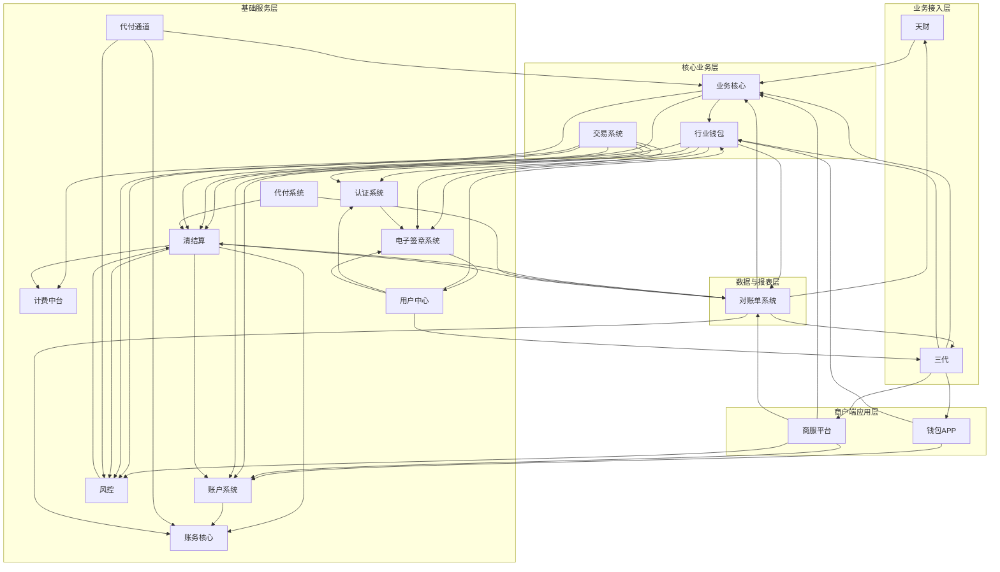
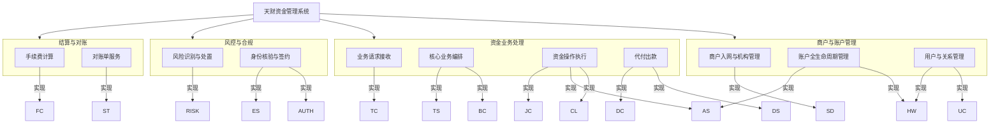
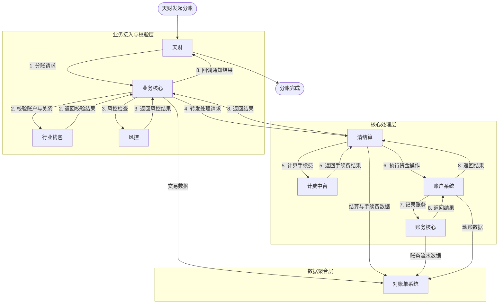
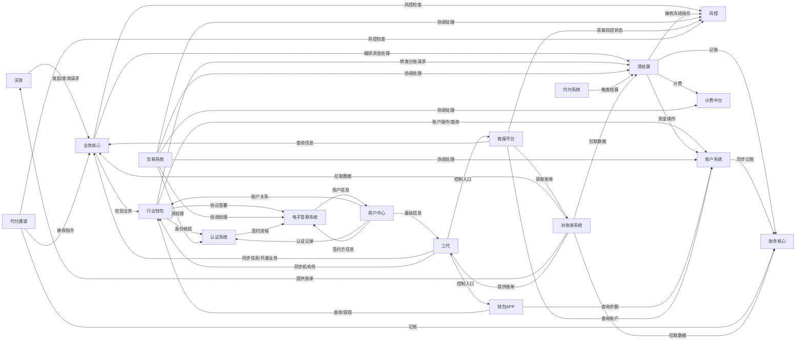

## 2.1 系统结构
本系统采用分层、模块化的微服务架构，旨在为“天财”业务提供专业的资金管理能力。整体架构遵循职责分离原则，由业务接入层、核心业务层、基础服务层和外部依赖层构成，各层通过定义清晰的API进行交互。

- **业务接入层**：包含“天财”和“三代”，作为外部业务方和运营方的统一入口，负责接收、校验业务请求，并进行异步结果管理。
- **核心业务层**：包含“业务核心”、“行业钱包”和“交易系统”，作为业务逻辑的编排与执行中心，负责处理开户、关系绑定、分账、结算等核心业务流程。
- **基础服务层**：包含“账户系统”、“清结算”、“账务核心”、“计费中台”、“风控”、“认证系统”、“电子签章系统”、“代付系统”、“代付通道”和“用户中心”，提供账户、资金、风控、认证等原子化、可复用的基础能力。
- **数据与报表层**：包含“对账单系统”，负责聚合各系统数据，生成并提供对账文件。
- **商户端应用层**：包含“钱包APP”和“商服平台”，为商户提供资金管理和信息查询的界面。

系统通过异步消息、事件驱动和API调用相结合的方式，确保高内聚、低耦合，支持高并发与弹性伸缩。

## 2.2 功能结构
系统功能围绕“天财资金管理”核心业务展开，主要划分为商户与账户管理、资金业务处理、风控与合规、结算与对账四大功能域。

1.  **商户与账户管理**
    *   **商户入网与机构管理**：由“三代”负责，完成商户资质审核、分配机构号、同步机构信息。
    *   **账户全生命周期管理**：由“行业钱包”和“账户系统”协同，实现天财专用账户（收款/接收方）的开立、升级、状态管理及余额查询。
    *   **用户与关系管理**：由“用户中心”统一管理用户身份，并与机构、商户、账户进行绑定。“行业钱包”负责处理收付款方之间的业务授权关系绑定。

2.  **资金业务处理**
    *   **业务请求接收**：由“天财”接收分账、会员结算、批量付款等原始请求。
    *   **核心业务编排**：“业务核心”和“交易系统”负责接收请求，协调“行业钱包”进行业务校验，并调用“清结算”执行资金处理。
    *   **资金操作执行**：“清结算”负责清分、结算、计费编排；“账户系统”执行具体的资金扣减、增加、冻结、解冻操作；“账务核心”记录所有资金变动的会计分录。
    *   **代付出款**：“代付系统”与“代付通道”协同，处理向外部银行账户的资金划转。

3.  **风控与合规**
    *   **风险识别与处置**：“风控”系统识别交易或商户风险，向“清结算”发起资金冻结指令。
    *   **身份核验与签约**：“认证系统”提供打款验证、人脸验证；“电子签章系统”提供电子协议签署与证据链留存，确保业务合规。

4.  **结算与对账**
    *   **手续费计算**：“计费中台”根据规则计算业务手续费。
    *   **对账单服务**：“对账单系统”聚合各模块数据，生成交易、结算、动账等明细对账单。

## 2.3 网络拓扑图
TBD

## 2.4 数据流转
以“天财分账”核心业务流程为例，描述关键数据在各系统间的流转过程。流程始于业务请求，经过多层校验与处理，最终完成资金划转和账务记录。

1.  **请求发起与接收**：“天财”发起分账请求至“业务核心”。
2.  **业务校验**：“业务核心”调用“行业钱包”校验付款方账户状态、收款方账户状态以及双方是否存在有效的授权关系。
3.  **风控检查**：“业务核心”同步或异步咨询“风控”系统进行交易风险识别。
4.  **资金处理编排**：校验通过后，“业务核心”或“交易系统”将请求转发至“清结算”。
5.  **手续费计算**：“清结算”调用“计费中台”计算本次分账产生的手续费。
6.  **账户资金操作**：“清结算”编排资金处理逻辑，向“账户系统”发起扣款（从付款方账户）和加款（至收款方账户）指令。
7.  **账务记录**：“账户系统”完成资金操作后，同步调用“账务核心”记录会计分录。
8.  **结果同步**：处理结果由“清结算”返回给上游，并最终由“业务核心”回调通知“天财”。同时，各环节的流水数据将作为源数据提供给“对账单系统”。

## 2.5 系统模块交互关系
模块间主要通过同步API调用进行交互，部分场景辅以异步消息或事件通知。下表概述了关键模块之间的主要调用方向与目的。

| 调用方 | 被调用方 | 交互目的 |
| :--- | :--- | :--- |
| **天财** | 业务核心 | 发起分账、会员结算、批量付款请求；查询请求状态。 |
| **三代** | 业务核心/行业钱包/钱包APP/商服平台 | 同步机构号信息；开通业务。 |
| **业务核心** | 行业钱包 | 校验账户状态、关系绑定。 |
| **业务核心** | 清结算 | 发起资金清分、结算、冻结/解冻编排。 |
| **业务核心** | 风控 | 提交交易进行风险识别。 |
| **行业钱包** | 账户系统 | 查询账户信息、执行账户升级。 |
| **行业钱包** | 清结算 | 转发分账请求。 |
| **行业钱包** | 认证系统 | 发起身份核验（打款/人脸）。 |
| **行业钱包** | 电子签章系统 | 发起电子协议签署流程。 |
| **清结算** | 账户系统 | 执行资金扣减、增加、冻结、解冻操作。 |
| **清结算** | 账务核心 | 记录资金变动的会计分录。 |
| **清结算** | 计费中台 | 计算业务手续费。 |
| **账户系统** | 账务核心 | 在资金变动后同步记账。 |
| **风控** | 清结算 | 发起针对账户或交易的资金冻结指令。 |
| **交易系统** | 清结算/账户系统/风控/认证系统/电子签章系统/计费中台 | 协调完成分账、归集、会员结算、批量付款的资金处理全流程。 |
| **钱包APP/商服平台** | 行业钱包/账户系统 | 查询账户信息、提交提现申请。 |
| **对账单系统** | 业务核心/清结算/账务核心/天财/三代 | 拉取交易、结算、账务数据；提供对账单下载。 |

