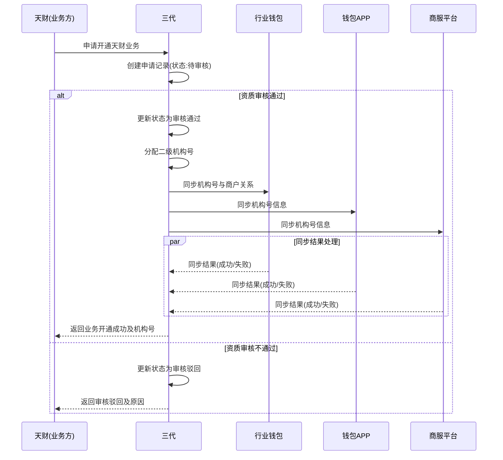

# 模块设计: 三代

生成时间: 2026-01-23 14:12:21
批判迭代: 2

---

# 三代模块设计文档

## 1. 概述
- **目的与范围**: 本模块是运营机构系统，负责商户入网审核、业务开通、接口调用等运营管理职能。其核心职责包括：为天财（业务方）分配和管理二级机构号，审核并开通商户的天财业务权限，以及作为调用方发起对行业钱包等下游系统的接口调用。

## 2. 接口设计
- **API端点 (REST/GraphQL)**:
    - `POST /api/v1/merchant/onboarding`: 接收商户入网及天财业务开通申请。
    - `POST /api/v1/merchant/audit`: 提交商户资质审核结果。
    - `GET /api/v1/agency/number/{merchantId}`: 查询商户分配的机构号。
    - `POST /api/v1/sync/agency-info`: 手动触发机构号信息同步。
- **请求/响应结构**:
    - `POST /api/v1/merchant/onboarding` 请求体包含：商户基本信息（商户ID、商户名称、商户类型、资质文件链接等）、申请业务类型。
    - 响应体包含：申请单号、处理状态。
    - 其他接口请求/响应结构：TBD。
- **发布/消费的事件**:
    - 发布事件：`MerchantAuditPassedEvent`（商户审核通过）、`AgencyNumberAssignedEvent`（机构号已分配）、`SyncCompletedEvent`（下游同步完成）。
    - 消费事件：TBD。

## 3. 数据模型
- **表/集合**:
    - `merchant_application`: 商户入网申请单表。
    - `agency_allocation`: 机构号分配记录表。
    - `sync_log`: 下游系统同步日志表。
- **关键字段**:
    - `merchant_application`: `application_id` (主键), `merchant_id`, `merchant_name`, `status` (待审核/审核通过/审核驳回), `audit_comment`, `apply_time`, `audit_time`。
    - `agency_allocation`: `id` (主键), `merchant_id`, `agency_number`, `is_active`, `allocate_time`。
    - `sync_log`: `log_id`, `target_system` (行业钱包/钱包APP/商服平台), `sync_data`, `status` (成功/失败), `retry_count`, `error_message`, `create_time`。
- **与其他模块的关系**: 三代模块为天财（业务方）分配机构号，并管理商户与机构号的绑定关系。这些信息需要同步给行业钱包（用于业务逻辑）、钱包APP（用于关闭提现入口）、商服平台（用于关闭提现入口）。

## 4. 业务逻辑
- **核心工作流/算法**:
    1.  **商户入网申请**: 接收商户提交的入网及天财业务开通申请，创建申请记录，状态为“待审核”。
    2.  **资质审核**: 运营人员对商户资质（如营业执照、法人信息）进行人工或系统自动审核。审核通过则进入下一步；审核驳回则更新申请状态并通知商户。
    3.  **机构号分配**: 审核通过后，系统为该商户分配一个全局唯一的二级机构号。分配逻辑需检查冲突，确保唯一性。
    4.  **下游同步**: 机构号分配成功后，异步向行业钱包、钱包APP、商服平台同步机构号与商户的绑定关系。需保证同步的最终一致性。
    5.  **结果通知**: 所有必要同步完成后（或达到最终一致性），通知申请方（天财业务方）业务开通结果及分配的机构号。
- **业务规则与验证**:
    - 同一商户ID只能分配一个有效的机构号。
    - 机构号格式需符合预定义规则（如特定前缀+序列号）。
    - 仅当商户申请状态为“审核通过”时，才允许分配机构号。
- **关键边界情况处理**:
    - **重复申请**: 同一商户在已有“待审核”或“审核通过”申请单时，新申请将被拒绝。
    - **审核信息不全**: 资质文件缺失或关键信息不完整，审核流程挂起并通知补全。
    - **下游系统不可用**: 通过重试机制和补偿任务处理，确保最终同步成功。

## 5. 时序图

## 6. 错误处理
- **预期错误情况**:
    1.  商户资质审核不通过。
    2.  机构号分配冲突（极小概率事件）。
    3.  下游系统（行业钱包、钱包APP、商服平台）同步失败或超时。
- **处理策略**:
    - **审核不通过**: 流程终止，申请状态更新为“驳回”，并记录驳回原因。
    - **分配冲突**: 触发重试分配逻辑，使用新的序列号再次尝试分配，并记录冲突事件。
    - **下游同步失败**:
        - 记录详细失败日志至`sync_log`表。
        - 实现基于指数退避的重试机制（如最多重试5次）。
        - 超过重试阈值后，触发告警通知运营人员人工介入处理。
        - 设计补偿查询接口，允许手动触发特定数据的重新同步，确保操作的幂等性。

## 7. 依赖关系
- **上游依赖**: 天财（作为业务方，提出业务开通申请）。
- **下游依赖**:
    - 行业钱包：接收机构号与商户绑定关系，用于核心业务逻辑。
    - 钱包APP：接收机构号信息，用于对天财新机构号关闭提现入口。
    - 商服平台：接收机构号信息，用于对天财新机构号关闭提现入口。