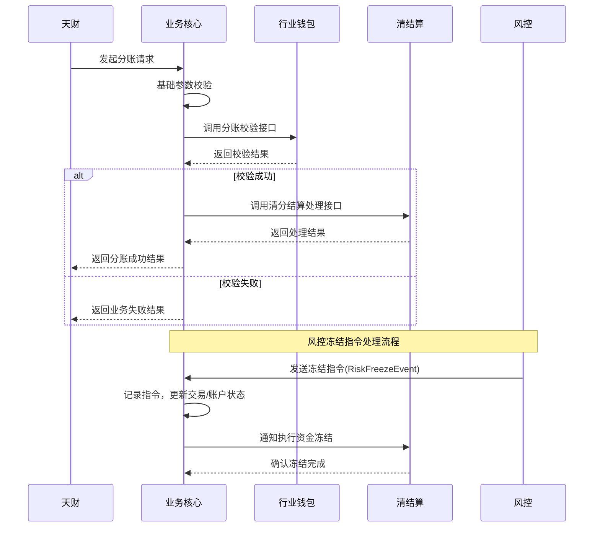

# 模块设计: 业务核心

生成时间: 2026-01-23 14:12:08
批判迭代: 2

---

# 业务核心 模块设计文档

## 1. 概述
- **目的与范围**: 本模块负责接收并处理天财分账等交易数据。它是天财资金管理业务流程的入口和协调中枢，负责接收业务请求、协调下游系统（如行业钱包、清结算）完成资金处理，并返回最终结果。其边界止于业务逻辑的编排与数据转发，不包含具体的账户操作、清分结算或风控规则执行。

## 2. 接口设计
- **API端点 (REST/GraphQL)**:
    - `POST /api/v1/tiancai/split`: 处理天财分账请求。
    - `POST /api/v1/tiancai/member-settlement`: 处理会员结算请求。
    - `POST /api/v1/tiancai/batch-payment`: 处理批量付款请求。
    - `POST /api/internal/risk/freeze`: 接收风控系统发起的账户冻结指令。
- **请求/响应结构**:
    - 分账请求: 包含请求流水号、付方机构号/账户、收方机构号/账户、分账金额、业务场景标识等字段。
    - 通用响应: 包含处理状态（成功/失败）、业务流水号、错误码、错误信息等字段。
- **发布/消费的事件**:
    - 消费事件: `RiskFreezeEvent` (来自风控系统)。
    - 发布事件: `TransactionProcessedEvent` (处理完成事件，供下游订阅)。

## 3. 数据模型
- **表/集合**:
    - `tiancai_transaction`: 核心交易流水表。
    - `freeze_instruction`: 冻结指令记录表。
- **关键字段**:
    - `tiancai_transaction`: 交易流水号、业务类型（分账/结算/批付）、付方信息、收方信息、金额、状态（待处理/处理中/成功/失败/已冻结）、创建时间、更新时间。
    - `freeze_instruction`: 指令ID、目标账户、冻结类型（商户冻结/交易冻结）、关联交易流水号、指令状态（待执行/已执行）、接收时间。
- **与其他模块的关系**: 本模块接收并处理来自“天财”的交易数据，处理后需调用“行业钱包”进行业务校验与账户操作，并调用“清结算”进行资金清分与结算编排。处理结果通过事件通知给其他订阅的下游系统。

## 4. 业务逻辑
- **核心工作流/算法**: 主要业务流程为接收天财的分账、会员结算、批量付款等请求，验证基础参数，然后调用行业钱包进行账户关系、状态及余额校验，最后调用清结算系统执行具体的资金冻结、解冻、分账等清结算流程。
- **业务规则与验证**: 对请求的必填字段、格式进行基础校验。依赖行业钱包校验分账双方账户是否存在、是否已绑定关系、账户状态是否正常、余额是否充足等业务规则。
- **关键边界情况处理**:
    - **下游系统失败重试与补偿**: 对行业钱包、清结算的调用采用带退避策略的有限次重试。对于最终失败且无法自动补偿的请求，记录详细日志并落入死信队列，供人工或定时任务进行后续对账与处理，确保最终一致性。
    - **处理风控冻结指令**: 通过内部API接收风控系统发起的`RiskFreezeEvent`。收到指令后，立即在`freeze_instruction`表记录。对于“商户冻结”，阻止后续所有涉及该商户账户的新交易处理；对于“交易冻结”，将`tiancai_transaction`表中对应流水号交易的状态标记为“已冻结”，并通知清结算系统执行资金冻结操作。

## 5. 时序图

## 6. 错误处理
- **预期错误情况**: 请求参数错误、账户不存在、账户状态异常（如冻结）、账户余额不足、关系未绑定、下游系统服务不可用、网络超时。
- **处理策略**: 参数错误立即返回失败。业务规则错误（如余额不足）返回明确的业务错误码。下游系统依赖失败，根据错误类型决定是否可重试，并记录日志用于对账与人工干预。对于超时等暂时性故障，执行有限次重试。最终失败则记录至死信队列。

## 7. 依赖关系
- **上游模块**: 天财、风控
- **下游模块**: 行业钱包、清结算