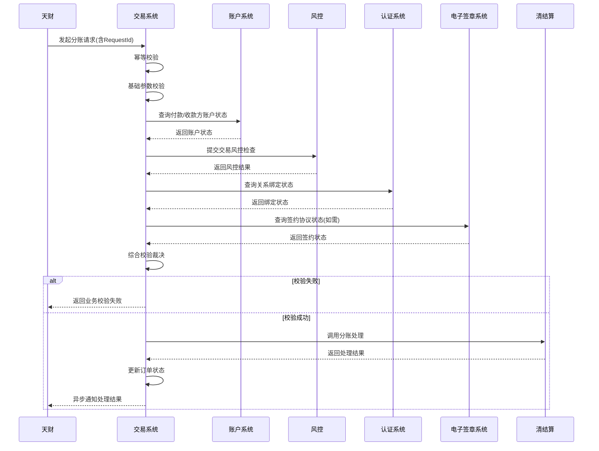

# 模块设计: 交易系统

生成时间: 2026-01-23 14:12:27
批判迭代: 2

---

# 交易系统模块设计文档

## 1. 概述
- **目的与范围**：本模块（在术语表中亦称为“业务核心”）负责接收并处理天财分账、归集、会员结算、批量付款等资金管理业务的请求。作为业务编排中枢，它负责参数校验、状态管理、流程协调，并调用下游系统完成资金处理。其边界始于接收业务请求，止于将处理结果通知相关系统。本模块不执行具体的账户资金操作、清分结算、计费及风控逻辑，但会调用相应系统完成这些操作。

## 2. 接口设计
- **API端点 (REST)**：
    - `POST /api/v1/transaction/split`：发起分账/转账。
    - `POST /api/v1/transaction/collection`：发起资金归集。
    - `POST /api/v1/transaction/member-settlement`：发起会员结算。
    - `POST /api/v1/transaction/batch-payment`：发起批量付款。
    - `GET /api/v1/transaction/{transactionId}`：查询交易状态。
- **请求/响应结构**：
    - 通用请求头包含：`X-Request-Id`（幂等键）、`X-App-Id`、`X-Org-Id`（机构号）。
    - 通用响应体包含：`code`、`message`、`data`（业务数据）、`requestId`。
    - 具体业务请求字段（示例为分账）：`payerAccountNo`（付款方账户）、`payeeAccountNo`（收款方账户）、`amount`（金额）、`feeBearer`（手续费承担方）、`transferMode`（转账模式：净额/全额）、`remark`（备注）。
- **发布/消费的事件**：
    - 消费事件：TBD（例如，监听账户状态变更、关系绑定完成等事件）。
    - 发布事件：交易创建事件、交易状态变更事件（如“处理成功”、“处理失败”）。

## 3. 数据模型
- **表/集合**：
    - `transaction_orders`：交易订单主表。
    - `transaction_steps`：交易处理步骤记录表。
- **关键字段**：
    - `transaction_orders`表：
        - `id`：主键。
        - `order_no`：业务订单号。
        - `request_id`：幂等请求ID。
        - `biz_type`：业务类型（分账、归集、会员结算、批量付款）。
        - `status`：订单状态（初始化、校验中、处理中、成功、失败、已冲正）。
        - `payer_info`：付款方信息（账户、名称、机构号）。
        - `payee_info`：收款方信息（账户、名称、机构号）。
        - `amount`：金额。
        - `fee_info`：手续费信息。
        - `relation_check_status`：关系绑定校验状态。
        - `risk_check_status`：风控检查状态。
        - `settlement_result`：清结算处理结果。
        - `created_at`， `updated_at`。
    - `transaction_steps`表：
        - `id`：主键。
        - `order_id`：关联订单ID。
        - `step_name`：步骤名称。
        - `step_status`：步骤状态。
        - `request_params`：请求参数。
        - `response_result`：响应结果。
        - `executed_at`：执行时间。
- **与其他模块的关系**：
    - 与**账户系统**：通过账户号关联，查询账户状态、类型及余额（仅校验用）。
    - 与**清结算**：通过业务订单号关联，驱动其完成资金处理编排。
    - 与**账务核心**：交易成功后，由清结算或账户系统触发记账。
    - 与**风控**：通过商户/交易信息关联，进行风险检查。

## 4. 业务逻辑
- **核心工作流/状态管理**：
    1.  **请求接收与幂等校验**：接收请求，检查`X-Request-Id`，避免重复处理。
    2.  **基础参数校验**：校验必填字段、格式、金额有效性。
    3.  **业务校验**：
        - 调用**账户系统**，校验付款方与收款方账户状态（是否存在、是否冻结、类型是否匹配）。
        - 调用**风控**，提交交易风控检查。
        - 校验业务关系绑定状态（需与**认证系统**、**电子签章系统**交互，确认签约与授权是否完成）。对于归集、会员结算、批量付款，需额外校验“开通付款”授权。
    4.  **预检查结果综合裁决**：汇总所有校验结果，决定是否继续处理或拒绝。
    5.  **调用清结算**：校验通过后，组装参数调用**清结算**系统执行资金处理编排（含冻结、计费、划转等）。
    6.  **结果处理与状态更新**：根据清结算返回结果，更新订单状态。成功则发布成功事件；失败则根据策略处理（如重试、标记失败、触发冲正）。
    7.  **异步通知**：将最终结果异步通知请求方（天财）。
- **关键业务规则**：
    - **关系绑定规则**：分账、归集等场景下，付款方与收款方必须已完成签约授权（关系绑定）。
    - **手续费规则**：根据`feeBearer`和`transferMode`，调用**计费中台**计算手续费（本模块透传参数，不计费）。
    - **并发与一致性**：使用数据库事务保证订单主表与步骤表的一致性。关键状态变更使用乐观锁。
- **边界情况处理**：
    - **账户余额不足**：在调用清结算前，依赖账户系统的余额校验结果。
    - **风控拦截**：风控检查返回拒绝时，流程终止，订单标记为“风控拒绝”。
    - **清结算处理失败**：根据返回的错误码决定重试（网络超时等可重试错误）或标记最终失败。

## 5. 时序图

## 6. 错误处理
- **预期错误分类**：
    - **客户端错误 (4xx)**：参数缺失、格式错误、幂等键重复、业务校验不通过（账户异常、风控拒绝、关系未绑定）。
    - **服务器端错误 (5xx)**：依赖系统（账户、风控、清结算）服务不可用、超时、内部处理异常。
    - **业务处理失败**：清结算处理失败（余额不足、账户状态变更等）。
- **处理策略**：
    - **重试策略**：仅对依赖系统的网络超时、暂时性故障进行指数退避重试（最多3次）。业务逻辑错误不重试。
    - **幂等性**：通过`X-Request-Id`保证。相同请求ID，无论调用多少次，返回相同结果。
    - **补偿机制**：对于已调用清结算但最终失败的交易，若已发生资金冻结等中间状态，依赖清结算系统的冲正接口或对账机制进行补偿，本模块记录最终状态为“失败”或“已冲正”。
    - **状态明确**：订单状态定义清晰（初始化、校验中、处理中、成功、失败、已冲正），便于对账与排查。
    - **日志与监控**：记录所有关键步骤日志和错误详情，并接入监控告警。

## 7. 依赖关系
- **上游模块/依赖方**：
    - **账户系统**：查询账户状态、类型等基础信息。
    - **风控**：进行交易风险检查。
    - **认证系统**：验证关系绑定状态。
    - **电子签章系统**：验证电子协议签署状态。
    - **清结算**：执行最终的资金处理编排（冻结、计费、划转）。
    - **计费中台**：透传参数，由其计算手续费（通常由清结算调用）。
- **下游模块/被依赖方**：
    - **天财**：接收业务请求，并异步接收处理结果通知。
    - （其他可能监听本模块状态变更事件的系统，如对账单系统）