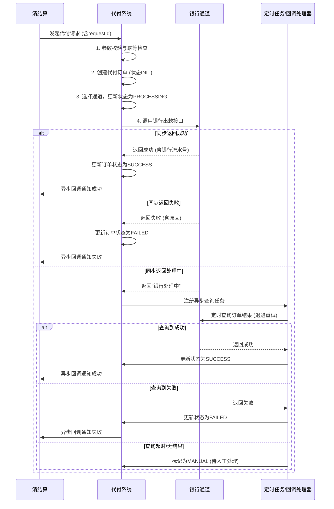

# 模块设计: 代付系统

生成时间: 2026-01-23 14:12:26
批判迭代: 2

---

# 代付系统 设计文档

## 1. 概述
- **目的与范围**: 本模块负责处理向外部银行账户进行代付出款的业务。其核心职责是接收来自上游系统的付款指令，调用银行通道完成资金划转，并同步处理结果。其边界止于银行通道接口的调用与结果返回，不涉及账户资金的扣减、会计分录的记录以及手续费的计算。本模块仅处理资金已预先从相关账户中扣减完毕的代付请求。

## 2. 接口设计
- **API端点 (REST/GraphQL)**:
  - `POST /api/v1/disburse`: 接收代付指令。
  - `GET /api/v1/disburse/{orderNo}/status`: 查询代付单状态。
  - `POST /api/v1/disburse/callback`: 接收银行通道异步回调（如支持）。
- **请求/响应结构**:
  - 代付请求 (`POST /api/v1/disburse`):
    - 请求体字段: `requestId` (请求流水号，用于幂等), `merchantId` (商户号), `bankAccountNo` (收款银行账号), `bankAccountName` (收款户名), `bankCode` (开户行编码), `amount` (金额), `currency` (币种), `purpose` (用途), `clientIp` (客户端IP), `notifyUrl` (结果通知地址)。
    - 响应体字段: `code` (响应码), `message` (响应信息), `data.orderNo` (代付系统订单号), `data.status` (订单状态: PROCESSING/SUCCESS/FAILED)。
  - 状态查询 (`GET /api/v1/disburse/{orderNo}/status`):
    - 响应体字段: `code`, `message`, `data.orderNo`, `data.status`, `data.bankSerialNo` (银行流水号，成功时返回), `data.failReason` (失败原因)。
- **发布/消费的事件**:
  - 消费事件: TBD (上游系统在资金扣减完成后发送的“代付指令就绪”事件)。
  - 发布事件: `DisburseOrderCompleted` (代付订单终态事件，包含订单号、状态、银行流水号等信息)。

## 3. 数据模型
- **表/集合**: `disburse_order` (代付订单表)
- **关键字段**:
  - `order_no` (主键，代付系统订单号),
  - `request_id` (唯一索引，上游请求流水号，用于幂等),
  - `merchant_id` (商户号),
  - `bank_account_no` (收款银行账号),
  - `bank_account_name` (收款户名),
  - `bank_code` (开户行编码),
  - `amount` (金额),
  - `currency` (币种),
  - `status` (状态: INIT, PROCESSING, SUCCESS, FAILED, MANUAL),
  - `bank_serial_no` (银行流水号),
  - `channel_code` (通道编码),
  - `fail_reason` (失败原因),
  - `notify_url` (结果通知地址),
  - `retry_count` (重试次数),
  - `next_retry_time` (下次重试时间),
  - `completed_at` (完成时间),
  - `created_at`, `updated_at`。
- **与其他模块的关系**: 本模块执行出款操作，其处理结果（成功/失败的交易记录）被**对账单系统**用于生成对账单。本模块不直接依赖账户系统进行资金操作。

## 4. 业务逻辑
- **核心工作流/算法**:
  1.  **接收请求**: 接收上游系统（清结算）发起的代付请求。请求中必须包含用于保证幂等性的唯一`requestId`。
  2.  **参数校验与幂等检查**: 校验请求参数（账户信息、金额、商户状态等）。根据`requestId`查询历史记录，若已存在相同请求且处于终态（SUCCESS/FAILED），则直接返回历史结果；若处于处理中（PROCESSING），返回处理中状态。
  3.  **订单创建与预处理**: 校验通过后，创建状态为`INIT`的代付订单。根据路由规则（如金额、银行、商户等级）选择合适的银行出款通道。
  4.  **调用银行通道**: 将订单状态更新为`PROCESSING`，组装银行接口要求的报文，调用银行出款接口。
  5.  **处理同步返回**:
      - **成功**: 更新订单状态为`SUCCESS`，记录银行流水号。
      - **失败**: 更新订单状态为`FAILED`，记录失败原因。
      - **处理中**: 银行返回处理中状态。启动异步结果查询任务（轮询或等待回调）。
  6.  **异步结果处理**:
      - **轮询**: 对于处理中的订单，按照退避策略（如首次5秒后，之后每次间隔加倍，最多重试N次）向银行查询结果，直至得到终态或超时。
      - **回调**: 监听银行通道的异步回调通知，验证签名后更新订单状态。
  7.  **终态处理与通知**: 订单进入终态（SUCCESS/FAILED）后，通过回调`notifyUrl`异步通知上游系统。同时发布`DisburseOrderCompleted`事件。
  8.  **人工处理兜底**: 对于长时间处于`PROCESSING`状态且异步查询无结果的订单，定期扫描并置为`MANUAL`状态，进入人工对账流程。
- **业务规则与验证**: 验证收款银行账户信息的有效性（如四要素）、出款金额是否在单笔/单日限额内、商户状态是否正常、通道是否可用等。
- **关键边界情况处理**: 明确处理银行通道超时、返回结果不明（“银行处理中”）、网络异常等场景，通过异步查询、重试机制和人工对账进行兜底。

## 5. 时序图

## 6. 错误处理
- **预期错误情况**:
  - **业务错误**: 银行账户信息错误、交易限额超限、商户状态异常、重复请求。
  - **通道错误**: 银行通道临时维护、单通道额度不足。
  - **系统错误**: 网络超时、银行响应报文解析失败、系统内部异常。
- **处理策略**:
  - **业务错误**: 立即失败，返回明确错误码，不重试。
  - **通道级错误**: 触发通道切换（如有备用通道）或标记通道不可用，并立即失败。
  - **网络超时等临时错误**: 对于`PROCESSING`状态的订单，由异步查询任务负责重试获取最终结果。对于因超时未成功发起的请求，可根据配置进行有限次数的同步重试。
  - **幂等性**: 通过唯一`requestId`保证，避免因重试导致重复出款。
  - **人工对账**: 对于异步查询也无法获取明确结果的订单，落入`MANUAL`状态，由运营人员通过银行对账单进行人工核对与处理。

## 7. 依赖关系
- **上游模块**: **清结算**（发起已扣减资金的代付指令）。
- **下游模块**: **对账单系统**（消费`DisburseOrderCompleted`事件或直接查询，以获取代付交易明细生成对账单）。
- **外部依赖**: 各银行或第三方支付机构的出款通道接口。