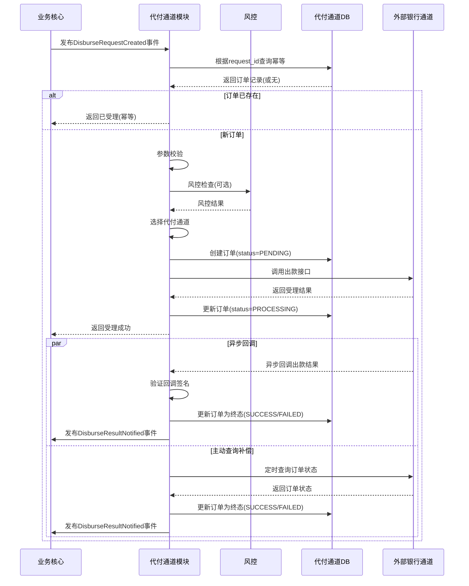

# 模块设计: 代付通道

生成时间: 2026-01-23 14:12:56
批判迭代: 2

---

# 代付通道 模块设计文档

## 1. 概述
- **目的与范围**: 本模块负责处理向外部银行账户进行代付出款的业务逻辑。其核心职责是接收出款请求，通过银行或支付通道完成资金划转，并处理出款结果的通知与状态同步。模块边界止于向外部银行发起支付指令及接收其异步回调。

## 2. 接口设计
- **API端点 (REST/GraphQL)**:
    - `POST /api/v1/disburse/orders`: 创建代付订单。
    - `GET /api/v1/disburse/orders/{order_id}`: 查询代付订单状态。
    - `POST /api/v1/disburse/callback/{channel_code}`: 接收外部通道的异步回调（通道专用）。
- **请求/响应结构**:
    - 创建代付订单请求体:
        - `request_id` (string): 请求唯一标识，用于幂等。
        - `merchant_id` (string): 商户标识。
        - `amount` (number): 出款金额。
        - `currency` (string): 币种。
        - `beneficiary_bank_code` (string): 收款方银行编码。
        - `beneficiary_account_no` (string): 收款方银行账号。
        - `beneficiary_name` (string): 收款方姓名。
        - `remark` (string): 附言。
    - 创建代付订单响应体:
        - `code` (string): 响应码。
        - `message` (string): 响应信息。
        - `data`: `{ "order_id": string, "status": string }`
    - 异步回调请求体: TBD (由外部通道定义)。
- **发布/消费的事件**:
    - 消费事件: `DisburseRequestCreated` (由业务核心发布，触发代付流程)。
    - 发布事件: `DisburseResultNotified` (代付最终结果，通知业务核心)。

## 3. 数据模型
- **表/集合**:
    - `disburse_order` (代付订单表)
- **关键字段**:
    - `order_id` (string, PK): 代付订单唯一标识。
    - `request_id` (string, UK): 上游请求ID，用于幂等。
    - `merchant_id` (string): 商户ID。
    - `amount` (decimal): 出款金额。
    - `currency` (string): 币种。
    - `beneficiary_bank_code` (string): 收款银行编码。
    - `beneficiary_account_no` (string): 收款账号。
    - `beneficiary_name` (string): 收款户名。
    - `channel_code` (string): 使用的代付通道编码。
    - `status` (string): 订单状态 (PENDING, PROCESSING, SUCCESS, FAILED, BANK_BOUNCE)。
    - `channel_request` (text): 发送给通道的原始请求。
    - `channel_response` (text): 通道的原始响应。
    - `fail_reason` (text): 失败原因。
    - `retry_count` (int): 重试次数。
    - `next_retry_at` (datetime): 下次重试时间。
    - `created_at` (datetime): 创建时间。
    - `updated_at` (datetime): 更新时间。
- **与其他模块的关系**:
    - 通过 `merchant_id` 与商户体系关联。
    - 通过消费/发布事件与业务核心交互。

## 4. 业务逻辑
- **核心工作流/算法**:
    1.  **请求接收与幂等**: 接收 `DisburseRequestCreated` 事件或API请求，通过 `request_id` 检查幂等，防止重复处理。
    2.  **参数校验与风控**:
        - 校验必填字段、金额格式与范围。
        - 校验收款方银行账户信息（卡BIN、户名校验）。
        - 校验商户状态与出款权限。
        - 调用风控系统进行交易风险评估（TBD）。
    3.  **通道选择**: 根据商户配置、金额、银行代码等因素选择最优代付通道（策略TBD）。
    4.  **状态机管理**: 订单状态遵循 `PENDING` -> `PROCESSING` -> (`SUCCESS` / `FAILED` / `BANK_BOUNCE`) 的流转。`PENDING` 为初始态，`PROCESSING` 为已提交通道，终态由回调或查询决定。
    5.  **调用通道与异步处理**: 调用选定通道的出款接口，记录请求响应。若通道返回受理成功，状态置为 `PROCESSING` 并进入异步等待。若通道即时返回失败，状态置为 `FAILED`。
    6.  **结果同步**:
        - **回调处理**: 接收通道异步回调，验证签名，更新订单状态为终态（`SUCCESS`/`FAILED`）。
        - **主动查询补偿**: 对于未及时收到回调的订单，启动定时任务轮询通道查询接口，同步最终状态。
    7.  **结果通知**: 订单达到终态后，发布 `DisburseResultNotified` 事件，通知业务核心。
- **业务规则与验证**:
    - 出款时间限制：仅在工作日及通道规定时间内处理（TBD）。
    - 单笔/单日限额校验（TBD）。
    - 收款账户黑名单校验（TBD）。
- **关键边界情况处理**:
    - **重试机制**: 针对通道调用网络超时等可重试错误，采用指数退避策略，最大重试次数为3次。重试间隔：5s, 30s, 5min。
    - **银行退票处理**: 通道回调或对账发现银行退票时，订单状态更新为 `BANK_BOUNCE`，记录退票原因，并通知业务核心。
    - **对账与差错处理**: 每日与各代付通道进行资金对账，发现长款、短款或状态不一致时，生成差错单，触发人工干预流程（TBD）。
    - **人工干预**: 对于多次重试失败、状态不明或需紧急止付的订单，提供管理界面供运营人员查询与手动处理。

## 5. 时序图

## 6. 错误处理
- **预期错误情况**:
    - **参数校验失败**: 如金额格式错误、必填字段缺失、账户信息无效。
    - **业务规则失败**: 如商户无权限、余额不足、超出限额。
    - **通道技术失败**: 如网络超时、连接拒绝、通道系统异常。
    - **通道业务失败**: 如通道返回账户不存在、账户已注销、交易拒绝。
    - **银行退票**: 资金已划出但被收款银行退回。
- **处理策略**:
    - **参数/业务失败**: 立即失败，更新订单状态为 `FAILED`，记录具体原因，不重试。
    - **通道技术失败**: 触发自动重试机制（指数退避，最多3次）。重试耗尽后状态置为 `FAILED`，并标记需人工排查。
    - **通道业务失败**: 立即失败，状态置为 `FAILED`，记录通道返回的错误码和原因。
    - **银行退票**: 状态置为 `BANK_BOUNCE`，记录退票原因，通知业务核心进行后续处理（如重新出款或退款）。
    - **状态未知**: 通过主动查询补偿流程获取最终状态。若长时间无法获取，触发人工干预告警。

## 7. 依赖关系
- **上游模块**:
    - **业务核心**: 发布 `DisburseRequestCreated` 事件，触发代付流程；消费 `DisburseResultNotified` 事件，获取最终出款结果。
- **下游模块**:
    - **风控**: 提供交易风险检查接口（TBD）。
    - **通知系统**: 发送代付成功/失败的通知给相关方（TBD）。
    - **账务核心**: 代付成功时，需驱动账务核心进行相应的资金扣减记账（TBD，依赖具体资金链路设计）。