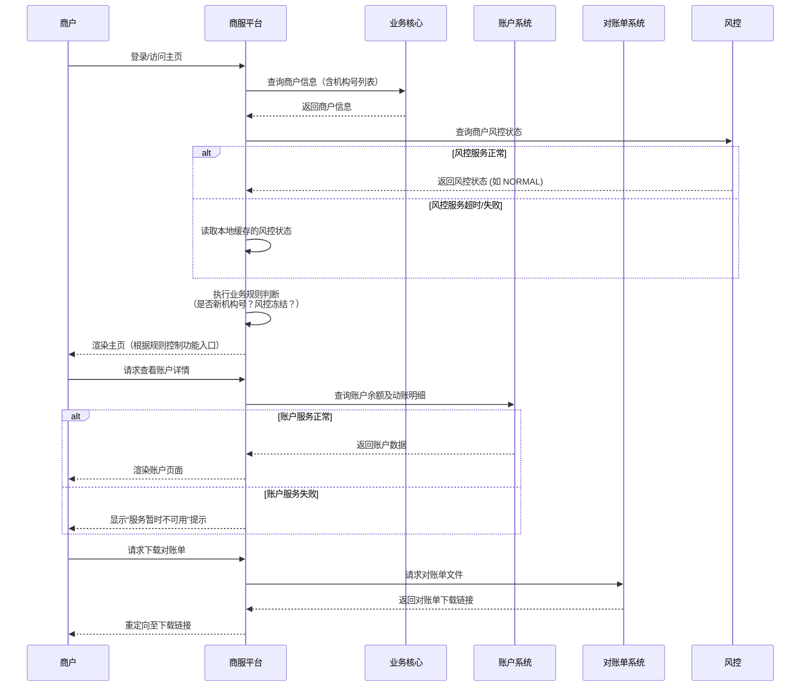

# 模块设计: 商服平台

生成时间: 2026-01-23 14:12:16
批判迭代: 2

---

# 商服平台 模块设计文档

## 1. 概述
- **目的与范围**: 本模块是面向商户的服务平台，核心职责是为商户提供账户管理、交易查询、对账单下载等服务。根据上下文，其特定职责包括对天财新机构号关闭提现等入口，并根据风控状态控制功能可用性。

## 2. 接口设计
- **API端点 (REST/GraphQL)**:
    - `GET /api/merchant/{merchantId}/profile`: 获取商户基本信息（含机构号、风控状态）。
    - `GET /api/merchant/{merchantId}/account`: 获取商户账户详情（余额、动账明细）。
    - `GET /api/merchant/{merchantId}/statements?date={date}&type={type}`: 获取对账单列表或下载链接。
    - `POST /api/merchant/{merchantId}/withdraw`: 发起提现申请（受业务规则控制）。
- **请求/响应结构**:
    - 商户信息响应示例：
        ```json
        {
          "merchantId": "string",
          "merchantName": "string",
          "institutionCodes": ["string"],
          "riskStatus": "NORMAL" | "FROZEN",
          "isNewTiancaiInstitution": boolean
        }
        ```
    - 账户详情响应示例：
        ```json
        {
          "accountNo": "string",
          "accountType": "天财收款账户" | "天财接收方账户",
          "balance": "number",
          "transactions": [...]
        }
        ```
- **发布/消费的事件**:
    - 消费事件：`MerchantRiskStatusChangedEvent` (来自风控模块)，用于更新本地缓存的商户风控状态。
    - 发布事件：TBD。

## 3. 数据模型
- **表/集合**:
    - `merchant_profile` (商户档案表): 存储商户核心信息。
    - `merchant_institution_mapping` (商户-机构映射表): 存储商户与机构号的关联关系。
    - `merchant_risk_cache` (商户风控状态缓存表): 缓存来自风控模块的最新状态。
- **关键字段**:
    - `merchant_profile`: `merchant_id` (主键), `merchant_name`, `status`。
    - `merchant_institution_mapping`: `id` (主键), `merchant_id`, `institution_code`, `institution_type`。
    - `merchant_risk_cache`: `merchant_id` (主键), `risk_status`, `freeze_reason`, `last_updated_time`。
- **与其他模块的关系**: 与业务核心（同步商户及机构信息）、账户系统（查询账户数据）、对账单系统（获取对账单）、风控（同步冻结状态）存在数据关联。

## 4. 业务逻辑
- **核心工作流/算法**: 主要业务流程包括商户登录、账户信息展示、交易明细查询、对账单下载与管理。关键业务逻辑是根据机构号类型（如天财新机构号）和风控状态控制前端功能入口（如提现）的显示与可用性。
- **业务规则与验证**:
    1.  **商户身份与权限验证**: 商户必须通过统一认证登录。商服平台根据登录令牌中的`merchantId`查询其信息。
    2.  **功能入口控制规则**:
        - **提现入口控制**: 当商户满足以下任一条件时，提现入口必须在前端界面关闭（置灰或隐藏）：
            - 商户关联的机构号列表中包含标记为“天财新机构号”的机构号。
            - 商户的风控状态为 `FROZEN`。
        - **其他功能控制**: 当商户风控状态为 `FROZEN` 时，所有资金转出类功能（如分账、转账）均应关闭。
    3.  **多机构号处理策略**: 若一个商户关联多个机构号，则采用“最严格”原则。即，只要关联的机构号列表中包含一个“天财新机构号”，则对该商户应用新机构号的限制策略（关闭提现入口）。
- **关键边界情况处理**: 当依赖服务（业务核心、风控）不可用时，使用本地最后已知的有效状态进行判断，并在界面上给出“服务暂不可用”的提示，而非直接开放受限功能。商户机构号信息为空时，默认采取保守策略，禁用敏感功能。

## 5. 时序图


## 6. 错误处理
- **预期错误情况**:
    1.  依赖服务（业务核心、账户系统、风控、对账单系统）调用超时或失败。
    2.  获取到的商户机构号信息异常或为空。
    3.  风控状态查询失败，且本地无缓存。
    4.  前端页面渲染错误。
- **处理策略**:
    1.  对所有外部依赖调用设置合理的超时与重试机制（如最多重试1次）。
    2.  依赖服务失败时：
        - 对于风控状态查询，降级为使用本地缓存数据；若无缓存，则视为“状态未知”，并**保守地按冻结状态处理**，关闭资金转出功能，同时记录日志告警。
        - 对于账户、对账单等查询类服务，向用户展示友好的“服务暂不可用，请稍后重试”提示。
    3.  机构号信息异常或为空时，记录错误日志，并采用保守策略，默认禁用提现等敏感功能。
    4.  前端进行全局异常捕获，对组件渲染错误进行降级UI展示（如显示错误占位符）。

## 7. 依赖关系
- **上游模块**:
    - **业务核心**: 获取商户基本资料及其关联的机构号列表。强依赖，用于核心信息展示和规则判断。
    - **账户系统**: 获取账户余额、动账明细。强依赖，用于账户页面展示。
    - **对账单系统**: 获取交易、结算等对账单。强依赖，用于对账单下载。
    - **风控**: 获取商户冻结状态。强依赖，其状态直接影响功能入口的开关。
- **下游模块**:
    - **钱包APP**: 可能共享部分商户服务逻辑和接口。
    - **商户**: 直接用户。