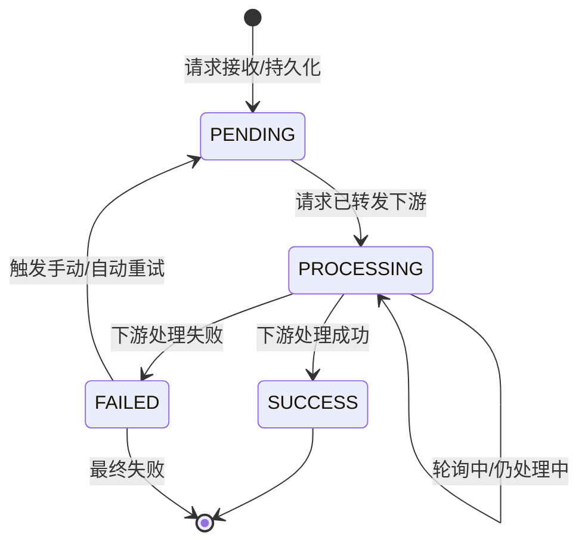
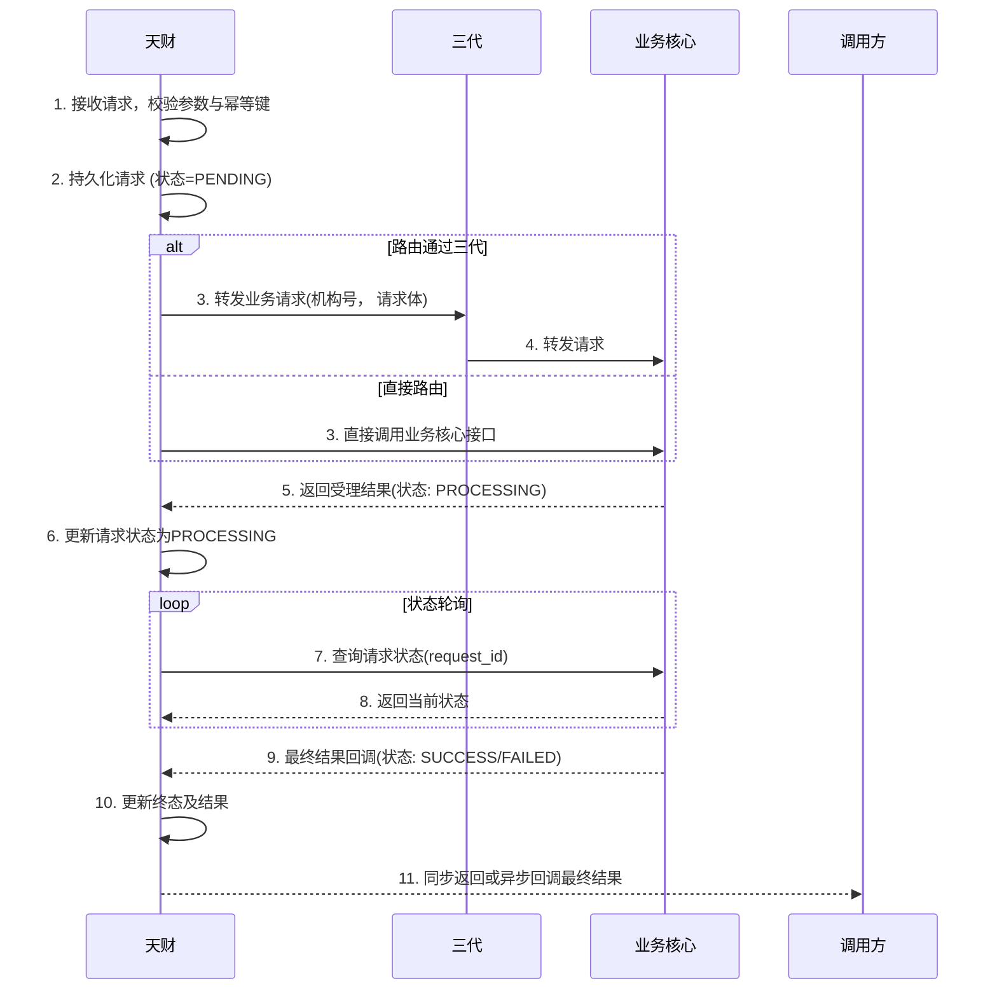

# 模块设计: 天财

生成时间: 2026-01-23 14:12:33
批判迭代: 2

---

# 天财模块设计文档

## 1. 概述
- **目的与范围**：本模块作为业务方或系统，负责提出分账、会员结算、批量付款等资金管理需求。它是业务流程的发起方，定义了业务场景和规则，并将请求传递给下游系统处理。其边界止于业务请求的发起与状态查询，不涉及具体的账户操作、清结算处理或风控执行。

## 2. 接口设计
- **API端点 (REST/GraphQL)**：
    - `POST /api/v1/fund/allocate`：发起分账请求。
    - `POST /api/v1/fund/member-settlement`：发起会员结算请求。
    - `POST /api/v1/fund/batch-payment`：发起批量付款请求。
    - `GET /api/v1/fund/requests/{request_id}`：查询业务请求状态。
    - `POST /api/v1/fund/requests/{request_id}/retry`：重试指定请求。
- **请求/响应结构**：
    - 通用请求头需包含：`X-Request-Id`（幂等键）、`X-Institution-Id`（机构号）、`X-App-Id`（APPID）。
    - 分账请求体示例：
        ```json
        {
          "payer_account_no": "TC_PAYER_001",
          "payee_account_no": "TC_PAYEE_001",
          "amount": 10000,
          "fee_payer": "PAYER",
          "transfer_mode": "NET",
          "biz_scene": "ALLOCATE",
          "remark": "分账给供应商"
        }
        ```
    - 通用响应体结构：
        ```json
        {
          "code": "SUCCESS",
          "message": "请求已受理",
          "data": {
            "request_id": "REQ_20231027001",
            "status": "PENDING",
            "submit_time": "2023-10-27T10:00:00Z"
          }
        }
        ```
- **发布/消费的事件**：
    - 发布事件：`FundRequestSubmitted`（资金请求已提交）、`FundRequestStatusUpdated`（资金请求状态已更新）。
    - 消费事件：TBD（从下游模块接收处理结果通知）。

## 3. 数据模型
- **表/集合**：
    - `fund_request`（资金请求表）：用于持久化追踪所有发起的业务请求。
    - `request_retry_log`（请求重试日志表）：记录请求重试的历史。
- **关键字段**：
    - `fund_request`表：
        - `id` (主键)
        - `request_id` (业务请求唯一标识，与幂等键关联)
        - `institution_id` (机构号)
        - `biz_type` (业务类型：ALLOCATE/MEMBER_SETTLEMENT/BATCH_PAYMENT)
        - `request_payload` (原始请求参数，JSON格式)
        - `status` (状态：PENDING/PROCESSING/SUCCESS/FAILED)
        - `idempotency_key` (幂等键)
        - `callback_url` (异步回调地址，可选)
        - `created_at` (创建时间)
        - `updated_at` (最后更新时间)
        - `final_result` (最终结果快照，JSON格式)
    - `request_retry_log`表：
        - `id` (主键)
        - `request_id` (关联的业务请求ID)
        - `retry_count` (当前重试次数)
        - `triggered_at` (重试触发时间)
        - `reason` (重试原因)
- **与其他模块的关系**：天财模块通过`institution_id`（机构号）与三代运营机构关联。通过`request_id`和业务类型，与业务核心、行业钱包等模块产生交互。

## 4. 业务逻辑
- **核心工作流/算法**：
    1.  **请求接收与校验**：接收业务请求，校验机构号有效性、请求参数合法性（如金额、账户、业务场景）。
    2.  **幂等性检查**：根据请求头中的`X-Request-Id`（幂等键）查询`fund_request`表。若存在相同幂等键且状态为终态（SUCCESS/FAILED）的记录，则直接返回历史结果；若状态为处理中（PENDING/PROCESSING），则返回当前状态。
    3.  **请求持久化与路由**：将校验通过的请求持久化至`fund_request`表，初始状态为`PENDING`。根据配置的路由规则（可能通过三代机构或直接调用），将请求转发至下游业务核心系统。
    4.  **状态管理与轮询**：对于返回“处理中”状态的请求，启动异步轮询机制，定期调用下游状态查询接口，并更新`fund_request`表状态。
    5.  **结果处理与回调**：当请求达到终态（SUCCESS/FAILED）时，更新数据库，并可选地向预设的`callback_url`发送异步通知。
- **业务规则与验证**：
    - 确保发起的请求符合业务场景定义，例如在分账中指定手续费承担方（付款方或收款方）、转账模式（净额转账或全额转账）。
    - 必须使用由三代分配的有效`机构号`进行身份标识和路由。
    - 批量付款请求需确保收款方列表不为空，且单笔金额符合风控限额。
- **状态机**：

- **关键边界情况处理**：
    - **处理中状态**：通过`fund_request`表记录状态，并提供查询接口。对于异步处理场景，实现后台任务定期轮询下游系统获取最新状态。
    - **幂等性与重试**：通过`idempotency_key`保证同一业务请求的重复提交仅产生一次效果。对于可重试的失败（如网络超时），支持配置化的重试策略（如指数退避）。

## 5. 时序图


## 6. 错误处理
- **预期错误情况**：
    - **客户端错误 (4xx)**：机构号无效、请求参数不合法（如金额格式错误）、幂等键冲突但状态为终态。
    - **服务器错误 (5xx)**：下游系统（三代、业务核心）服务不可用、网络超时、数据库连接失败。
    - **业务错误**：业务规则校验失败（如余额不足）、风控拦截、账户状态异常。
- **错误分类与代码**：
    - `INVALID_INSTITUTION`: 机构号无效或未授权。
    - `INVALID_PARAMETER`: 请求参数校验失败。
    - `IDEMPOTENCY_CONFLICT`: 幂等键冲突，请求已处理。
    - `DOWNSTREAM_UNAVAILABLE`: 下游服务暂时不可用。
    - `BUSINESS_RULE_FAILED`: 业务规则校验失败（如余额不足）。
    - `RISK_CONTROL_REJECTED`: 风控拦截。
- **处理策略**：
    - **参数/业务错误**：立即失败，返回明确的错误码和描述，不重试。
    - **系统级/网络错误**：记录错误日志，并根据错误类型决定重试策略。对于`DOWNSTREAM_UNAVAILABLE`或超时错误，采用指数退避算法进行自动重试（最大次数可配置），重试记录写入`request_retry_log`表。
    - **降级与监控**：当持续失败达到阈值时，触发告警。在极端情况下，可提供“降级模式”，如将请求标记为`MANUAL_REVIEW`（人工处理）状态。
- **重试机制**：
    - 可重试错误码：`DOWNSTREAM_UNAVAILABLE`, `NETWORK_TIMEOUT`。
    - 策略：指数退避，初始间隔1秒，最大间隔60秒，最大重试次数3次。
    - 实现：通过后台任务扫描状态为`FAILED`且错误码可重试的请求进行重试。

## 7. 依赖关系
- **上游模块**：**三代（运营机构）**。根据业务配置，天财发起的请求**必须**通过三代进行路由和转发。三代负责机构的准入、审核和接口权限管理，天财依赖三代提供的机构号进行身份标识。
- **下游模块**：**业务核心**、**行业钱包**。天财将业务请求（分账、结算、批付）通过三代或直接接口发送至业务核心，由业务核心协调行业钱包、清结算等模块完成具体处理。