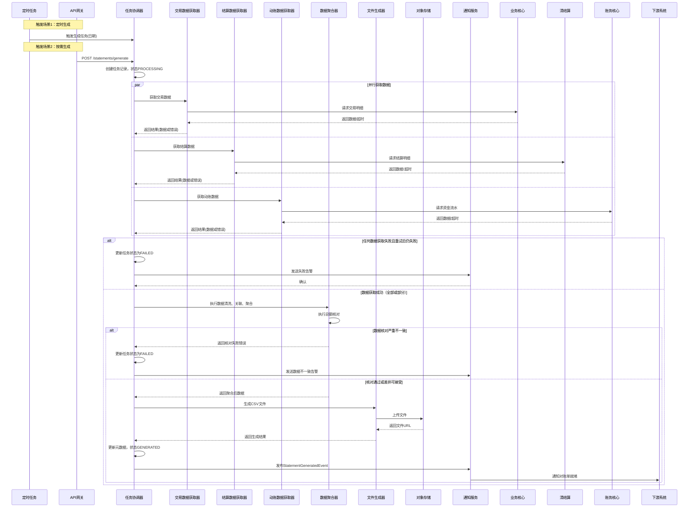

# 模块设计: 对账单系统

生成时间: 2026-01-23 14:12:38
批判迭代: 2

---

# 对账单系统 模块设计文档

## 1. 概述
- **目的与范围**: 本模块负责按机构或账户维度生成并提供各类交易、结算、动账明细对账单。其核心职责是接收上游系统的交易、结算及账户变动数据，按日（或按需）生成结构化的明细数据文件，并提供给下游系统（如天财、三代）进行对账。边界在于数据的聚合、格式化和分发，不涉及原始交易数据的处理或资金结算逻辑。
- **触发条件**: 对账单生成主要分为两种模式：
    1.  **定时生成**: 每日定时（如T+1日凌晨）为所有活跃机构生成前一自然日的对账单。
    2.  **按需生成**: 由下游系统（天财、三代）通过API主动触发，可指定特定机构、账户及日期范围（如补单、重跑）。

## 2. 接口设计
- **API端点 (REST)**:
    - `POST /api/v1/statements/generate`: 触发按需生成对账单。
        - 请求体: `{“institutionCode”: “机构号”, “accountNo”: “账户号(可选)”, “startDate”: “YYYY-MM-DD”, “endDate”: “YYYY-MM-DD”, “type”: “TRADE|SETTLEMENT|ACCOUNT”}`
        - 响应: `{“taskId”: “任务ID”, “status”: “ACCEPTED”}`
    - `GET /api/v1/statements`: 查询对账单列表。
        - 查询参数: `institutionCode`, `accountNo`, `date`, `type`, `status`
        - 响应: `[{“statementId”: “对账单ID”, “institutionCode”: “机构号”, “date”: “YYYY-MM-DD”, “type”: “类型”, “fileUrl”: “文件下载链接”, “status”: “GENERATED|FAILED”, “createdAt”: “时间戳”}]`
    - `GET /api/v1/statements/{statementId}/download`: 下载对账单文件。
- **发布/消费的事件**:
    - 消费事件: TBD (例如，监听上游系统发布的“日切完成”事件，作为定时触发的信号之一)。
    - 发布事件: `StatementGeneratedEvent` (对账单文件生成成功时发布，包含文件路径、机构、日期、类型等信息，供下游订阅)。

## 3. 数据模型
- **表/集合**:
    - `statement_metadata` (对账单元数据表)
        - `statement_id` (主键，对账单唯一标识)
        - `institution_code` (机构号)
        - `account_no` (账户号，可为空)
        - `statement_date` (对账日期)
        - `statement_type` (类型: TRADE-交易, SETTLEMENT-结算, ACCOUNT-动账)
        - `file_storage_path` (文件在对象存储中的路径)
        - `file_format` (文件格式，如CSV)
        - `status` (状态: GENERATING, GENERATED, FAILED)
        - `checksum` (文件校验和，用于完整性验证)
        - `generated_at` (生成时间)
        - `created_at`, `updated_at`
    - `generation_task_log` (生成任务日志表)
        - `task_id` (任务ID)
        - `trigger_type` (触发类型: SCHEDULED, MANUAL, API)
        - `parameters` (触发参数，JSON格式)
        - `status` (任务状态: PENDING, PROCESSING, SUCCESS, PARTIAL_FAILURE, FAILED)
        - `error_message` (错误信息)
        - `start_time`, `end_time`
- **关键字段**: 如上所述。
- **与其他模块的关系**: 依赖**业务核心**获取交易订单数据，依赖**清结算**获取结算明细数据，依赖**账务核心**获取资金流水（动账）数据。生成的对账单供**天财**、**三代**等系统使用。术语澄清：根据术语表，“账务核心”负责记录所有资金变动流水，因此动账明细数据源应为“账务核心”，而非“账户系统”。“账户系统”负责账户的底层操作，但对账单所需的资金变动记录应由“账务核心”提供。

## 4. 业务逻辑
- **核心工作流/算法**:
    1.  **数据拉取**: 根据对账日期和机构/账户维度，并行调用上游系统接口获取数据。
        - 从 **业务核心** 拉取指定日期范围内的交易订单明细。
        - 从 **清结算** 拉取指定日期范围内的结算明细（包括结算状态、金额、手续费等）。
        - 从 **账务核心** 拉取指定日期范围内涉及目标账户的资金流水明细（借贷方向、余额变动）。
    2.  **数据清洗与聚合**:
        - **清洗**: 校验数据必填字段，过滤无效记录（如金额为0），统一时间格式。
        - **聚合**: 按 `机构号`、`账户号`、`业务类型`、`日期` 等维度对明细数据进行分组。核心算法为按关键字段（如订单号、流水号）进行关联和汇总，确保同一笔业务在不同系统的记录能通过关联键对应。
        - **对账逻辑**: 在生成文件前，将聚合后的交易金额、结算金额与从上游获取的日汇总数据进行总额核对。若差异超过阈值，则记录告警并暂停文件生成。
    3.  **文件生成**:
        - **格式**: 采用CSV格式，文件编码UTF-8。具体列结构根据对账单类型预定义（例如交易对账单包含：订单号、交易时间、交易类型、金额、状态等）。
        - **命名规范**: `{机构号}_{对账日期}_{对账单类型}_{序列号}.csv`，例如 `INS001_2023-10-27_TRADE_01.csv`。
        - **存储**: 生成的文件上传至公司内部对象存储服务，存储路径遵循：`/statements/{yyyy}/{mm}/{dd}/{机构号}/`。
    4.  **分发与通知**: 更新对账单元数据状态为`GENERATED`，并记录文件访问URL。通过发布事件或回调通知下游系统（天财、三代）对账单已就绪。
- **业务规则与验证**:
    - 同一机构、同一日期、同一类型的对账单，成功生成后状态标记为`GENERATED`，防止重复生成。
    - 文件生成后计算MD5校验和，存储于元数据中，供下游验证文件完整性。
    - 对账单文件在存储服务中的保留策略为至少180天。
- **关键边界情况处理**:
    - **上游数据延迟**: 设置数据就绪等待窗口（如30分钟），超时后若数据仍不全，则根据配置决定是生成部分对账单（标记`PARTIAL`）还是失败告警。
    - **数据不一致**: 当交易、结算、动账三方数据无法通过关联键匹配或总额核对不一致时，记录详细的不匹配日志，发出数据一致性告警，并可由运营人员介入处理。
    - **下游系统不可用**: 文件推送失败时，进入重试队列，最多重试3次，每次间隔指数递增。最终失败则告警。

## 5. 时序图

## 6. 错误处理
- **预期错误情况**:
    1.  上游接口调用失败或超时。
    2.  上游返回数据格式异常、关键字段缺失或数据逻辑错误（如金额为负）。
    3.  数据聚合过程中关联失败，或核对总额与上游汇总数据差异超阈值。
    4.  文件生成失败（如模板错误、编码问题）。
    5.  文件上传至对象存储失败。
    6.  通知下游系统失败。
- **处理策略**:
    - **重试机制**: 对上游数据获取、文件上传、下游通知等外部调用设置指数退避重试策略（如最多3次）。
    - **熔断与降级**: 当某一上游系统持续不可用，触发熔断，暂时跳过该数据源，生成部分对账单并标记`PARTIAL_FAILURE`状态，同时告警。
    - **数据校验**: 对接收到的数据进行严格的结构和逻辑校验。失败记录被隔离并记录详细日志，不影响其他有效数据的处理，但触发告警。
    - **状态追踪与补偿**: 通过`generation_task_log`表完整记录任务生命周期。对于失败的生成任务，提供管理界面供运营人员查看错误详情并手动触发重试或补偿生成。
    - **监控告警**: 对任务失败率、数据不一致率、端到端延迟等关键指标进行监控，超出阈值时即时告警。

## 7. 依赖关系
- **上游模块**:
    - **业务核心**: 提供原始交易订单明细数据。
    - **清结算**: 提供交易清分、结算结果明细数据。
    - **账务核心**: 提供所有资金变动流水（动账）明细数据。
- **下游模块**:
    - **天财**: 消费交易、结算、动账对账单，用于其内部对账与资金管理。
    - **三代**: 消费对账单，用于运营侧对账与商户服务。
- **基础设施依赖**:
    - 对象存储服务（用于对账单文件持久化）。
    - 消息队列（用于异步事件发布/订阅）。
    - 数据库（用于存储元数据与任务日志）。