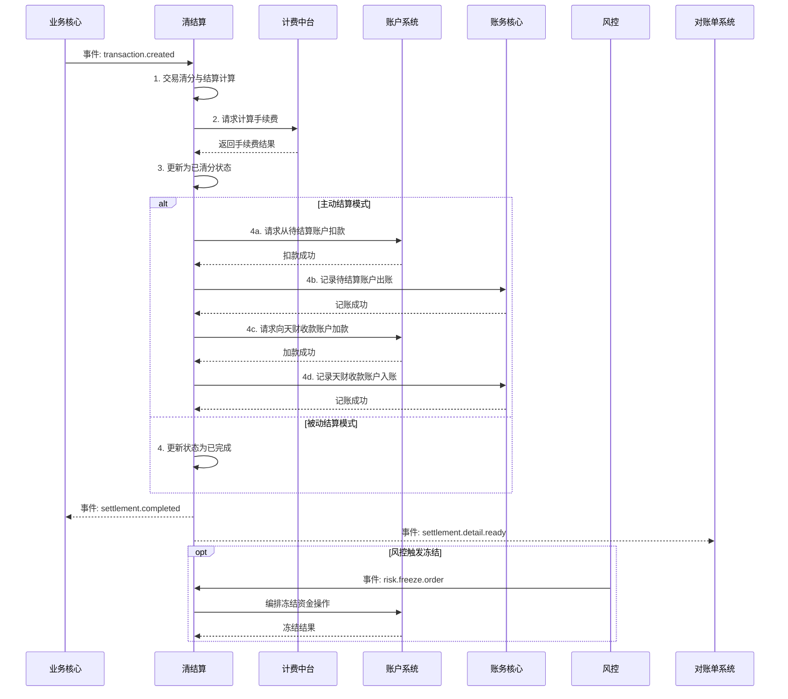

# 模块设计: 清结算

生成时间: 2026-01-23 14:12:18
批判迭代: 2

---

# 清结算模块设计文档

## 1. 概述
- **目的与范围**: 本模块（清结算）负责交易清分、结算、计费处理、资金冻结/解冻编排等资金清算与结算处理。其边界包括接收业务核心的交易数据，进行资金清算计算，调用计费中台计算手续费，调用账户系统完成资金操作，编排风控发起的冻结/解冻流程，以及将结算结果通知对账单系统。

## 2. 接口设计
- **API端点 (REST/GraphQL)**: TBD
- **请求/响应结构**: TBD
- **发布/消费的事件**:
    - **消费事件**:
        - `transaction.created` (来自业务核心)：包含交易基础数据。
        - `risk.freeze.order` (来自风控)：包含冻结指令。
    - **发布事件**:
        - `settlement.completed`：通知业务核心结算完成。
        - `settlement.detail.ready`：通知对账单系统结算明细已生成。

## 3. 数据模型
- **表/集合**:
    - `settlement_record` (结算记录表)
    - `fee_calculation` (手续费计算记录表)
    - `freeze_order` (冻结指令记录表)
- **关键字段**:
    - `settlement_record`: 结算流水号、交易流水号、结算模式（主动结算/被动结算）、结算状态（待清分/已清分/结算中/已完成/失败）、结算金额、手续费金额、源账户（待结算账户）、目标账户（天财收款账户）、创建时间、完成时间。
    - `fee_calculation`: 计费流水号、关联结算流水号、计费产品、计费结果（金额）、扣费方式、承担方、请求时间、响应时间。
    - `freeze_order`: 冻结指令ID、关联账户、冻结类型（商户冻结/交易冻结）、冻结金额、指令状态（待处理/处理中/已完成/失败）、风控请求时间、处理完成时间。
- **与其他模块的关系**: 处理来自业务核心的交易数据；调用账户系统进行资金操作；接收风控的冻结指令；为对账单系统提供结算明细数据。

## 4. 业务逻辑
- **核心工作流/算法**:
    1.  **交易清分与结算计算**:
        - 输入：交易数据（含交易金额、商户信息、产品类型）。
        - 处理：根据配置的结算规则（如T+1）确定结算批次与时间。计算应结算的净额（交易金额 - 预估手续费）。
        - 输出：待结算记录，状态为“待清分”。
    2.  **计费处理**:
        - 根据结算记录中的交易信息（如产品类型、金额）构造计费请求。
        - 调用计费中台，传入计费产品、金额、扣费方式、手续费承担方等参数。
        - 接收计费结果，更新结算记录中的实际手续费金额和净结算金额。
        - 状态流转：`待清分` -> `已清分`。
    3.  **资金结算执行**:
        - **主动结算模式**:
            1.  校验目标账户（天财收款账户）状态是否正常。
            2.  调用账户系统，从待结算账户扣减结算净额。
            3.  调用账务核心，记录资金从待结算账户流向天财收款账户的会计分录。
            4.  调用账户系统，向天财收款账户增加结算净额。
        - **被动结算模式**:
            - 资金保留在待结算账户，仅更新结算记录状态为“已完成”，不进行实际资金划转。
        - 状态流转：`已清分` -> `结算中` -> `已完成`。
    4.  **冻结/解冻编排**:
        - 接收风控冻结指令。
        - 根据指令类型（商户冻结/交易冻结）定位关联的账户或特定结算资金。
        - 调用账户系统执行资金冻结操作。
        - 更新冻结指令状态。
- **业务规则与验证**:
    - 结算模式规则：根据商户或产品配置决定采用主动或被动结算。
    - 手续费计算规则：遵循计费中台返回的结果。支持净额转账和全额转账模式。
    - 账户状态校验：执行资金操作前，必须校验源账户（待结算账户）余额充足，目标账户状态正常（非冻结、非注销）。
- **关键边界情况处理**:
    - 结算时目标账户被冻结：终止结算流程，记录失败原因，并可能触发告警。
    - 清分计算时数据不一致：与业务核心进行数据核对，若无法解决则挂起该笔结算，人工介入。

## 5. 时序图

## 6. 错误处理
- **预期错误情况**:
    - 依赖系统调用失败：计费中台、账户系统、账务核心服务超时或返回错误。
    - 业务逻辑错误：结算资金不足、目标账户状态异常、计费产品未配置。
    - 数据错误：风控指令格式错误、交易数据不完整。
- **处理策略**:
    - **重试机制**：对可重试的依赖系统调用失败（如网络超时），采用指数退避策略进行重试（如最多3次）。
    - **降级与补偿**：
        - 计费中台不可用：可使用本地配置的保底费率进行计算，并记录日志告警，事后核对。
        - 资金操作部分失败（如扣款成功但加款失败）：触发补偿交易，尝试回滚已完成的扣款操作，并将结算记录状态置为“失败”，等待人工处理。
    - **流程终止与告警**：遇到资金不足、账户冻结等业务错误，立即终止流程，更新状态为“失败”，并发送告警通知运营人员。
    - **无效指令处理**：对格式错误或无法识别的风控指令，记录错误日志并告警，不执行后续操作。

## 7. 依赖关系
- **上游模块**: 业务核心（提供交易数据）、风控（提供冻结指令）
- **下游模块**: 账户系统（执行资金操作）、账务核心（记录资金流水）、计费中台（计算手续费）、对账单系统（提供结算明细数据）