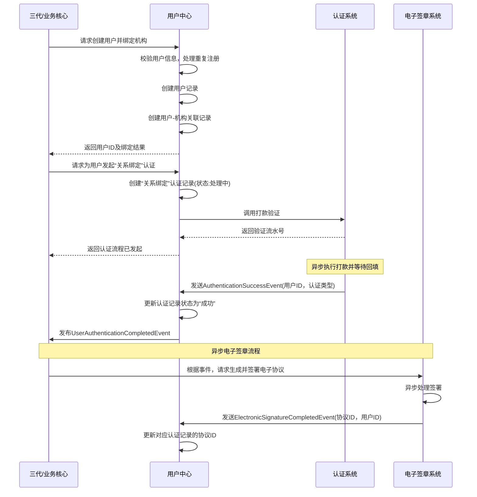

# 模块设计: 用户中心

生成时间: 2026-01-23 14:13:09
批判迭代: 2

---

# 用户中心模块设计文档

## 1. 概述
- **目的与范围**: 本模块负责管理系统中所有用户实体的核心信息、认证状态、角色与权限关联以及账户绑定关系。其核心职责包括：用户身份信息的存储与维护、用户与机构/商户/账户的关联映射、用户认证状态的跟踪，并为其他模块提供统一的用户信息查询服务。其边界止于具体的业务逻辑（如开户、分账）和底层认证操作（如打款验证、人脸验证），仅提供基础数据支撑。

## 2. 接口设计
- **API端点 (REST)**:
    - `POST /users`: 创建或更新用户信息。
    - `GET /users/{userId}`: 查询用户基础信息。
    - `POST /users/{userId}/bindings/institutions`: 绑定用户与机构关系。
    - `POST /users/{userId}/bindings/merchants`: 绑定用户与商户关系。
    - `POST /users/{userId}/bindings/accounts`: 绑定用户与账户关系。
    - `PUT /users/{userId}/roles`: 分配或更新用户角色。
    - `GET /users/{userId}/authentication-records`: 查询用户认证记录。
    - `POST /users/{userId}/authentication-records`: 发起用户认证流程。

- **请求/响应结构**:
    - 创建用户请求体示例：
        ```json
        {
          "name": "张三",
          "idCardNo": "110101199003071234",
          "mobile": "13800138000"
        }
        ```
    - 用户信息响应体示例：
        ```json
        {
          "userId": "USR202310110001",
          "name": "张三",
          "idCardNo": "110101199003071234",
          "mobile": "13800138000",
          "status": "ACTIVE",
          "registerTime": "2023-10-11T10:00:00Z"
        }
        ```
    - 绑定关系响应体示例：
        ```json
        {
          "bindingId": "BIND202310110001",
          "userId": "USR202310110001",
          "targetId": "INS001",
          "targetType": "INSTITUTION",
          "bindTime": "2023-10-11T10:05:00Z"
        }
        ```

- **发布/消费的事件**:
    - **发布事件**:
        - `UserCreatedEvent`: 用户创建完成。
        - `UserBindingCompletedEvent`: 用户与机构/商户/账户绑定完成。
        - `UserRoleAssignedEvent`: 用户角色分配完成。
        - `UserAuthenticationCompletedEvent`: 用户认证完成。
    - **消费事件**:
        - `InstitutionCreatedEvent` (来自三代): 用于关联用户与机构。
        - `AccountOpenedEvent` (来自行业钱包): 用于关联用户与账户。
        - `AuthenticationSuccessEvent` (来自认证系统): 用于更新认证记录。
        - `ElectronicSignatureCompletedEvent` (来自电子签章系统): 用于更新认证记录中的协议信息。

## 3. 数据模型
- **表/集合**:
    1.  `用户信息表`：存储用户基础身份信息。
    2.  `用户-机构关联表`：记录用户与天财机构号的绑定关系。
    3.  `用户-商户关联表`：记录用户与收单商户/非收单商户的绑定关系。
    4.  `用户-账户关联表`：记录用户与天财收款账户/天财接收方账户的绑定关系。
    5.  `用户角色表`：定义用户角色（如总部、门店、接收方）。
    6.  `用户-角色关联表`：记录用户与角色的分配关系。
    7.  `用户认证记录表`：记录用户完成的认证流程（如关系绑定、开通付款）及状态。

- **关键字段**:
    - `用户信息表`: 用户ID、姓名、身份证号、手机号、注册时间、状态。
    - `用户-机构关联表`: 关联ID、用户ID、机构号、关联类型、绑定时间。
    - `用户-商户关联表`: 关联ID、用户ID、商户号、商户类型（收单/非收单）、绑定时间。
    - `用户-账户关联表`: 关联ID、用户ID、账户号、账户类型（收款/接收方）、绑定时间。
    - `用户角色表`: 角色ID、角色名称（总部/门店/接收方）、描述。
    - `用户-角色关联表`: 关联ID、用户ID、角色ID、机构号（业务上下文）、生效时间、失效时间。
    - `用户认证记录表`: 记录ID、用户ID、认证类型（关系绑定/开通付款）、认证方式（打款验证/人脸验证/电子协议）、认证状态、完成时间、协议ID（若涉及）、过期时间。

- **与其他模块的关系**:
    - 与**行业钱包**关联：通过`用户-账户关联表`关联天财专用账户。
    - 与**三代**关联：通过`用户-机构关联表`关联机构号。
    - 与**业务核心**关联：消费来自业务核心的事件（如分账请求），并为其提供用户身份、角色及认证状态查询服务。
    - 与**认证系统**和**电子签章系统**关联：通过`用户认证记录表`同步认证结果。

## 4. 业务逻辑
- **核心工作流/算法**:
    1.  **用户注册与信息维护**：接收来自上游系统（如三代、钱包APP）的用户信息，创建或更新用户主记录。
    2.  **关联关系绑定**：当商户入网、账户开户或关系绑定时，创建或更新用户与机构、商户、账户的关联记录。
    3.  **角色分配**：根据业务场景（如品牌与门店架构、分账场景）为用户分配“总部”、“门店”或“接收方”角色。
    4.  **认证状态同步**：监听或接收来自认证系统、电子签章系统的认证完成事件，更新相应用户的认证记录状态。
    5.  **认证过期处理**：定时任务扫描`用户认证记录表`，对过期的认证记录进行状态标记，并触发重新认证流程。

- **业务规则与验证**:
    - 一个用户可以关联多个机构号、商户号和账户。
    - 一个用户在同一个机构号（业务上下文）下，只能被分配一个有效角色（总部或门店或接收方）。此规则是确定性的，分配新角色会使旧角色失效。
    - 进行关键操作（如作为付方发起分账）前，需校验用户是否已完成必要的认证（如“开通付款”）且认证记录未过期。
    - 用户基础信息（如身份证号、手机号）需满足基本的格式与有效性校验。

- **关键边界情况处理**:
    - **用户重复注册**：以身份证号作为核心去重标识。当收到创建用户请求时，优先通过身份证号查询。若存在，则更新现有用户信息（如手机号）并返回现有用户ID；若业务要求严格隔离，则拒绝创建并返回错误。
    - **关联关系冲突**：如同一用户在同一机构号下被尝试同时绑定为总部和门店角色，根据“一个用户在同一业务上下文中只能有一个有效角色”的规则，拒绝新的绑定请求并返回错误。
    - **认证信息过期**：`用户认证记录表`中的每条记录均设有`过期时间`字段。过期后，该记录状态标记为“EXPIRED”。当业务校验认证状态时，仅认可状态为“SUCCESS”且未过期的记录。过期触发后，需引导用户重新发起完整认证流程。

## 5. 时序图



## 6. 错误处理
- **预期错误情况与错误码**:
    - `USER_INFO_INVALID` (400): 用户信息不合法（如身份证格式错误、手机号格式错误）。
    - `USER_ALREADY_EXISTS` (409): 尝试创建已存在的用户（根据业务规则选择拒绝时）。
    - `TARGET_NOT_FOUND` (404): 尝试绑定不存在的机构号、商户号或账户号。
    - `DUPLICATE_BINDING` (409): 重复绑定已存在且状态有效的关系。
    - `ROLE_CONFLICT` (409): 在同一业务上下文（机构号）下分配冲突的角色。
    - `AUTHENTICATION_REQUIRED` (403): 用户未完成必要认证或认证已过期。
    - `DEPENDENCY_SERVICE_UNAVAILABLE` (503): 依赖模块（如认证系统、电子签章系统）服务不可用。
    - `USER_NOT_FOUND` (404): 查询的用户不存在。

- **处理策略**:
    - 输入参数校验失败立即返回对应错误码和描述，告知调用方具体原因。
    - 对于依赖服务（认证系统、电子签章系统）的调用失败，采用指数退避策略进行重试（最大重试次数：3次）。若最终失败，则将业务状态（如认证记录）更新为“FAILED”，记录详细错误日志，并触发告警通知运维人员。
    - 所有未捕获的异常将被记录为系统错误日志，对外返回统一的`INTERNAL_SERVER_ERROR` (500)，并触发紧急告警。

## 7. 依赖关系
- **上游模块/数据源**:
    - **三代**：提供机构号及商户信息，触发用户创建与关联（通过事件或API调用）。
    - **行业钱包**：提供账户信息，触发用户与账户关联（通过事件）。
    - **认证系统**：提供认证结果（通过事件）。
    - **电子签章系统**：提供协议签署结果（通过事件）。
- **下游模块/消费者**:
    - **业务核心**：消费用户中心发布的`UserAuthenticationCompletedEvent`等事件，并通过API查询用户信息、角色及有效的认证状态以处理分账等业务。
    - **风控**：通过API查询用户关联信息（如关联的商户、账户）用于风险判定。
    - **清结算**：可能通过API查询用户角色信息以进行差异化结算处理。