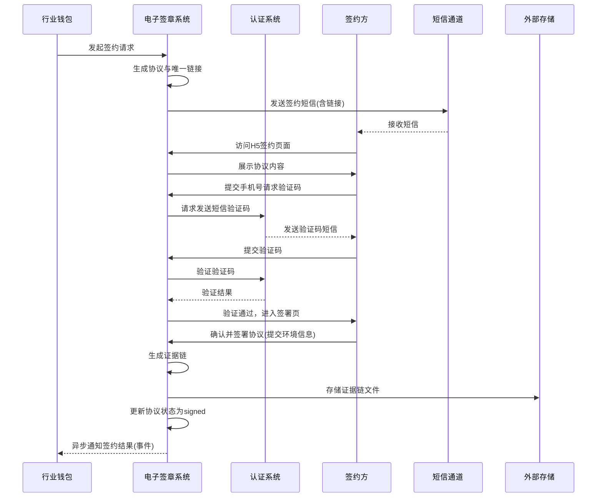

# 模块设计: 电子签章系统

生成时间: 2026-01-23 14:12:11
批判迭代: 2

---

# 电子签章系统模块设计文档

## 1. 概述
- **目的与范围**: 本模块负责为“关系绑定”和“开通付款”等业务流程提供电子协议签署能力。核心职责包括：根据业务需求生成电子协议、封装并发送签约短信、提供H5签约页面、管理签约证据链的生成与存储。本模块不涉及具体的业务审批逻辑或资金操作。

## 2. 接口设计
- **API端点 (REST/GraphQL)**:
  - `POST /v1/agreement/initiate`: 接收来自上游系统（如“行业钱包”）的签约请求，发起签约流程。
  - `GET /v1/agreement/{agreementId}/status`: 查询指定协议的签署状态。
  - `POST /v1/agreement/{agreementId}/resend-sms`: 重新发送签约短信。
  - `POST /v1/h5/sign/verify`: H5页面调用的身份验证接口。
  - `POST /v1/h5/sign/confirm`: H5页面调用的最终签署确认接口。
- **请求/响应结构**:
  - 发起签约请求 (`POST /v1/agreement/initiate`)
    - 请求体: `{“bizId”: “业务流水号”, “templateCode”: “协议模板编码”, “parties”: [ {“name”: “签约方名称”, “mobile”: “手机号”, “idNo”: “证件号”} ], “bizContext”: {“feeRule”: “计费产品信息”, … } }`
    - 响应体: `{“code”: “响应码”, “message”: “消息”, “data”: {“agreementId”: “协议唯一ID”, “expireTime”: “链接过期时间”}}`
  - 签署状态查询响应: `{“code”: “响应码”, “data”: {“agreementId”: “协议ID”, “status”: “pending/sent/signed/expired”, “signTime”: “签署时间”, “evidenceId”: “证据链ID”}}`
- **发布/消费的事件**:
  - 消费事件: TBD（例如，监听账户系统或业务核心发起的签约触发事件）。
  - 发布事件: `AgreementSignedEvent` (协议签署完成事件)，包含协议ID、签署方、签署时间、证据链ID。

## 3. 数据模型
- **表/集合**:
  - `agreement` (协议主表):
    - `agreement_id` (主键), `biz_id`, `template_code`, `status` (状态: pending, sent, signed, expired), `initiate_time`, `expire_time`, `biz_context` (JSON, 存储业务上下文如计费信息), `created_at`, `updated_at`.
  - `signatory` (签约方表):
    - `id` (主键), `agreement_id` (外键), `name`, `mobile`, `id_no`, `sign_status`, `sign_time`, `sign_ip`, `sign_user_agent`.
  - `evidence_log` (证据链日志表):
    - `evidence_id` (主键), `agreement_id` (外键), `content` (JSON, 存储完整的签署证据，包括页面访问记录、验证码验证记录、签署动作时间戳、IP、用户代理、协议原文哈希等), `storage_path` (外部存储路径), `created_at`.
  - `sms_send_log` (短信发送日志表):
    - `id` (主键), `agreement_id`, `mobile`, `sms_content`, `send_status`, `send_time`, `channel`.
- **关键字段**: 如上所述。
- **与其他模块的关系**: 本模块被“行业钱包”系统调用，用于在“关系绑定”和“开通付款”流程中完成电子协议签署环节。协议的业务上下文 (`biz_context`) 可能包含来自“账户系统”或“计费中台”的费率等信息。

## 4. 业务逻辑
- **核心工作流/算法**:
  1.  **接收与初始化**: 接收来自“行业钱包”的签约请求，校验参数，生成唯一`agreement_id`，根据`template_code`从模板引擎加载协议模板，并注入业务参数（包括来自`biz_context`的计费产品等信息）生成最终协议文件（PDF/HTML）。协议状态置为`pending`。
  2.  **生成链接与发送通知**: 为协议生成唯一的H5签约页面链接（包含`agreement_id`参数），链接设置有效期（如24小时）。调用短信服务发送签约短信。协议状态更新为`sent`。
  3.  **H5页面签署流程**:
      a. 签约方访问H5链接，系统展示协议全文。
      b. 调用`认证系统`的接口，通过短信验证码验证签约方手机号（与请求中的`mobile`匹配）。
      c. 验证通过后，签约方进行签署操作（如点击确认按钮、绘制签名等）。
      d. 签署时，前端收集用户环境信息（IP、User-Agent、时间戳）并提交。
  4.  **证据链生成与存储**: 在签署确认时，系统将协议原文、签署方身份信息、验证记录、签署动作时间戳、环境信息等打包，计算哈希，生成结构化证据链JSON。将该证据链存储至外部存储服务（如对象存储），并在`evidence_log`表中记录存储路径和元数据。
  5.  **状态更新与通知**: 协议状态更新为`signed`，记录签署时间。异步发布`AgreementSignedEvent`事件，通知“行业钱包”等上游系统。
- **业务规则与验证**:
  1.  签约方必须通过`认证系统`完成短信验证码验证，且验证的手机号需与协议中指定的手机号一致。
  2.  协议内容在签署前必须在H5页面完整、不可篡改地展示给签约方。
  3.  签署操作需记录精确到毫秒的时间戳、IP地址、用户代理等关键信息，并纳入证据链。
  4.  签约链接具有有效期，过期后状态自动更新为`expired`，需重新发起流程。
- **关键边界情况处理**:
  1.  短信发送失败：记录失败日志，提供`resend-sms`接口供上游重试，支持重试次数限制（如3次）。
  2.  签约链接过期：H5页面访问时校验`expire_time`，若过期则提示用户并引导联系业务方重新发起。
  3.  签署过程中断：基于`agreement_id`，用户重新访问链接时可恢复至上次步骤（如已验证则跳过验证，直接进入签署页面）。

## 5. 时序图

## 6. 错误处理
- **预期错误情况**:
  1.  模板生成失败（模板不存在或参数错误）。
  2.  短信发送失败（通道异常、号码格式错误）。
  3.  `认证系统`调用失败或验证不通过。
  4.  外部存储服务异常导致证据链保存失败。
  5.  并发签署请求（幂等性处理）。
- **处理策略**:
  1.  **重试机制**: 对短信发送、外部存储等外部依赖调用，配置指数退避重试策略（如最多3次）。对于`/initiate`接口，要求上游传递幂等键（如`bizId`），避免重复创建协议。
  2.  **状态机管理**: 协议状态遵循明确的状态流转（`pending` -> `sent` -> `signed`/`expired`），非法状态操作返回明确错误。
  3.  **错误响应**: 向调用方返回结构化的错误码和提示信息。例如：`SMS_SEND_FAILED`, `VERIFICATION_FAILED`, `AGREEMENT_EXPIRED`。
  4.  **补偿与兜底**: 证据链存储失败时，记录本地详细日志并告警，协议状态暂不更新为`signed`，等待人工介入或定时任务重试存储。确保关键数据不丢失。

## 7. 依赖关系
- **上游模块**:
  - 行业钱包（主调用方，发起签约请求）。
  - 账户系统/计费中台（提供协议中可能需要的业务上下文信息，如费率详情）。
- **下游模块/服务**:
  - 认证系统（必须，用于签约方短信验证码身份验证）。
  - 短信服务提供商（发送签约通知短信）。
  - 外部存储服务（用于持久化存储生成的协议文件和证据链文件）。