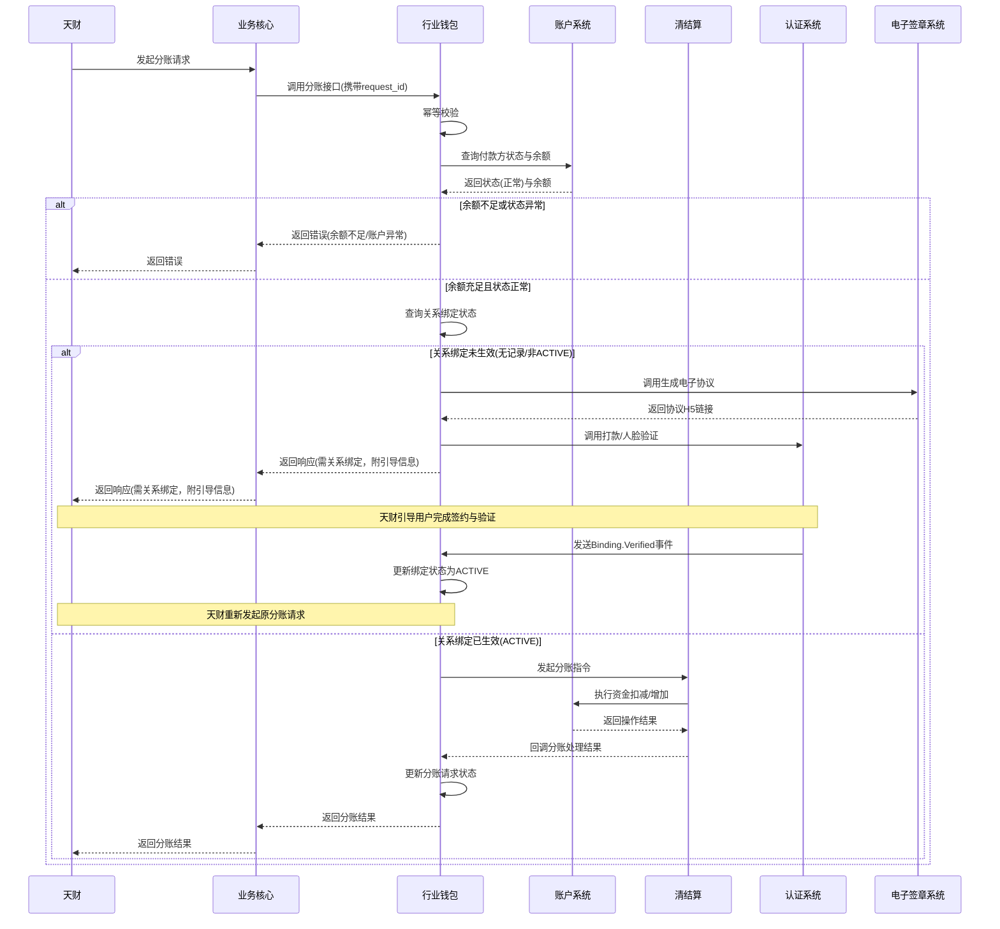

# 模块设计: 行业钱包

生成时间: 2026-01-23 14:12:46
批判迭代: 2

---

# 行业钱包模块设计文档

## 1. 概述
- **目的与范围**: 本模块是处理天财资金管理业务的核心系统，负责天财专用账户（收款账户、接收方账户）的开户、关系绑定、分账请求的校验与数据同步。其边界包括接收业务核心的交易数据，与清结算系统协同处理资金冻结/解冻，与账户系统交互完成账户操作，并与认证系统、电子签章系统等协作完成授权签约流程。

## 2. 接口设计
- **API端点 (REST/GraphQL)**:
    - `POST /api/v1/account/open`: 开户接口。接收来自业务核心的开户请求，为天财或三代指定的商户开立天财专用账户。
    - `POST /api/v1/binding/initiate`: 关系绑定发起接口。接收分账、归集等场景的绑定请求，触发协议生成与认证流程。
    - `POST /api/v1/transfer/request`: 分账请求接口。接收天财的分账请求，进行业务校验并转发至清结算系统。
    - `GET /api/v1/account/{accountId}/status`: 账户状态查询接口。
    - `GET /api/v1/binding/{bindingId}/status`: 关系绑定状态查询接口。
- **请求/响应结构**:
    - 通用请求头包含：`X-Request-Id`（幂等键）、`X-App-Id`（应用标识）、`X-Org-Id`（机构号）。
    - 通用响应体包含：`code`（状态码）、`message`（消息）、`data`（业务数据）、`requestId`（请求ID）。
    - 具体接口的请求/响应字段：TBD。
- **发布/消费的事件**:
    - 消费事件：
        - `Account.Opened` (来自账户系统)：账户开立成功。
        - `Account.Status.Changed` (来自账户系统)：账户状态（如冻结）变更。
        - `Settlement.Instruction.Result` (来自清结算系统)：分账指令处理结果。
        - `Binding.Verified` (来自认证系统)：关系绑定验证完成。
    - 发布事件：
        - `Transfer.Request.Validated`：分账请求校验通过，指令已发送至清结算。
        - `Binding.Required`：分账请求因关系绑定未完成被拦截，需引导完成绑定。
        - `Account.Open.Requested`：已向账户系统发起开户申请。

## 3. 数据模型
- **表/集合**:
    - `wallet_accounts` (行业钱包账户表)：存储与天财专用账户相关的业务属性，与账户系统的核心账户数据通过`account_id`关联。
    - `authorization_bindings` (授权关系绑定表)：存储收付款双方的关系绑定记录。
    - `transfer_requests` (分账请求表)：存储分账请求记录，用于幂等控制与状态跟踪。
- **关键字段**:
    - `wallet_accounts`:
        - `id` (主键)
        - `account_id` (外键，关联账户系统核心账户ID)
        - `org_id` (机构号)
        - `account_type` (账户类型：`RECEIVING`-收款账户，`RECEIVER`-接收方账户)
        - `merchant_id` (商户ID)
        - `business_tags` (业务标签，如是否开通付款)
        - `created_at`, `updated_at`
    - `authorization_bindings`:
        - `id` (主键)
        - `payer_account_id` (付款方账户ID，关联`wallet_accounts.id`)
        - `payee_account_id` (收款方账户ID，关联`wallet_accounts.id`)
        - `binding_type` (绑定类型：`TRANSFER`-分账，`COLLECTION`-归集，`SETTLEMENT`-会员结算)
        - `status` (状态：`PENDING`-待签约，`VERIFYING`-待验证，`ACTIVE`-生效，`EXPIRED`-过期，`REVOKED`-解除)
        - `contract_id` (电子协议ID)
        - `auth_method` (认证方式：`PAYMENT_VERIFY`， `FACE_VERIFY`)
        - `expiry_date` (有效期至)
        - `created_at`, `updated_at`
    - `transfer_requests`:
        - `id` (主键)
        - `request_id` (幂等键，唯一索引)
        - `payer_account_id` (付款方账户ID)
        - `payee_account_id` (收款方账户ID)
        - `amount` (金额)
        - `status` (状态：`VALIDATING`-校验中，`BINDING_REQUIRED`-需绑定，`SETTLEMENT_PENDING`-待清结算，`SUCCESS`， `FAILED`)
        - `settlement_instruction_id` (清结算指令ID)
        - `failure_reason` (失败原因)
        - `created_at`, `updated_at`
- **与其他模块的关系**:
    - **账户系统**：行业钱包模块通过`account_id`关联账户系统的核心账户实体。行业钱包管理账户的业务属性（如`account_type`, `business_tags`），账户系统管理资金、余额及基础状态。数据通过事件（如`Account.Status.Changed`）进行状态同步。
    - **业务核心**：共享交易请求数据，行业钱包负责其中的资金流转业务校验。
    - **清结算系统**：共享结算指令与状态。行业钱包发起指令，清结算负责资金流转的编排与执行（包括调用账户系统进行资金操作），并回调结果。

## 4. 业务逻辑
- **核心工作流/算法**:
    1.  **开户流程**: 接收来自**业务核心**（其请求可能源自天财或三代运营操作）的开户请求，校验资质，调用账户系统开立天财专用账户（收款账户或接收方账户），并在`wallet_accounts`表中创建业务记录。
    2.  **关系绑定流程**:
        a. **发起绑定**：处理分账、归集、会员结算等场景下的授权关系建立请求。
        b. **协议与认证**：调用电子签章系统生成协议，调用认证系统完成打款验证或人脸验证。
        c. **状态同步**：认证通过后，更新`authorization_bindings`表状态为`ACTIVE`。
    3.  **分账请求处理**:
        a. **接收与幂等校验**：接收天财的分账请求，通过`request_id`确保幂等。
        b. **顺序业务校验**：
            i.   校验付款方账户是否存在且状态正常（非冻结）。
            ii.  校验付款方账户余额是否充足。
            iii. 校验付款方与收款方的授权关系（`authorization_bindings`）是否`ACTIVE`且未过期。
            iv.  对于批量付款、会员结算场景，额外校验付款方账户的`business_tags`是否包含“开通付款”授权。
        c. **路由处理**：
            - 若上述校验全部通过，向清结算系统发起分账指令，更新`transfer_requests`状态为`SETTLEMENT_PENDING`。
            - 若关系绑定校验失败（未绑定或失效），则暂停分账流程，发布`Binding.Required`事件，并返回指引信息，引导用户完成绑定。绑定完成后，需由天财重新发起原分账请求（携带原`request_id`）。
        d. **结果处理**：接收清结算回调，更新分账请求状态为成功或失败。
    4.  **数据同步**: 将账户状态、关系绑定状态、分账结果等数据通过事件或API同步给相关业务方（如业务核心）。
- **业务规则与验证**:
    1.  分账付款方必须是天财收款账户。
    2.  分账前必须按顺序校验：①账户状态 → ②账户余额 → ③关系绑定状态 → ④（场景化）开通付款授权。
    3.  对于批量付款场景，应对列表中的每一笔独立执行上述校验序列。单笔失败不应影响其他成功项的继续处理，但整体批次状态需标记为部分成功。
- **关键边界情况处理**:
    1.  **账户冻结**: 若分账时付款方账户被风控冻结，则拒绝分账。
    2.  **关系绑定失效**: 若分账时授权关系已过期或解除，则拒绝分账，并引导重新绑定。
    3.  **清结算处理失败**: 接收清结算系统的失败回调，更新分账状态为失败，记录原因。根据失败类型（如系统异常、账户异常）决定是否自动触发冲正流程（由清结算系统执行）。

## 5. 时序图

## 6. 错误处理
- **预期错误情况**:
    1.  账户不存在或状态异常（冻结）。
    2.  账户余额不足。
    3.  关系绑定未完成、已失效或未开通付款授权。
    4.  清结算系统处理超时或失败。
    5.  与下游系统（账户、认证、电子签章）通信失败或超时。
- **处理策略**:
    1.  **业务校验失败**：立即向调用方返回明确的错误码和提示，不进行重试。
    2.  **下游系统调用失败**：
        - **账户系统、认证系统、电子签章系统调用**：采用指数退避策略进行有限次重试（如最多3次）。若最终失败，则业务流程失败，记录日志并告警。
        - **清结算系统调用**：此为关键资金操作。调用时需确保幂等。若调用超时或失败，启动异步补偿查询流程，定期向清结算查询指令状态，直至获得明确终态（成功/失败）。同时记录日志并触发高级别告警。
    3.  **幂等性实现**：
        - 所有写操作接口必须接收`X-Request-Id`。
        - 在`transfer_requests`等表使用`request_id`作为唯一索引。
        - 请求到达时，先查询`request_id`是否存在。若存在且为终态，则直接返回原结果；若存在且为中间态，返回处理中；若不存在，则开始处理。
    4.  **冲正流程**：当清结算返回明确的业务失败（如对方账户异常）时，行业钱包记录失败原因，通常不主动发起冲正。若因系统异常导致资金状态不确定，由清结算系统根据其事务一致性要求决定并执行冲正，行业钱包接收最终状态回调。

## 7. 依赖关系
- **上游模块**:
    - **业务核心**：提供开户、分账等业务请求。
    - **天财**：业务需求的最终发起方。
    - **三代**：运营角色，通过业务核心发起商户开户等运营操作。
    - **风控**：通过账户系统间接影响账户状态。
- **下游模块**:
    - **账户系统**：执行账户开立、资金扣减/增加、余额查询。
    - **清结算系统**：执行分账资金流转的编排与结算。
    - **认证系统**：执行身份核验（打款验证、人脸验证）。
    - **电子签章系统**：生成与管理电子协议。
    - **对账单系统**：提供交易明细数据。