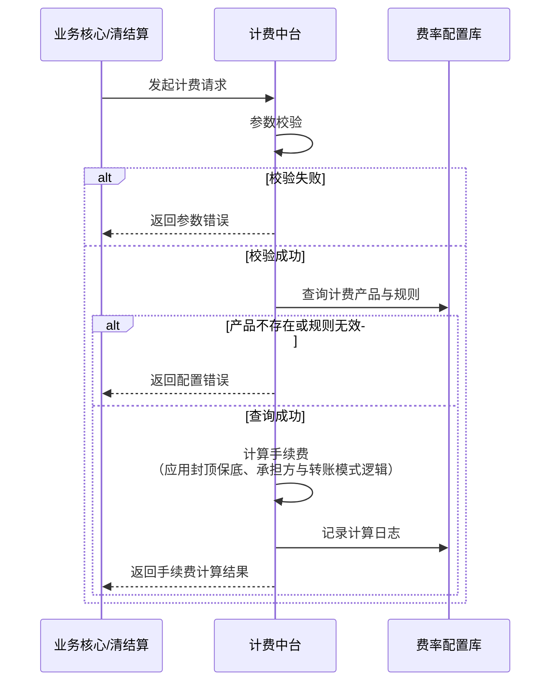

# 模块设计: 计费中台

生成时间: 2026-01-23 14:12:29
批判迭代: 2

---

# 计费中台模块设计文档

## 1. 概述
- **目的与范围**: 本模块负责根据配置的费率规则，计算并生成转账、分账等业务手续费。其核心职责是接收业务核心或清结算系统的计费请求，根据计费产品配置、扣费方式（如按比例或固定金额）以及手续费承担方（付款方或收款方）等参数，计算出应收手续费，并将结果返回给调用方。其边界仅限于手续费的计算，不涉及账户资金的扣减与记账。

## 2. 接口设计
- **API端点 (REST)**: `/api/v1/fee/calculate`
- **请求/响应结构**:
    - **请求方法**: POST
    - **请求体**:
        ```json
        {
            "requestId": "string, 请求唯一标识",
            "caller": "string, 调用方标识（如‘业务核心’、‘清结算’）",
            "businessType": "string, 业务类型（如‘分账’、‘转账’）",
            "amount": "number, 交易金额（单位：分）",
            "feeProductCode": "string, 计费产品编码",
            "feeBearer": "string, 手续费承担方（‘PAYER’ 或 ‘PAYEE’）",
            "transferMode": "string, 转账模式（‘NET’ 净额转账 或 ‘GROSS’ 全额转账）",
            "payerAccountNo": "string, 付款方账户号",
            "payeeAccountNo": "string, 收款方账户号",
            "extInfo": "object, 扩展信息"
        }
        ```
    - **成功响应体**:
        ```json
        {
            "code": "SUCCESS",
            "message": "成功",
            "data": {
                "requestId": "string, 原请求ID",
                "calculatedFee": "number, 计算出的手续费（单位：分）",
                "originalAmount": "number, 原始交易金额（单位：分）",
                "settlementAmount": "number, 结算金额（单位：分，根据转账模式调整后的金额）",
                "feeRuleApplied": "string, 应用的费率规则摘要",
                "calculationTime": "string, 计算时间戳"
            }
        }
        ```
    - **事件发布/消费**: TBD

## 3. 数据模型
- **表/集合**:
    1.  **计费产品表 (fee_product)**: 存储计费产品定义。
    2.  **费率规则表 (fee_rule)**: 存储具体的费率规则，与计费产品关联。
    3.  **计费计算日志表 (fee_calculation_log)**: 记录每次计费请求与结果，用于对账与审计。
- **关键字段**:
    - **fee_product**: `product_code` (主键), `product_name`, `status`, `effective_time`, `expire_time`, `description`。
    - **fee_rule**: `rule_id` (主键), `product_code` (外键), `fee_type` (如 ‘RATE‘， ‘FIXED‘), `rate` (比例，如 0.006 表示 0.6%), `fixed_amount` (固定金额，单位分), `min_fee` (最低手续费，单位分), `max_fee` (最高手续费，单位分), `priority`, `condition_json` (适用条件)。
    - **fee_calculation_log**: `log_id` (主键), `request_id`, `caller`, `business_type`, `original_amount`, `fee_product_code`, `calculated_fee`, `fee_bearer`, `transfer_mode`, `calculation_result`, `request_time`, `response_time`。
- **与其他模块的关系**: 本模块依赖上游系统（业务核心、清结算）传入的计费请求数据。`fee_product` 与 `fee_rule` 表的数据由运营配置系统（如三代运营机构的后台）进行管理。

## 4. 业务逻辑
- **核心工作流/算法**:
    1.  **接收与校验**: 接收计费请求，校验必填参数、金额有效性、计费产品状态。
    2.  **规则查询与匹配**: 根据 `feeProductCode` 查询有效的 `fee_rule`，并根据请求中的业务类型、金额区间等条件匹配优先级最高的适用规则。
    3.  **手续费计算**:
        - **基础计算**: 根据匹配的规则计算基础手续费。
            - 比例费率: `基础手续费 = 原始金额 * 费率`。
            - 固定金额: `基础手续费 = 固定金额`。
        - **封顶保底处理**: 若规则配置了 `min_fee` 或 `max_fee`，则应用 `手续费 = max(min_fee, min(基础手续费, max_fee))`。
        - **舍入规则**: 手续费计算结果向上取整到分。
    4.  **承担方与转账模式处理**:
        - **手续费承担方 (`feeBearer`)**:
            - `PAYER` (付款方承担): 最终应收手续费 = 计算出的手续费。
            - `PAYEE` (收款方承担): 最终应收手续费 = 计算出的手续费。
        - **转账模式 (`transferMode`)**:
            - `NET` (净额转账): 结算金额 = 原始金额 - 最终应收手续费 (当 `feeBearer` 为 `PAYER` 时)。
            - `GROSS` (全额转账): 结算金额 = 原始金额。
        - **逻辑组合**: 手续费金额的计算独立于承担方，但 `transferMode` 影响返回给上游的 `settlementAmount`（结算金额）。手续费由承担方后续在资金流中支付。
    5.  **结果返回与记录**: 组装计算结果，记录日志，返回给调用方。
- **业务规则与验证**: 校验请求参数有效性；确保计费产品处于生效状态；验证金额为正整数。
- **关键边界情况处理**:
    - **费率规则未配置/失效**: 返回明确的“计费产品不存在或已失效”错误。
    - **手续费为0**: 属于正常情况，按0返回。
    - **手续费计算为负数**: 此为逻辑错误，因费率为正，金额为正，不应出现。若出现，视为系统异常，记录错误日志并返回计算失败。
    - **大额交易费率封顶/保底**: 通过 `fee_rule` 表中的 `max_fee` 和 `min_fee` 字段实现。

## 5. 时序图



## 6. 错误处理
- **预期错误情况与错误码**:
    - `INVALID_PARAMETER` (400): 请求参数缺失、格式错误或金额非法。
    - `FEE_PRODUCT_NOT_FOUND` (404): 计费产品编码不存在。
    - `FEE_PRODUCT_INACTIVE` (400): 计费产品未生效或已过期。
    - `FEE_RULE_NOT_APPLICABLE` (400): 未找到适用于当前请求的费率规则。
    - `CALCULATION_ERROR` (500): 手续费计算过程出现逻辑错误（如负手续费）。
    - `SYSTEM_ERROR` (500): 系统内部异常（数据库连接失败等）。
- **处理策略**:
    - 对于客户端错误（4xx），返回具体错误码和信息，调用方不应重试。
    - 对于服务端错误（5xx），记录详细日志并触发告警。调用方可依据策略进行有限次重试。
    - 所有计费请求和结果（包括错误）均记录入 `fee_calculation_log` 表。

## 7. 依赖关系
- **上游模块**:
    - **业务核心**: 在处理分账、转账等交易时，调用本模块计算手续费。
    - **清结算**: 在清分结算过程中，调用本模块计算交易相关手续费。
- **下游模块**: TBD。本模块为纯计算服务，计算结果返回给上游调用方，由上游模块负责后续资金处理。
- **配置管理依赖**: 计费产品与费率规则依赖运营配置系统（如三代运营机构的后台）进行管理。