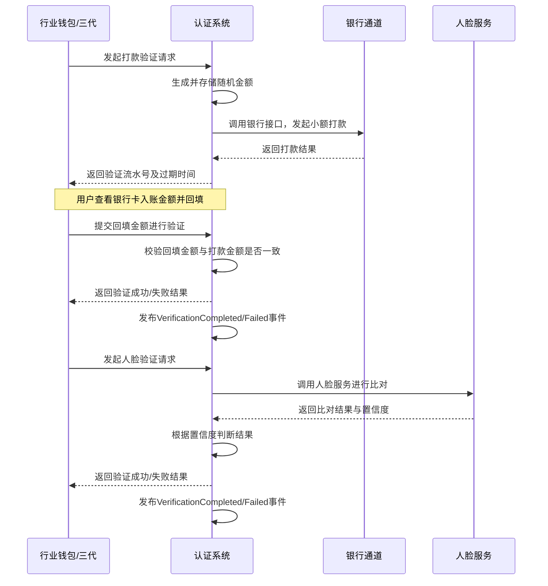

# 模块设计: 认证系统

生成时间: 2026-01-23 14:12:14
批判迭代: 2

---

# 认证系统 模块设计文档

## 1. 概述
- **目的与范围**: 认证系统负责执行打款验证、人脸验证等身份核验功能，为关系绑定、开通付款等业务流程提供身份认证支持。其核心职责是验证用户身份的真实性和授权的有效性，确保资金操作的安全合规。

## 2. 接口设计
- **API端点 (REST/GraphQL)**:
    - `POST /api/v1/verification/payment`: 发起打款验证。
    - `POST /api/v1/verification/face`: 发起人脸验证。
    - `POST /api/v1/verification/confirm`: 提交验证信息（如回填金额）进行确认。
    - `GET /api/v1/verification/record/{id}`: 查询验证记录状态。
- **请求/响应结构**:
    - 发起打款验证请求 (`POST /api/v1/verification/payment`):
        - 请求体: `{“user_id”: “string”, “bank_account”: “string”, “bank_name”: “string”, “id_card”: “string”, “name”: “string”}`
        - 响应体: `{“code”: “string”, “message”: “string”, “data”: {“verification_id”: “string”, “expire_time”: “timestamp”}}`
    - 提交确认请求 (`POST /api/v1/verification/confirm`):
        - 请求体: `{“verification_id”: “string”, “entered_amount”: “number”}` 或 `{“verification_id”: “string”, “face_image”: “base64_string”}`
        - 响应体: `{“code”: “string”, “message”: “string”, “data”: {“result”: “SUCCESS/FAILURE”, “locked_until”: “timestamp”}}`
- **发布/消费的事件**:
    - 发布事件: `VerificationCompleted` (验证成功), `VerificationFailed` (验证失败)。
    - 消费事件: TBD。

## 3. 数据模型
- **表/集合**: `verification_records` (验证记录表)。
- **关键字段**:
    - `id` (主键，验证流水号)
    - `user_id` (用户标识)
    - `type` (验证类型: PAYMENT, FACE)
    - `status` (状态: INITIATED, PENDING, SUCCESS, FAILED, LOCKED)
    - `amount_sent` (打款金额，加密存储)
    - `amount_entered` (用户回填金额)
    - `bank_account` (银行卡号，加密存储)
    - `face_data_hash` (人脸图像哈希值，用于比对)
    - `request_time` (请求时间)
    - `expire_time` (过期时间)
    - `failure_count` (失败次数)
    - `locked_until` (锁定截止时间)
    - `external_ref` (外部关联ID，如电子协议ID)
- **与其他模块的关系**: 认证系统与电子签章系统在复合认证流程中存在交互（例如，在关系绑定流程中，认证完成后触发电子协议签署）。与行业钱包、三代系统通过API交互接收验证请求。

## 4. 业务逻辑
- **核心工作流/算法**:
    1. **打款验证**:
        - 接收验证请求，生成一个密码学安全的随机小数金额（如0.01-0.99元）。
        - 将生成的金额加密后存储于`amount_sent`字段。
        - 调用银行通道接口发起小额打款。
        - 等待用户回填金额，比对回填金额与存储的`amount_sent`（允许微小误差，如±0.001元）。
    2. **人脸验证**:
        - 接收验证请求，获取用户提供的姓名、身份证号和人脸图像。
        - 调用第三方人脸识别服务，进行活体检测与三要素（姓名、身份证号、人脸）比对。
        - 根据服务返回的置信度分数判断验证结果。
- **业务规则与验证**:
    - 打款验证金额需使用密码学安全的随机数生成器生成。
    - 所有人脸生物特征数据在传输和临时处理过程中需脱敏或加密，不持久化存储原始图像。
    - 所有验证请求均有有效期（如10分钟），超时自动失效。
- **关键边界情况处理**:
    - **验证失败次数限制与锁定机制**: 同一验证标的（如银行卡/用户）连续失败3次后，状态置为`LOCKED`，锁定24小时。解锁可通过人工审核或锁定时间过期自动解除。
    - **打款验证中银行打款失败的处理**: 首次失败自动重试1次（更换通道或稍后重试）。若再次失败，则验证状态置为`FAILED`，并记录失败原因。需通知运营人员并告警。
    - **验证超时处理**: 系统定时任务扫描状态为`PENDING`且已过`expire_time`的记录，自动将其状态更新为`FAILED`。

## 5. 时序图

## 6. 错误处理
- **预期错误情况**:
    - 银行打款通道异常或失败。
    - 人脸识别服务不可用或超时。
    - 用户回填金额错误、超时或验证次数超限。
    - 网络超时或系统内部错误。
- **处理策略**:
    - 对银行通道、人脸服务等外部依赖设置指数退避重试机制（最多2次）和熔断器。
    - 所有验证操作记录详细流水日志，包含请求、响应、关键中间状态，便于审计与问题追踪。
    - 向调用方返回结构化的错误码和用户友好的提示信息。
    - 对系统级错误进行监控告警。

## 7. 依赖关系
- **上游模块**: 行业钱包、三代（发起认证请求）。
- **下游模块/服务**: 银行系统（执行打款）、第三方人脸识别服务（执行人脸比对）。
- **协作模块**: 电子签章系统。在关系绑定等复合流程中，认证系统完成验证后，可通过发布`VerificationCompleted`事件或同步API回调，通知电子签章系统进入后续签署流程。具体交互模式为事件驱动。