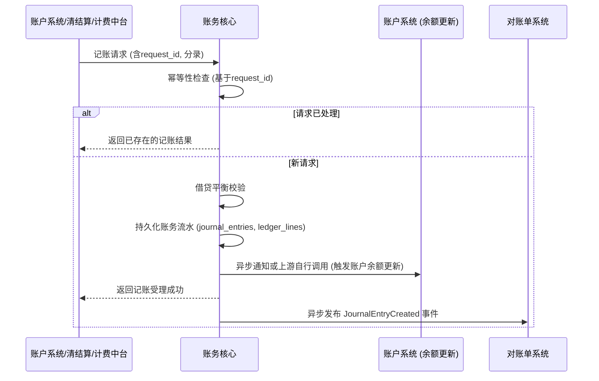

# 模块设计: 账务核心

生成时间: 2026-01-23 14:12:10
批判迭代: 2

---

# 账务核心 模块设计文档

## 1. 概述
- **目的与范围**: 本模块负责记录所有资金变动流水，进行会计分录记账。它是资金流转的最终账务记录中心，确保所有涉及账户余额变动的操作都有准确、可追溯的账务记录。核心职责包括接收记账指令、执行复式记账、生成账务流水，并为下游对账系统提供数据。

## 2. 接口设计
- **API端点 (REST/GraphQL)**:
    - `POST /api/v1/journal/entries`: 接收记账请求，创建会计分录。
    - `GET /api/v1/journal/entries/{request_id}`: 根据请求ID查询记账结果。
- **请求/响应结构**:
    - 记账请求 (`POST /api/v1/journal/entries`):
        ```json
        {
          "request_id": "unique_request_identifier",
          "business_type": "TRANSFER|FEE|SETTLEMENT|...",
          "business_ref": "关联业务订单号",
          "entries": [
            {
              "account_id": "账户ID",
              "amount": "100.00",
              "dr_cr": "DEBIT",
              "currency": "CNY"
            },
            {
              "account_id": "账户ID",
              "amount": "100.00",
              "dr_cr": "CREDIT",
              "currency": "CNY"
            }
          ]
        }
        ```
    - 记账响应:
        ```json
        {
          "code": "SUCCESS",
          "message": "成功",
          "data": {
            "journal_entry_id": "账务流水主ID",
            "status": "SUCCESS",
            "created_at": "2023-01-01T00:00:00Z"
          }
        }
        ```
- **发布/消费的事件**:
    - 消费事件: TBD (例如，来自**账户系统**的余额更新成功事件、来自**计费中台**的计费完成事件)
    - 发布事件: `JournalEntryCreated` (账务流水已创建)，供**对账单系统**等下游模块订阅。

## 3. 数据模型
- **表/集合**:
    - `journal_entries` (账务流水主表): 记录每笔记账请求。
    - `ledger_lines` (会计分录明细表): 记录每笔分录的借贷明细。
- **关键字段**:
    - `journal_entries`:
        - `id` (主键)
        - `request_id` (唯一业务请求ID，用于幂等)
        - `business_type` (业务类型)
        - `business_ref` (关联业务订单号)
        - `status` (状态: PROCESSING, SUCCESS, FAILED)
        - `created_at`, `updated_at`
    - `ledger_lines`:
        - `id` (主键)
        - `journal_entry_id` (外键)
        - `account_id` (账户ID)
        - `amount` (金额)
        - `dr_cr` (借贷方向: DEBIT/CREDIT)
        - `currency` (币种)
        - `line_no` (行号)
- **与其他模块的关系**: 接收来自**账户系统**（余额变动）、**清结算**（清分结算指令）、**计费中台**（手续费记录）的资金变动指令，记录账务流水。为**对账单系统**提供动账明细数据源。

## 4. 业务逻辑
- **核心工作流/算法**:
    1. **接收与幂等校验**: 接收记账请求，首先根据 `request_id` 查询 `journal_entries` 表。若已存在成功记录，则直接返回历史结果；若存在处理中记录，则等待或返回处理中状态；否则，创建新记录。
    2. **借贷平衡校验**: 对请求中的 `entries` 数组进行校验，确保所有分录的借方总金额等于贷方总金额。校验失败则拒绝请求。
    3. **持久化流水**: 校验通过后，将主记录 (`journal_entries`) 和明细记录 (`ledger_lines`) 在同一个数据库事务中持久化。
    4. **状态更新与事件发布**: 持久化成功后，将主记录状态更新为 `SUCCESS`，并异步发布 `JournalEntryCreated` 事件。
- **业务规则与验证**:
    - 每笔分录必须借贷平衡。
    - `request_id` 全局唯一，确保幂等性。
    - `business_ref` 用于关联上游业务订单。
- **关键边界情况处理**:
    - **重复请求 (幂等)**: 通过 `request_id` 机制保证。
    - **记账与账户余额更新的分布式事务**: 采用最终一致性策略。账务核心记录流水后，异步监听**账户系统**的余额更新结果事件。若账户更新失败，账务流水状态标记为待核对 (`RECONCILIATION_NEEDED`)，触发告警并需人工介入处理。
    - **与计费中台的协作**: 对于涉及手续费的业务（如分账），**清结算**或**业务核心**会先调用**计费中台**计算费用，然后将本金和手续费拆分，分别向账务核心发起记账请求。账务核心不直接调用计费中台。

## 5. 时序图


## 6. 错误处理
- **预期错误情况**:
    1. **请求数据错误**: `request_id` 格式错误、`entries` 为空、借贷不平衡、金额格式错误。
    2. **系统内部错误**: 数据库连接失败、持久化异常、消息发布失败。
    3. **分布式不一致**: 账务流水记录成功，但关联的账户余额更新失败。
- **处理策略**:
    - 对于请求数据错误，在校验阶段直接拒绝，返回明确的错误码和描述。
    - 对于系统内部错误，记录详细错误日志，触发告警，并向上游返回系统繁忙或失败响应，建议重试（依赖`request_id`幂等）。
    - 对于分布式不一致，将相关流水标记为 `RECONCILIATION_NEEDED` 状态，记录异常上下文，触发高级别告警，需运营或开发人员介入进行账务核对与人工补账。

## 7. 依赖关系
- **上游模块**:
    - **账户系统**: 提供账户余额变动的最终动因，账务核心记录其对应的会计分录。
    - **清结算**: 在清分、结算过程中产生资金划转指令，触发记账。
    - **计费中台**: 产生手续费计费结果，由上游模块将手续费作为独立的记账请求发送至账务核心。
- **下游模块**:
    - **对账单系统**: 订阅账务核心发布的账务流水事件，作为生成账户动账明细对账单的核心数据源。