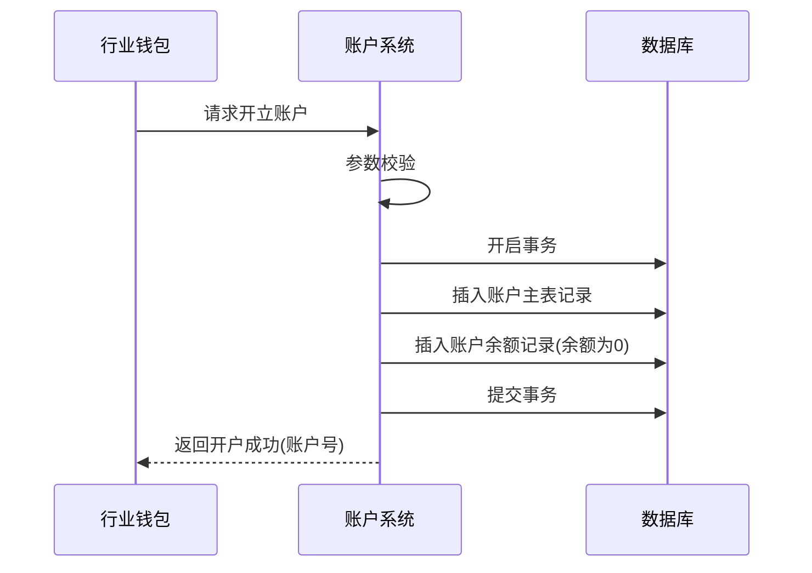
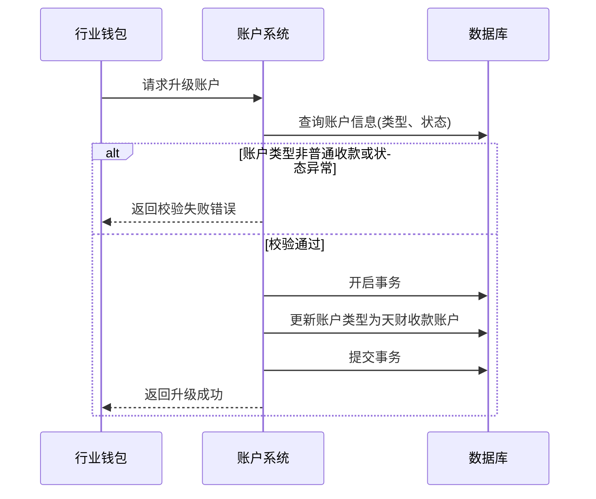
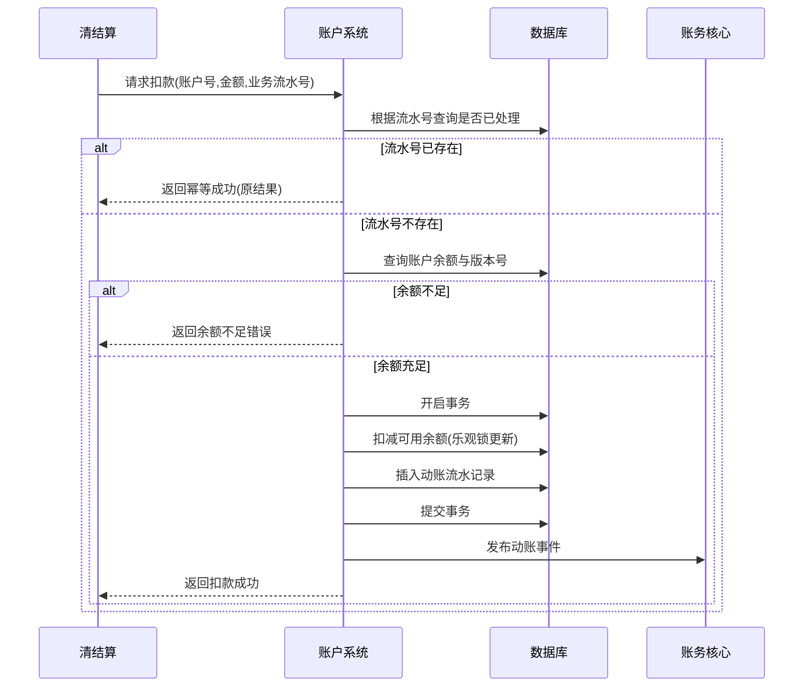

# 模块设计: 账户系统

生成时间: 2026-01-23 14:12:18
批判迭代: 2

---

# 账户系统模块设计文档

## 1. 概述
- **目的与范围**：本模块负责各类账户（如收款账户、接收方账户）的开立、升级、资金扣减/增加、余额管理等底层账户操作。其边界止于账户层面的资金变动指令执行与余额管理，不涉及业务逻辑（如分账校验）和资金清分结算逻辑。账户系统负责记录所有账户资金变动流水，并同步至账务核心进行会计分录记账，两者职责明确，无重叠。

## 2. 接口设计
- **API端点 (REST)**：
    - `POST /api/v1/accounts`：开立账户。
    - `PUT /api/v1/accounts/{accountNo}/upgrade`：升级账户。
    - `POST /api/v1/accounts/{accountNo}/actions/debit`：执行扣款。
    - `POST /api/v1/accounts/{accountNo}/actions/credit`：执行加款。
    - `POST /api/v1/accounts/{accountNo}/actions/freeze`：执行资金冻结。
    - `POST /api/v1/accounts/{accountNo}/actions/unfreeze`：执行资金解冻。
    - `GET /api/v1/accounts/{accountNo}/balance`：查询账户余额。
- **请求/响应结构**：
    - 通用请求头：`X-Request-ID`（请求流水号，用于幂等）。
    - 通用响应体：`{“code”: “string”, “msg”: “string”, “data”: object, “requestId”: “string”}`。
    - 示例（开立账户请求）：
        ```json
        {
          “accountType”: “NORMAL_RECEIVE”,
          “institutionNo”: “string”,
          “relatedUserId”: “string”,
          “currency”: “CNY”
        }
        ```
    - 示例（资金操作请求）：
        ```json
        {
          “amount”: 10000,
          “businessOrderNo”: “string”,
          “remark”: “string”
        }
        ```
- **发布/消费的事件**：
    - 消费事件：TBD（上游模块如清结算、行业钱包发起的指令事件）。
    - 发布事件：`AccountTransactionEvent`（账户动账事件），包含流水号、账户号、交易类型、金额、业务订单号等字段，供账务核心订阅。

## 3. 数据模型
- **表/集合**：
    - `account_main`（账户主表）
    - `account_balance`（账户余额表）
    - `account_transaction_flow`（账户动账流水表）
- **关键字段与关系**：
    - `account_main`：
        - `account_no` (VARCHAR(32), PRIMARY KEY): 账户号。
        - `account_type` (VARCHAR(20)): 账户类型（`TIANCAI_RECEIVE`-天财收款账户， `TIANCAI_RECEIVER`-天财接收方账户， `NORMAL_RECEIVE`-普通收款账户， `PENDING_SETTLEMENT`-待结算账户， `REFUND`-退货账户）。
        - `institution_no` (VARCHAR(20)): 所属机构号。
        - `status` (VARCHAR(10)): 状态（`NORMAL`-正常， `FROZEN`-冻结， `CLOSED`-注销）。
        - `related_user_id` (VARCHAR(64)): 关联商户/用户ID。
        - `created_at` (DATETIME): 创建时间。
        - `updated_at` (DATETIME): 更新时间。
        - `version` (INT, DEFAULT 0): 数据版本号（用于乐观锁）。
        - 索引：`idx_institution_no`(`institution_no`), `idx_related_user`(`related_user_id`), `idx_status`(`status`)。
    - `account_balance`：
        - `id` (BIGINT, PRIMARY KEY, AUTO_INCREMENT): 主键ID。
        - `account_no` (VARCHAR(32), FOREIGN KEY REFERENCES `account_main`(`account_no`), UNIQUE): 账户号。
        - `available_balance` (DECIMAL(15,2), DEFAULT 0.00): 可用余额。
        - `frozen_balance` (DECIMAL(15,2), DEFAULT 0.00): 冻结余额。
        - `currency` (VARCHAR(3)): 账户币种。
        - `updated_at` (DATETIME): 更新时间。
        - 索引：`idx_account_no`(`account_no`)。
    - `account_transaction_flow`：
        - `flow_no` (VARCHAR(64), PRIMARY KEY): 流水号。
        - `account_no` (VARCHAR(32), FOREIGN KEY REFERENCES `account_main`(`account_no`)): 账户号。
        - `transaction_type` (VARCHAR(10)): 交易类型（`CREDIT`-入账， `DEBIT`-出账， `FREEZE`-冻结， `UNFREEZE`-解冻）。
        - `amount` (DECIMAL(15,2)): 变动金额。
        - `balance_before` (DECIMAL(15,2)): 变动前余额。
        - `balance_after` (DECIMAL(15,2)): 变动后余额。
        - `business_order_no` (VARCHAR(64)): 关联业务订单号。
        - `created_at` (DATETIME): 记账时间。
        - 索引：`idx_account_no`(`account_no`), `idx_business_order`(`business_order_no`), `idx_created_at`(`created_at`)。
- **与其他模块的关系**：`account_transaction_flow` 表记录的资金变动流水，将作为事件源同步至账务核心进行会计分录记账。账户系统负责记录交易事实，账务核心负责会计处理，职责分离。

## 4. 业务逻辑
- **核心工作流/算法**：
    1.  **账户开立**：接收开户请求，校验必要参数，在 `account_main` 和 `account_balance` 表中创建记录，初始化余额为0。
    2.  **账户升级**：接收升级请求，校验原账户类型是否为 `NORMAL_RECEIVE`（普通收款账户）且状态为 `NORMAL`。校验通过后，将 `account_main.account_type` 更新为 `TIANCAI_RECEIVE`（天财收款账户）。
    3.  **资金操作（扣减/增加/冻结/解冻）**：
        - 在数据库事务内执行。
        - 使用 `account_balance` 表的 `version` 字段实现乐观锁控制并发。
        - 根据指令计算新的可用余额与冻结余额，更新 `account_balance` 表并递增版本号。
        - 在 `account_transaction_flow` 表中插入动账流水记录。
        - 发布 `AccountTransactionEvent` 事件。
- **业务规则与验证**：
    - 执行扣款前必须校验账户可用余额是否充足。
    - 冻结/解冻操作需校验账户状态是否为 `NORMAL`。
    - 账户升级需校验原账户类型为 `NORMAL_RECEIVE`。
    - 所有资金操作需通过 `business_order_no` 保证幂等性，重复请求直接返回已存在的流水记录。
- **关键边界情况处理**：
    - **并发控制**：采用乐观锁机制（基于 `version` 字段），更新失败时重试或返回冲突错误。
    - **幂等性**：通过业务流水号 (`business_order_no`) 唯一索引保证，防止重复处理。
    - **事务一致性**：资金操作涉及余额更新与流水记录插入，必须在同一数据库事务中完成。

## 5. 时序图

### 账户开立时序图


### 账户升级时序图


### 资金扣减时序图（含错误处理）


## 6. 错误处理
- **预期错误情况与错误码**：
    - `ACCOUNT_NOT_FOUND` (1001)：账户不存在。
    - `ACCOUNT_STATUS_INVALID` (1002)：账户状态异常（非正常状态）。
    - `INSUFFICIENT_BALANCE` (1003)：账户可用余额不足。
    - `DUPLICATE_REQUEST` (1004)：重复的业务流水号请求。
    - `ACCOUNT_TYPE_UPGRADE_INVALID` (1005)：账户类型不符合升级条件。
    - `CONCURRENT_OPERATION_CONFLICT` (1006)：并发操作冲突（乐观锁更新失败）。
    - `DOWNSTREAM_SERVICE_UNAVAILABLE` (2001)：下游服务（如数据库、消息队列）不可用。
- **处理策略**：
    - 业务错误（1xxx）：返回具体错误码和信息，拒绝操作。对于幂等请求，返回已成功的结果。
    - 系统错误（2xxx）：记录详细日志，告警。尝试重试或熔断，向上游返回系统繁忙或操作失败，建议稍后重试。
    - 依赖故障：对于账务核心事件发布失败，采用本地事务表与异步重试机制，确保最终一致性。

## 7. 依赖关系
- **上游模块**：
    - **清结算**：发起资金冻结/解冻、扣减/增加指令。
    - **行业钱包**：发起开户、升级指令。
- **下游模块**：
    - **账务核心**：订阅账户系统发布的动账事件，进行会计分录记账。
- **基础设施依赖**：数据库、消息中间件。