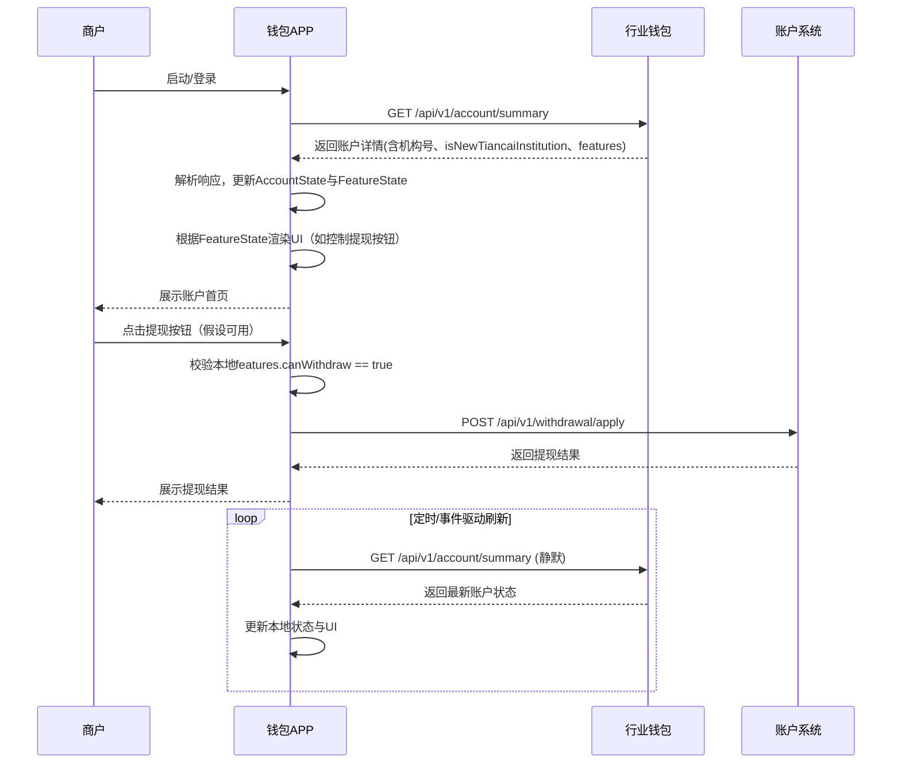

# 模块设计: 钱包APP

生成时间: 2026-01-23 14:12:24
批判迭代: 2

---

# 钱包APP模块设计文档

## 1. 概述
- **目的与范围**: 钱包APP是面向商户的移动端应用。其核心职责是为商户提供账户信息展示、分账、提现等资金操作界面。本模块需根据商户的机构号属性，对天财新机构号动态隐藏或禁用提现等特定功能入口，以符合业务管控要求。
- **设计原则**: 前端界面状态由后端数据驱动，确保功能控制逻辑与后端业务规则一致。

## 2. 接口设计
- **API端点 (REST)**: 钱包APP通过调用后端服务提供的RESTful API获取数据与执行业务操作。主要依赖以下接口：
    1.  **账户信息查询接口** (`GET /api/v1/account/summary`): 用于获取当前登录商户的账户概览信息，包括账户类型、余额、状态及机构号属性。
    2.  **提现申请接口** (`POST /api/v1/withdrawal/apply`): 用于提交提现申请。
- **请求/响应结构**:
    - 账户信息查询响应示例：
        ```json
        {
          "code": 0,
          "msg": "success",
          "data": {
            "accountNo": "ACC20240001",
            "accountType": "天财收款账户",
            "balance": "1000.00",
            "status": "NORMAL",
            "institutionNo": "INS002", // 机构号
            "isNewTiancaiInstitution": true, // 是否为天财新机构号标识
            "features": {
              "canWithdraw": false,
              "canTransfer": true
            }
          }
        }
        ```
    - 提现申请请求示例：
        ```json
        {
          "amount": "500.00",
          "bankCardNo": "6217000010000001234"
        }
        ```
- **发布/消费的事件**: TBD

## 3. 数据模型
- **前端状态模型 (View Model)**: 钱包APP内部维护以下核心状态模型以驱动UI渲染。
    - `AccountState`: 账户状态
        - `accountNo` (String): 账户号
        - `accountType` (String): 账户类型（如“天财收款账户”）
        - `balance` (Decimal): 可用余额
        - `status` (String): 账户状态（NORMAL, FROZEN）
        - `institutionNo` (String): 机构号
        - `isNewTiancaiInstitution` (Boolean): 是否为天财新机构号
        - `features` (FeatureState): 功能可用性状态
    - `FeatureState`: 功能开关状态
        - `canWithdraw` (Boolean): 提现功能是否可用
        - `canTransfer` (Boolean): 转账/分账功能是否可用
- **数据持久化**: APP本地可缓存`AccountState`，用于启动时快速展示及网络异常时降级处理。缓存键为`current_account_{userId}`。
- **与其他模块的关系**: 前端数据模型映射自**行业钱包**与**账户系统**后端接口返回的DTO。

## 4. 业务逻辑
- **核心工作流**:
    1.  **启动与登录**: 用户登录后，APP调用账户信息查询接口，获取完整的账户信息与功能状态。
    2.  **状态判定与UI渲染**: 解析响应中的`isNewTiancaiInstitution`字段及`features`对象，据此控制各功能入口（如提现按钮）的显示（`display: none`）或交互状态（`disabled`）。
    3.  **操作拦截**: 在用户发起提现等受控操作前，再次校验本地`FeatureState`，若不可用则阻止请求发出并给出提示。
    4.  **状态同步**: 在APP切换到前台或用户手动下拉刷新时，重新调用账户信息查询接口，更新本地状态，确保功能控制与后端最新状态一致。
- **业务规则与验证**:
    - **天财新机构号判定规则**: 完全依赖后端接口返回的`isNewTiancaiInstitution`布尔值。该标识由**行业钱包**系统根据机构号配置的业务规则生成。
    - **UI控制逻辑**: UI组件（如按钮）的可见性与可用性绑定至`FeatureState`中的对应字段。例如：`提现按钮.visible = features.canWithdraw`。
    - **操作权限验证**: 所有涉及资金变动的操作（如提现），在调用后端API前，必须确保本地`features`中对应功能为`true`，并检查账户`status`为`NORMAL`。
- **关键边界情况处理**:
    - **初始数据加载失败**: 显示友好错误页，提供“重试”按钮。
    - **缓存数据过时**: 每次成功调用账户信息接口后，更新本地缓存。使用缓存数据时，需明确提示用户“数据可能不是最新的”。

## 5. 时序图



## 6. 错误处理
- **预期错误情况与处理策略**:
    1.  **网络请求失败（超时、断开）**:
        - **策略**: 显示网络异常提示，并提供“重试”按钮。对于首页数据加载，可展示最后一次成功的缓存数据（若有）并标记为“缓存数据”。
    2.  **后端业务错误（HTTP 4xx/5xx）**:
        - **策略**: 解析响应体中的错误码和消息，向用户展示友好的业务提示。例如：`{“code”: “ACCOUNT_FROZEN”, “msg”: “账户已冻结，无法操作”}`。
    3.  **权限不足或功能禁用（如提现接口返回特定错误码）**:
        - **策略**: 提示用户“当前功能不可用”，并同步触发一次账户状态刷新，更新本地`FeatureState`。
    4.  **数据解析失败**:
        - **策略**: 记录日志，提示用户“数据加载异常，请稍后重试”。
- **降级方案**: 核心页面（如账户首页）在首次加载失败后，可尝试显示本地缓存的历史数据，并明确提示用户当前为离线状态。

## 7. 依赖关系
- **上游模块**:
    - **行业钱包**: 依赖其`/api/v1/account/summary`接口，获取决定UI状态的核心数据（机构号属性、功能开关）。
    - **账户系统**: 依赖其`/api/v1/withdrawal/apply`接口，执行提现资金操作。
- **下游模块**: TBD
- **隐式依赖**: 网络状态、用户登录态管理模块。