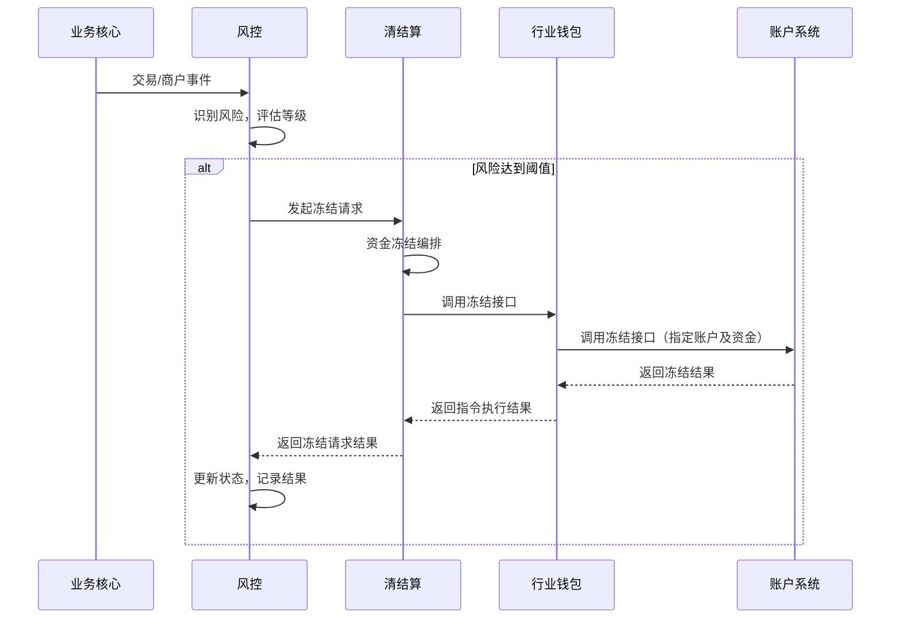

# 模块设计: 风控

生成时间: 2026-01-23 14:12:07
批判迭代: 2

---

# 风控模块设计文档

## 1. 概述
- **目的与范围**: 本模块负责识别交易或商户风险，并触发冻结等管控措施。核心职责包括对商户风险进行识别与评估，以及对特定交易的风险进行判断，并根据风险等级向**清结算**模块发起冻结请求。其边界止于风险识别与管控指令的发起，不直接与**账户系统**或**行业钱包**交互，也不管理指令的执行生命周期。

## 2. 接口设计
- **API端点 (REST/GraphQL)**: TBD
- **请求/响应结构**: TBD
- **发布/消费的事件**:
    - **发布事件**: `RiskEvent` (风险事件)，包含风险主体（商户/交易）、风险类型、风险等级、触发规则等信息。
    - **消费事件**: TBD（可能消费来自**业务核心**的交易/商户状态变更事件作为风险识别数据源）。

## 3. 数据模型
- **表/集合**: TBD
- **关键字段**: TBD
- **与其他模块的关系**: 本模块通过事件或API向**清结算**模块发起冻结请求。依赖**业务核心**等模块提供的数据进行风险识别。

## 4. 业务逻辑
- **核心工作流/算法**:
    1.  **风险识别**: 通过监听业务事件（如交易创建、结算完成）或定时任务扫描，获取商户与交易数据。通过内置规则引擎（规则TBD）评估风险，生成风险事件与等级。
    2.  **冻结发起**: 当风险等级达到预设阈值时，构造冻结请求（包含冻结类型：商户冻结/交易冻结、目标标识、风险依据等），调用**清结算**的冻结编排接口。
    3.  **请求幂等性处理**: 对同一风险主体（商户ID/交易ID）的冻结请求，通过检查本地记录的状态（如“已发起冻结”），确保仅发起一次有效请求。
    4.  **结果处理**: 监听**清结算**返回的冻结结果事件，更新本地冻结请求状态，记录成功或失败。对于失败结果，根据失败原因决定是否重试或告警。
- **业务规则与验证**: 风险识别规则（如商户行为模式、交易特征等）由风控策略决定，具体规则TBD。
- **关键边界情况处理**:
    - **重复冻结请求**: 通过幂等性检查，对已发起或已成功的冻结请求，直接返回已有状态，不重复发起。
    - **下游执行失败**: **清结算**执行冻结失败后，本模块根据失败原因（如参数错误、系统异常）决定后续动作。对于暂时性系统错误，可配置重试机制；对于业务性失败（如账户不存在），记录失败原因并告警运营人员，不自动重试。

## 5. 时序图

## 6. 错误处理
- **预期错误情况**:
    1) 下游系统（**清结算**）服务不可用或超时。
    2) 冻结请求参数错误（如不存在的商户或交易标识）。
    3) **清结算**返回冻结执行失败（可能因账户余额不足、账户状态异常等）。
    4) 风险识别依赖的数据源异常。
- **处理策略**:
    - 对于下游系统暂时性错误，采用带退避策略的重试机制，并记录日志告警。
    - 对于参数错误，应在发起请求前进行基础校验，校验失败则记录错误不发起请求。
    - 对于**清结算**返回的业务性失败，记录具体失败原因，通知运营人员处理，不自动重试。
    - 数据源异常时，暂停部分风险识别任务并告警。

## 7. 依赖关系
- **上游模块**: 依赖**业务核心**提供交易和商户数据以进行风险识别。具体依赖方式TBD。
- **下游模块**: **清结算**模块依赖本模块下发的冻结请求来编排执行资金管控。