# DocuFlow-AI Project - 软件设计文档
生成时间: 2026-01-26 15:30:09

## 目录
1. [概述说明](#1-概述说明)
   - 1.1 [术语与缩略词](#11-术语与缩略词)
2. [系统设计](#2-系统设计)
3. [模块设计](#3-模块设计)
   - 3.1 [三代](#module-1)
   - 3.2 [行业钱包](#module-2)
   - 3.3 [账户系统](#module-3)
   - 3.4 [清结算](#module-4)
   - 3.5 [电子签约平台](#module-5)
   - 3.6 [计费中台](#module-6)
   - 3.7 [对账单系统](#module-7)
   - 3.8 [业务核心](#module-8)
   - 3.9 [账务核心](#module-9)
   - 3.10 [认证系统](#module-10)
   - 3.11 [交易系统](#module-11)
   - 3.12 [代付系统](#module-12)
   - 3.13 [风控](#module-13)
   - 3.14 [用户中心](#module-14)
4. [接口设计](#4-接口设计)
5. [数据库设计](#5-数据库设计)

---
# 1 概述说明

## 1.1 术语与缩略词


## 角色

- **天财**: 提出分账需求的合作方或平台，通过开放平台分配APPID与三代运营分配的机构号进行系统对接。
- **总部** (别名: 总店, 品牌, 品牌/总部): 品牌或集团的管理方，在分账业务中作为资金归集的收方或分账的付方，角色为企业。
- **门店**: 隶属于总部的经营单元，在分账业务中可作为资金归集的付方或分账的收方。
- **接收方** (别名: 入账方): 在批量付款场景中接收资金的非收单商户或个人，开立天财接收方账户。
- **三代**: 拉卡拉内部系统，负责商户入网审核、开户接口调用、计费配置等核心业务处理。
- **行业钱包** (别名: 钱包系统): 拉卡拉内部系统，负责天财专用账户的开户管理、关系绑定校验、分账请求处理等业务逻辑。
- **账户系统**: 底层账户管理系统，负责天财专用账户的开立、升级、余额变动及权限控制。
- **清结算**: 负责资金清算、结算处理、手续费清分以及退货账户查询等功能的系统。
- **电子签约平台** (别名: 电子签章系统): 负责协议模板管理、短信推送、H5页面封装以及打款验证、人脸验证等签约认证流程的系统。
- **计费中台**: 提供转账计费能力，生成计费流水并同步费率信息的系统。
- **对账单系统**: 生成并提供机构层各类账户动账明细、交易明细及分账指令账单的系统。
- **业务核心**: 接收并处理天财分账交易数据的系统。

## 业务实体

- **天财专用账户**: 为满足天财分账需求而开立的专用账户类型，包括天财收款账户和天财接收方账户，在账户系统底层有特殊标记和权限控制。
- **天财收款账户**: 收单商户开立的专用账户，类型为行业钱包，用于资金归集、分账和提现，分为总部和门店角色。
- **天财接收方账户**: 非收单商户或个人开立的专用账户，主要用于接收分账资金和提现。
- **收单商户**: 通过拉卡拉进行收款交易的商户，分为企业或个体类型，可开立天财收款账户。
- **待结算账户** (别名: 01待结算账户): 收单商户的01类型账户，用于暂存未结算的交易资金。
- **退货账户** (别名: 04退货账户): 收单商户的04类型账户，用于处理退货资金。

## 流程

- **分账** (别名: 转账, 天财转账): 天财收款账户向其他天财收款账户或天财接收方账户进行资金划转的业务操作，交易类型定义为“天财分账”。
- **归集** (别名: 资金归集): 业务场景之一，指将门店的资金归集到总部的过程，需要建立归集授权关系。
- **会员结算**: 业务场景之一，指总部将会员支付的结算金额分账给对应门店的过程。
- **批量付款** (别名: 批付): 业务场景之一，指总部基于门店组关系，向多个收款方（如供应商、员工）发起批量转账付款。
- **关系绑定** (别名: 绑定关系): 在分账业务中，为不同场景（归集、会员结算、批量付款）建立付方与收方授权关系的过程，包含协议签署和认证。
- **开通付款**: 在批量付款和会员结算场景下，付方（总部/门店）需要额外完成的签约与认证流程，以激活付款能力。

## 技术术语

- **打款验证**: 一种认证方式，通过向目标银行账户打小额随机金额，验证回填金额和备注是否正确。
- **人脸验证**: 一种针对个人或个体接收方的认证方式，通过比对姓名、身份证和人脸信息确保一致性。
- **主动结算**: 一种结算模式，交易资金结算至商户指定的结算账户（如天财收款账户）。
- **被动结算**: 一种结算模式，交易资金结算至默认的待结算账户。
- **机构号**: 由三代运营分配给天财的唯一标识，用于区分业务归属和权限控制。

---
# 2 系统设计
## 2.1 系统结构
本系统为面向“天财”合作方的分账业务平台，采用分布式微服务架构。系统以“三代”作为业务入口与核心协调方，通过“行业钱包”处理核心分账逻辑，并依赖“账户系统”、“清结算”、“电子签约平台”等专业系统完成资金、账户、认证等专项服务。各模块职责清晰，通过API进行松耦合交互，共同支撑归集、会员结算、批量付款三大业务场景。


## 2.2 功能结构
系统功能围绕天财分账业务的核心流程展开，划分为商户与账户管理、分账交易处理、资金结算、签约认证、风控对账五大功能域。


## 2.3 网络拓扑图
TBD

## 2.4 数据流转
数据流转以一笔“会员结算”场景的分账交易为例，描述从交易发起到资金划转完成的关键数据流。


## 2.5 系统模块交互关系
模块间主要通过同步API调用进行交互，部分场景辅以异步消息通知。核心交互围绕“行业钱包”、“账户系统”、“清结算”和“电子签约平台”展开。


---
# 3 模块设计

<a id="module-1"></a>

## 3.1 三代


### 1. 概述
- **目的与范围**: 本模块是拉卡拉内部核心业务处理系统，负责商户入网审核、机构号分配、下游开户接口调用、计费配置等核心业务处理。它为“天财”提供机构号分配，并与行业钱包、账户系统等模块对接，是分账业务中商户和账户管理的起点。
- **角色澄清**: 根据术语表，“三代”在此文档中特指拉卡拉内部系统模块，而非角色。其角色定义为“拉卡拉内部系统，负责商户入网审核、开户接口调用、计费配置等核心业务处理”，与本模块定义一致。

### 2. 接口设计
- **API端点 (REST/GraphQL)**: 本模块通过开放平台向“天财”提供RESTful API。
    - `POST /v1/merchant/register`: 接收天财提交的商户入网申请。
    - `GET /v1/merchant/status/{applicationId}`: 查询商户入网申请状态。
    - `POST /v1/account/open`: 触发天财专用账户开户流程。
- **请求/响应结构**:
    - `POST /v1/merchant/register` 请求体包含：合作方/平台基本信息、资质文件链接、联系人信息。
    - 成功响应包含：`applicationId`（申请流水号）、`status`（审核中）。
    - `POST /v1/account/open` 请求体包含：`institutionCode`（机构号）、`accountType`（账户类型：收款账户/接收方账户）、`merchantInfo`（商户详情）。
    - 成功响应包含：`requestId`（开户请求ID）、`status`（处理中）。
- **发布/消费的事件**:
    - 发布事件：`MerchantAuditPassed`（商户审核通过）、`AccountOpeningTriggered`（开户已触发）。
    - 消费事件：TBD（依赖于上游“天财”通过开放平台推送的申请指令）。

### 3. 数据模型
- **表/集合**:
    - `merchant_application`: 商户入网申请记录表。
    - `institution_mapping`: 机构号映射表。
    - `account_opening_task`: 开户任务记录表。
- **关键字段**:
    - `merchant_application`: `application_id`（主键）、`app_id`（天财APPID）、`merchant_info`（JSON）、`audit_status`、`audit_comment`、`institution_code`（审核通过后填入）、`created_at`。
    - `institution_mapping`: `institution_code`（主键，机构号）、`app_id`、`status`（启用/停用）、`assigned_at`。
    - `account_opening_task`: `task_id`、`institution_code`、`account_type`、`request_payload`、`downstream_system`（行业钱包/账户系统）、`task_status`、`result`、`created_at`。
- **与其他模块的关系**: 通过`institution_code`与“天财”系统关联；通过`task_id`和`downstream_system`跟踪与行业钱包、账户系统的交互。

### 4. 业务逻辑
- **核心工作流/算法**:
    1.  **商户入网审核**: 接收“天财”通过开放平台提交的入网申请，进行资质审核（人工或自动）。
    2.  **机构号分配**: 为通过审核的申请分配全局唯一的机构号，并建立与天财APPID的绑定关系。
    3.  **触发开户**: 根据业务场景（如需要收款或分账），构造开户请求，调用行业钱包系统的开户接口。行业钱包负责业务逻辑校验与关系绑定，并最终调用账户系统完成底层账户开立。
    4.  **计费配置**: 在商户审核通过后，同步商户信息至计费中台，配置基础计费规则。
- **业务规则与验证**:
    1.  同一合作方（APPID）仅能分配一个有效机构号。
    2.  机构号生成需满足特定编码规则，并确保分布式环境下唯一。
    3.  调用下游开户接口前，必须已完成商户审核且机构号已分配。
    4.  根据开户账户类型（天财收款账户/天财接收方账户），传递对应的商户角色信息（总部/门店/接收方）。
- **关键边界情况处理**:
    1.  **下游调用部分失败**: 当调用行业钱包开户接口超时或失败时，启用重试机制（如3次指数退避）。若最终失败，将任务标记为失败，记录详细日志并触发告警，需人工介入处理。
    2.  **数据不一致性**: 定期对账任务，比对本模块的`account_opening_task`状态与行业钱包/账户系统的最终开户状态，发现不一致时生成异常工单。
    3.  **审核驳回后重新申请**: 保留历史审核记录，新申请需关联历史记录，避免重复提交相同资质材料。

### 5. 时序图


### 6. 错误处理
- **预期错误情况**:
    1.  **申请阶段**: 商户资质审核不通过；申请信息格式错误或缺失必填项。
    2.  **处理阶段**: 机构号分配时发生唯一键冲突；调用行业钱包或计费中台接口失败（网络超时、服务不可用、业务校验失败）。
    3.  **状态不一致**: 本模块任务状态与下游系统实际状态不一致。
- **处理策略**:
    1.  **业务错误**: 审核不通过或信息错误，流程终止，通过开放平台向“天财”返回明确错误码和原因。
    2.  **系统错误**: 对下游系统调用失败实施重试策略。对于持久性失败，将任务置为“失败”状态，记录告警，并支持人工重试或补偿。
    3.  **一致性保障**: 使用数据库唯一约束防止机构号重复分配。通过定期对账作业修复状态不一致。

### 7. 依赖关系
- **上游模块**: “天财”（通过**开放平台**接入，开放平台作为API网关和协议转换层）。
- **下游模块**:
    - **行业钱包**: 调用其开户接口，由其处理业务逻辑并驱动账户创建。
    - **账户系统**: 由行业钱包调用，完成底层天财专用账户的开立。
    - **计费中台**: 同步已审核通过的商户信息，配置费率。
- **内部依赖**: 数据库、分布式锁服务（用于机构号分配等临界区）。

<a id="module-2"></a>

## 3.2 行业钱包


### 1. 概述
- **目的与范围**: 行业钱包模块是拉卡拉内部负责天财专用账户管理的核心系统。其主要职责包括：天财收款账户与天财接收方账户的开户管理、为分账业务建立并校验付方与收方的授权关系（如归集、会员结算、批量付款关系）、处理来自业务核心的分账请求并进行资金划转。其边界止于账户系统（负责底层账户操作）、清结算系统（负责资金清算）和电子签约平台（负责关系绑定的认证流程）。

### 2. 接口设计
- **API端点 (REST/GraphQL)**:
    - `POST /api/v1/wallet/accounts`: 创建天财专用账户（收款账户或接收方账户）。
    - `POST /api/v1/wallet/transfers`: 处理天财分账（转账）请求。
    - `GET /api/v1/wallet/accounts/{accountNo}/status`: 查询账户状态。
    - `GET /api/v1/wallet/relationships`: 查询付方与收方之间的绑定关系状态。
- **请求/响应结构**:
    - 创建账户请求：包含机构号、商户号、账户类型（收款/接收方）、角色（总部/门店/个人）等信息。
    - 分账请求：包含请求流水号（用于幂等）、付方账户、收方账户、金额、业务场景、扩展信息。
    - 通用响应：包含状态码、业务流水号、处理结果、错误信息。
- **发布/消费的事件**:
    - 消费：`AccountOpenedEvent`（账户系统发布，通知账户开立成功）。
    - 消费：`RelationshipBoundEvent`（电子签约平台发布，通知关系绑定完成）。
    - 发布：`TransferInitiatedEvent`（分账请求已接收并校验通过）。
    - 发布：`TransferCompletedEvent`（分账资金划转完成）。

### 3. 数据模型
- **表/集合**:
    - `wallet_account`: 天财专用账户信息表。
    - `binding_relationship`: 付方与收方授权关系表。
    - `transfer_record`: 分账交易记录表。
- **关键字段**:
    - `wallet_account`:
        - `account_no` (主键): 账户号。
        - `merchant_no`: 商户号。
        - `account_type`: 账户类型（天财收款账户、天财接收方账户）。
        - `role`: 角色（总部、门店、个人）。
        - `status`: 账户状态（正常、冻结、注销）。
        - `underlying_account_id`: 底层账户系统账户ID。
        - `payment_activated`: 付款能力激活状态（是/否）。
    - `binding_relationship`:
        - `id` (主键): 关系ID。
        - `payer_account_no`: 付方账户号。
        - `payee_account_no`: 收方账户号。
        - `scene`: 业务场景（归集、会员结算、批量付款）。
        - `auth_status`: 认证状态（待认证、已认证、已失效）。
        - `contract_id`: 电子签约协议ID。
        - `expiry_time`: 关系过期时间。
    - `transfer_record`:
        - `transfer_id` (主键): 分账流水号。
        - `request_id`: 外部请求流水号（用于幂等）。
        - `payer_account_no`: 付方账户号。
        - `payee_account_no`: 收方账户号。
        - `amount`: 金额。
        - `scene`: 业务场景。
        - `status`: 处理状态（处理中、成功、失败）。
        - `create_time`: 创建时间。
- **与其他模块的关系**: 本模块依赖账户系统进行天财专用账户的开立、升级和余额操作。与电子签约平台交互以完成关系绑定的认证流程。接收业务核心的分账指令，并可能调用清结算系统进行资金处理。

### 4. 业务逻辑
- **核心工作流/算法**:
    1. **账户开户**: 接收来自三代的指令，调用账户系统为收单商户（总部/门店）开立天财收款账户，或为非收单商户/个人开立天财接收方账户。
    2. **关系绑定校验**: 在处理归集、会员结算、批量付款等分账请求前，校验付方与收方之间是否已通过电子签约平台完成授权关系绑定。
    3. **分账处理**: 接收业务核心的分账（天财转账）请求，验证账户状态、余额及关系，调用底层账户系统完成资金从一个天财专用账户到另一个天财专用账户的划转。
- **业务规则与验证**:
    - 天财专用账户在账户系统底层有特殊标记和权限控制。
    - 分账交易类型定义为“天财分账”。
    - 建立归集、会员结算、批量付款关系需完成协议签署和认证（如打款验证、人脸验证）。
    - 批量付款和会员结算场景下，付方需完成“开通付款”流程以激活付款能力。处理此类场景的分账请求前，必须校验付方账户的`payment_activated`状态为“是”。
    - 所有分账请求必须携带唯一请求流水号(`request_id`)，用于实现幂等性控制。
    - 对同一付方账户的并发分账请求，采用数据库乐观锁（如版本号）或分布式锁控制余额更新的并发。
- **关键边界情况处理**:
    - 处理账户不存在、账户状态异常、余额不足、关系未绑定或已失效等场景。
    - 处理与下游系统（如账户系统、清结算）交互超时或失败的重试与补偿机制。对于账户系统划转失败，根据`request_id`进行幂等重试。
    - 明确清结算系统角色：分账资金在账户系统内的天财专用账户间直接划转。清结算系统负责后续的资金清算、结算及手续费处理，不参与实时划转指令。

### 5. 时序图

#### 5.1 账户开户时序图


#### 5.2 分账处理时序图


### 6. 错误处理
- **预期错误情况**:
    - 账户校验失败（不存在、冻结、余额不足、付款能力未激活）。
    - 关系绑定校验失败（未绑定、已过期、认证未完成）。
    - 下游系统调用失败（账户系统、清结算系统异常）。
    - 网络超时或系统内部异常。
    - 重复请求（幂等性冲突）。
    - 并发余额更新冲突。
- **处理策略**:
    - 对于业务校验失败（账户、关系、付款能力），立即向调用方返回明确的错误码和描述。
    - 对于下游依赖的暂时性故障（如账户系统超时），实施带退避策略的重试机制。
    - 通过`request_id`保证重试的幂等性，避免重复扣款。
    - 对于并发冲突，返回明确错误，建议调用方稍后重试。
    - 记录详细的操作日志、错误上下文及请求/响应数据，用于问题排查、对账与审计。

### 7. 依赖关系
- **上游模块**: 三代（提供开户指令）、业务核心（发起分账请求）。
- **下游模块**: 账户系统（执行账户开立、余额查询与资金划转操作）、清结算系统（处理资金清算、结算及手续费清分）、电子签约平台（管理关系绑定认证）、对账单系统（提供动账明细）。

<a id="module-3"></a>

## 3.3 账户系统


### 1. 概述
- **目的与范围**: 账户系统是底层账户管理系统，负责为天财分账业务开立、管理专用账户，并提供账户余额变动、权限控制等核心功能。其核心职责包括：为收单商户开立天财收款账户，为非收单商户或个人开立天财接收方账户，处理账户的升级、余额查询与扣划，并对天财专用账户进行特殊标记和权限控制。本模块提供账户层面的基础操作（如开户、余额查询、资金划转），不处理具体的分账、归集等上层业务规则。

### 2. 接口设计
- **API端点 (REST)**:
    - `POST /v1/accounts`: 开立天财专用账户。
    - `POST /v1/accounts/{accountId}/upgrade`: 升级账户状态或权限。
    - `GET /v1/accounts/{accountId}/balance`: 查询账户余额。
    - `POST /v1/transfers`: 执行账户间资金划转。
    - `POST /v1/accounts/{accountId}/freeze`: 冻结账户资金。
    - `POST /v1/accounts/{accountId}/unfreeze`: 解冻账户资金。
- **请求/响应结构**:
    - 开户请求示例：
      ```json
      {
        "requestId": "req_1234567890",
        "institutionId": "INS001",
        "accountType": "RECEIVING_ACCOUNT",
        "accountRole": "HEADQUARTERS",
        "merchantNo": "M10001"
      }
      ```
    - 开户响应示例：
      ```json
      {
        "code": "SUCCESS",
        "message": "开户成功",
        "data": {
          "accountId": "ACC20241105001",
          "status": "ACTIVE"
        }
      }
      ```
    - 资金划转请求示例：
      ```json
      {
        "requestId": "transfer_req_987654321",
        "payerAccountId": "ACC20241105001",
        "payeeAccountId": "ACC20241105002",
        "amount": 10000,
        "currency": "CNY",
        "bizRemark": "测试转账"
      }
      ```
- **发布/消费的事件**:
    - 发布事件：
        - `AccountCreatedEvent`: 账户创建成功时发布，包含账户ID、机构号、账户类型等信息。
        - `BalanceChangedEvent`: 账户余额发生变动时发布，包含账户ID、变动金额、变动后余额、业务流水号。
    - 消费事件：TBD（暂无上游业务事件需要消费）。

### 3. 数据模型
- **表/集合**:
    - `tiancai_account` (天财专用账户主表)
    - `account_balance` (账户余额表)
    - `account_transaction` (账户交易流水表)
    - `idempotent_record` (幂等性记录表)
- **关键字段**:
    - `tiancai_account`:
        - `account_id` (主键，账户ID)
        - `institution_id` (机构号，索引)
        - `account_type` (账户类型: `RECEIVING_ACCOUNT`-天财收款账户, `RECEIVER_ACCOUNT`-天财接收方账户)
        - `account_role` (账户角色: `HEADQUARTERS`-总部, `STORE`-门店, `INDIVIDUAL`-个人，可为空)
        - `merchant_no` (商户号，关联收单商户)
        - `status` (状态: `INIT`, `ACTIVE`, `FROZEN`, `CLOSED`)
        - `special_flag` (特殊标记: `TIANCAI_SPECIAL`，用于在底层标识为天财专用账户)
        - `permission_bitmap` (权限控制位图，存储账户可执行的操作权限)
        - `created_at`, `updated_at` (时间戳)
    - `account_balance`:
        - `account_id` (主键，账户ID)
        - `available_balance` (可用余额)
        - `frozen_balance` (冻结余额)
        - `version` (版本号，用于乐观锁)
    - `account_transaction`:
        - `transaction_id` (主键，交易流水号)
        - `account_id` (账户ID，索引)
        - `biz_flow_no` (关联业务流水号)
        - `amount` (变动金额)
        - `balance_after` (变动后余额)
        - `transaction_type` (交易类型)
        - `created_at` (时间戳，索引)
- **与其他模块的关系**: 账户系统为行业钱包提供账户开立与查询服务。账户的动账明细会通过`BalanceChangedEvent`同步至对账单系统。账户的余额变动事件可能被清结算系统订阅，用于触发后续资金处理。

### 4. 业务逻辑
- **核心工作流/算法**:
    1. **开户**: 接收行业钱包的开户请求，校验请求ID幂等性、机构号有效性及参数完整性。根据请求参数创建具有`special_flag = 'TIANCAI_SPECIAL'`标记和相应权限位图的账户记录，并初始化余额。
    2. **账户升级**: 根据业务请求（如开通付款），更新账户的`permission_bitmap`或`status`字段，并记录变更日志。
    3. **余额操作**:
        - **资金划转**: 在同一数据库事务内，使用乐观锁（`account_balance.version`）校验并更新付方和收方账户余额，确保付方有足够可用余额。生成交易流水。
        - **冻结/解冻**: 更新`account_balance`表中的`available_balance`与`frozen_balance`字段。
- **业务规则与验证**:
    1. 所有天财专用账户在`tiancai_account`表中必须设置`special_flag = 'TIANCAI_SPECIAL'`。
    2. 涉及账户查询、资金划转、状态变更的操作，必须校验请求方提供的`institution_id`与目标账户记录的`institution_id`一致。
    3. 资金划转前必须校验付方账户`available_balance >= 划转金额`。
    4. 所有写操作（开户、划转、升级）必须携带唯一`requestId`，并在`idempotent_record`表中进行幂等校验。
- **关键边界情况处理**:
    1. **重复请求**: 通过`idempotent_record`表实现幂等性，相同`requestId`直接返回首次执行结果。
    2. **并发余额操作**: 使用数据库事务与`account_balance.version`字段实现乐观锁，防止超扣。
    3. **账户状态异常**: 操作前检查账户`status`，若为`FROZEN`或`CLOSED`，则拒绝操作。

### 5. 时序图


### 6. 错误处理
- **预期错误情况**:
    1. `INVALID_PARAMETER`: 开户或划转请求参数不完整或格式错误。
    2. `ACCOUNT_NOT_FOUND`: 账户不存在。
    3. `ACCOUNT_STATUS_INVALID`: 账户状态异常（冻结、注销）。
    4. `INSUFFICIENT_BALANCE`: 付方账户可用余额不足。
    5. `PERMISSION_DENIED`: 请求机构号与账户机构号不匹配，无操作权限。
    6. `DUPLICATE_REQUEST`: 检测到重复的`requestId`。
    7. `CONCURRENT_CONFLICT`: 余额更新时乐观锁冲突。
- **处理策略**:
    1. 输入参数校验失败，返回`INVALID_PARAMETER`及具体错误字段。
    2. 业务校验失败（如余额不足、权限不足），返回对应的业务错误码和描述。
    3. 幂等请求，返回`DUPLICATE_REQUEST`及首次执行的成功结果。
    4. 乐观锁冲突，返回`CONCURRENT_CONFLICT`，建议调用方使用新的`requestId`重试。
    5. 系统异常，记录详细日志，返回`SYSTEM_ERROR`，建议重试。

### 7. 依赖关系
- **上游模块**: 行业钱包（调用账户系统进行开户、账户操作）。
- **下游模块**:
    - 对账单系统：通过监听`BalanceChangedEvent`和接收账户信息同步，生成动账明细。
    - 清结算系统：可能订阅`BalanceChangedEvent`，根据事件中的业务类型和金额触发后续的资金清算与结算处理。具体交互方式为事件驱动，事件负载包含账户ID、变动金额、业务流水号。

<a id="module-4"></a>

## 3.4 清结算


### 1. 概述
- **目的与范围**: 本模块是清结算系统的核心处理单元，负责处理与天财分账业务相关的资金清算、结算、手续费清分以及退货账户查询等核心功能。其边界包括：处理从天财收款账户发起的资金结算请求、计算并清分交易手续费、提供商户退货账户信息查询服务。模块内部通过服务编排，协调与账户系统、行业钱包、计费中台等外部系统的交互。

### 2. 接口设计
- **API端点 (REST)**:
    1.  `POST /api/v1/settlement/initiate`: 发起结算处理。
    2.  `GET /api/v1/settlement/query/{settlement_id}`: 查询结算单状态。
    3.  `GET /api/v1/refund-account/{merchant_id}`: 查询商户退货账户信息。
- **请求/响应结构**:
    - `POST /api/v1/settlement/initiate` 请求体:
        ```json
        {
          "request_id": "string, 请求唯一标识，用于幂等",
          "merchant_id": "string, 商户ID",
          "transaction_data": "object, 业务核心提供的分账交易数据",
          "settlement_mode": "enum(ACTIVE, PASSIVE), 结算模式：主动结算/被动结算",
          "target_account_no": "string, 可选，主动结算时指定的天财收款账户号"
        }
        ```
    - `POST /api/v1/settlement/initiate` 响应体:
        ```json
        {
          "code": "string, 响应码",
          "message": "string, 响应消息",
          "data": {
            "settlement_id": "string, 结算单号",
            "status": "string, 处理状态"
          }
        }
        ```
    - `GET /api/v1/refund-account/{merchant_id}` 响应体:
        ```json
        {
          "code": "string, 响应码",
          "message": "string, 响应消息",
          "data": {
            "merchant_id": "string, 商户ID",
            "refund_account_no": "string, 04退货账户号",
            "account_status": "string, 账户状态"
          }
        }
        ```
- **发布/消费的事件**:
    - 消费事件: `TransactionSettlementEvent` (由业务核心发布，包含分账交易数据)。
    - 发布事件: `SettlementCompletedEvent` (结算完成时发布，包含结算结果，供对账单系统消费)。

### 3. 数据模型
- **表/集合**:
    1.  `t_settlement_order` (结算订单表): 记录每笔结算请求的核心信息与状态。
    2.  `t_settlement_detail` (结算明细表): 记录结算涉及的账户、金额、手续费等明细。
    3.  `t_settlement_retry_log` (结算重试日志表): 记录失败操作的异步重试信息。
- **关键字段**:
    - `t_settlement_order`:
        - `settlement_id` (主键), `request_id` (幂等键), `merchant_id`, `original_transaction_id`, `total_amount`, `fee_amount`, `settlement_mode`, `target_account_no`, `status` (INIT, PROCESSING, SUCCESS, FAILED), `create_time`, `update_time`.
    - `t_settlement_detail`:
        - `detail_id` (主键), `settlement_id`, `account_type` (PAYER, RECEIVER, FEE), `account_no`, `amount`, `account_system_trace_no`.
    - `t_settlement_retry_log`:
        - `log_id`, `settlement_id`, `retry_operation` (如 CALL_ACCOUNT_SYSTEM), `retry_count`, `last_retry_time`, `next_retry_time`, `status` (PENDING, SUCCESS, ABORTED).
- **与其他模块的关系**:
    - 与**账户系统**交互：通过账户号执行资金划转，查询账户状态与余额。
    - 与**行业钱包系统**交互：验证“天财收款账户”的有效性、状态及权限。
    - 与**计费中台**交互：获取费率信息，提交计费流水。
    - 与**业务核心**交互：接收分账交易数据事件。
    - 与**对账单系统**交互：发布结算完成事件，提供动账明细。

### 4. 业务逻辑
- **核心工作流/算法**:
    1.  **结算触发与模式选择**:
        - 监听业务核心发布的 `TransactionSettlementEvent` 触发结算流程。
        - 根据事件中的 `settlement_mode` 字段确定结算模式：
            - **主动结算 (ACTIVE)**: 使用事件中指定的 `target_account_no`（天财收款账户）作为最终收款方。需先调用行业钱包系统验证该账户状态。
            - **被动结算 (PASSIVE)**: 使用该商户默认的“01待结算账户”作为最终收款方。
    2.  **资金清算与手续费清分**:
        - 调用计费中台，基于交易金额和商户费率配置，计算应收手续费，并生成计费流水。
        - 清算净额 = 交易金额 - 手续费。
    3.  **资金划转执行**:
        - 付款方：从交易对应的付方账户（如门店的天财收款账户）扣减交易金额。
        - 收款方：根据结算模式，向目标账户（天财收款账户或01待结算账户）增加清算净额。
        - 手续费方：向手续费收入账户增加手续费金额。
        - 所有资金操作均通过调用账户系统完成。
    4.  **退货账户查询**:
        - 根据商户ID，查询其在账户系统下的“04退货账户”信息并返回。
- **业务规则与验证**:
    - 结算前必须验证付方账户余额充足。
    - 主动结算时，必须通过行业钱包系统验证目标“天财收款账户”状态正常且属于该商户。
    - 所有对外部系统的调用需具备幂等性，使用 `request_id` 或 `settlement_id`。
- **关键边界情况处理**:
    - 结算账户余额不足：立即失败，记录明确错误。
    - 下游系统交互失败：进入重试与补偿流程。

### 5. 时序图


### 6. 错误处理
- **预期错误情况**:
    1.  下游系统服务不可用或超时（账户系统、行业钱包、计费中台）。
    2.  付方账户余额不足。
    3.  主动结算的目标天财收款账户状态异常或无权使用。
    4.  费率信息获取失败。
    5.  网络异常或数据库操作失败。
- **处理策略**:
    1.  **重试机制**: 对于网络超时或暂时性下游故障，采用指数退避策略进行重试（如最多3次，间隔2^n秒）。重试信息记录在 `t_settlement_retry_log` 中。
    2.  **熔断保护**: 对账户系统、行业钱包等关键依赖配置熔断器，防止级联故障。
    3.  **幂等性**: 所有对外部系统的写操作（扣款、加款、计费）必须携带幂等键（如 `settlement_id:operation_type`），确保重复请求不会导致资金重复变动。
    4.  **补偿与冲正**: 对于已部分成功的资金操作（如扣款成功但加款失败），设计冲正流程。通常通过记录详细流水，由定时任务扫描失败订单，尝试发起反向交易进行冲正，或通知人工处理。
    5.  **立即失败**: 对于余额不足、账户状态异常等业务逻辑错误，立即失败，不进行重试，并返回明确的错误码和消息。

### 7. 依赖关系
- **上游模块**:
    - **业务核心**: 提供分账交易数据，通过事件驱动结算流程。
    - **计费中台**: 提供费率计算与计费流水生成服务。
- **下游模块**:
    - **账户系统**: 执行底层账户的资金扣划与增加操作，提供账户查询。
    - **行业钱包系统**: 提供天财收款账户的验证与状态查询服务。
    - **对账单系统**: 消费本模块发布的结算完成事件，用于生成动账明细与账单。

<a id="module-5"></a>

## 3.5 电子签约平台


### 1. 概述
- **目的与范围**: 本模块负责为分账业务中的各类关系绑定提供电子签约与认证服务。核心职责包括协议模板管理、签约流程的H5页面封装、短信推送，以及执行打款验证、人脸验证等认证流程。其边界在于处理签约与认证的交互逻辑，不涉及账户开立、资金划转或业务规则校验。

### 2. 接口设计
- **API端点 (REST)**:
    1.  `POST /api/v1/signing/initiate`: 接收行业钱包发起的签约请求，返回签约任务ID和状态。
    2.  `GET /api/v1/signing/task/{taskId}`: 查询指定签约任务的当前状态和详情。
    3.  `POST /api/v1/verification/callback/{type}`: 接收银行通道打款验证结果回调或人脸识别服务比对结果回调。
    4.  `POST /api/v1/template/query`: 供内部管理或行业钱包查询可用的协议模板。
- **请求/响应结构**:
    - `POST /api/v1/signing/initiate` 请求体示例:
        ```json
        {
          "requestId": "行业钱包生成的唯一请求ID",
          "scene": "COLLECTION | MEMBER_SETTLEMENT | BATCH_PAYMENT",
          "payerInfo": {
            "accountNo": "付方天财账户号",
            "role": "HEADQUARTERS | STORE"
          },
          "receiverInfo": {
            "accountNo": "收方天财账户号",
            "type": "ENTERPRISE | INDIVIDUAL | PERSONAL",
            "name": "接收方名称",
            "idCardNo": "身份证号（个人/个体）",
            "bankCardNo": "银行卡号（企业打款验证用）"
          },
          "templateCode": "协议模板编码"
        }
        ```
    - 成功响应体示例:
        ```json
        {
          "code": "SUCCESS",
          "message": "成功",
          "data": {
            "signingTaskId": "电子签约平台生成的签约任务ID",
            "status": "PENDING_SMS",
            "expireTime": "签约链接过期时间"
          }
        }
        ```
- **发布/消费的事件**:
    - 消费事件: TBD (例如，监听账户系统发出的账户状态变更事件，以确认账户有效性)。
    - 发布事件:
        1.  `SigningTaskCreated`: 签约任务创建。
        2.  `SigningTaskCompleted`: 签约及认证完成。
        3.  `SigningTaskFailed`: 签约任务失败。

### 3. 数据模型
- **表/集合**:
    1.  `agreement_template` (协议模板表): 存储不同业务场景的协议模板。
        - 关键字段: `id`, `template_code`(模板编码，唯一), `scene`(适用场景), `title`, `content`, `version`, `status`(ENABLED/DISABLED), `effective_date`(生效日期), `expiry_date`(失效日期), `creator`, `created_at`, `updated_at`。
    2.  `signing_task` (签约任务表): 记录每一次签约请求的生命周期。
        - 关键字段: `id`(签约任务ID), `request_id`(行业钱包请求ID), `scene`, `payer_account_no`, `receiver_account_no`, `receiver_type`, `template_code`, `template_version`, `status`(状态机), `sms_sent`(是否已发送), `auth_method`(认证方式), `auth_result`, `error_code`, `error_msg`, `expire_time`, `completed_at`, `created_at`。
    3.  `verification_attempt` (认证尝试记录表): 记录每次认证（打款/人脸）的详细信息。
        - 关键字段: `id`, `signing_task_id`, `attempt_number`(第几次尝试), `auth_method`, `request_params`, `response_result`, `status`(SUCCESS/FAILED), `created_at`。
    4.  `signing_record` (签约记录表): 签约成功后的最终协议存档。
        - 关键字段: `id`, `signing_task_id`, `agreement_no`(协议编号), `signed_content`(签署后的协议内容), `payer_sign_info`, `receiver_sign_info`, `signed_at`, `archive_path`(存储路径)。
- **与其他模块的关系**:
    - `signing_task.receiver_account_no` 关联 **行业钱包** 与 **账户系统** 中的天财账户。
    - 签约状态与结果通过事件或API回调通知 **行业钱包**。

### 4. 业务逻辑
- **核心工作流/算法**:
    1.  **签约初始化**: 接收请求，校验协议模板有效性（状态为`ENABLED`且在有效期内），创建签约任务。
    2.  **接收方类型判断逻辑**:
        - 输入：`receiverInfo.type`。
        - 规则：若为`ENTERPRISE`（企业），则触发**打款验证**；若为`INDIVIDUAL`（个体）或`PERSONAL`（个人），则触发**人脸验证**。
    3.  **H5页面与短信**: 根据模板和任务信息生成签约H5页面链接，通过短信服务推送至接收方关联手机号。
    4.  **认证流程**:
        - **打款验证**: 调用**银行通道**向`receiverInfo.bankCardNo`打一笔随机小额款项。用户回填金额与备注后，与打款记录比对验证。
        - **人脸验证**: 引导用户在H5页面完成人脸采集，调用**人脸识别服务**，比对`receiverInfo.name`、`receiverInfo.idCardNo`与采集的人脸信息。
    5.  **状态更新与通知**: 认证成功后，更新签约任务状态为成功，生成签约记录，并通知**行业钱包**。
    6.  **账户状态同步**: 在关键节点（如认证前），通过查询**账户系统**接口，确认收、付方天财账户状态正常且有效。
- **业务规则与验证**:
    1.  **协议模板有效性**: 定义为模板`status`字段为`ENABLED`，且当前时间在`effective_date`和`expiry_date`之间。
    2.  **防止重复签约**: 在创建签约任务时，根据`request_id`或`payer_account_no`+`receiver_account_no`+`scene`+特定状态（如`COMPLETED`）进行校验。
    3.  **认证重试与限制**: 每种认证方式允许最多3次尝试，超过后锁定任务并标记为失败。
    4.  **计费集成**: 若**打款验证**产生手续费，调用**计费中台**接口生成计费流水。费用归属TBD。
- **关键边界情况处理**:
    1.  用户中途放弃：签约链接设置有效期（如24小时），超时后任务自动过期。
    2.  认证信息不匹配：记录失败原因，计入重试次数，反馈明确错误信息给用户。
    3.  外部服务异常：进行服务降级或快速失败，记录异常，并触发告警。

### 5. 时序图


### 6. 错误处理
- **预期错误情况**:
    1.  **模板加载失败**: 模板不存在、已禁用或已过期。
    2.  **短信发送失败**: 运营商接口异常、手机号格式错误。
    3.  **认证信息不匹配**: 打款金额/备注错误、人脸比对相似度低于阈值。
    4.  **外部服务异常**: 银行通道打款失败、人脸识别服务超时、账户系统查询失败。
    5.  **用户重复签约**: 针对同一组付方、收方、场景已存在成功签约记录。
    6.  **计费失败**: 调用计费中台生成流水失败。
- **处理策略**:
    1.  **错误码与信息**: 定义模块专属错误码，响应中返回用户友好的提示信息。
    2.  **重试机制**: 对瞬时故障（短信、外部服务调用）实现指数退避重试。
    3.  **状态与次数控制**: 签约任务状态机明确，认证失败次数严格限制。
    4.  **日志与监控**: 所有失败记录详细日志，关键错误触发监控告警。
    5.  **重复签约处理**: 在签约初始化阶段进行校验，若存在有效签约记录，则直接返回成功或特定错误码，避免重复流程。

### 7. 依赖关系
- **上游模块**:
    - **行业钱包**: 核心调用方，发起签约请求并接收结果。
    - **账户系统**: 用于验证付方和收方天财账户的状态是否正常、有效。
- **下游模块/服务**:
    - **银行通道**: 用于执行企业接收方的打款验证（发起打款与校验回填信息）。
    - **人脸识别服务**: 用于执行个人/个体接收方的人脸信息比对。
    - **计费中台**: 用于处理打款验证等可能产生手续费的业务的计费。
- **内部依赖**:
    - 短信推送服务。
    - H5页面渲染服务。

<a id="module-6"></a>

## 3.6 计费中台


### 1. 概述
- **目的与范围**: 本模块的核心职责是为天财分账业务提供转账计费能力。具体包括根据业务请求生成计费流水，并将计算出的费率信息同步给相关系统。其边界仅限于计费逻辑的处理，不涉及资金的实际划转、账户管理或交易处理。

### 2. 接口设计
- **API端点 (REST/GraphQL)**:
    - `POST /api/v1/fee/calculate`: 核心计费接口。
- **请求/响应结构**:
    - **请求体**:
        - `institutionId` (String): 机构号。
        - `merchantType` (String): 商户类型。
        - `transactionType` (String): 交易类型（如“天财分账”）。
        - `amount` (BigDecimal): 交易金额。
        - `payerAccountNo` (String): 付方账户号。
        - `payeeAccountNo` (String): 收方账户号。
        - `bizScene` (String): 业务场景（如“归集”、“会员结算”）。
    - **响应体**:
        - `code` (String): 响应码。
        - `message` (String): 响应消息。
        - `data` (Object):
            - `feeTransactionId` (String): 计费流水号。
            - `calculatedFee` (BigDecimal): 计算出的手续费。
            - `feeRuleId` (String): 应用的计费规则ID。
            - `status` (String): 计费状态。
- **发布/消费的事件**:
    - **消费事件**: TBD。
    - **发布事件**: `FeeCalculatedEvent`，包含计费流水号、手续费、相关账户及交易信息，供下游系统（如清结算）订阅。

### 3. 数据模型
- **表/集合**:
    - `fee_transaction` (计费流水表): 记录每一笔计费请求和结果。
    - `fee_rule_cache` (计费规则缓存表): 缓存从三代系统查询到的计费规则。
- **关键字段**:
    - **`fee_transaction`**:
        - `id` (PK): 主键，计费流水号。
        - `institution_id`: 机构号。
        - `request_data`: 原始请求数据（JSON）。
        - `calculated_fee`: 计算出的手续费。
        - `fee_rule_id`: 关联的计费规则ID。
        - `status`: 状态（如“成功”、“失败”）。
        - `sync_status`: 同步下游状态（如“待同步”、“已同步”、“同步失败”）。
        - `created_at`: 创建时间。
    - **`fee_rule_cache`**:
        - `id` (PK): 主键。
        - `rule_key`: 规则键（由机构号、商户类型、交易类型等组合生成）。
        - `rule_config`: 规则配置详情（JSON，如费率、封顶额等）。
        - `expire_at`: 缓存过期时间。
        - `updated_at`: 最后更新时间。
- **与其他模块的关系**: 本模块生成的计费流水通过`fee_transaction`表记录。`fee_rule_cache`表依赖于三代系统的计费配置。计费结果通过事件或接口同步给清结算系统。

### 4. 业务逻辑
- **核心工作流/算法**:
    1.  **接收请求**: 接收来自业务核心的计费请求。
    2.  **请求校验**: 校验必要参数（机构号、金额等）的合法性与完整性。
    3.  **规则查询**:
        a. 根据请求参数（机构号、商户类型、交易类型、业务场景）生成规则键。
        b. 首先查询本地`fee_rule_cache`缓存。
        c. 若缓存不存在或已过期，则调用三代系统提供的接口（具体接口TBD）查询实时计费规则，并更新缓存。
    4.  **手续费计算**:
        - 算法：根据获取到的规则配置（如百分比费率、固定费用、封顶额、保底额）进行计算。
        - 示例：`手续费 = min( max( 交易金额 * 费率, 保底额 ), 封顶额 ) + 固定费用`。
        - 若规则中指定了特定场景（如归集）的优惠或豁免，则应用相应逻辑。
    5.  **流水记录**:
        - 生成唯一的计费流水号 (`feeTransactionId`)。在高并发下，采用分布式序列生成器（如基于数据库序列或雪花算法）确保全局唯一性。
        - 将请求、规则ID、计算结果、状态等信息持久化到`fee_transaction`表。
    6.  **结果同步**: 发布`FeeCalculatedEvent`事件，或将计费结果通过接口同步给清结算系统。
    7.  **响应返回**: 将包含手续费和流水号的计费结果返回给调用方（业务核心）。
- **业务规则与验证**:
    - 计费规则必须与三代系统配置的商户费率保持最终一致性（通过缓存更新机制）。
    - 验证请求的机构号是否有效（格式校验，存在性需依赖三代）。
    - 交易金额必须大于零。
- **关键边界情况处理**:
    - **计费规则缺失**: 若在三代系统未查询到对应规则，或规则配置错误（如费率为空），则计费失败，向调用方返回明确错误。
    - **高并发流水号生成**: 使用分布式ID生成方案，确保唯一性与有序性。
    - **缓存与三代数据不一致**: 为缓存设置合理的过期时间（如5分钟），并在三代规则变更时（如通过通知机制TBD）主动刷新或失效缓存。

### 5. 时序图


### 6. 错误处理
- **预期错误情况**:
    1.  **请求参数错误**: 参数缺失、格式错误、金额非正。
    2.  **计费规则错误**: 在三代系统未查询到规则、规则配置不合法。
    3.  **下游同步失败**: 发布事件或调用清结算接口失败。
    4.  **系统内部错误**: 数据库异常、缓存服务异常、分布式ID生成服务异常。
- **处理策略**:
    - **参数与规则错误**: 立即向调用方返回明确的业务错误码和描述，交易终止。记录错误日志。
    - **下游同步失败**:
        - 将`fee_transaction`表中的`sync_status`标记为“同步失败”。
        - 启动异步重试机制，采用指数退避策略（如1s, 2s, 4s...）进行重试，并设置最大重试次数（如5次）。
        - 若重试耗尽仍失败，则将失败详情记录至死信队列或专用监控表，触发告警，需人工干预处理。
    - **系统内部错误**: 记录详细错误日志，触发系统级告警，并向调用方返回系统繁忙或操作失败等通用错误。

### 7. 依赖关系
- **上游模块**:
    - **业务核心**: 发起计费请求。
    - **三代系统**: 提供计费规则查询接口，是计费规则的权威数据源。
- **下游模块**:
    - **清结算**: 订阅`FeeCalculatedEvent`或通过接口接收费率信息，用于后续资金清算与手续费清分。

<a id="module-7"></a>

## 3.7 对账单系统


### 1. 概述
- **目的与范围**: 本模块负责为机构层（天财）生成并提供各类账户的动账明细、交易明细及分账指令账单。其核心职责是聚合来自上游系统的交易与资金变动数据，按机构维度进行整理、汇总，并以账单文件或API接口的形式提供给天财，满足其对账、财务核算及业务分析的需求。其边界止于账单数据的生成与提供，不涉及原始交易数据的处理或资金结算。

### 2. 接口设计
- **API端点 (REST/GraphQL)**:
    - `GET /v1/statements`: 查询账单列表。支持按机构号、账单日期、账单类型、状态等条件筛选。
    - `GET /v1/statements/{statement_id}`: 获取指定账单的元数据信息。
    - `GET /v1/statements/{statement_id}/download`: 下载账单文件。
    - `POST /v1/statements/regenerate`: 触发历史账单重新生成。
- **请求/响应结构**:
    - 查询账单列表请求：包含 `institution_id`（机构号）、`date_from`、`date_to`、`type`（动账/交易/分账指令）、`status`（生成中/就绪/异常）等查询参数。
    - 账单列表响应：包含账单ID、机构号、账单日期、账单类型、状态、文件大小、生成时间等字段的列表。
    - 账单重新生成请求：包含 `institution_id`、`date_from`、`date_to`。
- **发布/消费的事件**:
    - 消费事件：TBD（例如，消费上游系统发布的交易完成、账户变动等事件作为触发账单生成的信号之一）。
    - 发布事件：`Statement.Generated`（账单生成就绪事件），包含 `statement_id`、`institution_id`、`download_url`。

### 3. 数据模型
- **表/集合**:
    - `statements`（账单主表）：存储账单元数据。
    - `statement_items`（账单明细表）：存储账单的明细行数据，与主表为1:N关系。
- **关键字段**:
    - `statements` 表：
        - `id` (主键)
        - `institution_id` (机构号，用于数据隔离与查询)
        - `statement_date` (账单日期)
        - `type` (账单类型：动账明细/交易明细/分账指令)
        - `status` (状态：生成中/就绪/异常)
        - `file_path` (账单文件在对象存储中的路径)
        - `file_hash` (文件哈希，用于校验)
        - `generated_at` (生成时间)
        - `data_version` (数据版本，用于支持重新生成)
    - `statement_items` 表：
        - `id` (主键)
        - `statement_id` (外键)
        - `line_data` (明细行结构化数据，JSON格式)
- **与其他模块的关系**: 本模块的数据源依赖于**业务核心**（分账交易数据）、**账户系统**（天财专用账户余额变动数据）以及**清结算**（资金清算与结算数据）。生成的对账单供**天财**通过开放平台获取。

### 4. 业务逻辑
- **核心工作流/算法**:
    1.  **数据采集**: 定时任务或事件驱动，根据机构号和日期范围，并行从业务核心、账户系统、清结算等上游模块拉取交易流水、账户变动流水、结算流水。
    2.  **数据加工与聚合**:
        - **清洗**: 校验数据格式，补全必要字段。
        - **归类**: 按交易类型、账户、业务场景对流水进行分组。
        - **汇总**: 计算各账户的期初余额、期间变动总额、期末余额。
        - **勾稽校验（对账）**: 核心校验算法。动账明细的净变动总额应与从账户系统获取的对应账户的期初、期末余额差保持一致。分账指令账单的总额应与从业务核心获取的交易总额一致。若校验失败，则标记异常。
    3.  **账单生成**: 将加工后的数据按预定义格式（如CSV）生成账单文件，计算文件哈希，并上传至对象存储服务。
    4.  **账单提供与通知**: 更新账单状态为“就绪”，记录文件存储路径。可选发布 `Statement.Generated` 事件通知下游。
    5.  **历史账单重新生成**: 接收重新生成请求后，基于原 `statement_date` 和 `institution_id`，执行上述1-4步。新生成的账单将获得新的 `id` 和 `data_version`，旧账单记录保留以供审计。此过程需保证幂等性。
- **业务规则与验证**:
    1.  账单数据必须严格按**机构号**进行隔离。所有数据库查询和API访问必须强制带上 `institution_id` 条件。
    2.  动账明细需与账户系统的最终余额保持一致，通过上述勾稽校验算法保证。
    3.  分账指令账单需与业务核心发起的实际分账指令完全匹配。
    4.  账单文件一旦生成，内容不可变。重新生成将产生新版本文件。
- **关键边界情况处理**:
    1.  **上游数据延迟**: 设置数据就绪等待窗口，配合指数退避重试机制拉取数据。
    2.  **数据不一致**: 勾稽校验失败时，账单状态置为“异常”，记录详细差异日志并触发告警，需人工介入排查。
    3.  **历史账单重新生成**: 支持按指定日期范围重新生成。需评估对上游系统的查询压力，考虑限流和异步处理。

### 5. 时序图


### 6. 错误处理
- **预期错误情况**:
    1.  上游服务（业务核心、账户系统、清结算）调用超时、不可用或返回错误。
    2.  从上游获取的数据存在格式错误、关键字段缺失或逻辑矛盾。
    3.  账单文件生成或上传至对象存储过程中发生IO错误。
    4.  账单数据勾稽校验不通过（如余额不平、交易总额不匹配）。
- **处理策略**:
    1.  对上游依赖调用实施指数退避重试，达到最大重试次数后标记本次任务失败并告警。
    2.  对数据格式错误进行记录并告警，根据错误严重程度决定是跳过问题数据（记录缺口）还是中止本次账单生成。
    3.  对象存储操作失败时，尝试备用存储区域或路径，并立即告警。
    4.  数据校验失败时，生成详细的异常报告，账单状态置为“异常”，阻止该账单发布，并通知相关人员排查。

### 7. 依赖关系
- **上游模块**: 业务核心（提供分账交易数据）、账户系统（提供天财专用账户变动数据）、清结算（提供资金结算数据）。
- **下游模块/消费者**: **天财**（角色）。天财通过开放平台认证（使用APPID/机构号）后，调用本模块提供的API查询和下载账单。

<a id="module-8"></a>

## 3.8 业务核心


### 1. 概述
- **目的与范围**: 业务核心模块的核心职责是接收并处理来自天财（通过开放平台）的分账交易数据。它作为分账业务的数据处理中枢，负责接收交易指令，进行必要的业务逻辑处理，并将处理结果或后续指令传递给其他相关系统（如行业钱包、清结算等）。其边界在于处理“天财分账”交易类型下的所有子场景（归集、会员结算、批量付款）的业务逻辑，不涉及商户入网、账户开立、协议签署等前置流程。

### 2. 接口设计
- **API端点 (REST/GraphQL)**: 本模块通过开放平台提供的接口接收天财的请求。开放平台将根据分配给天财的APPID与机构号进行路由和鉴权，并将请求转发至本模块的REST API端点。
    - `POST /api/v1/split-account/execute`: 执行分账交易。
- **请求/响应结构**:
    - **请求体 (Request Body)**:
        ```json
        {
          "requestId": "string", // 请求唯一标识，用于幂等性控制
          "appId": "string", // 开放平台分配的APPID
          "institutionCode": "string", // 三代运营分配的机构号
          "scene": "COLLECTION | MEMBER_SETTLEMENT | BATCH_PAYMENT", // 业务场景
          "payerAccountNo": "string", // 付方天财账户号
          "payeeList": [ // 收方列表（批量付款支持多个）
            {
              "payeeAccountNo": "string", // 收方天财账户号
              "amount": "number", // 金额（单位：分）
              "remark": "string" // 备注（可选）
            }
          ],
          "totalAmount": "number", // 总金额（单位：分），用于校验
          "extInfo": "object" // 扩展信息，不同场景下结构不同（TBD）
        }
        ```
    - **响应体 (Success Response)**:
        ```json
        {
          "code": "SUCCESS",
          "message": "string",
          "data": {
            "transactionId": "string", // 系统内部交易流水号
            "requestId": "string", // 原请求ID
            "status": "PROCESSING | SUCCESS | PARTIAL_SUCCESS | FAILED",
            "detail": [ // 每笔分账结果明细
              {
                "payeeAccountNo": "string",
                "amount": "number",
                "status": "SUCCESS | FAILED",
                "subCode": "string",
                "subMessage": "string"
              }
            ]
          }
        }
        ```
    - **响应体 (Error Response)**:
        ```json
        {
          "code": "VALIDATION_ERROR | BUSINESS_ERROR | SYSTEM_ERROR",
          "message": "string",
          "detail": "string" // 错误详情（可选）
        }
        ```
- **发布/消费的事件**:
    - **消费事件**: TBD（例如，监听来自行业钱包的分账结果异步通知事件）。
    - **发布事件**: 分账交易状态变更事件（例如，`SplitAccountTransactionCompleted`），包含交易ID、状态、明细，供清结算等下游模块订阅。

### 3. 数据模型
- **表/集合**:
    - **分账交易主表 (split_account_transaction)**: 记录每笔分账请求。
        - `transaction_id` (PK): 系统内部交易流水号。
        - `request_id`: 外部请求ID，用于幂等。
        - `app_id`: 应用ID。
        - `institution_code`: 机构号。
        - `scene`: 业务场景。
        - `payer_account_no`: 付方账户号。
        - `total_amount`: 总金额。
        - `status`: 交易状态（INIT, PROCESSING, SUCCESS, PARTIAL_SUCCESS, FAILED, COMPENSATING）。
        - `retry_count`: 重试次数。
        - `created_at`: 创建时间。
        - `updated_at`: 更新时间。
    - **分账交易明细表 (split_account_transaction_detail)**: 记录每笔分账请求下的每一条分账指令。
        - `detail_id` (PK): 明细ID。
        - `transaction_id` (FK): 关联主表ID。
        - `payee_account_no`: 收方账户号。
        - `amount`: 分账金额。
        - `status`: 状态（PENDING, SUCCESS, FAILED）。
        - `error_code`: 错误码（如失败）。
        - `error_message`: 错误信息。
        - `compensated`: 是否已冲正。
        - `created_at`: 创建时间。
        - `updated_at`: 更新时间。
    - **幂等控制表 (idempotency_control)**: 保证请求幂等性。
        - `request_id` (PK): 外部请求ID。
        - `transaction_id`: 已处理的交易ID。
        - `created_at`: 创建时间。
- **关键字段**: 如上所述。
- **与其他模块的关系**: 业务核心模块处理的分账交易数据，其源头关联天财（通过开放平台），其处理结果将影响行业钱包（账户资金变动）、清结算（资金清算）等模块的数据状态。本模块的数据模型不直接存储账户信息，账户信息通过行业钱包模块查询。

### 4. 业务逻辑
- **核心工作流/算法**:
    1.  **接收与幂等校验**: 通过开放平台接口接收请求，首先检查`request_id`在幂等控制表中是否存在。若存在且交易成功，则直接返回原结果；若存在但交易失败，根据策略决定是否重试；若不存在，则创建新交易记录。
    2.  **参数与基础校验**: 校验请求参数格式、必填项、金额精度（分）、总金额与明细金额之和是否一致。
    3.  **账户与关系校验（调用行业钱包）**:
        - **付方校验**: 查询付方账户（天财收款账户或天财接收方账户）状态是否正常、可用余额是否充足。
        - **收方校验**: 遍历收方列表，查询每个收方账户状态是否正常。
        - **关系绑定校验**: 根据业务场景（`scene`）校验付方与收方之间是否存在有效的关系绑定（归集关系、会员结算关系、批量付款关系）。
    4.  **分账金额计算**:
        - **归集**: 通常为固定金额或门店待结算账户的全部/部分余额，具体规则由请求的`extInfo`或上游业务约定，本模块负责执行。
        - **会员结算**: 金额通常由上游根据会员消费计算得出，通过`amount`字段直接传递。
        - **批量付款**: 金额由请求的`payeeList`中的`amount`字段明确指定。
        （注：复杂的费率计算、手续费扣除由计费中台或上游完成，本模块处理净额。）
    5.  **调用行业钱包执行分账**: 将校验通过的分账指令（可能分批）发送至行业钱包模块执行资金划转。
    6.  **结果处理与状态同步**:
        - 接收行业钱包返回的每笔分账结果。
        - 更新交易主表及明细表状态。
        - 若全部成功，标记交易成功。
        - 若部分成功，标记交易部分成功，并触发对失败明细的补偿流程（冲正）。
        - 若全部失败，标记交易失败。
        - 向清结算模块同步最终的分账交易明细。
    7.  **响应**: 根据处理状态，向开放平台（天财）返回最终结果。
- **业务规则与验证**:
    - **场景化校验**:
        - **归集**: 付方必须是门店天财收款账户，收方必须是总部天财收款账户，且存在有效的归集授权关系。
        - **会员结算**: 付方必须是总部天财收款账户，收方必须是门店天财收款账户，且存在有效的会员结算关系。
        - **批量付款**: 付方可以是总部天财收款账户或天财接收方账户，收方可以是天财接收方账户或其他天财收款账户，且付方必须已完成“开通付款”认证，并与收方存在有效的批量付款关系授权。
    - **金额校验**: 付方账户可用余额必须大于等于当前请求的总分账金额。
- **关键边界情况处理**:
    - **下游调用失败重试**: 对行业钱包的调用设置指数退避重试机制（如最多3次，间隔2^n秒）。重试仅适用于网络超时等可重试错误。
    - **冲正机制**:
        - 当某笔分账指令在行业钱包执行失败，或交易最终状态为部分成功/失败时，需触发冲正。
        - 冲正逻辑：对已成功的分账明细，生成一笔反向的、等额的冲正交易指令（付方和收方互换），调用行业钱包执行，以确保资金退回。
        - 冲正操作本身也需保证幂等。
    - **批量付款部分失败**: 采用“尽力而为”策略。成功部分正常入账，失败部分记录原因并触发冲正（如果需要）。最终向天财返回部分成功状态及明细结果。
    - **幂等性**: 所有接口通过`request_id`保证幂等，防止重复提交导致资金重复划转。

### 5. 时序图


### 6. 错误处理
- **预期错误情况**:
    - **客户端错误 (4xx)**: 参数校验失败（金额格式、场景非法）、请求幂等但原交易已失败且不可重试、账户或关系校验不通过（状态异常、余额不足、关系无效）。
    - **服务器端错误 (5xx)**: 业务核心内部服务异常、依赖系统（行业钱包）服务不可用或超时、数据库异常。
    - **业务处理错误**: 分账指令在行业钱包执行失败（如账户已冻结）、冲正操作失败。
- **处理策略**:
    - **参数与业务校验失败**: 立即失败，向调用方返回明确的错误码和描述，不进行重试。
    - **下游依赖失败**:
        - **可重试错误**（如网络超时、行业钱包暂时不可用）：启动指数退避重试机制（最大重试次数可配置）。重试期间交易状态保持为`PROCESSING`。
        - **不可重试错误**（如账户状态异常导致分账被拒）：立即失败，更新交易状态为`FAILED`，并记录错误原因。
    - **资金事务一致性**:
        - 采用“冲正”作为补偿事务。任何导致资金状态不一致的失败（如部分成功），都会触发对已成功操作的冲正流程。
        - 冲正操作记录在交易明细中，并确保其自身幂等。
    - **监控与告警**: 对失败交易、重试次数超限、冲正失败等情况进行监控和告警，以便人工介入处理。

### 7. 依赖关系
- **上游模块**: 本模块通过**开放平台**间接接收来自**天财**的请求。开放平台负责路由、鉴权（基于APPID和机构号）和协议转换。
- **下游模块**:
    - **行业钱包**: 核心依赖。提供账户信息查询、关系绑定校验、分账指令执行（资金划转）能力。本模块不直接依赖底层账户系统。
    - **清结算**: 本模块在分账交易完成后，需向清结算模块异步同步交易明细，供其进行资金清算。
    - **对账单系统**: （间接依赖）可能消费本模块产生的数据以生成分账指令账单。
- **内部依赖**: 数据库（存储交易流水、幂等记录）。

<a id="module-9"></a>

## 3.9 账务核心


### 1. 概述
- **目的与范围**: 本模块是接收并处理天财分账交易数据的系统核心。它负责处理来自上游业务系统的分账指令，协调账户系统、行业钱包等完成资金划转，并确保交易数据的准确性与一致性。其边界在于处理“天财分账”这一特定交易类型，不涉及商户入网、账户开立、协议签署等其他业务流程。

### 2. 接口设计
- **API端点 (REST/GraphQL)**: TBD
- **请求/响应结构**: TBD
- **发布/消费的事件**: TBD

### 3. 数据模型
- **表/集合**: TBD
- **关键字段**: TBD
- **与其他模块的关系**: 本模块处理的分账交易数据，其动账明细和交易明细最终由对账单系统生成并提供。

### 4. 业务逻辑
- **核心工作流/算法**: 主要业务流程是处理“天财分账”交易。这包括接收分账请求，验证付方（天财收款账户）与收方（天财收款账户或天财接收方账户）的账户状态与权限，调用行业钱包或账户系统执行资金划转，并记录交易结果。
- **业务规则与验证**: 需验证分账场景（如归集、会员结算、批量付款）下的付方与收方是否已建立正确的授权关系。需校验付方账户余额是否充足。
- **关键边界情况处理**: 处理资金划转过程中的失败场景，如账户系统调用超时、账户状态异常（冻结、注销）等，需确保交易状态可回查与补偿。
- **状态管理**: 交易状态包括：INITIATED（已接收）、PROCESSING（处理中）、SUCCESS（成功）、FAILED（失败）、SUSPENDED（挂起待人工处理）。
- **幂等性处理**: 通过请求中的唯一幂等键（如业务流水号+机构号）确保同一笔交易请求不会被重复处理。
- **补偿机制**: 对于涉及多个下游系统的操作，采用SAGA模式进行补偿。若行业钱包或账户系统调用失败，则根据失败阶段执行相应的补偿操作（如冲正）或标记为挂起状态。

### 5. 时序图


### 6. 错误处理
- **预期错误情况**: 可能的错误类型包括：付方账户余额不足、付方与收方未建立有效授权关系、账户状态异常（冻结、注销）、下游系统（行业钱包、账户系统）服务不可用或超时、交易数据重复等。
- **处理策略**: 对于业务规则校验失败（如余额不足、无授权），立即返回明确错误。对于下游系统调用失败，应记录详细日志，实现重试机制，并可能将交易置为“处理中”状态，等待后续对账与人工介入处理。
- **重试策略**: 对下游系统调用采用指数退避重试机制，设定最大重试次数和超时时间。
- **幂等性保证**: 基于请求中的唯一幂等键，在交易处理前进行校验，防止重复处理。
- **对账与核对流程**: 定期与对账单系统进行交易明细核对，发现状态不一致（如账务核心为SUCCESS但对账单无记录）时，触发异常处理流程并告警，需人工介入核查。

### 7. 依赖关系
- **上游模块**: 业务上游系统（发起分账请求的模块）。
- **下游模块**: 行业钱包（处理分账业务逻辑）、账户系统（执行底层资金划转）、对账单系统（提供交易明细）。

<a id="module-10"></a>

## 3.10 认证系统


### 1. 概述
- **目的与范围**: 本模块负责处理分账业务中各类关系的建立与验证，核心职责包括管理“关系绑定”流程、执行“打款验证”和“人脸验证”等认证操作，以及处理“开通付款”所需的签约与认证。其边界在于接收来自上游的认证请求，调用外部系统完成验证，并记录认证结果。本模块不涉及具体的账户开立、资金划转或协议模板管理，但会触发或协调“天财接收方账户”的开立流程。

### 2. 接口设计
- **API端点 (REST/GraphQL)**:
    - `POST /api/v1/bindings`: 发起关系绑定请求。
    - `POST /api/v1/verifications`: 发起特定认证（打款/人脸）请求。
    - `GET /api/v1/bindings/{bindingId}`: 查询关系绑定状态。
    - `POST /api/v1/payment-activations`: 发起开通付款流程。
- **请求/响应结构**: TBD
- **发布/消费的事件**:
    - 消费事件: `BindingRequested`, `PaymentActivationRequested` (来自业务核心)。
    - 发布事件: `BindingEstablished`, `BindingFailed`, `PaymentActivated`, `PaymentActivationFailed` (通知业务核心)。

### 3. 数据模型
- **表/集合**:
    - `authentication_record` (认证记录表): 记录所有认证请求与结果。
    - `binding_relationship` (绑定关系表): 记录已建立的付方与收方授权关系。
- **关键字段**:
    - `authentication_record`:
        - `id` (主键), `request_id` (请求ID), `scenario` (场景: 归集/会员结算/批量付款), `payer_id` (付方ID), `payee_id` (收方ID), `auth_type` (认证类型: 打款/人脸), `status` (状态: 待处理/进行中/成功/失败), `result` (结果详情), `external_ref` (外部系统引用ID), `created_at`, `updated_at`。
    - `binding_relationship`:
        - `id` (主键), `binding_id` (绑定关系ID), `payer_id`, `payee_id`, `scenario`, `auth_record_id` (关联的认证记录), `status` (状态: 有效/失效), `expires_at`, `created_at`。
- **与其他模块的关系**: 本模块依赖**电子签约平台**执行具体的签约流程和验证（如打款验证、人脸验证），并将认证结果同步给上游的**业务核心**。绑定关系建立后，可能触发**行业钱包**或**账户系统**进行“天财接收方账户”的开立。

### 4. 业务逻辑
- **核心工作流/算法**:
    1.  **接收请求**: 接收来自业务核心的`关系绑定`或`开通付款`请求。
    2.  **解析与校验**:
        - 校验付方（总部/门店）与收方（门店/接收方）身份有效性（调用相关系统接口）。
        - 根据场景（归集、会员结算、批量付款）和接收方类型（企业、个人）确定必需的认证方式组合。
        - 检查是否已存在相同付方-收方-场景的有效绑定关系，若存在则返回已绑定信息（幂等性处理）。
    3.  **执行认证**:
        - 调用**电子签约平台**接口，发起相应的认证流程（打款验证、人脸验证及协议签署）。
        - 监听电子签约平台回调，更新认证状态。
    4.  **处理结果**:
        - 认证成功：创建或更新`binding_relationship`记录，状态设为“有效”。对于涉及开通付款的场景，发布`PaymentActivated`事件，可能触发下游账户开立流程。
        - 认证失败：更新`authentication_record`状态为“失败”，记录失败原因，并发布相应失败事件。
- **业务规则与验证**:
    - 归集场景：门店（付方）-> 总部（收方），通常需要协议签署。
    - 会员结算场景：总部（付方）-> 门店（收方），需要协议签署。
    - 批量付款场景：总部（付方）-> 接收方（个人/企业收方），根据接收方类型决定认证方式（个人：人脸验证；企业：打款验证），并需要完成“开通付款”流程。
    - 同一付方-收方-场景组合下，只允许存在一条“有效”状态的绑定关系。
- **关键边界情况处理**:
    - 认证失败重试：对于可重试错误（如网络超时），采用指数退避策略进行最多3次重试。
    - 流程超时：为每个认证流程设置总超时时间（如30分钟），超时后标记为失败。
    - 幂等性：使用请求ID确保重复请求不会创建重复的关系记录。

### 5. 时序图


### 6. 错误处理
- **预期错误情况**:
    - 外部依赖错误：电子签约平台服务不可用、接口超时、返回业务失败。
    - 业务逻辑错误：认证信息不匹配（姓名、身份证、人脸不符）、打款验证回填错误或超时、请求参数非法、重复绑定冲突。
    - 系统错误：数据库连接失败、网络异常。
- **处理策略**:
    - **重试机制**：针对外部系统可重试错误（如网络超时、5xx错误），采用指数退避策略，最大重试次数3次。
    - **超时控制**：所有外部调用设置连接超时（如5秒）与读取超时（如30秒）。
    - **错误码映射**：定义清晰的错误码体系，将内部及外部错误映射为业务错误码返回给上游。
    - **幂等性保证**：请求需携带唯一`request_id`，避免重复处理。
    - **降级与熔断**：对电子签约平台调用配置熔断器，在失败率过高时快速失败，避免系统雪崩。
    - **日志与监控**：记录详细的错误日志（包含`request_id`和上下文），并设置关键错误告警。

### 7. 依赖关系
- **上游模块**: **业务核心**（发起关系绑定、开通付款请求）。
- **下游模块**:
    - **电子签约平台**（执行具体的打款验证、人脸验证及签约流程）。
    - **行业钱包** / **账户系统**（在绑定关系建立后，触发“天财接收方账户”的开立）。
- **其他依赖**: TBD

<a id="module-11"></a>

## 3.11 交易系统


### 1. 概述
- **目的与范围**: 本模块是业务核心，负责接收并处理来自天财的分账交易数据。其核心职责是作为天财分账业务的交易处理中枢，接收交易请求，协调调用下游系统（如行业钱包、清结算、计费中台）完成资金划转、计费、清算等操作，并最终记录和返回交易结果。其边界止于交易指令的处理与状态管理，不负责账户开立、关系绑定、协议签署等前置业务，也不直接管理底层账户资金。

### 2. 接口设计
- **API端点 (REST/GraphQL)**: TBD
- **请求/响应结构**: TBD
- **发布/消费的事件**: TBD

### 3. 数据模型
- **表/集合**: TBD
- **关键字段**: TBD
- **与其他模块的关系**: 本模块处理的分账交易数据，其资金来源可能与清结算模块的待结算账户、退货账户相关；交易指令的执行依赖行业钱包模块；交易产生的计费信息需同步至计费中台；最终交易明细会提供给对账单系统。业务逻辑中的关系绑定验证依赖行业钱包提供的绑定关系查询接口。

### 4. 业务逻辑
- **核心工作流/算法**: 主要处理“分账”（天财转账）业务流程。包括接收交易请求，验证付方账户状态与权限，调用行业钱包执行资金划转，触发计费中台生成计费流水，并更新交易状态。对于归集、会员结算、批量付款等场景，其底层资金转移均通过此分账流程实现，通过业务场景字段进行区分。
- **业务规则与验证**: 需验证付方天财收款账户状态是否正常、余额是否充足、是否已完成必要的“开通付款”签约认证、与收方的关系绑定是否有效（针对归集、会员结算等场景，通过调用行业钱包接口验证）。交易类型固定为“天财分账”，通过`业务场景`字段区分归集、会员结算、批量付款等具体业务。
- **关键边界情况处理**: 处理行业钱包调用超时或失败时的重试与冲正逻辑；处理与计费中台交互失败时，交易完成与计费流水生成的最终一致性保证。具体技术方案如下：
    - **重试机制**: 对下游系统（行业钱包、计费中台）的调用失败，根据错误类型（如网络超时、5xx错误）进行有限次（如3次）指数退避重试。所有请求需携带幂等键（如交易系统生成的唯一交易流水号），确保下游系统操作的幂等性。
    - **冲正与最终一致性**: 对于涉及资金变动的关键操作（如行业钱包分账），若在重试后最终失败，则记录交易为失败状态，并可能触发冲正流程（如调用行业钱包的冲正接口撤销已完成的资金操作）。对于计费中台，采用异步补偿机制，若计费流水生成失败，系统将交易标记为“待计费”，由后台任务定期扫描并重推计费信息，直至成功，确保最终一致性。
    - **状态机**: 交易状态需明确定义（如：初始化、校验中、支付处理中、支付成功、支付失败、计费处理中、交易完成、交易失败），并通过状态机管理状态流转，防止状态混乱。

### 5. 时序图


### 6. 错误处理
- **预期错误情况**: 付方账户不存在或状态异常；付方账户余额不足；付方未开通付款权限；付方与收方关系绑定无效或已过期；行业钱包系统服务异常；计费中台服务异常；网络超时。
- **处理策略**: 对于业务规则校验失败，立即返回明确错误码和提示。对于下游系统（行业钱包、计费中台）调用失败，根据错误类型进行有限次重试，并依赖幂等键保证重试安全性。对于涉及资金变动的关键操作失败，通过冲正机制或状态标记确保最终一致性。所有错误需记录详细日志以供排查。

### 7. 依赖关系
- **上游模块**: 天财（通过开放平台）、三代（提供机构号等商户基础信息）。
- **下游模块**: 行业钱包（执行分账及关系绑定验证）、清结算（处理关联账户资金）、计费中台（生成交易计费）、对账单系统（提供交易明细数据）。

<a id="module-12"></a>

## 3.12 代付系统


### 1. 概述
- **目的与范围**: 本模块负责处理天财业务中的批量付款（批付）场景。其核心职责是接收来自天财的批量付款指令，完成资金从付方（总部）天财收款账户到多个收方（天财接收方账户）的划转，并管理相关的签约与认证流程（开通付款）。其边界止于向账户系统发起转账指令，不涉及底层账户的资金清算与结算。

### 2. 接口设计
- **API端点 (REST/GraphQL)**:
    - `POST /api/v1/batch-payments`: 接收并处理批量付款请求。
- **请求/响应结构**:
    - **请求体**:
        - `requestId` (string): 请求唯一标识，用于幂等性控制。
        - `appId` (string): 天财的APPID。
        - `institutionId` (string): 三代分配的机构号。
        - `payerAccountNo` (string): 付方（总部）天财收款账户号。
        - `items` (array): 付款明细列表。
            - `payeeAccountNo` (string): 收方天财接收方账户号。
            - `amount` (number): 转账金额。
            - `remark` (string, optional): 转账备注。
    - **响应体**:
        - `code` (string): 处理结果码。
        - `message` (string): 处理结果描述。
        - `data` (object):
            - `batchId` (string): 批次号。
            - `totalCount` (number): 总笔数。
            - `successCount` (number): 成功笔数。
            - `failureCount` (number): 失败笔数。
            - `details` (array): 每笔处理详情。
                - `payeeAccountNo` (string)
                - `status` (string)
                - `errorCode` (string, optional)
                - `errorMessage` (string, optional)
- **发布/消费的事件**:
    - **发布事件**: `BatchPaymentProcessed` (批量付款处理完成事件)，包含批次ID、状态、成功/失败摘要。
    - **消费事件**: TBD。

### 3. 数据模型
- **表/集合**:
    - **batch_payment_request** (批量付款请求主表)
        - `batch_id` (PK): 批次号。
        - `request_id` (UK): 外部请求ID，用于幂等。
        - `app_id`: 天财APPID。
        - `institution_id`: 机构号。
        - `payer_account_no`: 付方账户号。
        - `total_amount`: 总金额。
        - `total_count`: 总笔数。
        - `status`: 批次状态（处理中、部分成功、全部成功、全部失败）。
        - `fee_amount`: 手续费金额。
        - `created_at`: 创建时间。
        - `updated_at`: 更新时间。
    - **batch_payment_item** (批量付款明细表)
        - `item_id` (PK): 明细项ID。
        - `batch_id` (FK): 关联的批次号。
        - `payee_account_no`: 收方账户号。
        - `amount`: 转账金额。
        - `status`: 单笔状态（待处理、成功、失败）。
        - `error_code`: 失败错误码。
        - `error_message`: 失败原因。
        - `account_transaction_id`: 账户系统交易流水号。
    - **payer_payment_authorization** (付方付款授权缓存表)
        - `id` (PK): 主键。
        - `payer_account_no`: 付方账户号。
        - `authorization_type`: 授权类型（开通付款）。
        - `contract_id`: 电子签约合同ID。
        - `status`: 授权状态（有效、过期、失效）。
        - `effective_time`: 生效时间。
        - `expire_time`: 过期时间。
        - `verified_at`: 最后验证时间。
- **关键字段**: 如上所列。
- **与其他模块的关系**: 本模块需要依赖**账户系统**进行账户状态和余额查询、转账操作；依赖**电子签约平台**完成打款验证、人脸验证等开通付款所需的认证流程；依赖**计费中台**获取转账手续费；依赖**行业钱包**进行账户关系绑定校验。

### 4. 业务逻辑
- **核心工作流/算法**:
    1.  **接收与幂等校验**: 接收请求，通过`request_id`检查是否已处理，避免重复。
    2.  **基础校验**: 校验请求格式、必填字段、金额非负等。
    3.  **付方状态校验**: 调用账户系统，验证付方天财收款账户状态正常且余额充足（需包含手续费）。
    4.  **开通付款状态校验**: 查询本地缓存表`payer_payment_authorization`，检查付方是否存在状态为“有效”且在有效期内的“开通付款”授权。若缓存不存在或已过期，则调用**电子签约平台**查询并更新缓存。有效状态定义为：签约合同状态为“已签署”，且当前时间在合同生效与过期时间之内。
    5.  **付方-收方关系绑定校验**: 对于请求中的每个收方，调用**行业钱包**系统，校验该付方与收方之间是否存在针对“批量付款”场景的有效绑定关系。绑定关系应未过期且状态有效。
    6.  **收方状态校验**: 调用账户系统，批量校验所有收方天财接收方账户状态正常。
    7.  **手续费计算**: 调用**计费中台**，基于付方账户、总金额等信息计算本次批量付款的手续费。
    8.  **执行转账**: 调用**账户系统**的批量转账接口，传入付方账户、收方清单、金额及手续费信息。此调用需支持幂等（例如，通过批次号）。
    9.  **结果处理与持久化**: 根据账户系统返回的每笔结果，更新`batch_payment_item`和`batch_payment_request`表状态。
    10. **响应与通知**: 向调用方返回处理结果，并发布`BatchPaymentProcessed`事件。
- **业务规则与验证**:
    - 付方账户（天财收款账户）状态正常且余额充足（含手续费）。
    - 所有收方账户（天财接收方账户）状态正常。
    - 付方必须已完成“开通付款”签约认证，且合同在有效期内。“开通付款”是针对付方（总部）的一次性激活，激活后可用于向多个已绑定的收方发起批量付款。
    - 付方与每一个收方之间必须已通过行业钱包建立针对“批量付款”场景的有效授权绑定关系。绑定关系可能有过期机制。
    - 同一`request_id`的请求仅处理一次（幂等）。
- **关键边界情况处理**:
    - **部分成功/失败**: 账户系统可能返回部分成功的结果。系统需准确记录每一笔明细的状态。已成功的转账不可撤销。响应中需清晰区分成功与失败的明细及原因。
    - **依赖服务降级**: 对于非核心的依赖校验（如计费），可考虑设置降级策略（如使用默认费率），但核心依赖（账户系统、行业钱包绑定校验）失败必须导致整个批次失败。

### 5. 时序图


### 6. 错误处理
- **预期错误情况**:
    - **业务校验错误**: 付方或收方账户不存在/状态异常；付方余额不足；关系绑定无效或已过期；付方未完成开通付款认证或授权已过期；`requestId`重复。
    - **依赖系统错误**: 计费中台服务失败；账户系统查询或转账失败；行业钱包绑定校验失败；电子签约平台查询失败。
    - **系统错误**: 网络超时、数据库异常、系统内部错误。
- **处理策略**:
    - **业务错误**: 立即失败，返回明确的业务错误码和提示信息，不进行重试。
    - **依赖系统错误**:
        - **重试策略**: 对账户系统的**转账操作**实施有限次数的指数退避重试（如最多3次）。重试请求必须携带原批次号以确保幂等。对于查询类调用（账户状态、绑定校验、签约状态），通常立即失败，不重试或仅重试一次。
        - **降级策略**: 计费中台服务不可用时，可记录日志并使用配置的默认费率进行计算，或导致批次失败（根据业务要求选择）。
    - **部分失败处理**: 当账户系统返回部分成功结果时，系统原子性地更新每笔明细状态及批次汇总状态。提供包含成功与失败详情的响应。
    - **审计与监控**: 所有错误，无论等级，均需记录详细的审计日志，包含请求上下文、错误码、错误信息。设置针对失败率、依赖服务健康度的监控告警。

### 7. 依赖关系
- **上游模块**: 本模块直接服务于**天财**（通过开放平台），接收其批量付款请求。
- **下游模块**:
    - **通知系统**: 消费`BatchPaymentProcessed`事件，向相关方发送处理结果通知。
    - **对账单系统**: 依赖本模块生成的转账记录，生成机构层级的动账明细与分账指令账单。
    - **业务核心**: 可能消费本模块事件，用于业务数据统计或联动处理。
- **强依赖模块**:
    - **行业钱包**: 用于校验付方与收方之间的批量付款关系绑定。
    - **电子签约平台**: 用于校验付方的“开通付款”签约认证状态。
    - **计费中台**: 用于计算批量转账产生的手续费。
    - **账户系统**: 用于账户状态、余额查询以及执行最终的批量资金划转。

<a id="module-13"></a>

## 3.13 风控


### 1. 概述
- **目的与范围**：本模块负责对天财分账业务中的关键操作进行风险识别与控制，确保交易安全与合规。其核心职责包括对分账、归集、批量付款等资金划转请求进行风险扫描与拦截，以及对关系绑定、开通付款等签约认证流程进行风险审核。模块边界限定于处理来自业务核心的同步风险检查请求，不包含异步风险监控。模块不涉及底层账户系统的权限控制或清结算系统的资金处理逻辑。

### 2. 接口设计
- **API端点 (REST)**：
    - `POST /api/v1/risk/transaction/check`：交易风险检查接口。业务核心在发起分账、归集、批量付款等资金操作前调用。
    - `POST /api/v1/risk/contract/check`：签约风险检查接口。业务核心在关系绑定、开通付款等签约流程的关键节点调用。
    - `POST /api/v1/risk/review/callback`：人工审核结果回调接口。运营后台在完成人工审核后调用，通知风控模块审核结果。
- **请求/响应结构**：
    - **交易风险检查请求**：包含交易ID、交易类型（分账/归集/批量付款）、付方账户号、收方账户号（列表）、交易金额、商户机构号、请求时间戳等。
    - **交易风险检查响应**：包含风险检查结果（`PASS`/`BLOCK`/`SUSPEND`）、风险分数、拦截原因（若为`BLOCK`）、审核任务ID（若为`SUSPEND`）。
    - **签约风险检查请求**：包含签约流程ID、认证类型（打款验证/人脸验证）、认证结果、相关方身份信息、商户机构号等。
    - **签约风险检查响应**：包含风险检查结果（`PASS`/`BLOCK`）、风险分数、拦截原因。
    - **人工审核回调请求**：包含审核任务ID、审核结果（`APPROVE`/`REJECT`）、审核意见、审核人、审核时间。
- **发布/消费的事件**：
    - **消费事件**：TBD（例如，可消费账户状态变更事件以更新内部缓存）。
    - **发布事件**：`RiskCheckCompleted`（风险检查完成，包含结果）、`ManualReviewTaskCreated`（人工审核任务已创建）。

### 3. 数据模型
- **表/集合**：
    - **风控规则表 (`risk_rules`)**：存储风险规则定义，包括规则ID、规则名称、规则类型（金额/频率/名单/关联关系）、规则条件（JSON格式）、风险分数、生效状态、创建/更新时间。
    - **风险事件表 (`risk_events`)**：记录每次风险检查的详细日志，包括事件ID、关联业务ID（交易ID/签约ID）、检查类型、请求数据快照、应用的风险规则列表、风险分数、最终结果、创建时间。
    - **人工审核任务表 (`review_tasks`)**：管理待人工处理的风险事件，包括任务ID、关联风险事件ID、任务状态（`PENDING`/`APPROVED`/`REJECTED`）、创建时间、分配人、完成时间、审核意见。
    - **风控决策日志表 (`decision_logs`)**：记录降级策略触发等关键决策点，包括日志ID、关联事件、决策类型（如`DEGRADE_TO_PASS`）、决策原因（如上游超时）、决策时间。
- **关键字段**：TBD（基于上述表的详细字段设计）。
- **与其他模块的关系**：本模块依赖业务核心提供的交易与签约数据。风险事件表通过业务ID（如交易ID）与业务核心的业务数据关联。人工审核任务表与运营后台模块交互。

### 4. 业务逻辑
- **核心工作流/算法**：接收来自业务核心的风险检查请求，依次执行规则引擎。规则引擎加载生效的预设规则，根据交易/签约数据、以及从行业钱包查询的账户与关系状态，进行风险评估与计分。根据总分与阈值（如`BLOCK`阈值 > `SUSPEND`阈值 > `PASS`阈值）返回决策。
- **业务规则与验证**：
    - **规则类型**：
        1.  **金额规则**：校验单笔交易金额是否超过针对该商户或该业务场景设定的限额。
        2.  **频率/频次规则**：检查短时间内同一付方发起的交易频次是否异常（如1分钟内超过N笔）。
        3.  **名单规则**：基于内部风险名单（如黑名单账户）进行拦截。
        4.  **关联关系规则**：检查付方与收方是否存在异常关联（如新绑定的关系立即发起大额交易）。
        5.  **签约认证规则**：在关系绑定或开通付款流程中，对打款验证、人脸验证等认证环节的结果进行风险复核（如认证失败次数过多）。
    - **规则引擎**：采用可配置的规则集，支持优先级和权重配置。评估结果为每个匹配规则的风险分数累加。
- **关键边界情况处理**：
    - **上游依赖故障降级**：当调用行业钱包查询账户/关系状态超时或失败时，根据预配置的降级策略（如针对该接口配置`default_pass`或`default_block`）进行决策，并记录决策日志与告警。
    - **人工审核工作流**：对于风险评估结果为`SUSPEND`的事件，自动在`review_tasks`表中创建状态为`PENDING`的任务，并通过发布`ManualReviewTaskCreated`事件或内部通知机制告知运营后台。运营人员通过后台处理任务后，调用回调接口更新任务状态，风控模块将最终结果同步给业务核心。
    - **规则引擎内部错误**：记录错误日志，返回系统错误响应，建议业务核心重试或记录失败。

### 5. 时序图


### 6. 错误处理
- **预期错误情况**：
    - 调用外部依赖（如行业钱包）超时或服务不可用。
    - 风控规则引擎内部计算错误（如规则配置错误）。
    - 接收到的请求数据格式错误或关键字段缺失。
    - 人工审核回调接口收到非法或重复的任务ID。
- **处理策略**：
    - **外部依赖故障**：触发配置的降级策略（每个依赖可独立配置`default_pass`或`default_block`），记录异常日志与监控告警，并在`decision_logs`中记录。
    - **内部错误**：返回明确的5xx系统错误响应，确保业务核心能感知并做相应处理（如记录失败交易，触发重试或人工介入）。
    - **非法请求**：返回4xx客户端错误，提示参数错误或缺失。
    - **回调非法任务**：返回错误，并记录日志告警。

### 7. 依赖关系
- **上游模块**：
    - **业务核心**：提供待检查的交易与签约数据，是风险检查请求的发起方。
- **下游模块**：
    - **行业钱包**：提供付方/收方账户的状态查询以及关系绑定状态的校验。根据术语表，账户管理与关系校验应由行业钱包负责，风控模块应调用行业钱包而非直接调用底层账户系统。
    - **运营后台**：消费人工审核任务通知，并提供人工审核界面与结果回调。

<a id="module-14"></a>

## 3.14 用户中心


### 1. 概述
- **目的与范围**: 本模块负责管理天财业务中的核心用户实体及其关系。核心职责包括：天财合作方（天财）的机构号与APPID管理、总部与门店的商户信息维护、接收方账户的开立与管理，以及为分账业务（归集、会员结算、批量付款）建立和校验付方与收方之间的授权关系。本模块不涉及底层账户开立（由账户系统负责）和具体资金交易处理（由业务核心负责）。

### 2. 接口设计
- **API端点 (REST)**:
    1.  `POST /api/v1/auth-relationships`: 创建授权关系。
    2.  `GET /api/v1/auth-relationships/{relationshipId}`: 查询授权关系详情。
    3.  `GET /api/v1/auth-relationships/validate`: 校验授权关系有效性。
    4.  `PUT /api/v1/auth-relationships/{relationshipId}/status`: 更新授权状态（内部/异步通知使用）。
    5.  `GET /api/v1/merchants/{merchantId}`: 查询商户详情。
    6.  `GET /api/v1/receivers/{receiverId}`: 查询接收方详情。
    7.  `POST /api/v1/sync/merchants`: 同步商户信息（供上游系统调用）。
    8.  `POST /api/v1/sync/receivers`: 同步接收方信息（供上游系统调用）。

- **请求/响应结构**:
    - 创建授权关系请求示例：
        ```json
        {
          "org_id": "TC20240001",
          "payer_id": "M1001",
          "payer_type": "merchant_store",
          "payee_id": "M1000",
          "payee_type": "merchant_headquarters",
          "scene": "归集"
        }
        ```
    - 校验授权关系响应示例：
        ```json
        {
          "is_valid": true,
          "relationship_id": "REL001",
          "auth_status": "已签约",
          "expire_time": "2025-12-31T23:59:59Z"
        }
        ```
    - 同步商户信息请求示例：
        ```json
        {
          "operation": "UPSERT",
          "data": {
            "merchant_id": "M1001",
            "org_id": "TC20240001",
            "merchant_type": "企业",
            "role": "门店",
            "parent_merchant_id": "M1000",
            "tiancai_collect_account_id": "ACC_COLLECT_001",
            "bank_account_no": "6228480012345678901"
          }
        }
        ```

- **发布/消费的事件**:
    - 消费事件：
        - `MerchantInfoUpdatedEvent` (来自三代系统)：触发商户信息同步。
        - `ReceiverAccountOpenedEvent` (来自账户系统)：触发接收方账户ID绑定。
        - `ContractSignedEvent` (来自电子签约平台)：触发授权关系状态更新。
        - `ContractAuthCompletedEvent` (来自电子签约平台)：触发授权关系状态更新。
    - 发布事件：
        - `AuthRelationshipEstablishedEvent`: 授权关系建立完成时发布。
        - `AuthRelationshipExpiredEvent`: 授权关系过期时发布（由定时任务触发）。
        - `UserInfoSyncFailedEvent`: 用户信息同步失败时发布（用于告警）。

### 3. 数据模型
- **表/集合**:
    1.  `tiancai_org` (天财机构表): 存储由三代运营分配的机构号及对应天财信息。
    2.  `merchant` (商户表): 存储总部和门店的收单商户基础信息。
    3.  `receiver` (接收方表): 存储非收单商户或个人的天财接收方账户信息。
    4.  `auth_relationship` (授权关系表): 存储为分账场景建立的付方与收方授权关系。

- **关键字段**:
    - `tiancai_org`:
        - `org_id` (机构号): 唯一标识。
        - `app_id`: 开放平台分配的APPID。
        - `tiancai_name`: 天财合作方名称。
    - `merchant`:
        - `merchant_id`: 商户唯一标识（与三代系统关联）。
        - `org_id`: 所属天财机构号。
        - `merchant_type`: 商户类型（企业/个体）。
        - `role`: 角色（总部/门店）。值域：`merchant_headquarters` (总部), `merchant_store` (门店)。
        - `parent_merchant_id`: 上级总部ID（若为门店）。
        - `tiancai_collect_account_id`: 关联的天财收款账户ID（从账户系统`ReceiverAccountOpenedEvent`事件中获取并关联）。
        - `bank_account_no`: 银行账号（用于信息同步和验证）。
        - `last_sync_time`: 最后同步时间。
    - `receiver`:
        - `receiver_id`: 接收方唯一标识。
        - `org_id`: 所属天财机构号。
        - `receiver_type`: 类型（企业/个人）。
        - `name`: 姓名/企业名。
        - `id_card_no`: 身份证号（个人）。
        - `bank_account_no`: 银行账号。
        - `tiancai_receiver_account_id`: 关联的天财接收方账户ID（从账户系统`ReceiverAccountOpenedEvent`事件中获取并关联）。
        - `auth_status`: 认证状态（如：待认证，打款验证中，人脸验证中，已认证）。
        - `last_sync_time`: 最后同步时间。
    - `auth_relationship`:
        - `relationship_id`: 关系ID。
        - `org_id`: 所属天财机构号。
        - `payer_id`: 付方ID（关联`merchant_id`或`receiver_id`）。
        - `payer_type`: 付方类型。值域：`merchant_headquarters`, `merchant_store`, `receiver`。
        - `payee_id`: 收方ID（关联`merchant_id`或`receiver_id`）。
        - `payee_type`: 收方类型。值域：`merchant_headquarters`, `merchant_store`, `receiver`。
        - `scene`: 业务场景（归集/会员结算/批量付款）。
        - `contract_id`: 电子签约平台返回的协议ID。
        - `auth_status`: 授权状态（待签约，已签约，已认证，已开通付款，已过期）。
        - `expire_time`: 授权过期时间。
        - `created_time`: 创建时间。

- **与其他模块的关系**:
    - 通过`org_id`与三代系统关联，确认业务归属。
    - 通过`contract_id`与电子签约平台关联，获取协议状态。
    - 通过`tiancai_collect_account_id`和`tiancai_receiver_account_id`与账户系统关联，查询账户状态。
    - 为业务核心提供付方、收方信息及关系校验。

### 4. 业务逻辑
- **核心工作流/算法**:
    1.  **关系绑定流程**: 接收天财通过API网关发来的请求，根据场景（归集、会员结算、批量付款）创建付方与收方的授权关系记录，调用电子签约平台完成协议签署与认证（打款验证/人脸验证），更新授权状态。
    2.  **开通付款流程**: 在批量付款和会员结算场景下，针对付方（总部/门店）执行额外的签约与认证，激活其付款能力，更新`auth_status`。
    3.  **用户信息查询与校验**: 根据机构号、商户ID或接收方ID，查询并返回用户详情，并在发起分账前校验付方与收方之间是否存在有效授权关系。
    4.  **数据同步机制**: 通过消费上游系统（三代系统、账户系统）发出的事件来更新本地数据。对于关键信息变更（如银行账号），将关联的授权关系状态置为“待复核”，并发布事件通知相关业务方。
    5.  **授权过期处理**: 后台定时任务每日扫描`auth_relationship`表中`expire_time`即将在7天内到期的记录，向天财发送预警通知。对于已过期的记录，将其`auth_status`更新为“已过期”，并发布`AuthRelationshipExpiredEvent`事件。

- **业务规则与验证**:
    1.  一个机构号(`org_id`)下可关联多个总部和门店。
    2.  门店必须关联一个上级总部(`parent_merchant_id`)。
    3.  建立归集关系时，付方必须是门店(`payer_type=merchant_store`)，收方必须是其所属总部(`payee_type=merchant_headquarters`)。
    4.  建立会员结算关系时，付方必须是总部(`payer_type=merchant_headquarters`)，收方必须是其下属门店(`payee_type=merchant_store`)。
    5.  建立批量付款关系时，付方必须是总部(`payer_type=merchant_headquarters`)，收方可以是任意已认证的接收方(`payee_type=receiver`且`auth_status=已认证`)。
    6.  发起分账交易前，必须校验对应场景下的授权关系`auth_status`为“已签约”、“已认证”或“已开通付款”等有效状态。
    7.  同一付方、收方、场景下，若已存在有效授权关系（非“已过期”状态），则拒绝重复创建。

- **关键边界情况处理**:
    1.  **重复绑定**: 规则校验时拒绝。
    2.  **信息变更**: 通过事件同步机制更新，并标记关联授权关系为“待复核”，需人工或重新认证激活。
    3.  **授权过期**: 通过定时任务扫描与状态更新处理。
    4.  **依赖服务失败**: 对电子签约平台调用采用指数退避重试，达到最大重试次数后标记关系为“签约失败”，并记录告警。

### 5. 时序图


### 6. 错误处理
- **预期错误情况**:
    1.  无效的机构号(`org_id`)或用户ID。
    2.  违反业务规则的绑定请求（如门店归集到非所属总部）。
    3.  电子签约平台调用失败或超时。
    4.  授权关系已存在或已过期。
    5.  数据不一致（如账户系统无对应天财账户）。
    6.  上游数据同步事件处理失败。

- **处理策略**:
    1.  **输入校验**: 对API请求参数进行严格校验，立即返回明确的业务错误码（如`INVALID_ORG_ID`, `BUSINESS_RULE_VIOLATION`）和描述。
    2.  **依赖调用**: 对电子签约平台等外部调用设置连接超时（3s）、读取超时（10s）及最多3次指数退避重试。持久化重试上下文，避免重复请求。
    3.  **异步幂等**: 通过事件ID或请求唯一键保证异步通知处理的幂等性。
    4.  **日志记录**:
        - **级别**: INFO记录业务操作（如关系创建、状态更新），WARN记录预期内错误（如校验失败），ERROR记录系统异常和依赖故障。
        - **内容**: 包含请求ID、机构号、用户ID、关系ID、操作类型、关键参数、结果状态、耗时、错误码和堆栈信息（如为ERROR）。
        - **存储与使用**: 日志统一输出至ELK栈，保留30天。通过请求ID实现全链路追踪。定期分析ERROR日志进行系统优化，使用操作日志与业务系统对账。

### 7. 依赖关系
- **上游模块**:
    1.  **三代系统**: 提供机构号、商户入网信息。通过事件`MerchantInfoUpdatedEvent`同步商户数据。
    2.  **电子签约平台**: 提供协议签署、打款验证、人脸验证等服务。通过事件同步签约状态。
    3.  **账户系统**: 提供天财专用账户的开户状态查询。通过事件`ReceiverAccountOpenedEvent`同步账户ID。
- **下游模块**:
    1.  **业务核心**: 在处理`分账`、`归集`、`会员结算`、`批量付款`交易前，调用本模块校验用户及授权关系。
    2.  **消息中心**: 接收本模块发布的`AuthRelationshipExpiredEvent`等事件，发送预警通知。

---
# 4 接口设计
## 4.1 对外接口
系统对外部合作方（天财）暴露的接口。

| Method | Path | Module | Description | Request/Response |
| :--- | :--- | :--- | :--- | :--- |
| POST | /v1/merchant/register | 三代 | 接收天财提交的商户入网申请 | TBD |
| GET | /v1/merchant/status/{applicationId} | 三代 | 查询商户入网申请状态 | TBD |
| POST | /v1/account/open | 三代 | 触发天财专用账户开户流程 | TBD |
| POST | /api/v1/split-account/execute | 业务核心 | 执行分账交易 | TBD |
| GET | /v1/statements | 对账单系统 | 查询账单列表 | TBD |
| GET | /v1/statements/{statement_id} | 对账单系统 | 获取指定账单的元数据信息 | TBD |
| GET | /v1/statements/{statement_id}/download | 对账单系统 | 下载账单文件 | TBD |
| POST | /v1/statements/regenerate | 对账单系统 | 触发历史账单重新生成 | TBD |

## 4.2 模块间接口
系统内部各模块之间的调用接口。

| Method | Path | Module (调用方) | Description | Request/Response |
| :--- | :--- | :--- | :--- | :--- |
| POST | /api/v1/wallet/accounts | 三代 | 创建天财专用账户（收款账户或接收方账户）。 | TBD |
| POST | /api/v1/wallet/transfers | 业务核心 | 处理天财分账（转账）请求。 | TBD |
| GET | /api/v1/wallet/accounts/{accountNo}/status | 业务核心/认证系统 | 查询账户状态。 | TBD |
| GET | /api/v1/wallet/relationships | 业务核心/代付系统 | 查询付方与收方之间的绑定关系状态。 | TBD |
| POST | /v1/accounts | 行业钱包 | 开立天财专用账户。 | TBD |
| POST | /v1/accounts/{accountId}/upgrade | 行业钱包 | 升级账户状态或权限。 | TBD |
| GET | /v1/accounts/{accountId}/balance | 行业钱包/清结算 | 查询账户余额。 | TBD |
| POST | /v1/transfers | 行业钱包/清结算 | 执行账户间资金划转。 | TBD |
| POST | /v1/accounts/{accountId}/freeze | 风控 | 冻结账户资金。 | TBD |
| POST | /v1/accounts/{accountId}/unfreeze | 风控 | 解冻账户资金。 | TBD |
| POST | /api/v1/settlement/initiate | 业务核心 | 发起结算处理。 | TBD |
| GET | /api/v1/settlement/query/{settlement_id} | 业务核心 | 查询结算单状态。 | TBD |
| GET | /api/v1/refund-account/{merchant_id} | 行业钱包 | 查询商户退货账户信息。 | TBD |
| POST | /api/v1/signing/initiate | 行业钱包/认证系统 | 接收行业钱包发起的签约请求，返回签约任务ID和状态。 | TBD |
| GET | /api/v1/signing/task/{taskId} | 行业钱包/认证系统 | 查询指定签约任务的当前状态和详情。 | TBD |
| POST | /api/v1/verification/callback/{type} | 银行通道/人脸识别服务 | 接收银行通道打款验证结果回调或人脸识别服务比对结果回调。 | TBD |
| POST | /api/v1/template/query | 行业钱包 | 供内部管理或行业钱包查询可用的协议模板。 | TBD |
| POST | /api/v1/fee/calculate | 清结算 | 核心计费接口 | TBD |
| POST | /api/v1/bindings | 行业钱包 | 发起关系绑定请求 | TBD |
| POST | /api/v1/verifications | 电子签约平台 | 发起特定认证（打款/人脸）请求 | TBD |
| GET | /api/v1/bindings/{bindingId} | 行业钱包 | 查询关系绑定状态 | TBD |
| POST | /api/v1/payment-activations | 代付系统 | 发起开通付款流程 | TBD |
| POST | /api/v1/batch-payments | 天财 | 接收并处理批量付款请求。 | TBD |
| POST | /api/v1/risk/transaction/check | 业务核心 | 交易风险检查接口。 | TBD |
| POST | /api/v1/risk/contract/check | 业务核心 | 签约风险检查接口。 | TBD |
| POST | /api/v1/risk/review/callback | 运营后台 | 人工审核结果回调接口。 | TBD |
| POST | /api/v1/auth-relationships | 行业钱包 | 创建授权关系 | TBD |
| GET | /api/v1/auth-relationships/{relationshipId} | 业务核心/代付系统 | 查询授权关系详情 | TBD |
| GET | /api/v1/auth-relationships/validate | 业务核心/代付系统 | 校验授权关系有效性 | TBD |
| PUT | /api/v1/auth-relationships/{relationshipId}/status | 电子签约平台 | 更新授权状态（内部/异步通知使用） | TBD |
| GET | /api/v1/merchants/{merchantId} | 业务核心 | 查询商户详情 | TBD |
| GET | /api/v1/receivers/{receiverId} | 业务核心/代付系统 | 查询接收方详情 | TBD |
| POST | /api/v1/sync/merchants | 三代 | 同步商户信息（供上游系统调用） | TBD |
| POST | /api/v1/sync/receivers | 三代 | 同步接收方信息（供上游系统调用） | TBD |
---
# 5 数据库设计
## 5.1 ER图

```mermaid
erDiagram
    merchant_application {
        string application_id PK
        string institution_code
        string merchant_name
        string status
    }
    institution_mapping {
        string institution_code PK
        string tiancai_app_id
    }
    account_opening_task {
        string task_id PK
        string application_id FK
        string account_type
        string status
    }

    wallet_account {
        string account_no PK
        string account_type
        string role
        string status
        string user_id FK
    }
    binding_relationship {
        string relationship_id PK
        string payer_account_no FK
        string payee_account_no FK
        string scene_type
        string status
    }
    transfer_record {
        string transfer_id PK
        string payer_account_no FK
        string payee_account_no FK
        decimal amount
        string status
    }

    tiancai_account {
        string account_id PK
        string account_no FK
        string account_type
        string status
    }
    account_balance {
        string balance_id PK
        string account_id FK
        decimal available_balance
        decimal frozen_balance
    }
    account_transaction {
        string transaction_id PK
        string account_id FK
        string ref_id
        decimal amount
        string transaction_type
    }
    idempotent_record {
        string idempotent_key PK
        string business_type
        string result
    }

    t_settlement_order {
        string settlement_id PK
        string merchant_id FK
        string settlement_mode
        string status
    }
    t_settlement_detail {
        string detail_id PK
        string settlement_id FK
        string account_no FK
        decimal amount
        decimal fee
    }
    t_settlement_retry_log {
        string log_id PK
        string settlement_id FK
        string retry_reason
        string status
    }

    agreement_template {
        string template_id PK
        string scene_type
        string content
    }
    signing_task {
        string task_id PK
        string business_id
        string template_id FK
        string status
    }
    verification_attempt {
        string attempt_id PK
        string task_id FK
        string verification_type
        string status
    }
    signing_record {
        string record_id PK
        string task_id FK
        string signed_content
    }

    fee_transaction {
        string fee_id PK
        string business_id
        decimal fee_amount
        string status
    }
    fee_rule_cache {
        string rule_key PK
        string rule_content
    }

    statements {
        string statement_id PK
        string institution_code
        string statement_type
        string status
    }
    statement_items {
        string item_id PK
        string statement_id FK
        string account_no FK
        decimal amount
    }

    split_account_transaction {
        string transaction_id PK
        string business_scene
        string status
        string idempotent_key FK
    }
    split_account_transaction_detail {
        string detail_id PK
        string transaction_id FK
        string payer_account_no FK
        string payee_account_no FK
        decimal amount
    }
    idempotency_control {
        string idempotent_key PK
        string business_type
        string result
    }

    authentication_record {
        string auth_id PK
        string binding_id FK
        string verification_type
        string result
    }

    batch_payment_request {
        string request_id PK
        string payer_account_no FK
        string status
    }
    batch_payment_item {
        string item_id PK
        string request_id FK
        string payee_account_no FK
        decimal amount
        string status
    }
    payer_payment_authorization {
        string authorization_id PK
        string payer_account_no FK
        string status
    }

    risk_rules {
        string rule_id PK
        string rule_name
        string rule_type
        string status
    }
    risk_events {
        string event_id PK
        string business_id
        string check_type
        string result
    }
    review_tasks {
        string task_id PK
        string event_id FK
        string status
    }
    decision_logs {
        string log_id PK
        string event_id FK
        string decision_type
    }

    tiancai_org {
        string org_id PK
        string institution_code FK
    }
    merchant {
        string merchant_id PK
        string org_id FK
        string merchant_type
        string name
    }
    receiver {
        string receiver_id PK
        string org_id FK
        string name
    }
    auth_relationship {
        string relationship_id PK
        string payer_id FK
        string payee_id FK
        string scene_type
        string status
    }

    merchant_application ||--o{ account_opening_task : "triggers"
    wallet_account ||--o{ binding_relationship : "payer"
    wallet_account ||--o{ binding_relationship : "payee"
    wallet_account ||--o{ transfer_record : "payer"
    wallet_account ||--o{ transfer_record : "payee"
    tiancai_account ||--|| wallet_account : "maps_to"
    tiancai_account ||--o{ account_balance : "holds"
    tiancai_account ||--o{ account_transaction : "has"
    t_settlement_order ||--o{ t_settlement_detail : "contains"
    agreement_template ||--o{ signing_task : "used_by"
    signing_task ||--o{ verification_attempt : "has"
    signing_task ||--|| signing_record : "results_in"
    statements ||--o{ statement_items : "contains"
    split_account_transaction ||--o{ split_account_transaction_detail : "contains"
    batch_payment_request ||--o{ batch_payment_item : "contains"
    risk_events ||--o{ review_tasks : "triggers"
    tiancai_org ||--o{ merchant : "has"
    tiancai_org ||--o{ receiver : "has"
    merchant ||--o{ auth_relationship : "payer"
    merchant ||--o{ auth_relationship : "payee"
    receiver ||--o{ auth_relationship : "payee"
```


*注：部分实体间关系（如`idempotent_record`与`idempotency_control`）因信息不足，未在图中体现。*

## 5.2 表结构

| 表名 | 所属模块 | 主要字段（简述） | 关联关系（简述） |
| :--- | :--- | :--- | :--- |
| merchant_application | 三代 | 申请ID(PK), 机构号, 商户名, 状态 | 触发开户任务 |
| institution_mapping | 三代 | 机构号(PK), 天财APPID | TBD |
| account_opening_task | 三代 | 任务ID(PK), 申请ID(FK), 账户类型, 状态 | 关联商户申请 |
| wallet_account | 行业钱包 | 账户号(PK), 账户类型, 角色, 状态, 用户ID(FK) | 关联绑定关系、转账记录 |
| binding_relationship | 行业钱包 | 关系ID(PK), 付方账户号(FK), 收方账户号(FK), 场景类型, 状态 | 关联付方和收方账户 |
| transfer_record | 行业钱包 | 转账ID(PK), 付方账户号(FK), 收方账户号(FK), 金额, 状态 | 关联付方和收方账户 |
| tiancai_account | 账户系统 | 账户ID(PK), 账户号(FK), 账户类型, 状态 | 映射到钱包账户，持有余额 |
| account_balance | 账户系统 | 余额ID(PK), 账户ID(FK), 可用余额, 冻结余额 | 关联天财账户 |
| account_transaction | 账户系统 | 交易流水ID(PK), 账户ID(FK), 关联业务ID, 金额, 交易类型 | 关联天财账户 |
| idempotent_record | 账户系统 | 幂等键(PK), 业务类型, 处理结果 | TBD |
| t_settlement_order | 清结算 | 结算单ID(PK), 商户ID(FK), 结算模式, 状态 | 包含结算明细 |
| t_settlement_detail | 清结算 | 明细ID(PK), 结算单ID(FK), 账户号(FK), 金额, 手续费 | 关联结算单 |
| t_settlement_retry_log | 清结算 | 日志ID(PK), 结算单ID(FK), 重试原因, 状态 | 关联结算单 |
| agreement_template | 电子签约平台 | 模板ID(PK), 场景类型, 内容 | 被签约任务使用 |
| signing_task | 电子签约平台 | 任务ID(PK), 业务ID, 模板ID(FK), 状态 | 关联模板，产生签约记录 |
| verification_attempt | 电子签约平台 | 认证尝试ID(PK), 任务ID(FK), 认证类型, 状态 | 关联签约任务 |
| signing_record | 电子签约平台 | 记录ID(PK), 任务ID(FK), 签约内容 | 关联签约任务 |
| fee_transaction | 计费中台 | 计费ID(PK), 业务ID, 手续费金额, 状态 | TBD |
| fee_rule_cache | 计费中台 | 规则键(PK), 规则内容 | TBD |
| statements | 对账单系统 | 账单ID(PK), 机构号, 账单类型, 状态 | 包含账单明细 |
| statement_items | 对账单系统 | 明细项ID(PK), 账单ID(FK), 账户号(FK), 金额 | 关联账单 |
| split_account_transaction | 业务核心 | 交易ID(PK), 业务场景, 状态, 幂等键(FK) | 包含分账明细 |
| split_account_transaction_detail | 业务核心 | 明细ID(PK), 交易ID(FK), 付方账户号(FK), 收方账户号(FK), 金额 | 关联分账交易 |
| idempotency_control | 业务核心 | 幂等键(PK), 业务类型, 处理结果 | TBD |
| authentication_record | 认证系统 | 认证ID(PK), 绑定关系ID(FK), 认证类型, 结果 | TBD |
| batch_payment_request | 代付系统 | 请求ID(PK), 付方账户号(FK), 状态 | 包含付款明细 |
| batch_payment_item | 代付系统 | 明细ID(PK), 请求ID(FK), 收方账户号(FK), 金额, 状态 | 关联批量付款请求 |
| payer_payment_authorization | 代付系统 | 授权ID(PK), 付方账户号(FK), 状态 | TBD |
| risk_rules | 风控 | 规则ID(PK), 规则名, 规则类型, 状态 | TBD |
| risk_events | 风控 | 事件ID(PK), 业务ID, 检查类型, 结果 | 触发审核任务 |
| review_tasks | 风控 | 任务ID(PK), 事件ID(FK), 状态 | 关联风险事件 |
| decision_logs | 风控 | 日志ID(PK), 事件ID(FK), 决策类型 | 关联风险事件 |
| tiancai_org | 用户中心 | 机构ID(PK), 机构号(FK) | 拥有商户和接收方 |
| merchant | 用户中心 | 商户ID(PK), 机构ID(FK), 商户类型, 名称 | 关联机构，作为付方或收方 |
| receiver | 用户中心 | 接收方ID(PK), 机构ID(FK), 名称 | 关联机构，作为收方 |
| auth_relationship | 用户中心 | 关系ID(PK), 付方ID(FK), 收方ID(FK), 场景类型, 状态 | 关联付方和收方实体 |