## 5.1 ER图

```mermaid
erDiagram
    merchant_application {
        string application_id PK
        string institution_code
        string merchant_name
        string status
    }
    institution_mapping {
        string institution_code PK
        string tiancai_app_id
    }
    account_opening_task {
        string task_id PK
        string application_id FK
        string account_type
        string status
    }

    wallet_account {
        string account_no PK
        string account_type
        string role
        string status
        string user_id FK
    }
    binding_relationship {
        string relationship_id PK
        string payer_account_no FK
        string payee_account_no FK
        string scene_type
        string status
    }
    transfer_record {
        string transfer_id PK
        string payer_account_no FK
        string payee_account_no FK
        decimal amount
        string status
    }

    tiancai_account {
        string account_id PK
        string account_no FK
        string account_type
        string status
    }
    account_balance {
        string balance_id PK
        string account_id FK
        decimal available_balance
        decimal frozen_balance
    }
    account_transaction {
        string transaction_id PK
        string account_id FK
        string ref_id
        decimal amount
        string transaction_type
    }
    idempotent_record {
        string idempotent_key PK
        string business_type
        string result
    }

    t_settlement_order {
        string settlement_id PK
        string merchant_id FK
        string settlement_mode
        string status
    }
    t_settlement_detail {
        string detail_id PK
        string settlement_id FK
        string account_no FK
        decimal amount
        decimal fee
    }
    t_settlement_retry_log {
        string log_id PK
        string settlement_id FK
        string retry_reason
        string status
    }

    agreement_template {
        string template_id PK
        string scene_type
        string content
    }
    signing_task {
        string task_id PK
        string business_id
        string template_id FK
        string status
    }
    verification_attempt {
        string attempt_id PK
        string task_id FK
        string verification_type
        string status
    }
    signing_record {
        string record_id PK
        string task_id FK
        string signed_content
    }

    fee_transaction {
        string fee_id PK
        string business_id
        decimal fee_amount
        string status
    }
    fee_rule_cache {
        string rule_key PK
        string rule_content
    }

    statements {
        string statement_id PK
        string institution_code
        string statement_type
        string status
    }
    statement_items {
        string item_id PK
        string statement_id FK
        string account_no FK
        decimal amount
    }

    split_account_transaction {
        string transaction_id PK
        string business_scene
        string status
        string idempotent_key FK
    }
    split_account_transaction_detail {
        string detail_id PK
        string transaction_id FK
        string payer_account_no FK
        string payee_account_no FK
        decimal amount
    }
    idempotency_control {
        string idempotent_key PK
        string business_type
        string result
    }

    authentication_record {
        string auth_id PK
        string binding_id FK
        string verification_type
        string result
    }

    batch_payment_request {
        string request_id PK
        string payer_account_no FK
        string status
    }
    batch_payment_item {
        string item_id PK
        string request_id FK
        string payee_account_no FK
        decimal amount
        string status
    }
    payer_payment_authorization {
        string authorization_id PK
        string payer_account_no FK
        string status
    }

    risk_rules {
        string rule_id PK
        string rule_name
        string rule_type
        string status
    }
    risk_events {
        string event_id PK
        string business_id
        string check_type
        string result
    }
    review_tasks {
        string task_id PK
        string event_id FK
        string status
    }
    decision_logs {
        string log_id PK
        string event_id FK
        string decision_type
    }

    tiancai_org {
        string org_id PK
        string institution_code FK
    }
    merchant {
        string merchant_id PK
        string org_id FK
        string merchant_type
        string name
    }
    receiver {
        string receiver_id PK
        string org_id FK
        string name
    }
    auth_relationship {
        string relationship_id PK
        string payer_id FK
        string payee_id FK
        string scene_type
        string status
    }

    merchant_application ||--o{ account_opening_task : "triggers"
    wallet_account ||--o{ binding_relationship : "payer"
    wallet_account ||--o{ binding_relationship : "payee"
    wallet_account ||--o{ transfer_record : "payer"
    wallet_account ||--o{ transfer_record : "payee"
    tiancai_account ||--|| wallet_account : "maps_to"
    tiancai_account ||--o{ account_balance : "holds"
    tiancai_account ||--o{ account_transaction : "has"
    t_settlement_order ||--o{ t_settlement_detail : "contains"
    agreement_template ||--o{ signing_task : "used_by"
    signing_task ||--o{ verification_attempt : "has"
    signing_task ||--|| signing_record : "results_in"
    statements ||--o{ statement_items : "contains"
    split_account_transaction ||--o{ split_account_transaction_detail : "contains"
    batch_payment_request ||--o{ batch_payment_item : "contains"
    risk_events ||--o{ review_tasks : "triggers"
    tiancai_org ||--o{ merchant : "has"
    tiancai_org ||--o{ receiver : "has"
    merchant ||--o{ auth_relationship : "payer"
    merchant ||--o{ auth_relationship : "payee"
    receiver ||--o{ auth_relationship : "payee"
```

*注：部分实体间关系（如`idempotent_record`与`idempotency_control`）因信息不足，未在图中体现。*

## 5.2 表结构

| 表名 | 所属模块 | 主要字段（简述） | 关联关系（简述） |
| :--- | :--- | :--- | :--- |
| merchant_application | 三代 | 申请ID(PK), 机构号, 商户名, 状态 | 触发开户任务 |
| institution_mapping | 三代 | 机构号(PK), 天财APPID | TBD |
| account_opening_task | 三代 | 任务ID(PK), 申请ID(FK), 账户类型, 状态 | 关联商户申请 |
| wallet_account | 行业钱包 | 账户号(PK), 账户类型, 角色, 状态, 用户ID(FK) | 关联绑定关系、转账记录 |
| binding_relationship | 行业钱包 | 关系ID(PK), 付方账户号(FK), 收方账户号(FK), 场景类型, 状态 | 关联付方和收方账户 |
| transfer_record | 行业钱包 | 转账ID(PK), 付方账户号(FK), 收方账户号(FK), 金额, 状态 | 关联付方和收方账户 |
| tiancai_account | 账户系统 | 账户ID(PK), 账户号(FK), 账户类型, 状态 | 映射到钱包账户，持有余额 |
| account_balance | 账户系统 | 余额ID(PK), 账户ID(FK), 可用余额, 冻结余额 | 关联天财账户 |
| account_transaction | 账户系统 | 交易流水ID(PK), 账户ID(FK), 关联业务ID, 金额, 交易类型 | 关联天财账户 |
| idempotent_record | 账户系统 | 幂等键(PK), 业务类型, 处理结果 | TBD |
| t_settlement_order | 清结算 | 结算单ID(PK), 商户ID(FK), 结算模式, 状态 | 包含结算明细 |
| t_settlement_detail | 清结算 | 明细ID(PK), 结算单ID(FK), 账户号(FK), 金额, 手续费 | 关联结算单 |
| t_settlement_retry_log | 清结算 | 日志ID(PK), 结算单ID(FK), 重试原因, 状态 | 关联结算单 |
| agreement_template | 电子签约平台 | 模板ID(PK), 场景类型, 内容 | 被签约任务使用 |
| signing_task | 电子签约平台 | 任务ID(PK), 业务ID, 模板ID(FK), 状态 | 关联模板，产生签约记录 |
| verification_attempt | 电子签约平台 | 认证尝试ID(PK), 任务ID(FK), 认证类型, 状态 | 关联签约任务 |
| signing_record | 电子签约平台 | 记录ID(PK), 任务ID(FK), 签约内容 | 关联签约任务 |
| fee_transaction | 计费中台 | 计费ID(PK), 业务ID, 手续费金额, 状态 | TBD |
| fee_rule_cache | 计费中台 | 规则键(PK), 规则内容 | TBD |
| statements | 对账单系统 | 账单ID(PK), 机构号, 账单类型, 状态 | 包含账单明细 |
| statement_items | 对账单系统 | 明细项ID(PK), 账单ID(FK), 账户号(FK), 金额 | 关联账单 |
| split_account_transaction | 业务核心 | 交易ID(PK), 业务场景, 状态, 幂等键(FK) | 包含分账明细 |
| split_account_transaction_detail | 业务核心 | 明细ID(PK), 交易ID(FK), 付方账户号(FK), 收方账户号(FK), 金额 | 关联分账交易 |
| idempotency_control | 业务核心 | 幂等键(PK), 业务类型, 处理结果 | TBD |
| authentication_record | 认证系统 | 认证ID(PK), 绑定关系ID(FK), 认证类型, 结果 | TBD |
| batch_payment_request | 代付系统 | 请求ID(PK), 付方账户号(FK), 状态 | 包含付款明细 |
| batch_payment_item | 代付系统 | 明细ID(PK), 请求ID(FK), 收方账户号(FK), 金额, 状态 | 关联批量付款请求 |
| payer_payment_authorization | 代付系统 | 授权ID(PK), 付方账户号(FK), 状态 | TBD |
| risk_rules | 风控 | 规则ID(PK), 规则名, 规则类型, 状态 | TBD |
| risk_events | 风控 | 事件ID(PK), 业务ID, 检查类型, 结果 | 触发审核任务 |
| review_tasks | 风控 | 任务ID(PK), 事件ID(FK), 状态 | 关联风险事件 |
| decision_logs | 风控 | 日志ID(PK), 事件ID(FK), 决策类型 | 关联风险事件 |
| tiancai_org | 用户中心 | 机构ID(PK), 机构号(FK) | 拥有商户和接收方 |
| merchant | 用户中心 | 商户ID(PK), 机构ID(FK), 商户类型, 名称 | 关联机构，作为付方或收方 |
| receiver | 用户中心 | 接收方ID(PK), 机构ID(FK), 名称 | 关联机构，作为收方 |
| auth_relationship | 用户中心 | 关系ID(PK), 付方ID(FK), 收方ID(FK), 场景类型, 状态 | 关联付方和收方实体 |