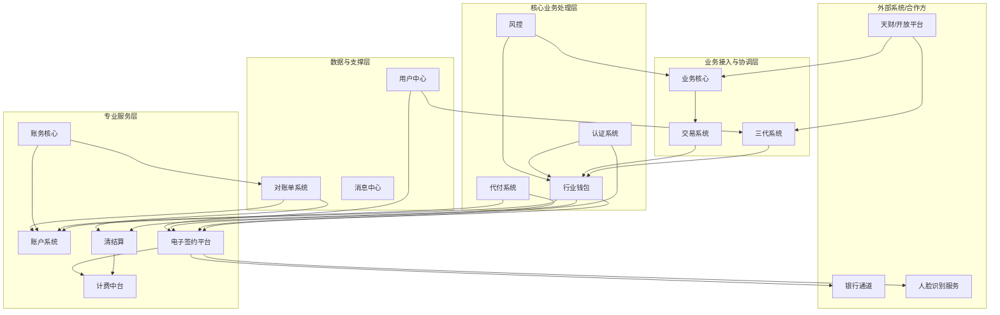
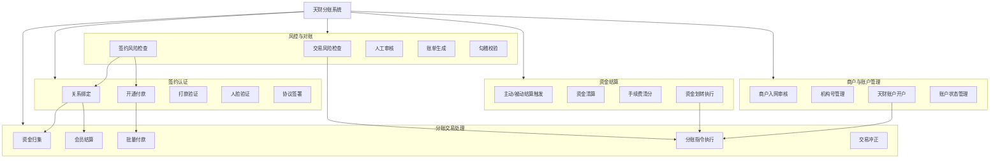
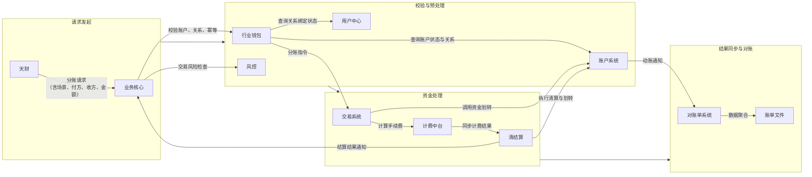
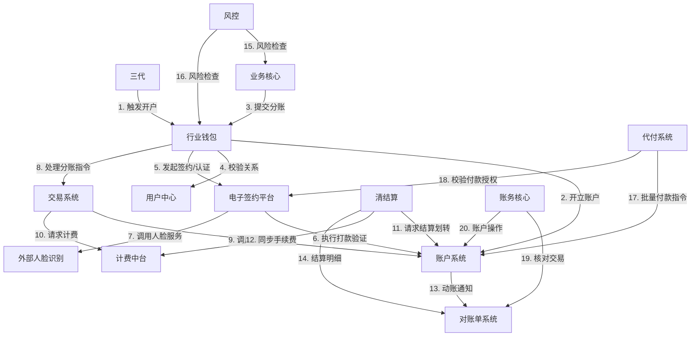

## 2.1 系统结构
本系统为面向“天财”合作方的分账业务平台，采用分布式微服务架构。系统以“三代”作为业务入口与核心协调方，通过“行业钱包”处理核心分账逻辑，并依赖“账户系统”、“清结算”、“电子签约平台”等专业系统完成资金、账户、认证等专项服务。各模块职责清晰，通过API进行松耦合交互，共同支撑归集、会员结算、批量付款三大业务场景。

## 2.2 功能结构
系统功能围绕天财分账业务的核心流程展开，划分为商户与账户管理、分账交易处理、资金结算、签约认证、风控对账五大功能域。

## 2.3 网络拓扑图
TBD

## 2.4 数据流转
数据流转以一笔“会员结算”场景的分账交易为例，描述从交易发起到资金划转完成的关键数据流。

## 2.5 系统模块交互关系
模块间主要通过同步API调用进行交互，部分场景辅以异步消息通知。核心交互围绕“行业钱包”、“账户系统”、“清结算”和“电子签约平台”展开。

