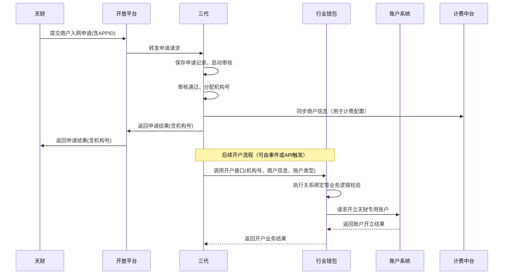

# 模块设计: 三代

生成时间: 2026-01-26 15:27:49
批判迭代: 2

---

# 三代模块设计文档

## 1. 概述
- **目的与范围**: 本模块是拉卡拉内部核心业务处理系统，负责商户入网审核、机构号分配、下游开户接口调用、计费配置等核心业务处理。它为“天财”提供机构号分配，并与行业钱包、账户系统等模块对接，是分账业务中商户和账户管理的起点。
- **角色澄清**: 根据术语表，“三代”在此文档中特指拉卡拉内部系统模块，而非角色。其角色定义为“拉卡拉内部系统，负责商户入网审核、开户接口调用、计费配置等核心业务处理”，与本模块定义一致。

## 2. 接口设计
- **API端点 (REST/GraphQL)**: 本模块通过开放平台向“天财”提供RESTful API。
    - `POST /v1/merchant/register`: 接收天财提交的商户入网申请。
    - `GET /v1/merchant/status/{applicationId}`: 查询商户入网申请状态。
    - `POST /v1/account/open`: 触发天财专用账户开户流程。
- **请求/响应结构**:
    - `POST /v1/merchant/register` 请求体包含：合作方/平台基本信息、资质文件链接、联系人信息。
    - 成功响应包含：`applicationId`（申请流水号）、`status`（审核中）。
    - `POST /v1/account/open` 请求体包含：`institutionCode`（机构号）、`accountType`（账户类型：收款账户/接收方账户）、`merchantInfo`（商户详情）。
    - 成功响应包含：`requestId`（开户请求ID）、`status`（处理中）。
- **发布/消费的事件**:
    - 发布事件：`MerchantAuditPassed`（商户审核通过）、`AccountOpeningTriggered`（开户已触发）。
    - 消费事件：TBD（依赖于上游“天财”通过开放平台推送的申请指令）。

## 3. 数据模型
- **表/集合**:
    - `merchant_application`: 商户入网申请记录表。
    - `institution_mapping`: 机构号映射表。
    - `account_opening_task`: 开户任务记录表。
- **关键字段**:
    - `merchant_application`: `application_id`（主键）、`app_id`（天财APPID）、`merchant_info`（JSON）、`audit_status`、`audit_comment`、`institution_code`（审核通过后填入）、`created_at`。
    - `institution_mapping`: `institution_code`（主键，机构号）、`app_id`、`status`（启用/停用）、`assigned_at`。
    - `account_opening_task`: `task_id`、`institution_code`、`account_type`、`request_payload`、`downstream_system`（行业钱包/账户系统）、`task_status`、`result`、`created_at`。
- **与其他模块的关系**: 通过`institution_code`与“天财”系统关联；通过`task_id`和`downstream_system`跟踪与行业钱包、账户系统的交互。

## 4. 业务逻辑
- **核心工作流/算法**:
    1.  **商户入网审核**: 接收“天财”通过开放平台提交的入网申请，进行资质审核（人工或自动）。
    2.  **机构号分配**: 为通过审核的申请分配全局唯一的机构号，并建立与天财APPID的绑定关系。
    3.  **触发开户**: 根据业务场景（如需要收款或分账），构造开户请求，调用行业钱包系统的开户接口。行业钱包负责业务逻辑校验与关系绑定，并最终调用账户系统完成底层账户开立。
    4.  **计费配置**: 在商户审核通过后，同步商户信息至计费中台，配置基础计费规则。
- **业务规则与验证**:
    1.  同一合作方（APPID）仅能分配一个有效机构号。
    2.  机构号生成需满足特定编码规则，并确保分布式环境下唯一。
    3.  调用下游开户接口前，必须已完成商户审核且机构号已分配。
    4.  根据开户账户类型（天财收款账户/天财接收方账户），传递对应的商户角色信息（总部/门店/接收方）。
- **关键边界情况处理**:
    1.  **下游调用部分失败**: 当调用行业钱包开户接口超时或失败时，启用重试机制（如3次指数退避）。若最终失败，将任务标记为失败，记录详细日志并触发告警，需人工介入处理。
    2.  **数据不一致性**: 定期对账任务，比对本模块的`account_opening_task`状态与行业钱包/账户系统的最终开户状态，发现不一致时生成异常工单。
    3.  **审核驳回后重新申请**: 保留历史审核记录，新申请需关联历史记录，避免重复提交相同资质材料。

## 5. 时序图

## 6. 错误处理
- **预期错误情况**:
    1.  **申请阶段**: 商户资质审核不通过；申请信息格式错误或缺失必填项。
    2.  **处理阶段**: 机构号分配时发生唯一键冲突；调用行业钱包或计费中台接口失败（网络超时、服务不可用、业务校验失败）。
    3.  **状态不一致**: 本模块任务状态与下游系统实际状态不一致。
- **处理策略**:
    1.  **业务错误**: 审核不通过或信息错误，流程终止，通过开放平台向“天财”返回明确错误码和原因。
    2.  **系统错误**: 对下游系统调用失败实施重试策略。对于持久性失败，将任务置为“失败”状态，记录告警，并支持人工重试或补偿。
    3.  **一致性保障**: 使用数据库唯一约束防止机构号重复分配。通过定期对账作业修复状态不一致。

## 7. 依赖关系
- **上游模块**: “天财”（通过**开放平台**接入，开放平台作为API网关和协议转换层）。
- **下游模块**:
    - **行业钱包**: 调用其开户接口，由其处理业务逻辑并驱动账户创建。
    - **账户系统**: 由行业钱包调用，完成底层天财专用账户的开立。
    - **计费中台**: 同步已审核通过的商户信息，配置费率。
- **内部依赖**: 数据库、分布式锁服务（用于机构号分配等临界区）。