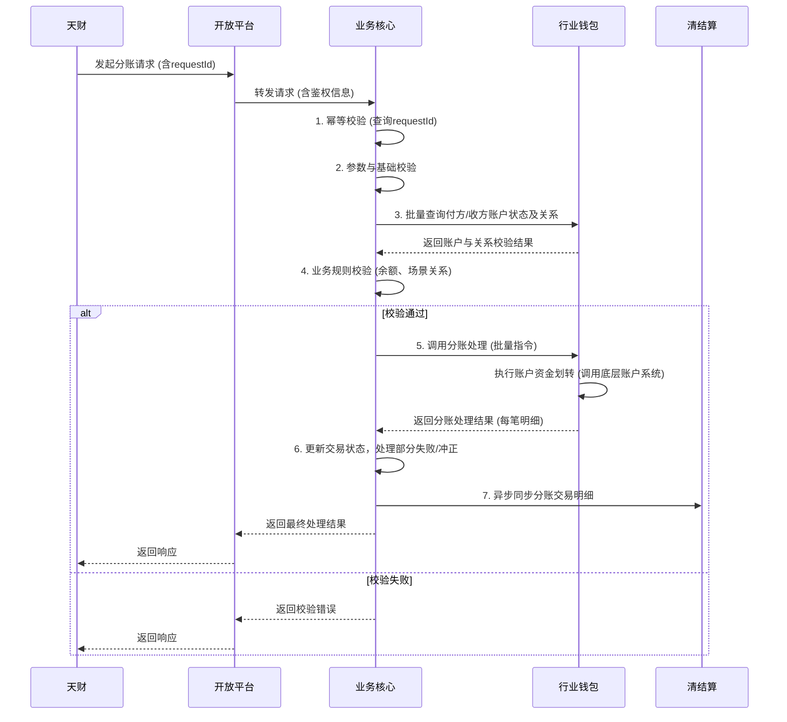

# 模块设计: 业务核心

生成时间: 2026-01-26 15:28:08
批判迭代: 2

---

# 业务核心模块设计文档

## 1. 概述
- **目的与范围**: 业务核心模块的核心职责是接收并处理来自天财（通过开放平台）的分账交易数据。它作为分账业务的数据处理中枢，负责接收交易指令，进行必要的业务逻辑处理，并将处理结果或后续指令传递给其他相关系统（如行业钱包、清结算等）。其边界在于处理“天财分账”交易类型下的所有子场景（归集、会员结算、批量付款）的业务逻辑，不涉及商户入网、账户开立、协议签署等前置流程。

## 2. 接口设计
- **API端点 (REST/GraphQL)**: 本模块通过开放平台提供的接口接收天财的请求。开放平台将根据分配给天财的APPID与机构号进行路由和鉴权，并将请求转发至本模块的REST API端点。
    - `POST /api/v1/split-account/execute`: 执行分账交易。
- **请求/响应结构**:
    - **请求体 (Request Body)**:
        ```json
        {
          "requestId": "string", // 请求唯一标识，用于幂等性控制
          "appId": "string", // 开放平台分配的APPID
          "institutionCode": "string", // 三代运营分配的机构号
          "scene": "COLLECTION | MEMBER_SETTLEMENT | BATCH_PAYMENT", // 业务场景
          "payerAccountNo": "string", // 付方天财账户号
          "payeeList": [ // 收方列表（批量付款支持多个）
            {
              "payeeAccountNo": "string", // 收方天财账户号
              "amount": "number", // 金额（单位：分）
              "remark": "string" // 备注（可选）
            }
          ],
          "totalAmount": "number", // 总金额（单位：分），用于校验
          "extInfo": "object" // 扩展信息，不同场景下结构不同（TBD）
        }
        ```
    - **响应体 (Success Response)**:
        ```json
        {
          "code": "SUCCESS",
          "message": "string",
          "data": {
            "transactionId": "string", // 系统内部交易流水号
            "requestId": "string", // 原请求ID
            "status": "PROCESSING | SUCCESS | PARTIAL_SUCCESS | FAILED",
            "detail": [ // 每笔分账结果明细
              {
                "payeeAccountNo": "string",
                "amount": "number",
                "status": "SUCCESS | FAILED",
                "subCode": "string",
                "subMessage": "string"
              }
            ]
          }
        }
        ```
    - **响应体 (Error Response)**:
        ```json
        {
          "code": "VALIDATION_ERROR | BUSINESS_ERROR | SYSTEM_ERROR",
          "message": "string",
          "detail": "string" // 错误详情（可选）
        }
        ```
- **发布/消费的事件**:
    - **消费事件**: TBD（例如，监听来自行业钱包的分账结果异步通知事件）。
    - **发布事件**: 分账交易状态变更事件（例如，`SplitAccountTransactionCompleted`），包含交易ID、状态、明细，供清结算等下游模块订阅。

## 3. 数据模型
- **表/集合**:
    - **分账交易主表 (split_account_transaction)**: 记录每笔分账请求。
        - `transaction_id` (PK): 系统内部交易流水号。
        - `request_id`: 外部请求ID，用于幂等。
        - `app_id`: 应用ID。
        - `institution_code`: 机构号。
        - `scene`: 业务场景。
        - `payer_account_no`: 付方账户号。
        - `total_amount`: 总金额。
        - `status`: 交易状态（INIT, PROCESSING, SUCCESS, PARTIAL_SUCCESS, FAILED, COMPENSATING）。
        - `retry_count`: 重试次数。
        - `created_at`: 创建时间。
        - `updated_at`: 更新时间。
    - **分账交易明细表 (split_account_transaction_detail)**: 记录每笔分账请求下的每一条分账指令。
        - `detail_id` (PK): 明细ID。
        - `transaction_id` (FK): 关联主表ID。
        - `payee_account_no`: 收方账户号。
        - `amount`: 分账金额。
        - `status`: 状态（PENDING, SUCCESS, FAILED）。
        - `error_code`: 错误码（如失败）。
        - `error_message`: 错误信息。
        - `compensated`: 是否已冲正。
        - `created_at`: 创建时间。
        - `updated_at`: 更新时间。
    - **幂等控制表 (idempotency_control)**: 保证请求幂等性。
        - `request_id` (PK): 外部请求ID。
        - `transaction_id`: 已处理的交易ID。
        - `created_at`: 创建时间。
- **关键字段**: 如上所述。
- **与其他模块的关系**: 业务核心模块处理的分账交易数据，其源头关联天财（通过开放平台），其处理结果将影响行业钱包（账户资金变动）、清结算（资金清算）等模块的数据状态。本模块的数据模型不直接存储账户信息，账户信息通过行业钱包模块查询。

## 4. 业务逻辑
- **核心工作流/算法**:
    1.  **接收与幂等校验**: 通过开放平台接口接收请求，首先检查`request_id`在幂等控制表中是否存在。若存在且交易成功，则直接返回原结果；若存在但交易失败，根据策略决定是否重试；若不存在，则创建新交易记录。
    2.  **参数与基础校验**: 校验请求参数格式、必填项、金额精度（分）、总金额与明细金额之和是否一致。
    3.  **账户与关系校验（调用行业钱包）**:
        - **付方校验**: 查询付方账户（天财收款账户或天财接收方账户）状态是否正常、可用余额是否充足。
        - **收方校验**: 遍历收方列表，查询每个收方账户状态是否正常。
        - **关系绑定校验**: 根据业务场景（`scene`）校验付方与收方之间是否存在有效的关系绑定（归集关系、会员结算关系、批量付款关系）。
    4.  **分账金额计算**:
        - **归集**: 通常为固定金额或门店待结算账户的全部/部分余额，具体规则由请求的`extInfo`或上游业务约定，本模块负责执行。
        - **会员结算**: 金额通常由上游根据会员消费计算得出，通过`amount`字段直接传递。
        - **批量付款**: 金额由请求的`payeeList`中的`amount`字段明确指定。
        （注：复杂的费率计算、手续费扣除由计费中台或上游完成，本模块处理净额。）
    5.  **调用行业钱包执行分账**: 将校验通过的分账指令（可能分批）发送至行业钱包模块执行资金划转。
    6.  **结果处理与状态同步**:
        - 接收行业钱包返回的每笔分账结果。
        - 更新交易主表及明细表状态。
        - 若全部成功，标记交易成功。
        - 若部分成功，标记交易部分成功，并触发对失败明细的补偿流程（冲正）。
        - 若全部失败，标记交易失败。
        - 向清结算模块同步最终的分账交易明细。
    7.  **响应**: 根据处理状态，向开放平台（天财）返回最终结果。
- **业务规则与验证**:
    - **场景化校验**:
        - **归集**: 付方必须是门店天财收款账户，收方必须是总部天财收款账户，且存在有效的归集授权关系。
        - **会员结算**: 付方必须是总部天财收款账户，收方必须是门店天财收款账户，且存在有效的会员结算关系。
        - **批量付款**: 付方可以是总部天财收款账户或天财接收方账户，收方可以是天财接收方账户或其他天财收款账户，且付方必须已完成“开通付款”认证，并与收方存在有效的批量付款关系授权。
    - **金额校验**: 付方账户可用余额必须大于等于当前请求的总分账金额。
- **关键边界情况处理**:
    - **下游调用失败重试**: 对行业钱包的调用设置指数退避重试机制（如最多3次，间隔2^n秒）。重试仅适用于网络超时等可重试错误。
    - **冲正机制**:
        - 当某笔分账指令在行业钱包执行失败，或交易最终状态为部分成功/失败时，需触发冲正。
        - 冲正逻辑：对已成功的分账明细，生成一笔反向的、等额的冲正交易指令（付方和收方互换），调用行业钱包执行，以确保资金退回。
        - 冲正操作本身也需保证幂等。
    - **批量付款部分失败**: 采用“尽力而为”策略。成功部分正常入账，失败部分记录原因并触发冲正（如果需要）。最终向天财返回部分成功状态及明细结果。
    - **幂等性**: 所有接口通过`request_id`保证幂等，防止重复提交导致资金重复划转。

## 5. 时序图



## 6. 错误处理
- **预期错误情况**:
    - **客户端错误 (4xx)**: 参数校验失败（金额格式、场景非法）、请求幂等但原交易已失败且不可重试、账户或关系校验不通过（状态异常、余额不足、关系无效）。
    - **服务器端错误 (5xx)**: 业务核心内部服务异常、依赖系统（行业钱包）服务不可用或超时、数据库异常。
    - **业务处理错误**: 分账指令在行业钱包执行失败（如账户已冻结）、冲正操作失败。
- **处理策略**:
    - **参数与业务校验失败**: 立即失败，向调用方返回明确的错误码和描述，不进行重试。
    - **下游依赖失败**:
        - **可重试错误**（如网络超时、行业钱包暂时不可用）：启动指数退避重试机制（最大重试次数可配置）。重试期间交易状态保持为`PROCESSING`。
        - **不可重试错误**（如账户状态异常导致分账被拒）：立即失败，更新交易状态为`FAILED`，并记录错误原因。
    - **资金事务一致性**:
        - 采用“冲正”作为补偿事务。任何导致资金状态不一致的失败（如部分成功），都会触发对已成功操作的冲正流程。
        - 冲正操作记录在交易明细中，并确保其自身幂等。
    - **监控与告警**: 对失败交易、重试次数超限、冲正失败等情况进行监控和告警，以便人工介入处理。

## 7. 依赖关系
- **上游模块**: 本模块通过**开放平台**间接接收来自**天财**的请求。开放平台负责路由、鉴权（基于APPID和机构号）和协议转换。
- **下游模块**:
    - **行业钱包**: 核心依赖。提供账户信息查询、关系绑定校验、分账指令执行（资金划转）能力。本模块不直接依赖底层账户系统。
    - **清结算**: 本模块在分账交易完成后，需向清结算模块异步同步交易明细，供其进行资金清算。
    - **对账单系统**: （间接依赖）可能消费本模块产生的数据以生成分账指令账单。
- **内部依赖**: 数据库（存储交易流水、幂等记录）。