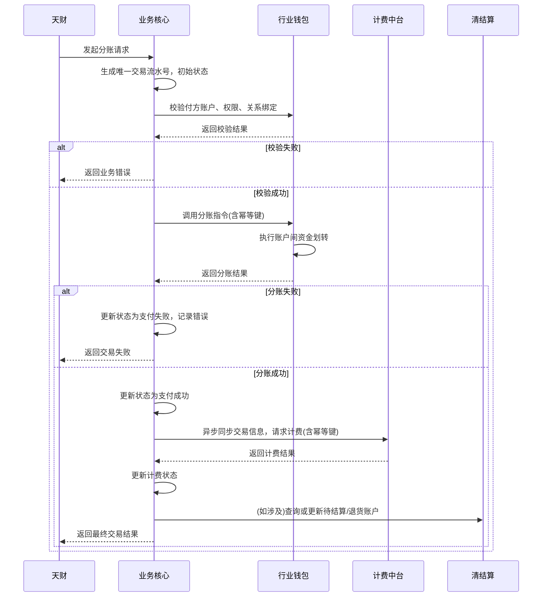

# 模块设计: 交易系统

生成时间: 2026-01-26 15:27:56
批判迭代: 2

---

# 业务核心模块设计文档

## 1. 概述
- **目的与范围**: 本模块是业务核心，负责接收并处理来自天财的分账交易数据。其核心职责是作为天财分账业务的交易处理中枢，接收交易请求，协调调用下游系统（如行业钱包、清结算、计费中台）完成资金划转、计费、清算等操作，并最终记录和返回交易结果。其边界止于交易指令的处理与状态管理，不负责账户开立、关系绑定、协议签署等前置业务，也不直接管理底层账户资金。

## 2. 接口设计
- **API端点 (REST/GraphQL)**: TBD
- **请求/响应结构**: TBD
- **发布/消费的事件**: TBD

## 3. 数据模型
- **表/集合**: TBD
- **关键字段**: TBD
- **与其他模块的关系**: 本模块处理的分账交易数据，其资金来源可能与清结算模块的待结算账户、退货账户相关；交易指令的执行依赖行业钱包模块；交易产生的计费信息需同步至计费中台；最终交易明细会提供给对账单系统。业务逻辑中的关系绑定验证依赖行业钱包提供的绑定关系查询接口。

## 4. 业务逻辑
- **核心工作流/算法**: 主要处理“分账”（天财转账）业务流程。包括接收交易请求，验证付方账户状态与权限，调用行业钱包执行资金划转，触发计费中台生成计费流水，并更新交易状态。对于归集、会员结算、批量付款等场景，其底层资金转移均通过此分账流程实现，通过业务场景字段进行区分。
- **业务规则与验证**: 需验证付方天财收款账户状态是否正常、余额是否充足、是否已完成必要的“开通付款”签约认证、与收方的关系绑定是否有效（针对归集、会员结算等场景，通过调用行业钱包接口验证）。交易类型固定为“天财分账”，通过`业务场景`字段区分归集、会员结算、批量付款等具体业务。
- **关键边界情况处理**: 处理行业钱包调用超时或失败时的重试与冲正逻辑；处理与计费中台交互失败时，交易完成与计费流水生成的最终一致性保证。具体技术方案如下：
    - **重试机制**: 对下游系统（行业钱包、计费中台）的调用失败，根据错误类型（如网络超时、5xx错误）进行有限次（如3次）指数退避重试。所有请求需携带幂等键（如交易系统生成的唯一交易流水号），确保下游系统操作的幂等性。
    - **冲正与最终一致性**: 对于涉及资金变动的关键操作（如行业钱包分账），若在重试后最终失败，则记录交易为失败状态，并可能触发冲正流程（如调用行业钱包的冲正接口撤销已完成的资金操作）。对于计费中台，采用异步补偿机制，若计费流水生成失败，系统将交易标记为“待计费”，由后台任务定期扫描并重推计费信息，直至成功，确保最终一致性。
    - **状态机**: 交易状态需明确定义（如：初始化、校验中、支付处理中、支付成功、支付失败、计费处理中、交易完成、交易失败），并通过状态机管理状态流转，防止状态混乱。

## 5. 时序图

## 6. 错误处理
- **预期错误情况**: 付方账户不存在或状态异常；付方账户余额不足；付方未开通付款权限；付方与收方关系绑定无效或已过期；行业钱包系统服务异常；计费中台服务异常；网络超时。
- **处理策略**: 对于业务规则校验失败，立即返回明确错误码和提示。对于下游系统（行业钱包、计费中台）调用失败，根据错误类型进行有限次重试，并依赖幂等键保证重试安全性。对于涉及资金变动的关键操作失败，通过冲正机制或状态标记确保最终一致性。所有错误需记录详细日志以供排查。

## 7. 依赖关系
- **上游模块**: 天财（通过开放平台）、三代（提供机构号等商户基础信息）。
- **下游模块**: 行业钱包（执行分账及关系绑定验证）、清结算（处理关联账户资金）、计费中台（生成交易计费）、对账单系统（提供交易明细数据）。