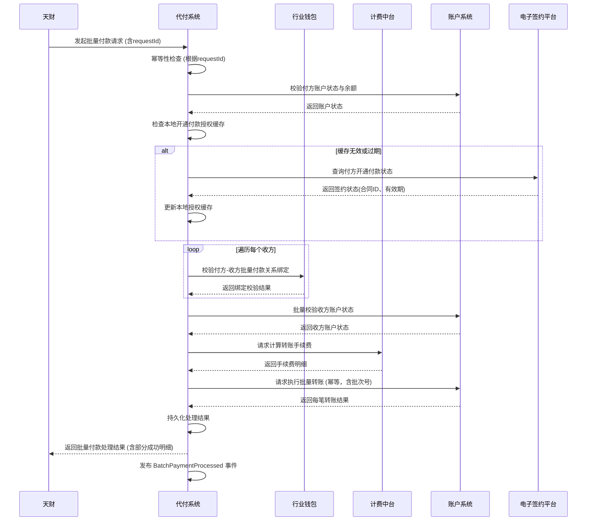

# 模块设计: 代付系统

生成时间: 2026-01-26 15:28:01
批判迭代: 2

---

# 代付系统 模块设计文档

## 1. 概述
- **目的与范围**: 本模块负责处理天财业务中的批量付款（批付）场景。其核心职责是接收来自天财的批量付款指令，完成资金从付方（总部）天财收款账户到多个收方（天财接收方账户）的划转，并管理相关的签约与认证流程（开通付款）。其边界止于向账户系统发起转账指令，不涉及底层账户的资金清算与结算。

## 2. 接口设计
- **API端点 (REST/GraphQL)**:
    - `POST /api/v1/batch-payments`: 接收并处理批量付款请求。
- **请求/响应结构**:
    - **请求体**:
        - `requestId` (string): 请求唯一标识，用于幂等性控制。
        - `appId` (string): 天财的APPID。
        - `institutionId` (string): 三代分配的机构号。
        - `payerAccountNo` (string): 付方（总部）天财收款账户号。
        - `items` (array): 付款明细列表。
            - `payeeAccountNo` (string): 收方天财接收方账户号。
            - `amount` (number): 转账金额。
            - `remark` (string, optional): 转账备注。
    - **响应体**:
        - `code` (string): 处理结果码。
        - `message` (string): 处理结果描述。
        - `data` (object):
            - `batchId` (string): 批次号。
            - `totalCount` (number): 总笔数。
            - `successCount` (number): 成功笔数。
            - `failureCount` (number): 失败笔数。
            - `details` (array): 每笔处理详情。
                - `payeeAccountNo` (string)
                - `status` (string)
                - `errorCode` (string, optional)
                - `errorMessage` (string, optional)
- **发布/消费的事件**:
    - **发布事件**: `BatchPaymentProcessed` (批量付款处理完成事件)，包含批次ID、状态、成功/失败摘要。
    - **消费事件**: TBD。

## 3. 数据模型
- **表/集合**:
    - **batch_payment_request** (批量付款请求主表)
        - `batch_id` (PK): 批次号。
        - `request_id` (UK): 外部请求ID，用于幂等。
        - `app_id`: 天财APPID。
        - `institution_id`: 机构号。
        - `payer_account_no`: 付方账户号。
        - `total_amount`: 总金额。
        - `total_count`: 总笔数。
        - `status`: 批次状态（处理中、部分成功、全部成功、全部失败）。
        - `fee_amount`: 手续费金额。
        - `created_at`: 创建时间。
        - `updated_at`: 更新时间。
    - **batch_payment_item** (批量付款明细表)
        - `item_id` (PK): 明细项ID。
        - `batch_id` (FK): 关联的批次号。
        - `payee_account_no`: 收方账户号。
        - `amount`: 转账金额。
        - `status`: 单笔状态（待处理、成功、失败）。
        - `error_code`: 失败错误码。
        - `error_message`: 失败原因。
        - `account_transaction_id`: 账户系统交易流水号。
    - **payer_payment_authorization** (付方付款授权缓存表)
        - `id` (PK): 主键。
        - `payer_account_no`: 付方账户号。
        - `authorization_type`: 授权类型（开通付款）。
        - `contract_id`: 电子签约合同ID。
        - `status`: 授权状态（有效、过期、失效）。
        - `effective_time`: 生效时间。
        - `expire_time`: 过期时间。
        - `verified_at`: 最后验证时间。
- **关键字段**: 如上所列。
- **与其他模块的关系**: 本模块需要依赖**账户系统**进行账户状态和余额查询、转账操作；依赖**电子签约平台**完成打款验证、人脸验证等开通付款所需的认证流程；依赖**计费中台**获取转账手续费；依赖**行业钱包**进行账户关系绑定校验。

## 4. 业务逻辑
- **核心工作流/算法**:
    1.  **接收与幂等校验**: 接收请求，通过`request_id`检查是否已处理，避免重复。
    2.  **基础校验**: 校验请求格式、必填字段、金额非负等。
    3.  **付方状态校验**: 调用账户系统，验证付方天财收款账户状态正常且余额充足（需包含手续费）。
    4.  **开通付款状态校验**: 查询本地缓存表`payer_payment_authorization`，检查付方是否存在状态为“有效”且在有效期内的“开通付款”授权。若缓存不存在或已过期，则调用**电子签约平台**查询并更新缓存。有效状态定义为：签约合同状态为“已签署”，且当前时间在合同生效与过期时间之内。
    5.  **付方-收方关系绑定校验**: 对于请求中的每个收方，调用**行业钱包**系统，校验该付方与收方之间是否存在针对“批量付款”场景的有效绑定关系。绑定关系应未过期且状态有效。
    6.  **收方状态校验**: 调用账户系统，批量校验所有收方天财接收方账户状态正常。
    7.  **手续费计算**: 调用**计费中台**，基于付方账户、总金额等信息计算本次批量付款的手续费。
    8.  **执行转账**: 调用**账户系统**的批量转账接口，传入付方账户、收方清单、金额及手续费信息。此调用需支持幂等（例如，通过批次号）。
    9.  **结果处理与持久化**: 根据账户系统返回的每笔结果，更新`batch_payment_item`和`batch_payment_request`表状态。
    10. **响应与通知**: 向调用方返回处理结果，并发布`BatchPaymentProcessed`事件。
- **业务规则与验证**:
    - 付方账户（天财收款账户）状态正常且余额充足（含手续费）。
    - 所有收方账户（天财接收方账户）状态正常。
    - 付方必须已完成“开通付款”签约认证，且合同在有效期内。“开通付款”是针对付方（总部）的一次性激活，激活后可用于向多个已绑定的收方发起批量付款。
    - 付方与每一个收方之间必须已通过行业钱包建立针对“批量付款”场景的有效授权绑定关系。绑定关系可能有过期机制。
    - 同一`request_id`的请求仅处理一次（幂等）。
- **关键边界情况处理**:
    - **部分成功/失败**: 账户系统可能返回部分成功的结果。系统需准确记录每一笔明细的状态。已成功的转账不可撤销。响应中需清晰区分成功与失败的明细及原因。
    - **依赖服务降级**: 对于非核心的依赖校验（如计费），可考虑设置降级策略（如使用默认费率），但核心依赖（账户系统、行业钱包绑定校验）失败必须导致整个批次失败。

## 5. 时序图

## 6. 错误处理
- **预期错误情况**:
    - **业务校验错误**: 付方或收方账户不存在/状态异常；付方余额不足；关系绑定无效或已过期；付方未完成开通付款认证或授权已过期；`requestId`重复。
    - **依赖系统错误**: 计费中台服务失败；账户系统查询或转账失败；行业钱包绑定校验失败；电子签约平台查询失败。
    - **系统错误**: 网络超时、数据库异常、系统内部错误。
- **处理策略**:
    - **业务错误**: 立即失败，返回明确的业务错误码和提示信息，不进行重试。
    - **依赖系统错误**:
        - **重试策略**: 对账户系统的**转账操作**实施有限次数的指数退避重试（如最多3次）。重试请求必须携带原批次号以确保幂等。对于查询类调用（账户状态、绑定校验、签约状态），通常立即失败，不重试或仅重试一次。
        - **降级策略**: 计费中台服务不可用时，可记录日志并使用配置的默认费率进行计算，或导致批次失败（根据业务要求选择）。
    - **部分失败处理**: 当账户系统返回部分成功结果时，系统原子性地更新每笔明细状态及批次汇总状态。提供包含成功与失败详情的响应。
    - **审计与监控**: 所有错误，无论等级，均需记录详细的审计日志，包含请求上下文、错误码、错误信息。设置针对失败率、依赖服务健康度的监控告警。

## 7. 依赖关系
- **上游模块**: 本模块直接服务于**天财**（通过开放平台），接收其批量付款请求。
- **下游模块**:
    - **通知系统**: 消费`BatchPaymentProcessed`事件，向相关方发送处理结果通知。
    - **对账单系统**: 依赖本模块生成的转账记录，生成机构层级的动账明细与分账指令账单。
    - **业务核心**: 可能消费本模块事件，用于业务数据统计或联动处理。
- **强依赖模块**:
    - **行业钱包**: 用于校验付方与收方之间的批量付款关系绑定。
    - **电子签约平台**: 用于校验付方的“开通付款”签约认证状态。
    - **计费中台**: 用于计算批量转账产生的手续费。
    - **账户系统**: 用于账户状态、余额查询以及执行最终的批量资金划转。