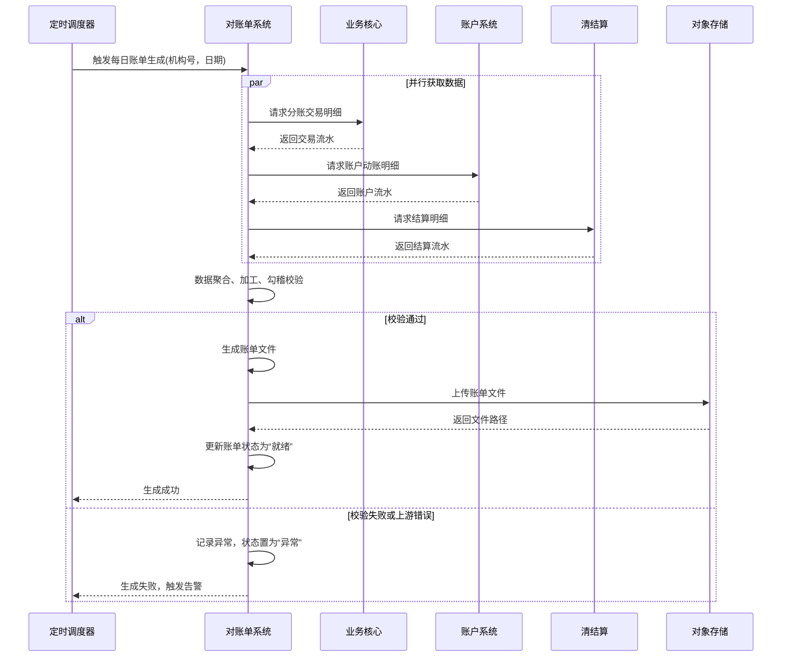

# 模块设计: 对账单系统

生成时间: 2026-01-26 15:28:06
批判迭代: 2

---

# 对账单系统 模块设计文档

## 1. 概述
- **目的与范围**: 本模块负责为机构层（天财）生成并提供各类账户的动账明细、交易明细及分账指令账单。其核心职责是聚合来自上游系统的交易与资金变动数据，按机构维度进行整理、汇总，并以账单文件或API接口的形式提供给天财，满足其对账、财务核算及业务分析的需求。其边界止于账单数据的生成与提供，不涉及原始交易数据的处理或资金结算。

## 2. 接口设计
- **API端点 (REST/GraphQL)**:
    - `GET /v1/statements`: 查询账单列表。支持按机构号、账单日期、账单类型、状态等条件筛选。
    - `GET /v1/statements/{statement_id}`: 获取指定账单的元数据信息。
    - `GET /v1/statements/{statement_id}/download`: 下载账单文件。
    - `POST /v1/statements/regenerate`: 触发历史账单重新生成。
- **请求/响应结构**:
    - 查询账单列表请求：包含 `institution_id`（机构号）、`date_from`、`date_to`、`type`（动账/交易/分账指令）、`status`（生成中/就绪/异常）等查询参数。
    - 账单列表响应：包含账单ID、机构号、账单日期、账单类型、状态、文件大小、生成时间等字段的列表。
    - 账单重新生成请求：包含 `institution_id`、`date_from`、`date_to`。
- **发布/消费的事件**:
    - 消费事件：TBD（例如，消费上游系统发布的交易完成、账户变动等事件作为触发账单生成的信号之一）。
    - 发布事件：`Statement.Generated`（账单生成就绪事件），包含 `statement_id`、`institution_id`、`download_url`。

## 3. 数据模型
- **表/集合**:
    - `statements`（账单主表）：存储账单元数据。
    - `statement_items`（账单明细表）：存储账单的明细行数据，与主表为1:N关系。
- **关键字段**:
    - `statements` 表：
        - `id` (主键)
        - `institution_id` (机构号，用于数据隔离与查询)
        - `statement_date` (账单日期)
        - `type` (账单类型：动账明细/交易明细/分账指令)
        - `status` (状态：生成中/就绪/异常)
        - `file_path` (账单文件在对象存储中的路径)
        - `file_hash` (文件哈希，用于校验)
        - `generated_at` (生成时间)
        - `data_version` (数据版本，用于支持重新生成)
    - `statement_items` 表：
        - `id` (主键)
        - `statement_id` (外键)
        - `line_data` (明细行结构化数据，JSON格式)
- **与其他模块的关系**: 本模块的数据源依赖于**业务核心**（分账交易数据）、**账户系统**（天财专用账户余额变动数据）以及**清结算**（资金清算与结算数据）。生成的对账单供**天财**通过开放平台获取。

## 4. 业务逻辑
- **核心工作流/算法**:
    1.  **数据采集**: 定时任务或事件驱动，根据机构号和日期范围，并行从业务核心、账户系统、清结算等上游模块拉取交易流水、账户变动流水、结算流水。
    2.  **数据加工与聚合**:
        - **清洗**: 校验数据格式，补全必要字段。
        - **归类**: 按交易类型、账户、业务场景对流水进行分组。
        - **汇总**: 计算各账户的期初余额、期间变动总额、期末余额。
        - **勾稽校验（对账）**: 核心校验算法。动账明细的净变动总额应与从账户系统获取的对应账户的期初、期末余额差保持一致。分账指令账单的总额应与从业务核心获取的交易总额一致。若校验失败，则标记异常。
    3.  **账单生成**: 将加工后的数据按预定义格式（如CSV）生成账单文件，计算文件哈希，并上传至对象存储服务。
    4.  **账单提供与通知**: 更新账单状态为“就绪”，记录文件存储路径。可选发布 `Statement.Generated` 事件通知下游。
    5.  **历史账单重新生成**: 接收重新生成请求后，基于原 `statement_date` 和 `institution_id`，执行上述1-4步。新生成的账单将获得新的 `id` 和 `data_version`，旧账单记录保留以供审计。此过程需保证幂等性。
- **业务规则与验证**:
    1.  账单数据必须严格按**机构号**进行隔离。所有数据库查询和API访问必须强制带上 `institution_id` 条件。
    2.  动账明细需与账户系统的最终余额保持一致，通过上述勾稽校验算法保证。
    3.  分账指令账单需与业务核心发起的实际分账指令完全匹配。
    4.  账单文件一旦生成，内容不可变。重新生成将产生新版本文件。
- **关键边界情况处理**:
    1.  **上游数据延迟**: 设置数据就绪等待窗口，配合指数退避重试机制拉取数据。
    2.  **数据不一致**: 勾稽校验失败时，账单状态置为“异常”，记录详细差异日志并触发告警，需人工介入排查。
    3.  **历史账单重新生成**: 支持按指定日期范围重新生成。需评估对上游系统的查询压力，考虑限流和异步处理。

## 5. 时序图

## 6. 错误处理
- **预期错误情况**:
    1.  上游服务（业务核心、账户系统、清结算）调用超时、不可用或返回错误。
    2.  从上游获取的数据存在格式错误、关键字段缺失或逻辑矛盾。
    3.  账单文件生成或上传至对象存储过程中发生IO错误。
    4.  账单数据勾稽校验不通过（如余额不平、交易总额不匹配）。
- **处理策略**:
    1.  对上游依赖调用实施指数退避重试，达到最大重试次数后标记本次任务失败并告警。
    2.  对数据格式错误进行记录并告警，根据错误严重程度决定是跳过问题数据（记录缺口）还是中止本次账单生成。
    3.  对象存储操作失败时，尝试备用存储区域或路径，并立即告警。
    4.  数据校验失败时，生成详细的异常报告，账单状态置为“异常”，阻止该账单发布，并通知相关人员排查。

## 7. 依赖关系
- **上游模块**: 业务核心（提供分账交易数据）、账户系统（提供天财专用账户变动数据）、清结算（提供资金结算数据）。
- **下游模块/消费者**: **天财**（角色）。天财通过开放平台认证（使用APPID/机构号）后，调用本模块提供的API查询和下载账单。