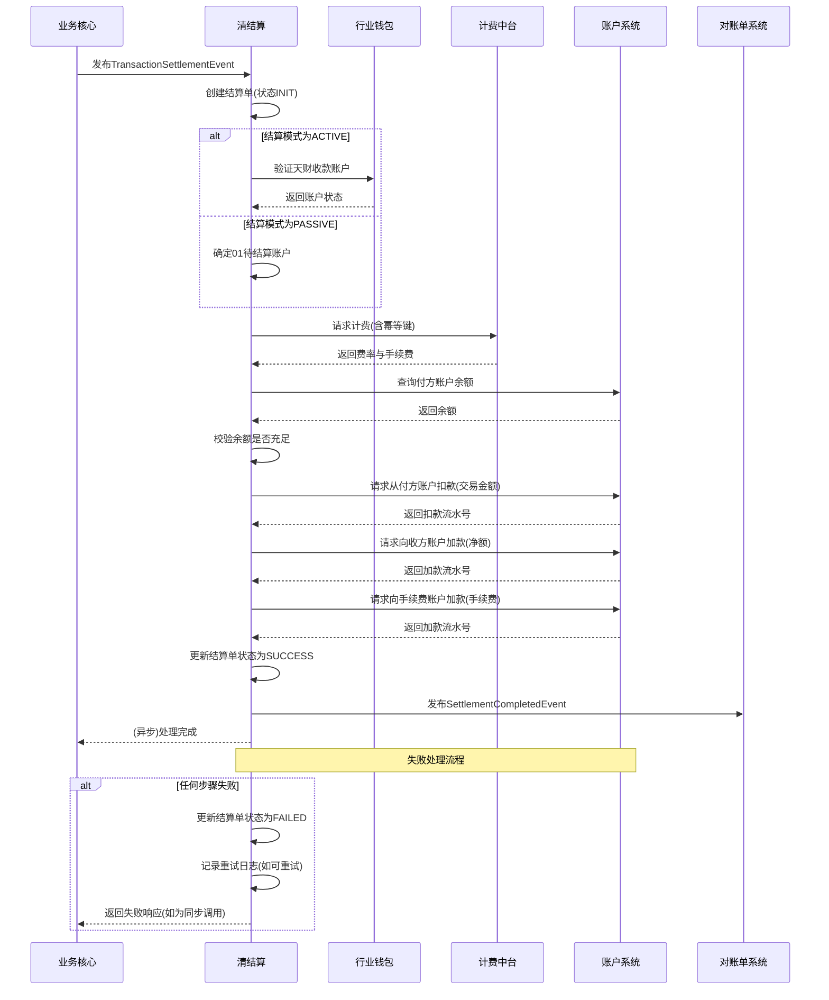

# 模块设计: 清结算

生成时间: 2026-01-26 15:27:35
批判迭代: 2

---

# 清结算模块设计文档

## 1. 概述
- **目的与范围**: 本模块是清结算系统的核心处理单元，负责处理与天财分账业务相关的资金清算、结算、手续费清分以及退货账户查询等核心功能。其边界包括：处理从天财收款账户发起的资金结算请求、计算并清分交易手续费、提供商户退货账户信息查询服务。模块内部通过服务编排，协调与账户系统、行业钱包、计费中台等外部系统的交互。

## 2. 接口设计
- **API端点 (REST)**:
    1.  `POST /api/v1/settlement/initiate`: 发起结算处理。
    2.  `GET /api/v1/settlement/query/{settlement_id}`: 查询结算单状态。
    3.  `GET /api/v1/refund-account/{merchant_id}`: 查询商户退货账户信息。
- **请求/响应结构**:
    - `POST /api/v1/settlement/initiate` 请求体:
        ```json
        {
          "request_id": "string, 请求唯一标识，用于幂等",
          "merchant_id": "string, 商户ID",
          "transaction_data": "object, 业务核心提供的分账交易数据",
          "settlement_mode": "enum(ACTIVE, PASSIVE), 结算模式：主动结算/被动结算",
          "target_account_no": "string, 可选，主动结算时指定的天财收款账户号"
        }
        ```
    - `POST /api/v1/settlement/initiate` 响应体:
        ```json
        {
          "code": "string, 响应码",
          "message": "string, 响应消息",
          "data": {
            "settlement_id": "string, 结算单号",
            "status": "string, 处理状态"
          }
        }
        ```
    - `GET /api/v1/refund-account/{merchant_id}` 响应体:
        ```json
        {
          "code": "string, 响应码",
          "message": "string, 响应消息",
          "data": {
            "merchant_id": "string, 商户ID",
            "refund_account_no": "string, 04退货账户号",
            "account_status": "string, 账户状态"
          }
        }
        ```
- **发布/消费的事件**:
    - 消费事件: `TransactionSettlementEvent` (由业务核心发布，包含分账交易数据)。
    - 发布事件: `SettlementCompletedEvent` (结算完成时发布，包含结算结果，供对账单系统消费)。

## 3. 数据模型
- **表/集合**:
    1.  `t_settlement_order` (结算订单表): 记录每笔结算请求的核心信息与状态。
    2.  `t_settlement_detail` (结算明细表): 记录结算涉及的账户、金额、手续费等明细。
    3.  `t_settlement_retry_log` (结算重试日志表): 记录失败操作的异步重试信息。
- **关键字段**:
    - `t_settlement_order`:
        - `settlement_id` (主键), `request_id` (幂等键), `merchant_id`, `original_transaction_id`, `total_amount`, `fee_amount`, `settlement_mode`, `target_account_no`, `status` (INIT, PROCESSING, SUCCESS, FAILED), `create_time`, `update_time`.
    - `t_settlement_detail`:
        - `detail_id` (主键), `settlement_id`, `account_type` (PAYER, RECEIVER, FEE), `account_no`, `amount`, `account_system_trace_no`.
    - `t_settlement_retry_log`:
        - `log_id`, `settlement_id`, `retry_operation` (如 CALL_ACCOUNT_SYSTEM), `retry_count`, `last_retry_time`, `next_retry_time`, `status` (PENDING, SUCCESS, ABORTED).
- **与其他模块的关系**:
    - 与**账户系统**交互：通过账户号执行资金划转，查询账户状态与余额。
    - 与**行业钱包系统**交互：验证“天财收款账户”的有效性、状态及权限。
    - 与**计费中台**交互：获取费率信息，提交计费流水。
    - 与**业务核心**交互：接收分账交易数据事件。
    - 与**对账单系统**交互：发布结算完成事件，提供动账明细。

## 4. 业务逻辑
- **核心工作流/算法**:
    1.  **结算触发与模式选择**:
        - 监听业务核心发布的 `TransactionSettlementEvent` 触发结算流程。
        - 根据事件中的 `settlement_mode` 字段确定结算模式：
            - **主动结算 (ACTIVE)**: 使用事件中指定的 `target_account_no`（天财收款账户）作为最终收款方。需先调用行业钱包系统验证该账户状态。
            - **被动结算 (PASSIVE)**: 使用该商户默认的“01待结算账户”作为最终收款方。
    2.  **资金清算与手续费清分**:
        - 调用计费中台，基于交易金额和商户费率配置，计算应收手续费，并生成计费流水。
        - 清算净额 = 交易金额 - 手续费。
    3.  **资金划转执行**:
        - 付款方：从交易对应的付方账户（如门店的天财收款账户）扣减交易金额。
        - 收款方：根据结算模式，向目标账户（天财收款账户或01待结算账户）增加清算净额。
        - 手续费方：向手续费收入账户增加手续费金额。
        - 所有资金操作均通过调用账户系统完成。
    4.  **退货账户查询**:
        - 根据商户ID，查询其在账户系统下的“04退货账户”信息并返回。
- **业务规则与验证**:
    - 结算前必须验证付方账户余额充足。
    - 主动结算时，必须通过行业钱包系统验证目标“天财收款账户”状态正常且属于该商户。
    - 所有对外部系统的调用需具备幂等性，使用 `request_id` 或 `settlement_id`。
- **关键边界情况处理**:
    - 结算账户余额不足：立即失败，记录明确错误。
    - 下游系统交互失败：进入重试与补偿流程。

## 5. 时序图



## 6. 错误处理
- **预期错误情况**:
    1.  下游系统服务不可用或超时（账户系统、行业钱包、计费中台）。
    2.  付方账户余额不足。
    3.  主动结算的目标天财收款账户状态异常或无权使用。
    4.  费率信息获取失败。
    5.  网络异常或数据库操作失败。
- **处理策略**:
    1.  **重试机制**: 对于网络超时或暂时性下游故障，采用指数退避策略进行重试（如最多3次，间隔2^n秒）。重试信息记录在 `t_settlement_retry_log` 中。
    2.  **熔断保护**: 对账户系统、行业钱包等关键依赖配置熔断器，防止级联故障。
    3.  **幂等性**: 所有对外部系统的写操作（扣款、加款、计费）必须携带幂等键（如 `settlement_id:operation_type`），确保重复请求不会导致资金重复变动。
    4.  **补偿与冲正**: 对于已部分成功的资金操作（如扣款成功但加款失败），设计冲正流程。通常通过记录详细流水，由定时任务扫描失败订单，尝试发起反向交易进行冲正，或通知人工处理。
    5.  **立即失败**: 对于余额不足、账户状态异常等业务逻辑错误，立即失败，不进行重试，并返回明确的错误码和消息。

## 7. 依赖关系
- **上游模块**:
    - **业务核心**: 提供分账交易数据，通过事件驱动结算流程。
    - **计费中台**: 提供费率计算与计费流水生成服务。
- **下游模块**:
    - **账户系统**: 执行底层账户的资金扣划与增加操作，提供账户查询。
    - **行业钱包系统**: 提供天财收款账户的验证与状态查询服务。
    - **对账单系统**: 消费本模块发布的结算完成事件，用于生成动账明细与账单。