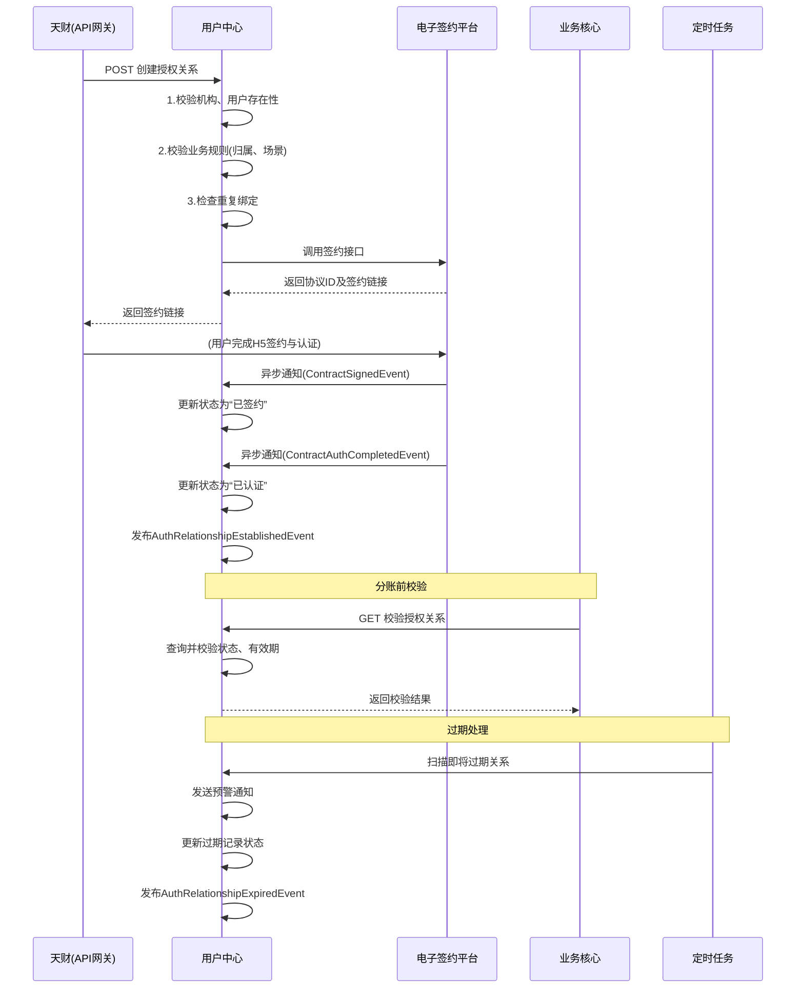

# 模块设计: 用户中心

生成时间: 2026-01-26 15:28:14
批判迭代: 2

---

# 用户中心 模块设计文档

## 1. 概述
- **目的与范围**: 本模块负责管理天财业务中的核心用户实体及其关系。核心职责包括：天财合作方（天财）的机构号与APPID管理、总部与门店的商户信息维护、接收方账户的开立与管理，以及为分账业务（归集、会员结算、批量付款）建立和校验付方与收方之间的授权关系。本模块不涉及底层账户开立（由账户系统负责）和具体资金交易处理（由业务核心负责）。

## 2. 接口设计
- **API端点 (REST)**:
    1.  `POST /api/v1/auth-relationships`: 创建授权关系。
    2.  `GET /api/v1/auth-relationships/{relationshipId}`: 查询授权关系详情。
    3.  `GET /api/v1/auth-relationships/validate`: 校验授权关系有效性。
    4.  `PUT /api/v1/auth-relationships/{relationshipId}/status`: 更新授权状态（内部/异步通知使用）。
    5.  `GET /api/v1/merchants/{merchantId}`: 查询商户详情。
    6.  `GET /api/v1/receivers/{receiverId}`: 查询接收方详情。
    7.  `POST /api/v1/sync/merchants`: 同步商户信息（供上游系统调用）。
    8.  `POST /api/v1/sync/receivers`: 同步接收方信息（供上游系统调用）。

- **请求/响应结构**:
    - 创建授权关系请求示例：
        ```json
        {
          "org_id": "TC20240001",
          "payer_id": "M1001",
          "payer_type": "merchant_store",
          "payee_id": "M1000",
          "payee_type": "merchant_headquarters",
          "scene": "归集"
        }
        ```
    - 校验授权关系响应示例：
        ```json
        {
          "is_valid": true,
          "relationship_id": "REL001",
          "auth_status": "已签约",
          "expire_time": "2025-12-31T23:59:59Z"
        }
        ```
    - 同步商户信息请求示例：
        ```json
        {
          "operation": "UPSERT",
          "data": {
            "merchant_id": "M1001",
            "org_id": "TC20240001",
            "merchant_type": "企业",
            "role": "门店",
            "parent_merchant_id": "M1000",
            "tiancai_collect_account_id": "ACC_COLLECT_001",
            "bank_account_no": "6228480012345678901"
          }
        }
        ```

- **发布/消费的事件**:
    - 消费事件：
        - `MerchantInfoUpdatedEvent` (来自三代系统)：触发商户信息同步。
        - `ReceiverAccountOpenedEvent` (来自账户系统)：触发接收方账户ID绑定。
        - `ContractSignedEvent` (来自电子签约平台)：触发授权关系状态更新。
        - `ContractAuthCompletedEvent` (来自电子签约平台)：触发授权关系状态更新。
    - 发布事件：
        - `AuthRelationshipEstablishedEvent`: 授权关系建立完成时发布。
        - `AuthRelationshipExpiredEvent`: 授权关系过期时发布（由定时任务触发）。
        - `UserInfoSyncFailedEvent`: 用户信息同步失败时发布（用于告警）。

## 3. 数据模型
- **表/集合**:
    1.  `tiancai_org` (天财机构表): 存储由三代运营分配的机构号及对应天财信息。
    2.  `merchant` (商户表): 存储总部和门店的收单商户基础信息。
    3.  `receiver` (接收方表): 存储非收单商户或个人的天财接收方账户信息。
    4.  `auth_relationship` (授权关系表): 存储为分账场景建立的付方与收方授权关系。

- **关键字段**:
    - `tiancai_org`:
        - `org_id` (机构号): 唯一标识。
        - `app_id`: 开放平台分配的APPID。
        - `tiancai_name`: 天财合作方名称。
    - `merchant`:
        - `merchant_id`: 商户唯一标识（与三代系统关联）。
        - `org_id`: 所属天财机构号。
        - `merchant_type`: 商户类型（企业/个体）。
        - `role`: 角色（总部/门店）。值域：`merchant_headquarters` (总部), `merchant_store` (门店)。
        - `parent_merchant_id`: 上级总部ID（若为门店）。
        - `tiancai_collect_account_id`: 关联的天财收款账户ID（从账户系统`ReceiverAccountOpenedEvent`事件中获取并关联）。
        - `bank_account_no`: 银行账号（用于信息同步和验证）。
        - `last_sync_time`: 最后同步时间。
    - `receiver`:
        - `receiver_id`: 接收方唯一标识。
        - `org_id`: 所属天财机构号。
        - `receiver_type`: 类型（企业/个人）。
        - `name`: 姓名/企业名。
        - `id_card_no`: 身份证号（个人）。
        - `bank_account_no`: 银行账号。
        - `tiancai_receiver_account_id`: 关联的天财接收方账户ID（从账户系统`ReceiverAccountOpenedEvent`事件中获取并关联）。
        - `auth_status`: 认证状态（如：待认证，打款验证中，人脸验证中，已认证）。
        - `last_sync_time`: 最后同步时间。
    - `auth_relationship`:
        - `relationship_id`: 关系ID。
        - `org_id`: 所属天财机构号。
        - `payer_id`: 付方ID（关联`merchant_id`或`receiver_id`）。
        - `payer_type`: 付方类型。值域：`merchant_headquarters`, `merchant_store`, `receiver`。
        - `payee_id`: 收方ID（关联`merchant_id`或`receiver_id`）。
        - `payee_type`: 收方类型。值域：`merchant_headquarters`, `merchant_store`, `receiver`。
        - `scene`: 业务场景（归集/会员结算/批量付款）。
        - `contract_id`: 电子签约平台返回的协议ID。
        - `auth_status`: 授权状态（待签约，已签约，已认证，已开通付款，已过期）。
        - `expire_time`: 授权过期时间。
        - `created_time`: 创建时间。

- **与其他模块的关系**:
    - 通过`org_id`与三代系统关联，确认业务归属。
    - 通过`contract_id`与电子签约平台关联，获取协议状态。
    - 通过`tiancai_collect_account_id`和`tiancai_receiver_account_id`与账户系统关联，查询账户状态。
    - 为业务核心提供付方、收方信息及关系校验。

## 4. 业务逻辑
- **核心工作流/算法**:
    1.  **关系绑定流程**: 接收天财通过API网关发来的请求，根据场景（归集、会员结算、批量付款）创建付方与收方的授权关系记录，调用电子签约平台完成协议签署与认证（打款验证/人脸验证），更新授权状态。
    2.  **开通付款流程**: 在批量付款和会员结算场景下，针对付方（总部/门店）执行额外的签约与认证，激活其付款能力，更新`auth_status`。
    3.  **用户信息查询与校验**: 根据机构号、商户ID或接收方ID，查询并返回用户详情，并在发起分账前校验付方与收方之间是否存在有效授权关系。
    4.  **数据同步机制**: 通过消费上游系统（三代系统、账户系统）发出的事件来更新本地数据。对于关键信息变更（如银行账号），将关联的授权关系状态置为“待复核”，并发布事件通知相关业务方。
    5.  **授权过期处理**: 后台定时任务每日扫描`auth_relationship`表中`expire_time`即将在7天内到期的记录，向天财发送预警通知。对于已过期的记录，将其`auth_status`更新为“已过期”，并发布`AuthRelationshipExpiredEvent`事件。

- **业务规则与验证**:
    1.  一个机构号(`org_id`)下可关联多个总部和门店。
    2.  门店必须关联一个上级总部(`parent_merchant_id`)。
    3.  建立归集关系时，付方必须是门店(`payer_type=merchant_store`)，收方必须是其所属总部(`payee_type=merchant_headquarters`)。
    4.  建立会员结算关系时，付方必须是总部(`payer_type=merchant_headquarters`)，收方必须是其下属门店(`payee_type=merchant_store`)。
    5.  建立批量付款关系时，付方必须是总部(`payer_type=merchant_headquarters`)，收方可以是任意已认证的接收方(`payee_type=receiver`且`auth_status=已认证`)。
    6.  发起分账交易前，必须校验对应场景下的授权关系`auth_status`为“已签约”、“已认证”或“已开通付款”等有效状态。
    7.  同一付方、收方、场景下，若已存在有效授权关系（非“已过期”状态），则拒绝重复创建。

- **关键边界情况处理**:
    1.  **重复绑定**: 规则校验时拒绝。
    2.  **信息变更**: 通过事件同步机制更新，并标记关联授权关系为“待复核”，需人工或重新认证激活。
    3.  **授权过期**: 通过定时任务扫描与状态更新处理。
    4.  **依赖服务失败**: 对电子签约平台调用采用指数退避重试，达到最大重试次数后标记关系为“签约失败”，并记录告警。

## 5. 时序图



## 6. 错误处理
- **预期错误情况**:
    1.  无效的机构号(`org_id`)或用户ID。
    2.  违反业务规则的绑定请求（如门店归集到非所属总部）。
    3.  电子签约平台调用失败或超时。
    4.  授权关系已存在或已过期。
    5.  数据不一致（如账户系统无对应天财账户）。
    6.  上游数据同步事件处理失败。

- **处理策略**:
    1.  **输入校验**: 对API请求参数进行严格校验，立即返回明确的业务错误码（如`INVALID_ORG_ID`, `BUSINESS_RULE_VIOLATION`）和描述。
    2.  **依赖调用**: 对电子签约平台等外部调用设置连接超时（3s）、读取超时（10s）及最多3次指数退避重试。持久化重试上下文，避免重复请求。
    3.  **异步幂等**: 通过事件ID或请求唯一键保证异步通知处理的幂等性。
    4.  **日志记录**:
        - **级别**: INFO记录业务操作（如关系创建、状态更新），WARN记录预期内错误（如校验失败），ERROR记录系统异常和依赖故障。
        - **内容**: 包含请求ID、机构号、用户ID、关系ID、操作类型、关键参数、结果状态、耗时、错误码和堆栈信息（如为ERROR）。
        - **存储与使用**: 日志统一输出至ELK栈，保留30天。通过请求ID实现全链路追踪。定期分析ERROR日志进行系统优化，使用操作日志与业务系统对账。

## 7. 依赖关系
- **上游模块**:
    1.  **三代系统**: 提供机构号、商户入网信息。通过事件`MerchantInfoUpdatedEvent`同步商户数据。
    2.  **电子签约平台**: 提供协议签署、打款验证、人脸验证等服务。通过事件同步签约状态。
    3.  **账户系统**: 提供天财专用账户的开户状态查询。通过事件`ReceiverAccountOpenedEvent`同步账户ID。
- **下游模块**:
    1.  **业务核心**: 在处理`分账`、`归集`、`会员结算`、`批量付款`交易前，调用本模块校验用户及授权关系。
    2.  **消息中心**: 接收本模块发布的`AuthRelationshipExpiredEvent`等事件，发送预警通知。