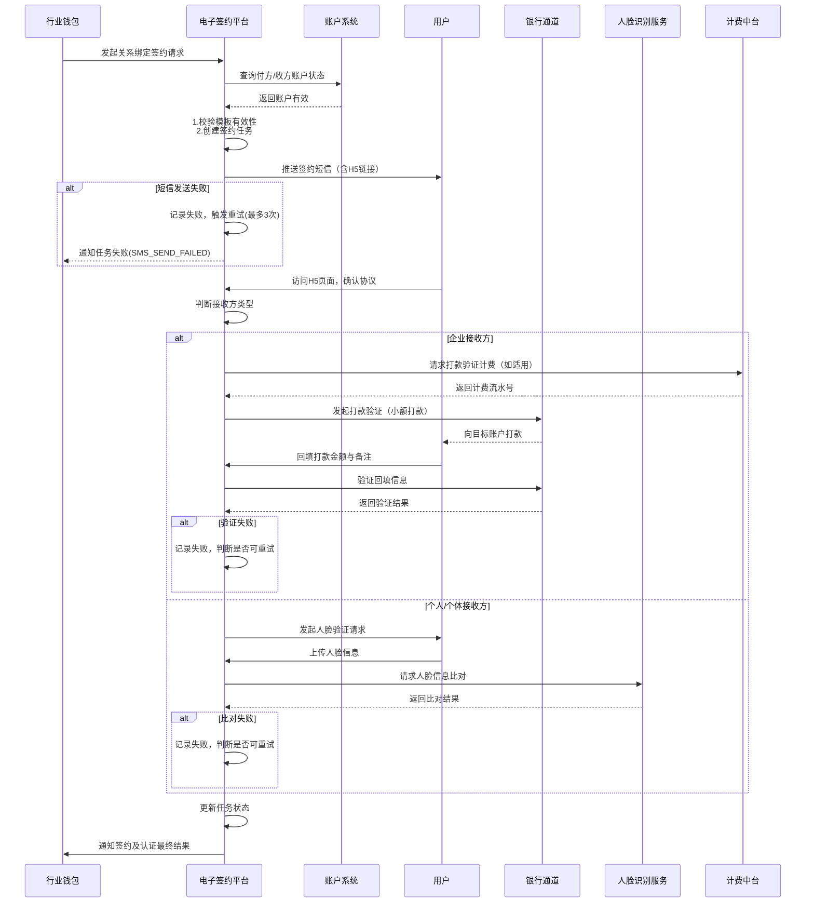

# 模块设计: 电子签约平台

生成时间: 2026-01-26 15:27:28
批判迭代: 2

---

# 电子签约平台模块设计文档

## 1. 概述
- **目的与范围**: 本模块负责为分账业务中的各类关系绑定提供电子签约与认证服务。核心职责包括协议模板管理、签约流程的H5页面封装、短信推送，以及执行打款验证、人脸验证等认证流程。其边界在于处理签约与认证的交互逻辑，不涉及账户开立、资金划转或业务规则校验。

## 2. 接口设计
- **API端点 (REST)**:
    1.  `POST /api/v1/signing/initiate`: 接收行业钱包发起的签约请求，返回签约任务ID和状态。
    2.  `GET /api/v1/signing/task/{taskId}`: 查询指定签约任务的当前状态和详情。
    3.  `POST /api/v1/verification/callback/{type}`: 接收银行通道打款验证结果回调或人脸识别服务比对结果回调。
    4.  `POST /api/v1/template/query`: 供内部管理或行业钱包查询可用的协议模板。
- **请求/响应结构**:
    - `POST /api/v1/signing/initiate` 请求体示例:
        ```json
        {
          "requestId": "行业钱包生成的唯一请求ID",
          "scene": "COLLECTION | MEMBER_SETTLEMENT | BATCH_PAYMENT",
          "payerInfo": {
            "accountNo": "付方天财账户号",
            "role": "HEADQUARTERS | STORE"
          },
          "receiverInfo": {
            "accountNo": "收方天财账户号",
            "type": "ENTERPRISE | INDIVIDUAL | PERSONAL",
            "name": "接收方名称",
            "idCardNo": "身份证号（个人/个体）",
            "bankCardNo": "银行卡号（企业打款验证用）"
          },
          "templateCode": "协议模板编码"
        }
        ```
    - 成功响应体示例:
        ```json
        {
          "code": "SUCCESS",
          "message": "成功",
          "data": {
            "signingTaskId": "电子签约平台生成的签约任务ID",
            "status": "PENDING_SMS",
            "expireTime": "签约链接过期时间"
          }
        }
        ```
- **发布/消费的事件**:
    - 消费事件: TBD (例如，监听账户系统发出的账户状态变更事件，以确认账户有效性)。
    - 发布事件:
        1.  `SigningTaskCreated`: 签约任务创建。
        2.  `SigningTaskCompleted`: 签约及认证完成。
        3.  `SigningTaskFailed`: 签约任务失败。

## 3. 数据模型
- **表/集合**:
    1.  `agreement_template` (协议模板表): 存储不同业务场景的协议模板。
        - 关键字段: `id`, `template_code`(模板编码，唯一), `scene`(适用场景), `title`, `content`, `version`, `status`(ENABLED/DISABLED), `effective_date`(生效日期), `expiry_date`(失效日期), `creator`, `created_at`, `updated_at`。
    2.  `signing_task` (签约任务表): 记录每一次签约请求的生命周期。
        - 关键字段: `id`(签约任务ID), `request_id`(行业钱包请求ID), `scene`, `payer_account_no`, `receiver_account_no`, `receiver_type`, `template_code`, `template_version`, `status`(状态机), `sms_sent`(是否已发送), `auth_method`(认证方式), `auth_result`, `error_code`, `error_msg`, `expire_time`, `completed_at`, `created_at`。
    3.  `verification_attempt` (认证尝试记录表): 记录每次认证（打款/人脸）的详细信息。
        - 关键字段: `id`, `signing_task_id`, `attempt_number`(第几次尝试), `auth_method`, `request_params`, `response_result`, `status`(SUCCESS/FAILED), `created_at`。
    4.  `signing_record` (签约记录表): 签约成功后的最终协议存档。
        - 关键字段: `id`, `signing_task_id`, `agreement_no`(协议编号), `signed_content`(签署后的协议内容), `payer_sign_info`, `receiver_sign_info`, `signed_at`, `archive_path`(存储路径)。
- **与其他模块的关系**:
    - `signing_task.receiver_account_no` 关联 **行业钱包** 与 **账户系统** 中的天财账户。
    - 签约状态与结果通过事件或API回调通知 **行业钱包**。

## 4. 业务逻辑
- **核心工作流/算法**:
    1.  **签约初始化**: 接收请求，校验协议模板有效性（状态为`ENABLED`且在有效期内），创建签约任务。
    2.  **接收方类型判断逻辑**:
        - 输入：`receiverInfo.type`。
        - 规则：若为`ENTERPRISE`（企业），则触发**打款验证**；若为`INDIVIDUAL`（个体）或`PERSONAL`（个人），则触发**人脸验证**。
    3.  **H5页面与短信**: 根据模板和任务信息生成签约H5页面链接，通过短信服务推送至接收方关联手机号。
    4.  **认证流程**:
        - **打款验证**: 调用**银行通道**向`receiverInfo.bankCardNo`打一笔随机小额款项。用户回填金额与备注后，与打款记录比对验证。
        - **人脸验证**: 引导用户在H5页面完成人脸采集，调用**人脸识别服务**，比对`receiverInfo.name`、`receiverInfo.idCardNo`与采集的人脸信息。
    5.  **状态更新与通知**: 认证成功后，更新签约任务状态为成功，生成签约记录，并通知**行业钱包**。
    6.  **账户状态同步**: 在关键节点（如认证前），通过查询**账户系统**接口，确认收、付方天财账户状态正常且有效。
- **业务规则与验证**:
    1.  **协议模板有效性**: 定义为模板`status`字段为`ENABLED`，且当前时间在`effective_date`和`expiry_date`之间。
    2.  **防止重复签约**: 在创建签约任务时，根据`request_id`或`payer_account_no`+`receiver_account_no`+`scene`+特定状态（如`COMPLETED`）进行校验。
    3.  **认证重试与限制**: 每种认证方式允许最多3次尝试，超过后锁定任务并标记为失败。
    4.  **计费集成**: 若**打款验证**产生手续费，调用**计费中台**接口生成计费流水。费用归属TBD。
- **关键边界情况处理**:
    1.  用户中途放弃：签约链接设置有效期（如24小时），超时后任务自动过期。
    2.  认证信息不匹配：记录失败原因，计入重试次数，反馈明确错误信息给用户。
    3.  外部服务异常：进行服务降级或快速失败，记录异常，并触发告警。

## 5. 时序图


## 6. 错误处理
- **预期错误情况**:
    1.  **模板加载失败**: 模板不存在、已禁用或已过期。
    2.  **短信发送失败**: 运营商接口异常、手机号格式错误。
    3.  **认证信息不匹配**: 打款金额/备注错误、人脸比对相似度低于阈值。
    4.  **外部服务异常**: 银行通道打款失败、人脸识别服务超时、账户系统查询失败。
    5.  **用户重复签约**: 针对同一组付方、收方、场景已存在成功签约记录。
    6.  **计费失败**: 调用计费中台生成流水失败。
- **处理策略**:
    1.  **错误码与信息**: 定义模块专属错误码，响应中返回用户友好的提示信息。
    2.  **重试机制**: 对瞬时故障（短信、外部服务调用）实现指数退避重试。
    3.  **状态与次数控制**: 签约任务状态机明确，认证失败次数严格限制。
    4.  **日志与监控**: 所有失败记录详细日志，关键错误触发监控告警。
    5.  **重复签约处理**: 在签约初始化阶段进行校验，若存在有效签约记录，则直接返回成功或特定错误码，避免重复流程。

## 7. 依赖关系
- **上游模块**:
    - **行业钱包**: 核心调用方，发起签约请求并接收结果。
    - **账户系统**: 用于验证付方和收方天财账户的状态是否正常、有效。
- **下游模块/服务**:
    - **银行通道**: 用于执行企业接收方的打款验证（发起打款与校验回填信息）。
    - **人脸识别服务**: 用于执行个人/个体接收方的人脸信息比对。
    - **计费中台**: 用于处理打款验证等可能产生手续费的业务的计费。
- **内部依赖**:
    - 短信推送服务。
    - H5页面渲染服务。