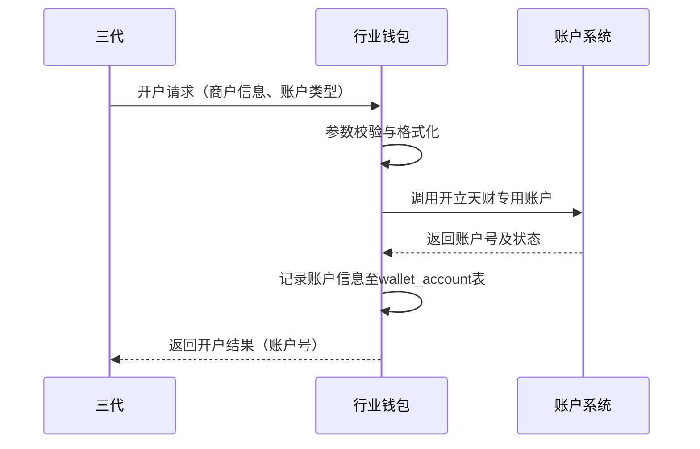
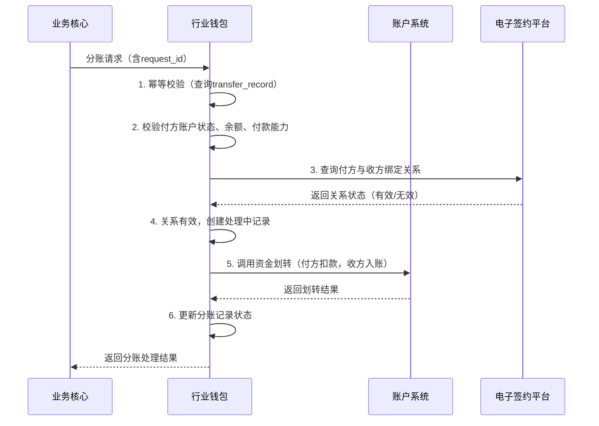

# 模块设计: 行业钱包

生成时间: 2026-01-26 15:27:54
批判迭代: 2

---

# 行业钱包模块设计文档

## 1. 概述
- **目的与范围**: 行业钱包模块是拉卡拉内部负责天财专用账户管理的核心系统。其主要职责包括：天财收款账户与天财接收方账户的开户管理、为分账业务建立并校验付方与收方的授权关系（如归集、会员结算、批量付款关系）、处理来自业务核心的分账请求并进行资金划转。其边界止于账户系统（负责底层账户操作）、清结算系统（负责资金清算）和电子签约平台（负责关系绑定的认证流程）。

## 2. 接口设计
- **API端点 (REST/GraphQL)**:
    - `POST /api/v1/wallet/accounts`: 创建天财专用账户（收款账户或接收方账户）。
    - `POST /api/v1/wallet/transfers`: 处理天财分账（转账）请求。
    - `GET /api/v1/wallet/accounts/{accountNo}/status`: 查询账户状态。
    - `GET /api/v1/wallet/relationships`: 查询付方与收方之间的绑定关系状态。
- **请求/响应结构**:
    - 创建账户请求：包含机构号、商户号、账户类型（收款/接收方）、角色（总部/门店/个人）等信息。
    - 分账请求：包含请求流水号（用于幂等）、付方账户、收方账户、金额、业务场景、扩展信息。
    - 通用响应：包含状态码、业务流水号、处理结果、错误信息。
- **发布/消费的事件**:
    - 消费：`AccountOpenedEvent`（账户系统发布，通知账户开立成功）。
    - 消费：`RelationshipBoundEvent`（电子签约平台发布，通知关系绑定完成）。
    - 发布：`TransferInitiatedEvent`（分账请求已接收并校验通过）。
    - 发布：`TransferCompletedEvent`（分账资金划转完成）。

## 3. 数据模型
- **表/集合**:
    - `wallet_account`: 天财专用账户信息表。
    - `binding_relationship`: 付方与收方授权关系表。
    - `transfer_record`: 分账交易记录表。
- **关键字段**:
    - `wallet_account`:
        - `account_no` (主键): 账户号。
        - `merchant_no`: 商户号。
        - `account_type`: 账户类型（天财收款账户、天财接收方账户）。
        - `role`: 角色（总部、门店、个人）。
        - `status`: 账户状态（正常、冻结、注销）。
        - `underlying_account_id`: 底层账户系统账户ID。
        - `payment_activated`: 付款能力激活状态（是/否）。
    - `binding_relationship`:
        - `id` (主键): 关系ID。
        - `payer_account_no`: 付方账户号。
        - `payee_account_no`: 收方账户号。
        - `scene`: 业务场景（归集、会员结算、批量付款）。
        - `auth_status`: 认证状态（待认证、已认证、已失效）。
        - `contract_id`: 电子签约协议ID。
        - `expiry_time`: 关系过期时间。
    - `transfer_record`:
        - `transfer_id` (主键): 分账流水号。
        - `request_id`: 外部请求流水号（用于幂等）。
        - `payer_account_no`: 付方账户号。
        - `payee_account_no`: 收方账户号。
        - `amount`: 金额。
        - `scene`: 业务场景。
        - `status`: 处理状态（处理中、成功、失败）。
        - `create_time`: 创建时间。
- **与其他模块的关系**: 本模块依赖账户系统进行天财专用账户的开立、升级和余额操作。与电子签约平台交互以完成关系绑定的认证流程。接收业务核心的分账指令，并可能调用清结算系统进行资金处理。

## 4. 业务逻辑
- **核心工作流/算法**:
    1. **账户开户**: 接收来自三代的指令，调用账户系统为收单商户（总部/门店）开立天财收款账户，或为非收单商户/个人开立天财接收方账户。
    2. **关系绑定校验**: 在处理归集、会员结算、批量付款等分账请求前，校验付方与收方之间是否已通过电子签约平台完成授权关系绑定。
    3. **分账处理**: 接收业务核心的分账（天财转账）请求，验证账户状态、余额及关系，调用底层账户系统完成资金从一个天财专用账户到另一个天财专用账户的划转。
- **业务规则与验证**:
    - 天财专用账户在账户系统底层有特殊标记和权限控制。
    - 分账交易类型定义为“天财分账”。
    - 建立归集、会员结算、批量付款关系需完成协议签署和认证（如打款验证、人脸验证）。
    - 批量付款和会员结算场景下，付方需完成“开通付款”流程以激活付款能力。处理此类场景的分账请求前，必须校验付方账户的`payment_activated`状态为“是”。
    - 所有分账请求必须携带唯一请求流水号(`request_id`)，用于实现幂等性控制。
    - 对同一付方账户的并发分账请求，采用数据库乐观锁（如版本号）或分布式锁控制余额更新的并发。
- **关键边界情况处理**:
    - 处理账户不存在、账户状态异常、余额不足、关系未绑定或已失效等场景。
    - 处理与下游系统（如账户系统、清结算）交互超时或失败的重试与补偿机制。对于账户系统划转失败，根据`request_id`进行幂等重试。
    - 明确清结算系统角色：分账资金在账户系统内的天财专用账户间直接划转。清结算系统负责后续的资金清算、结算及手续费处理，不参与实时划转指令。

## 5. 时序图

### 5.1 账户开户时序图

### 5.2 分账处理时序图

## 6. 错误处理
- **预期错误情况**:
    - 账户校验失败（不存在、冻结、余额不足、付款能力未激活）。
    - 关系绑定校验失败（未绑定、已过期、认证未完成）。
    - 下游系统调用失败（账户系统、清结算系统异常）。
    - 网络超时或系统内部异常。
    - 重复请求（幂等性冲突）。
    - 并发余额更新冲突。
- **处理策略**:
    - 对于业务校验失败（账户、关系、付款能力），立即向调用方返回明确的错误码和描述。
    - 对于下游依赖的暂时性故障（如账户系统超时），实施带退避策略的重试机制。
    - 通过`request_id`保证重试的幂等性，避免重复扣款。
    - 对于并发冲突，返回明确错误，建议调用方稍后重试。
    - 记录详细的操作日志、错误上下文及请求/响应数据，用于问题排查、对账与审计。

## 7. 依赖关系
- **上游模块**: 三代（提供开户指令）、业务核心（发起分账请求）。
- **下游模块**: 账户系统（执行账户开立、余额查询与资金划转操作）、清结算系统（处理资金清算、结算及手续费清分）、电子签约平台（管理关系绑定认证）、对账单系统（提供动账明细）。