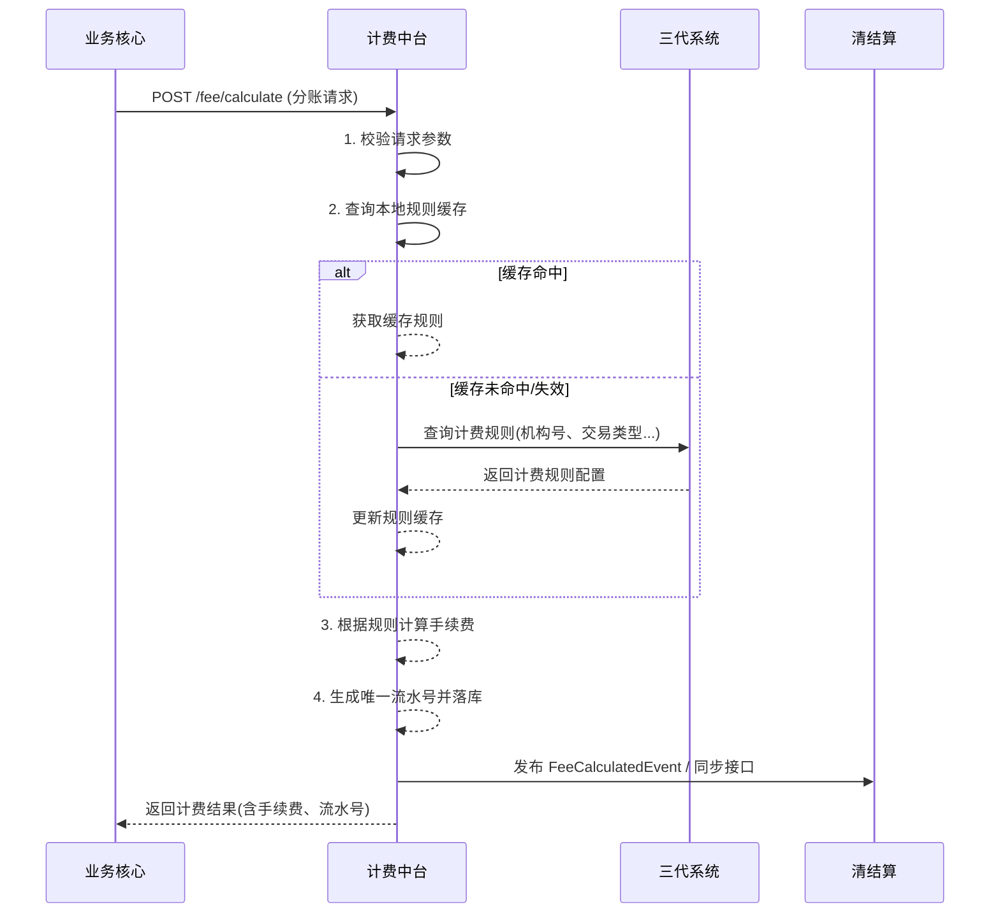

# 模块设计: 计费中台

生成时间: 2026-01-26 15:27:49
批判迭代: 2

---

# 计费中台 模块设计文档

## 1. 概述
- **目的与范围**: 本模块的核心职责是为天财分账业务提供转账计费能力。具体包括根据业务请求生成计费流水，并将计算出的费率信息同步给相关系统。其边界仅限于计费逻辑的处理，不涉及资金的实际划转、账户管理或交易处理。

## 2. 接口设计
- **API端点 (REST/GraphQL)**:
    - `POST /api/v1/fee/calculate`: 核心计费接口。
- **请求/响应结构**:
    - **请求体**:
        - `institutionId` (String): 机构号。
        - `merchantType` (String): 商户类型。
        - `transactionType` (String): 交易类型（如“天财分账”）。
        - `amount` (BigDecimal): 交易金额。
        - `payerAccountNo` (String): 付方账户号。
        - `payeeAccountNo` (String): 收方账户号。
        - `bizScene` (String): 业务场景（如“归集”、“会员结算”）。
    - **响应体**:
        - `code` (String): 响应码。
        - `message` (String): 响应消息。
        - `data` (Object):
            - `feeTransactionId` (String): 计费流水号。
            - `calculatedFee` (BigDecimal): 计算出的手续费。
            - `feeRuleId` (String): 应用的计费规则ID。
            - `status` (String): 计费状态。
- **发布/消费的事件**:
    - **消费事件**: TBD。
    - **发布事件**: `FeeCalculatedEvent`，包含计费流水号、手续费、相关账户及交易信息，供下游系统（如清结算）订阅。

## 3. 数据模型
- **表/集合**:
    - `fee_transaction` (计费流水表): 记录每一笔计费请求和结果。
    - `fee_rule_cache` (计费规则缓存表): 缓存从三代系统查询到的计费规则。
- **关键字段**:
    - **`fee_transaction`**:
        - `id` (PK): 主键，计费流水号。
        - `institution_id`: 机构号。
        - `request_data`: 原始请求数据（JSON）。
        - `calculated_fee`: 计算出的手续费。
        - `fee_rule_id`: 关联的计费规则ID。
        - `status`: 状态（如“成功”、“失败”）。
        - `sync_status`: 同步下游状态（如“待同步”、“已同步”、“同步失败”）。
        - `created_at`: 创建时间。
    - **`fee_rule_cache`**:
        - `id` (PK): 主键。
        - `rule_key`: 规则键（由机构号、商户类型、交易类型等组合生成）。
        - `rule_config`: 规则配置详情（JSON，如费率、封顶额等）。
        - `expire_at`: 缓存过期时间。
        - `updated_at`: 最后更新时间。
- **与其他模块的关系**: 本模块生成的计费流水通过`fee_transaction`表记录。`fee_rule_cache`表依赖于三代系统的计费配置。计费结果通过事件或接口同步给清结算系统。

## 4. 业务逻辑
- **核心工作流/算法**:
    1.  **接收请求**: 接收来自业务核心的计费请求。
    2.  **请求校验**: 校验必要参数（机构号、金额等）的合法性与完整性。
    3.  **规则查询**:
        a. 根据请求参数（机构号、商户类型、交易类型、业务场景）生成规则键。
        b. 首先查询本地`fee_rule_cache`缓存。
        c. 若缓存不存在或已过期，则调用三代系统提供的接口（具体接口TBD）查询实时计费规则，并更新缓存。
    4.  **手续费计算**:
        - 算法：根据获取到的规则配置（如百分比费率、固定费用、封顶额、保底额）进行计算。
        - 示例：`手续费 = min( max( 交易金额 * 费率, 保底额 ), 封顶额 ) + 固定费用`。
        - 若规则中指定了特定场景（如归集）的优惠或豁免，则应用相应逻辑。
    5.  **流水记录**:
        - 生成唯一的计费流水号 (`feeTransactionId`)。在高并发下，采用分布式序列生成器（如基于数据库序列或雪花算法）确保全局唯一性。
        - 将请求、规则ID、计算结果、状态等信息持久化到`fee_transaction`表。
    6.  **结果同步**: 发布`FeeCalculatedEvent`事件，或将计费结果通过接口同步给清结算系统。
    7.  **响应返回**: 将包含手续费和流水号的计费结果返回给调用方（业务核心）。
- **业务规则与验证**:
    - 计费规则必须与三代系统配置的商户费率保持最终一致性（通过缓存更新机制）。
    - 验证请求的机构号是否有效（格式校验，存在性需依赖三代）。
    - 交易金额必须大于零。
- **关键边界情况处理**:
    - **计费规则缺失**: 若在三代系统未查询到对应规则，或规则配置错误（如费率为空），则计费失败，向调用方返回明确错误。
    - **高并发流水号生成**: 使用分布式ID生成方案，确保唯一性与有序性。
    - **缓存与三代数据不一致**: 为缓存设置合理的过期时间（如5分钟），并在三代规则变更时（如通过通知机制TBD）主动刷新或失效缓存。

## 5. 时序图

## 6. 错误处理
- **预期错误情况**:
    1.  **请求参数错误**: 参数缺失、格式错误、金额非正。
    2.  **计费规则错误**: 在三代系统未查询到规则、规则配置不合法。
    3.  **下游同步失败**: 发布事件或调用清结算接口失败。
    4.  **系统内部错误**: 数据库异常、缓存服务异常、分布式ID生成服务异常。
- **处理策略**:
    - **参数与规则错误**: 立即向调用方返回明确的业务错误码和描述，交易终止。记录错误日志。
    - **下游同步失败**:
        - 将`fee_transaction`表中的`sync_status`标记为“同步失败”。
        - 启动异步重试机制，采用指数退避策略（如1s, 2s, 4s...）进行重试，并设置最大重试次数（如5次）。
        - 若重试耗尽仍失败，则将失败详情记录至死信队列或专用监控表，触发告警，需人工干预处理。
    - **系统内部错误**: 记录详细错误日志，触发系统级告警，并向调用方返回系统繁忙或操作失败等通用错误。

## 7. 依赖关系
- **上游模块**:
    - **业务核心**: 发起计费请求。
    - **三代系统**: 提供计费规则查询接口，是计费规则的权威数据源。
- **下游模块**:
    - **清结算**: 订阅`FeeCalculatedEvent`或通过接口接收费率信息，用于后续资金清算与手续费清分。