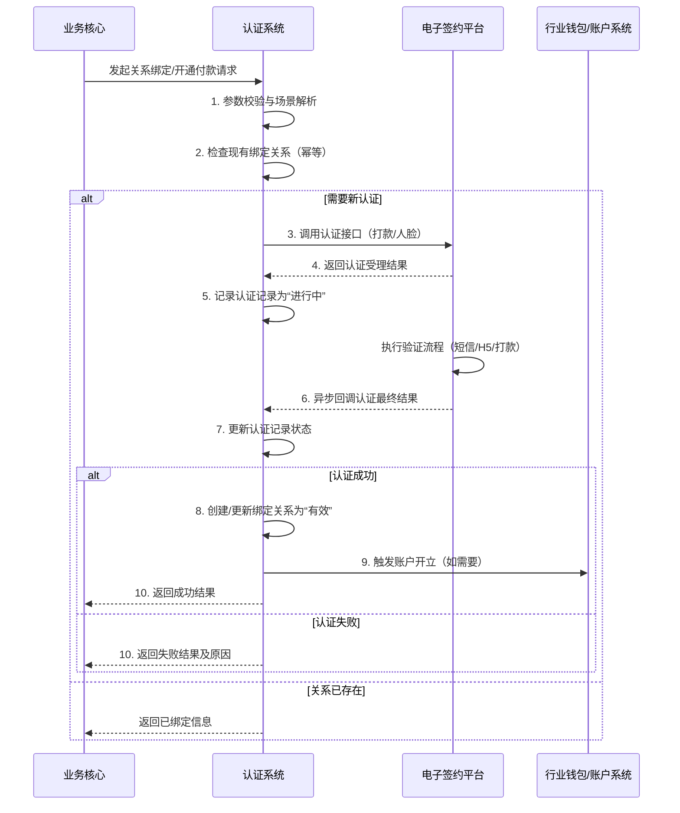

# 模块设计: 认证系统

生成时间: 2026-01-26 15:28:00
批判迭代: 2

---

# 认证系统 模块设计文档

## 1. 概述
- **目的与范围**: 本模块负责处理分账业务中各类关系的建立与验证，核心职责包括管理“关系绑定”流程、执行“打款验证”和“人脸验证”等认证操作，以及处理“开通付款”所需的签约与认证。其边界在于接收来自上游的认证请求，调用外部系统完成验证，并记录认证结果。本模块不涉及具体的账户开立、资金划转或协议模板管理，但会触发或协调“天财接收方账户”的开立流程。

## 2. 接口设计
- **API端点 (REST/GraphQL)**:
    - `POST /api/v1/bindings`: 发起关系绑定请求。
    - `POST /api/v1/verifications`: 发起特定认证（打款/人脸）请求。
    - `GET /api/v1/bindings/{bindingId}`: 查询关系绑定状态。
    - `POST /api/v1/payment-activations`: 发起开通付款流程。
- **请求/响应结构**: TBD
- **发布/消费的事件**:
    - 消费事件: `BindingRequested`, `PaymentActivationRequested` (来自业务核心)。
    - 发布事件: `BindingEstablished`, `BindingFailed`, `PaymentActivated`, `PaymentActivationFailed` (通知业务核心)。

## 3. 数据模型
- **表/集合**:
    - `authentication_record` (认证记录表): 记录所有认证请求与结果。
    - `binding_relationship` (绑定关系表): 记录已建立的付方与收方授权关系。
- **关键字段**:
    - `authentication_record`:
        - `id` (主键), `request_id` (请求ID), `scenario` (场景: 归集/会员结算/批量付款), `payer_id` (付方ID), `payee_id` (收方ID), `auth_type` (认证类型: 打款/人脸), `status` (状态: 待处理/进行中/成功/失败), `result` (结果详情), `external_ref` (外部系统引用ID), `created_at`, `updated_at`。
    - `binding_relationship`:
        - `id` (主键), `binding_id` (绑定关系ID), `payer_id`, `payee_id`, `scenario`, `auth_record_id` (关联的认证记录), `status` (状态: 有效/失效), `expires_at`, `created_at`。
- **与其他模块的关系**: 本模块依赖**电子签约平台**执行具体的签约流程和验证（如打款验证、人脸验证），并将认证结果同步给上游的**业务核心**。绑定关系建立后，可能触发**行业钱包**或**账户系统**进行“天财接收方账户”的开立。

## 4. 业务逻辑
- **核心工作流/算法**:
    1.  **接收请求**: 接收来自业务核心的`关系绑定`或`开通付款`请求。
    2.  **解析与校验**:
        - 校验付方（总部/门店）与收方（门店/接收方）身份有效性（调用相关系统接口）。
        - 根据场景（归集、会员结算、批量付款）和接收方类型（企业、个人）确定必需的认证方式组合。
        - 检查是否已存在相同付方-收方-场景的有效绑定关系，若存在则返回已绑定信息（幂等性处理）。
    3.  **执行认证**:
        - 调用**电子签约平台**接口，发起相应的认证流程（打款验证、人脸验证及协议签署）。
        - 监听电子签约平台回调，更新认证状态。
    4.  **处理结果**:
        - 认证成功：创建或更新`binding_relationship`记录，状态设为“有效”。对于涉及开通付款的场景，发布`PaymentActivated`事件，可能触发下游账户开立流程。
        - 认证失败：更新`authentication_record`状态为“失败”，记录失败原因，并发布相应失败事件。
- **业务规则与验证**:
    - 归集场景：门店（付方）-> 总部（收方），通常需要协议签署。
    - 会员结算场景：总部（付方）-> 门店（收方），需要协议签署。
    - 批量付款场景：总部（付方）-> 接收方（个人/企业收方），根据接收方类型决定认证方式（个人：人脸验证；企业：打款验证），并需要完成“开通付款”流程。
    - 同一付方-收方-场景组合下，只允许存在一条“有效”状态的绑定关系。
- **关键边界情况处理**:
    - 认证失败重试：对于可重试错误（如网络超时），采用指数退避策略进行最多3次重试。
    - 流程超时：为每个认证流程设置总超时时间（如30分钟），超时后标记为失败。
    - 幂等性：使用请求ID确保重复请求不会创建重复的关系记录。

## 5. 时序图

## 6. 错误处理
- **预期错误情况**:
    - 外部依赖错误：电子签约平台服务不可用、接口超时、返回业务失败。
    - 业务逻辑错误：认证信息不匹配（姓名、身份证、人脸不符）、打款验证回填错误或超时、请求参数非法、重复绑定冲突。
    - 系统错误：数据库连接失败、网络异常。
- **处理策略**:
    - **重试机制**：针对外部系统可重试错误（如网络超时、5xx错误），采用指数退避策略，最大重试次数3次。
    - **超时控制**：所有外部调用设置连接超时（如5秒）与读取超时（如30秒）。
    - **错误码映射**：定义清晰的错误码体系，将内部及外部错误映射为业务错误码返回给上游。
    - **幂等性保证**：请求需携带唯一`request_id`，避免重复处理。
    - **降级与熔断**：对电子签约平台调用配置熔断器，在失败率过高时快速失败，避免系统雪崩。
    - **日志与监控**：记录详细的错误日志（包含`request_id`和上下文），并设置关键错误告警。

## 7. 依赖关系
- **上游模块**: **业务核心**（发起关系绑定、开通付款请求）。
- **下游模块**:
    - **电子签约平台**（执行具体的打款验证、人脸验证及签约流程）。
    - **行业钱包** / **账户系统**（在绑定关系建立后，触发“天财接收方账户”的开立）。
- **其他依赖**: TBD