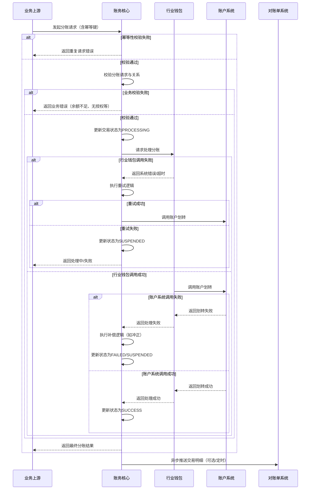

# 模块设计: 账务核心

生成时间: 2026-01-26 15:27:42
批判迭代: 2

---

# 账务核心模块设计文档

## 1. 概述
- **目的与范围**: 本模块是接收并处理天财分账交易数据的系统核心。它负责处理来自上游业务系统的分账指令，协调账户系统、行业钱包等完成资金划转，并确保交易数据的准确性与一致性。其边界在于处理“天财分账”这一特定交易类型，不涉及商户入网、账户开立、协议签署等其他业务流程。

## 2. 接口设计
- **API端点 (REST/GraphQL)**: TBD
- **请求/响应结构**: TBD
- **发布/消费的事件**: TBD

## 3. 数据模型
- **表/集合**: TBD
- **关键字段**: TBD
- **与其他模块的关系**: 本模块处理的分账交易数据，其动账明细和交易明细最终由对账单系统生成并提供。

## 4. 业务逻辑
- **核心工作流/算法**: 主要业务流程是处理“天财分账”交易。这包括接收分账请求，验证付方（天财收款账户）与收方（天财收款账户或天财接收方账户）的账户状态与权限，调用行业钱包或账户系统执行资金划转，并记录交易结果。
- **业务规则与验证**: 需验证分账场景（如归集、会员结算、批量付款）下的付方与收方是否已建立正确的授权关系。需校验付方账户余额是否充足。
- **关键边界情况处理**: 处理资金划转过程中的失败场景，如账户系统调用超时、账户状态异常（冻结、注销）等，需确保交易状态可回查与补偿。
- **状态管理**: 交易状态包括：INITIATED（已接收）、PROCESSING（处理中）、SUCCESS（成功）、FAILED（失败）、SUSPENDED（挂起待人工处理）。
- **幂等性处理**: 通过请求中的唯一幂等键（如业务流水号+机构号）确保同一笔交易请求不会被重复处理。
- **补偿机制**: 对于涉及多个下游系统的操作，采用SAGA模式进行补偿。若行业钱包或账户系统调用失败，则根据失败阶段执行相应的补偿操作（如冲正）或标记为挂起状态。

## 5. 时序图

## 6. 错误处理
- **预期错误情况**: 可能的错误类型包括：付方账户余额不足、付方与收方未建立有效授权关系、账户状态异常（冻结、注销）、下游系统（行业钱包、账户系统）服务不可用或超时、交易数据重复等。
- **处理策略**: 对于业务规则校验失败（如余额不足、无授权），立即返回明确错误。对于下游系统调用失败，应记录详细日志，实现重试机制，并可能将交易置为“处理中”状态，等待后续对账与人工介入处理。
- **重试策略**: 对下游系统调用采用指数退避重试机制，设定最大重试次数和超时时间。
- **幂等性保证**: 基于请求中的唯一幂等键，在交易处理前进行校验，防止重复处理。
- **对账与核对流程**: 定期与对账单系统进行交易明细核对，发现状态不一致（如账务核心为SUCCESS但对账单无记录）时，触发异常处理流程并告警，需人工介入核查。

## 7. 依赖关系
- **上游模块**: 业务上游系统（发起分账请求的模块）。
- **下游模块**: 行业钱包（处理分账业务逻辑）、账户系统（执行底层资金划转）、对账单系统（提供交易明细）。