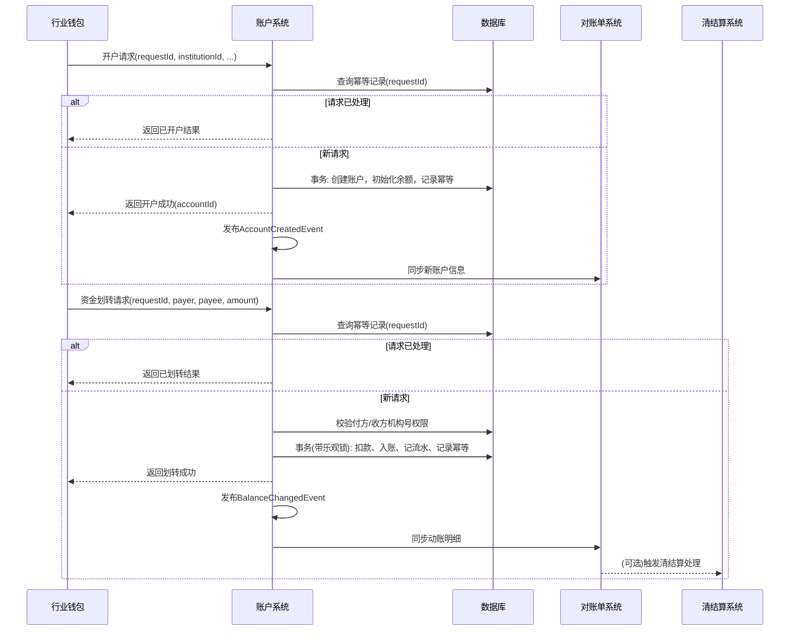

# 模块设计: 账户系统

生成时间: 2026-01-26 15:27:41
批判迭代: 2

---

# 账户系统模块设计文档

## 1. 概述
- **目的与范围**: 账户系统是底层账户管理系统，负责为天财分账业务开立、管理专用账户，并提供账户余额变动、权限控制等核心功能。其核心职责包括：为收单商户开立天财收款账户，为非收单商户或个人开立天财接收方账户，处理账户的升级、余额查询与扣划，并对天财专用账户进行特殊标记和权限控制。本模块提供账户层面的基础操作（如开户、余额查询、资金划转），不处理具体的分账、归集等上层业务规则。

## 2. 接口设计
- **API端点 (REST)**:
    - `POST /v1/accounts`: 开立天财专用账户。
    - `POST /v1/accounts/{accountId}/upgrade`: 升级账户状态或权限。
    - `GET /v1/accounts/{accountId}/balance`: 查询账户余额。
    - `POST /v1/transfers`: 执行账户间资金划转。
    - `POST /v1/accounts/{accountId}/freeze`: 冻结账户资金。
    - `POST /v1/accounts/{accountId}/unfreeze`: 解冻账户资金。
- **请求/响应结构**:
    - 开户请求示例：
      ```json
      {
        "requestId": "req_1234567890",
        "institutionId": "INS001",
        "accountType": "RECEIVING_ACCOUNT",
        "accountRole": "HEADQUARTERS",
        "merchantNo": "M10001"
      }
      ```
    - 开户响应示例：
      ```json
      {
        "code": "SUCCESS",
        "message": "开户成功",
        "data": {
          "accountId": "ACC20241105001",
          "status": "ACTIVE"
        }
      }
      ```
    - 资金划转请求示例：
      ```json
      {
        "requestId": "transfer_req_987654321",
        "payerAccountId": "ACC20241105001",
        "payeeAccountId": "ACC20241105002",
        "amount": 10000,
        "currency": "CNY",
        "bizRemark": "测试转账"
      }
      ```
- **发布/消费的事件**:
    - 发布事件：
        - `AccountCreatedEvent`: 账户创建成功时发布，包含账户ID、机构号、账户类型等信息。
        - `BalanceChangedEvent`: 账户余额发生变动时发布，包含账户ID、变动金额、变动后余额、业务流水号。
    - 消费事件：TBD（暂无上游业务事件需要消费）。

## 3. 数据模型
- **表/集合**:
    - `tiancai_account` (天财专用账户主表)
    - `account_balance` (账户余额表)
    - `account_transaction` (账户交易流水表)
    - `idempotent_record` (幂等性记录表)
- **关键字段**:
    - `tiancai_account`:
        - `account_id` (主键，账户ID)
        - `institution_id` (机构号，索引)
        - `account_type` (账户类型: `RECEIVING_ACCOUNT`-天财收款账户, `RECEIVER_ACCOUNT`-天财接收方账户)
        - `account_role` (账户角色: `HEADQUARTERS`-总部, `STORE`-门店, `INDIVIDUAL`-个人，可为空)
        - `merchant_no` (商户号，关联收单商户)
        - `status` (状态: `INIT`, `ACTIVE`, `FROZEN`, `CLOSED`)
        - `special_flag` (特殊标记: `TIANCAI_SPECIAL`，用于在底层标识为天财专用账户)
        - `permission_bitmap` (权限控制位图，存储账户可执行的操作权限)
        - `created_at`, `updated_at` (时间戳)
    - `account_balance`:
        - `account_id` (主键，账户ID)
        - `available_balance` (可用余额)
        - `frozen_balance` (冻结余额)
        - `version` (版本号，用于乐观锁)
    - `account_transaction`:
        - `transaction_id` (主键，交易流水号)
        - `account_id` (账户ID，索引)
        - `biz_flow_no` (关联业务流水号)
        - `amount` (变动金额)
        - `balance_after` (变动后余额)
        - `transaction_type` (交易类型)
        - `created_at` (时间戳，索引)
- **与其他模块的关系**: 账户系统为行业钱包提供账户开立与查询服务。账户的动账明细会通过`BalanceChangedEvent`同步至对账单系统。账户的余额变动事件可能被清结算系统订阅，用于触发后续资金处理。

## 4. 业务逻辑
- **核心工作流/算法**:
    1. **开户**: 接收行业钱包的开户请求，校验请求ID幂等性、机构号有效性及参数完整性。根据请求参数创建具有`special_flag = 'TIANCAI_SPECIAL'`标记和相应权限位图的账户记录，并初始化余额。
    2. **账户升级**: 根据业务请求（如开通付款），更新账户的`permission_bitmap`或`status`字段，并记录变更日志。
    3. **余额操作**:
        - **资金划转**: 在同一数据库事务内，使用乐观锁（`account_balance.version`）校验并更新付方和收方账户余额，确保付方有足够可用余额。生成交易流水。
        - **冻结/解冻**: 更新`account_balance`表中的`available_balance`与`frozen_balance`字段。
- **业务规则与验证**:
    1. 所有天财专用账户在`tiancai_account`表中必须设置`special_flag = 'TIANCAI_SPECIAL'`。
    2. 涉及账户查询、资金划转、状态变更的操作，必须校验请求方提供的`institution_id`与目标账户记录的`institution_id`一致。
    3. 资金划转前必须校验付方账户`available_balance >= 划转金额`。
    4. 所有写操作（开户、划转、升级）必须携带唯一`requestId`，并在`idempotent_record`表中进行幂等校验。
- **关键边界情况处理**:
    1. **重复请求**: 通过`idempotent_record`表实现幂等性，相同`requestId`直接返回首次执行结果。
    2. **并发余额操作**: 使用数据库事务与`account_balance.version`字段实现乐观锁，防止超扣。
    3. **账户状态异常**: 操作前检查账户`status`，若为`FROZEN`或`CLOSED`，则拒绝操作。

## 5. 时序图



## 6. 错误处理
- **预期错误情况**:
    1. `INVALID_PARAMETER`: 开户或划转请求参数不完整或格式错误。
    2. `ACCOUNT_NOT_FOUND`: 账户不存在。
    3. `ACCOUNT_STATUS_INVALID`: 账户状态异常（冻结、注销）。
    4. `INSUFFICIENT_BALANCE`: 付方账户可用余额不足。
    5. `PERMISSION_DENIED`: 请求机构号与账户机构号不匹配，无操作权限。
    6. `DUPLICATE_REQUEST`: 检测到重复的`requestId`。
    7. `CONCURRENT_CONFLICT`: 余额更新时乐观锁冲突。
- **处理策略**:
    1. 输入参数校验失败，返回`INVALID_PARAMETER`及具体错误字段。
    2. 业务校验失败（如余额不足、权限不足），返回对应的业务错误码和描述。
    3. 幂等请求，返回`DUPLICATE_REQUEST`及首次执行的成功结果。
    4. 乐观锁冲突，返回`CONCURRENT_CONFLICT`，建议调用方使用新的`requestId`重试。
    5. 系统异常，记录详细日志，返回`SYSTEM_ERROR`，建议重试。

## 7. 依赖关系
- **上游模块**: 行业钱包（调用账户系统进行开户、账户操作）。
- **下游模块**:
    - 对账单系统：通过监听`BalanceChangedEvent`和接收账户信息同步，生成动账明细。
    - 清结算系统：可能订阅`BalanceChangedEvent`，根据事件中的业务类型和金额触发后续的资金清算与结算处理。具体交互方式为事件驱动，事件负载包含账户ID、变动金额、业务流水号。