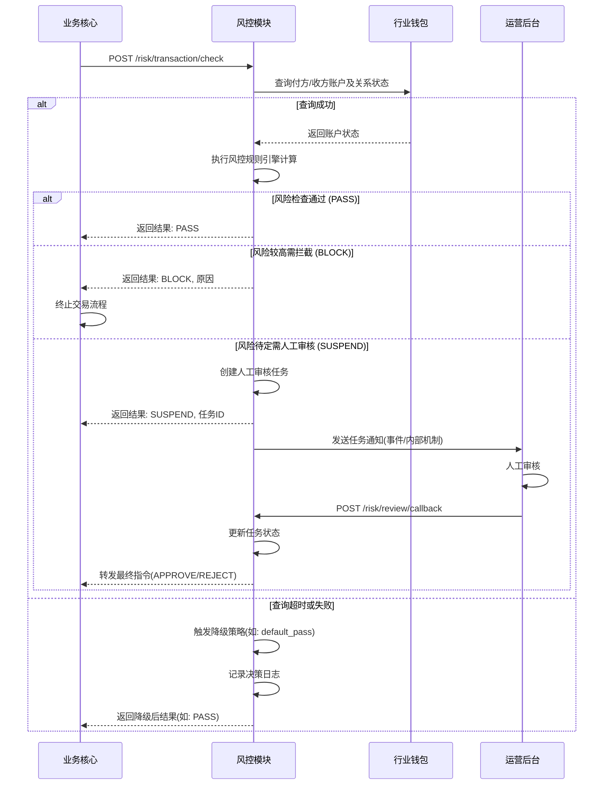

# 模块设计: 风控

生成时间: 2026-01-26 15:28:05
批判迭代: 2

---

# 风控模块设计文档

## 1. 概述
- **目的与范围**：本模块负责对天财分账业务中的关键操作进行风险识别与控制，确保交易安全与合规。其核心职责包括对分账、归集、批量付款等资金划转请求进行风险扫描与拦截，以及对关系绑定、开通付款等签约认证流程进行风险审核。模块边界限定于处理来自业务核心的同步风险检查请求，不包含异步风险监控。模块不涉及底层账户系统的权限控制或清结算系统的资金处理逻辑。

## 2. 接口设计
- **API端点 (REST)**：
    - `POST /api/v1/risk/transaction/check`：交易风险检查接口。业务核心在发起分账、归集、批量付款等资金操作前调用。
    - `POST /api/v1/risk/contract/check`：签约风险检查接口。业务核心在关系绑定、开通付款等签约流程的关键节点调用。
    - `POST /api/v1/risk/review/callback`：人工审核结果回调接口。运营后台在完成人工审核后调用，通知风控模块审核结果。
- **请求/响应结构**：
    - **交易风险检查请求**：包含交易ID、交易类型（分账/归集/批量付款）、付方账户号、收方账户号（列表）、交易金额、商户机构号、请求时间戳等。
    - **交易风险检查响应**：包含风险检查结果（`PASS`/`BLOCK`/`SUSPEND`）、风险分数、拦截原因（若为`BLOCK`）、审核任务ID（若为`SUSPEND`）。
    - **签约风险检查请求**：包含签约流程ID、认证类型（打款验证/人脸验证）、认证结果、相关方身份信息、商户机构号等。
    - **签约风险检查响应**：包含风险检查结果（`PASS`/`BLOCK`）、风险分数、拦截原因。
    - **人工审核回调请求**：包含审核任务ID、审核结果（`APPROVE`/`REJECT`）、审核意见、审核人、审核时间。
- **发布/消费的事件**：
    - **消费事件**：TBD（例如，可消费账户状态变更事件以更新内部缓存）。
    - **发布事件**：`RiskCheckCompleted`（风险检查完成，包含结果）、`ManualReviewTaskCreated`（人工审核任务已创建）。

## 3. 数据模型
- **表/集合**：
    - **风控规则表 (`risk_rules`)**：存储风险规则定义，包括规则ID、规则名称、规则类型（金额/频率/名单/关联关系）、规则条件（JSON格式）、风险分数、生效状态、创建/更新时间。
    - **风险事件表 (`risk_events`)**：记录每次风险检查的详细日志，包括事件ID、关联业务ID（交易ID/签约ID）、检查类型、请求数据快照、应用的风险规则列表、风险分数、最终结果、创建时间。
    - **人工审核任务表 (`review_tasks`)**：管理待人工处理的风险事件，包括任务ID、关联风险事件ID、任务状态（`PENDING`/`APPROVED`/`REJECTED`）、创建时间、分配人、完成时间、审核意见。
    - **风控决策日志表 (`decision_logs`)**：记录降级策略触发等关键决策点，包括日志ID、关联事件、决策类型（如`DEGRADE_TO_PASS`）、决策原因（如上游超时）、决策时间。
- **关键字段**：TBD（基于上述表的详细字段设计）。
- **与其他模块的关系**：本模块依赖业务核心提供的交易与签约数据。风险事件表通过业务ID（如交易ID）与业务核心的业务数据关联。人工审核任务表与运营后台模块交互。

## 4. 业务逻辑
- **核心工作流/算法**：接收来自业务核心的风险检查请求，依次执行规则引擎。规则引擎加载生效的预设规则，根据交易/签约数据、以及从行业钱包查询的账户与关系状态，进行风险评估与计分。根据总分与阈值（如`BLOCK`阈值 > `SUSPEND`阈值 > `PASS`阈值）返回决策。
- **业务规则与验证**：
    - **规则类型**：
        1.  **金额规则**：校验单笔交易金额是否超过针对该商户或该业务场景设定的限额。
        2.  **频率/频次规则**：检查短时间内同一付方发起的交易频次是否异常（如1分钟内超过N笔）。
        3.  **名单规则**：基于内部风险名单（如黑名单账户）进行拦截。
        4.  **关联关系规则**：检查付方与收方是否存在异常关联（如新绑定的关系立即发起大额交易）。
        5.  **签约认证规则**：在关系绑定或开通付款流程中，对打款验证、人脸验证等认证环节的结果进行风险复核（如认证失败次数过多）。
    - **规则引擎**：采用可配置的规则集，支持优先级和权重配置。评估结果为每个匹配规则的风险分数累加。
- **关键边界情况处理**：
    - **上游依赖故障降级**：当调用行业钱包查询账户/关系状态超时或失败时，根据预配置的降级策略（如针对该接口配置`default_pass`或`default_block`）进行决策，并记录决策日志与告警。
    - **人工审核工作流**：对于风险评估结果为`SUSPEND`的事件，自动在`review_tasks`表中创建状态为`PENDING`的任务，并通过发布`ManualReviewTaskCreated`事件或内部通知机制告知运营后台。运营人员通过后台处理任务后，调用回调接口更新任务状态，风控模块将最终结果同步给业务核心。
    - **规则引擎内部错误**：记录错误日志，返回系统错误响应，建议业务核心重试或记录失败。

## 5. 时序图

## 6. 错误处理
- **预期错误情况**：
    - 调用外部依赖（如行业钱包）超时或服务不可用。
    - 风控规则引擎内部计算错误（如规则配置错误）。
    - 接收到的请求数据格式错误或关键字段缺失。
    - 人工审核回调接口收到非法或重复的任务ID。
- **处理策略**：
    - **外部依赖故障**：触发配置的降级策略（每个依赖可独立配置`default_pass`或`default_block`），记录异常日志与监控告警，并在`decision_logs`中记录。
    - **内部错误**：返回明确的5xx系统错误响应，确保业务核心能感知并做相应处理（如记录失败交易，触发重试或人工介入）。
    - **非法请求**：返回4xx客户端错误，提示参数错误或缺失。
    - **回调非法任务**：返回错误，并记录日志告警。

## 7. 依赖关系
- **上游模块**：
    - **业务核心**：提供待检查的交易与签约数据，是风险检查请求的发起方。
- **下游模块**：
    - **行业钱包**：提供付方/收方账户的状态查询以及关系绑定状态的校验。根据术语表，账户管理与关系校验应由行业钱包负责，风控模块应调用行业钱包而非直接调用底层账户系统。
    - **运营后台**：消费人工审核任务通知，并提供人工审核界面与结果回调。